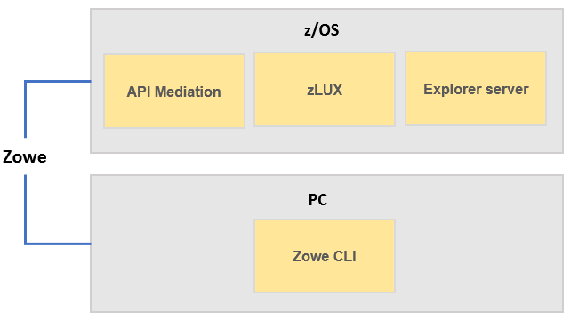

# Installing Zowe

Zowe consists of four main components: the Zowe Application Framework (zLUX), the explorer server, API Mediation Layer, and Zowe CLI. You install the Zowe Application Framework, the explorer server, and API Mediation on z/OS and install Zowe CLI on PC. The installations on z/OS and on PC are independent.

To get started with installing Zowe, review the [Installation roadmap](installroadmap.md) topic.
