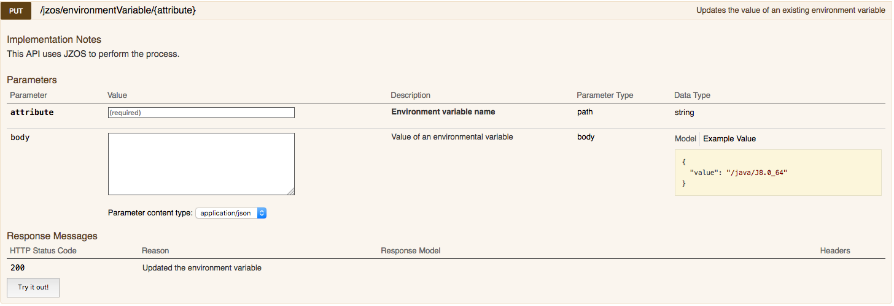
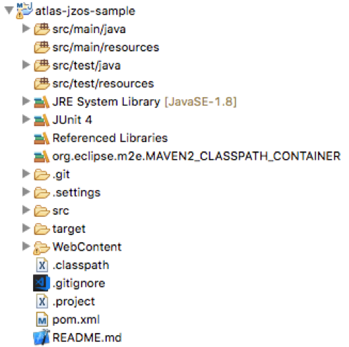
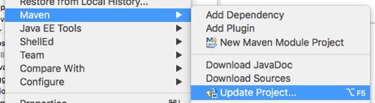

# Creating a RestAPI with Swagger documentation using Liberty

This tutorial will show you how to develop your own Zowe API's with Swagger notation. Although the resulting War file is "dropped into" a Liberty server, the same principles can be applied for other JEE servers.

The source repo for the project can be found at the [rest-api-jzos sample](https://github.com/zowe/rest-api-jzos-sample)

This document describes how we can add new function and UI's to run alongside Zowe.

So for example, as a team with an established z/OS application we may want to provide wider access to that functionality so that it can be exploited by different applications and organizations. This can include making functionality available to company DevOps processes or for inclusion in UI's.

## Prerequisite skills

Developers should be familiar with the following technologies:

- Java
- Git and GitHub
- Maven

Knowledge of the following development technologies is beneficial:

- J2E
- Liberty or WebSphere Application Server
- Eclipse/z/OS Explorer
- RestAPI's
- zSystems development

## Zowe API Architecture Overview

Much of the Zowe infrastructure builds upon functionality provided by different applications and systems in z/OS some of which are microservices deployed on a Liberty server running on the Z system. As an example Zowe can access z/OSMF services that are aggregated with other functionality that provides new or more comprehensive functionality that allows new services to be created that also benefit from single-sign using **Lightweight Third Party** Authentication (LTPA) keys and centralized logging functions.

The API for Zowe is written in Java utilizing JAX-RS: Java API for RESTful Web Services (JAX-RS). JAX-RS uses Java annotations to simplify the development and deployment of web service clients and endpoints and ultimately become rendered into swagger interfaces.

## Building your own Microservice

There are many publications and blogs regarding Microservice design
available and it's beyond our scope to attempt to cover here. Fundamentally, however you have most likely already performed an analysis of your product and have identified several notional business
areas or components that you are most interested in. One of the recommendations in developing Microservices is not to have one massive service but several services that represent component areas. One reason
would be Microservices that are not used or function is considered restricted can be excluded without affecting other function.

Once you have identified areas of the functionality Microservices for the API's can be designed. Once again there are an
enormous amount of guidelines, Best practices, strict rules and design guides out there and I won't be prescriptive how you do this except to
say that you will spend a lot of time teasing out your API object names and considering how the REST functions (GET, PUT, POST and DELETE) apply
to these objects. Once ready or as long as we have the most basic Get Object API defined we can make a start at coding.

An example below is intended to show how we apply the definitions of
the Rest API as Java Annotations around a Java method.

```java
	@PUT
	@Path(value = "{attribute}")
	@Produces(MediaType.APPLICATION_JSON)
	@ApiOperation(value = "Updates the value of an existing environment variable",
	              notes = "This API uses JZOS to perform the process.")
	@ApiResponses({
		@ApiResponse(code = 200, message = "Updated the environment variable")})
	public Response update(
			@ApiParam(value = "Environment variable name", required = true)  @PathParam("attribute") String attribute,
			@ApiParam(value = "Value of an environmental variable") ValueParameter parameter)
	{
		jzosService.updateProperty(attribute, parameter) ;
		return Response.status(Status.OK).build();
	}
```

Within the Liberty server we have configured a function "APIDiscovery" which at run time converts this into swagger format.



## Anatomy of a project

Using [rest-api-jzos sample](https://github.com/zowe/rest-api-jzos-sample) as a guide. Create a Dynamic web project (don't specify it as part of an EAR if using the wizard), or if using a
Maven archetype choose one containing a simplified sample J2EE application.

_Alternatively, use the project as a template. Download the code, rename it and use as the basis of your new project._

The image below indicates the type of structure you should be seeing although this contains more files and folders than you will have
initially it should give you the general idea. Don't worry about git or target at this stage they will appear later as you develop your project.



Your project should be developed as a standalone war file and deployed either to a local server if you have no z dependencies (Hint: good to
start with). If using Eclipse and not yet using z/OS specific functionality consider setting up a test server within Eclipse and
automatically deploying your war to it. Fantastic for debugging.

The alternative is to drop the war into the Dropins folder of an existing Zowe installation.

It is possible to debug remotely using Eclipse but personally I have found this can lead to issues such as corrupt process locks in z/OS
requiring SysProg intervention. If you have quick access to SysProg rights you may be comfortable with this but often good old sysout is the
best debug support

The example project uses Maven for its build process which will run locally or as part of a Jenkins build process.

Further examples of implementations can be found looking at the code for the Zowe microservice.

### Eclipse hint..

Using Maven to build in an Eclipse environment can leave your files full of red x's. Generally this is caused because the Eclipse compiler
mechanism has no visibility of dependencies described in the pom.xml file. There is a magic function to help with this. Right click on your
project and select the Maven Update option. This will allow the Eclipse project to be updated and get rid of many of the x's.



### Generic jar files

It is likely that the Zowe team will provide utility jar files that will either be present on the server or require specific inclusion as
described in 'Additional Jars'. Currently generic jar files such as Zowe utilities should be included in your war file. This may be revised
later based upon future requirements.

## Unit Testing

Aim for 100% coverage. In many cases it may be impossible or impractical to achieve either because code is auto-generated or covered in other
tests. Use Jacoco to highlight where there are gaps.

Note the references to Jacoco in the atlas-jzos-sample pom.xml file. Remember it operates in two phases, initializing before the unit tests
are run and reporting afterwards.

Examples of unit testing, the use of Mockito and PowerMock are in the src/test/java folder for the jzos sample.

### FV testing

For the purpose of testing applications in a live fully configured environment scenario it is necessary to create another testing specific
project. You will notice that only the src/main/tests folder is populated. When running a Maven build the tests contained here are
exercised.

- Using the maven-archetype-quickstart as your Maven template or by creating a new Java project and adding the pom.xml file in Eclipse,
  create a project to contain FV and/or Integration tests.

- Alternatively, you can always download the code, rename it and use as the basis of your new project.
