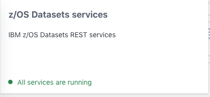
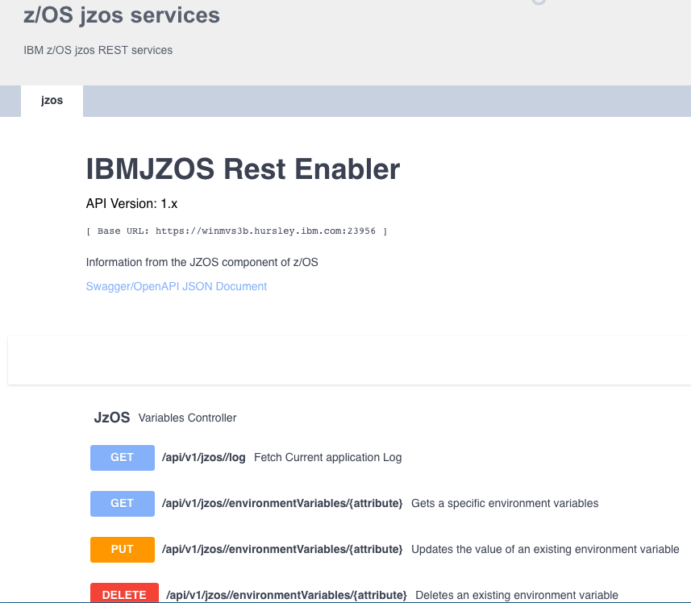

# Deploying existing Rest API Script

(WORK IN PROGRESS)

Lets consider how an organisation with a product or tool that has an existing Rest API can be rapidly Onboarded to Zowe by getting that product or tool registered with the API Gateway. The product would then be available from a central location and benefit from other Zowe API Mediation layer functionality. So how do we register with the gateway.

In this sceanrio we are using a simple Spring Boot sample app that can be downloaded here: [spring-boot-jzos-sample](https://github.com/zowe/spring-boot-jzos-sample). If you have your own example skip the "Getting the sample app running" section. We can adapt a script for your sample instead.

## Overview 
Apart from centralising access, the Gateway provides manifest information about all accessible API's in it's catalog which are derived in different ways depending upon the type of application. In our scenario we are creating a static "api definitions", meaning they are hardcoded rather than discovered by the gateway. The gateway retrieves this information from definitions stored in yaml files. Although simple files they would add more complexity for your customers when it comes to installing your product. For that reason we are proposing the use of a script that you can incorporate into your product installation process to reduce any extra burden on the customer.

### The Api definition file

Key to registering your product to the gateway is the following file structure which is installed in the API mediation layer. It's not critical to understand everything here but provided for anyone who wishes to grasp every detail.

```yaml
services:
    - serviceId: jzos # internal id for the service
      title: IBM z/OS jzos # Title as used in the Catalog information tiles
      description: IBM z/OS jzos REST API service # Title as used in the Catalog information tiles
      catalogUiTileId: jzos # internal id Catalog information tiles
      instanceBaseUrls:
        - https://host.my.com:2956/ # location of service
      homePageRelativeUrl:  # home page, leave blank if instanceBaseUrls is the same
      routedServices:
        - gatewayUrl: api/v1  # [api/ui/ws]/v{majorVersion} convention
          serviceRelativeUrl: jzos # added to location 
      apiInfo:
        - apiId: com.ibm.jzos # internal id
          gatewayUrl: api/v1 # main reference
          version: 1.0.0 # version of API on Gateway
          documentationUrl: https://host.my.com:2956/swagger-ui.html # Applies if no swagger ui
          swaggerUrl:  https://host.my.com:2956/v2/api-docs # provides a link and generates swagger info
          
catalogUiTiles:
    jzos: # as per serviceId - internal id for the service
        title: z/OS jzos services # tile label
        description: IBM z/OS jzos REST services # tile description
```

This information together creates the catalog tile information



By clicking on the tile the following information is presented. Note the swagger is generated from the swaggerUrl link which needs to be v2 swagger


Although the most critical information, the redirection of the urls is under routed services along with the service id. 
```
routedServices.gatewayUrl+serviceId will point at instanceBaseUrls+serviceRelativeUrl
<gateway url>api/v1/jzos ==> https://host.my.com:2956/jzos
```
## Getting the sample app running

If you are using the sample follow the instructions in the readme to get it up and running on your z/OS machine. If using your own go to section 2. The sample generates swagger 2 documentation.

## Modifying the Gateway script

As described earlier we are registering our application with the API Catalog by way of a file that is read by the Gateway when it's started. We think of this as a static definition as the details of the service won't change whilst the gateway is running. To achieve a more dynamic relationship between the application and registry, one that can respond to changes in one or the other e.g. for load balancing purposes we need to construct the product differently. See [Onboarding from scratch](./existingApp.md)

The information contained in the yaml definitions file above requires input from both the onboarding organisation (you) and the end user. Therefore the intent is to provide as much of the onboarder information into the script template so the end user has fewer choices to make. Therefore the script should be edited and gthe section described as "The following fields to be filled in by implementing extenders team" filled in.  

[Deploy-to-gateway](https://github.com/zowe/Onboarding-scripts)

The following fields need to be set

````properties
################################################################################
# The following fields to be filled in by implementing extenders team
################################################################################
defaultServiceId="xtdrsvcid" 	# lowercase only
defaultTitle="Product name"
defaultDescription="Product description"
defaultCatalogUiTileId="xtdrCatalogUiTileId"
defaultHomePageRelativeUrl="" # Usually home page is the same as the base URL 

defaultGatewayUrl1="api/v1"
defaultServiceUrl1="api/v1/xtdrServiceId"
defaultGatewayUrl2="ui/v1"
defaultServiceUrl2="ui/v1/xtdrServiceId"
# Additional gateway and services will require further changes to script later

defaultApiId="no.id.ea"
defaultGatewayUrl=$defaultGatewayUrl1
defaultApiVersion="1.0.0"

defaultCatalogTileTitle="My Product in catalog"
defaultCatalogTileDescription="My Product description in catalog"
````

##### defaultServiceId
This field is an internal identifier that needs to be unique across product instances. Therefore if you install multiple instances of your product this will also need to be incremented. Note it must be lowercase and is also used as part of the gateway uri
##### defaultTitle

##### defaultDescription

##### defaultCatalogUiTileId
This is the name that appears on the tab of the opened service 

##### defaultHomePageRelativeUrl
If the home page is not same as the base url add it in here

##### defaultGatewayUrl(n)
This is the the gateway url that you want your redirect to work from. 
You can create several  defaultGatewayUrl/defaultServiceUrl pairings. Normally this would cater for api, web socket (ws) and ui.

##### defaultServiceUrl(n)
The target url of the service

##### defaultApiId
An internally used id. Suggest using com.co.yourprod etc.

##### defaultGatewayUrl
Main url redirection for documentation

##### defaultApiVersion
Version number of API if you wish to use it  

##### defaultCatalogTileTitle
The title that is displayed in the catalog pages

##### defaultCatalogTileDescription
The description that is displayed in the catalog pages

## Custom behavior
Although this template will address 90% of tasks there is always areas we may need to consider differently for each product.

### Multiple routed services
The template is set up to define one pairing of gatewayUrl to serviceUrl but this may not be sufficient for all endpoints. 
````yaml
      routedServices:
        - gatewayUrl: api/v1  # [api/ui/ws]/v{majorVersion}
          serviceRelativeUrl: api/v1/zos
        - gatewayUrl: api/v1/api-doc  # [api/ui/ws]/v{majorVersion}
          serviceRelativeUrl: api/docs   
````

Fortunately this is easily accomodated but you need to modify the script to include the extra the services. Simply enter the properties in the format below and repeat the relervant section in the script.
defaultGatewayUrl1="api/v1"
defaultServiceUrl1="api/v1/zos"
defaultGatewayUrl2="api/v1/api-doc"
defaultServiceUrl2="api/docs" 

### External documentation or swagger documentation

Established products have documentation that is published externally so these can be accessed by the documentationUrl. The swaggerUrl on the other hand describes swagger 2.0+ api docs that are local to the installation and allow a degree of interaction. Currently these offer and either, or choice.

## How the Script works
Your updated shell script can now be run. It will ask the user to specify where the zowe installation is after attempting to recognise them automatically. It will then request the location your product is running at followed by any link to it's api documentation. 


 This is how the process will appear to the end user.


