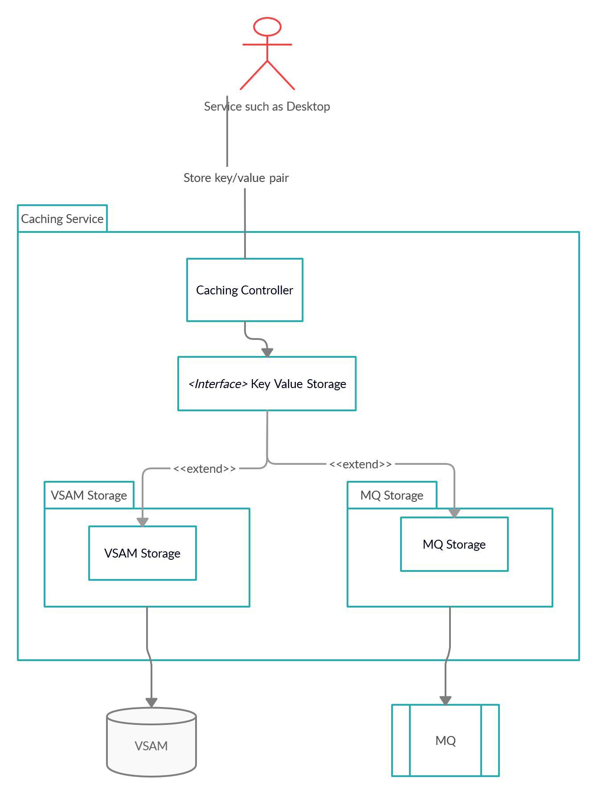

# Caching service 
As an API developer, you can use the Caching service to provide an API which offers the possibility to store, retrieve and delete data associated with keys. 

To support the High Availability of all components within Zowe, components either need to be stateless, or offload the state to a location accessible by all instances of the service, including those which just started. 
At the current time, some services are not, and cannot be stateless. For these services, we introduce the Caching service. 

The Caching service aims to provide an API which offers the possibility to store, retrieve and delete data associated with keys. 
The service will be used only by internal Zowe applications and will not be exposed to the internet. The Caching service needs to support a hot-reload scenario in which a client service requests all available service data. 
The current implementation of the service depends on VSAM to store the key/value pairs, as VSAM is a native z/OS solution to storing key/value pairs.  
Eventually, there will be other implementations for solutions such as MQs.

## Architecture

 

There are REST APIs available to create, delete, and update key-value pairs in the cache, as well as APIs to read a specific key-value pair or all key-value pairs in the cache.

The cached APIs information are stored as JSON in the format below:
```yml
{
  “key”: “keyValue”, 
  “value”: “valueValue”
}
```

## Storage methods

There are multiple storage solutions supported by the Caching Service with the option to 
add custom implementation. [Additional Storage Support](#additional-storage-support) explains
what needs to be done to implement custom solution.

### VSAM

Check [VSAM](./api-mediation-vsam.md) to get more information about this storage access method.

### In Memory

This storage is useful for testing and integration verification. Don't use it in production. 
The key/value pairs are stored only in the memory of one instance of the service and therefore 
won't persist. 

### Additional Storage Support

To add a new implementation it is necessary to provide the library with the implementation
of the Storage.class and properly configure the Spring with the used implementation. 

    @ConditionalOnProperty(
        value = "caching.storage",
        havingValue = "custom"
    )
    @Bean
    public Storage custom() {
        return new CustomStorage();
    }

The example above shows the Configuration within the library that will use different storage than the default InMemory one. 

It is possible to provide the custom implementation via the `-Dloader.path` property provided on startup of the Caching service. 

## How to start the service

By default, the Caching service is started along with the other Zowe components. You can prevent the Caching service to start by setting the `zowe_apiml_caching_service_start` defined in the ansible playbooks to `false`. 
This parameter will be then appended to the `instance.env` configuration file and used at the Zowe start.

## API

The Caching service API path is `/cachingservice/api/v1/cache/${path-params-as-needed}`.
1. `POST /cache`: Create a new key in the Cache. 
2. `GET /cache`: Returns all key/value pairs for specific service.
3. `PUT /cache/{key}`: Update the existing value for the given key.
4. `GET /cache/{key}`: Return the existing value for the given key.
5. `DELETE /cache/{key}`: Delete a key/value pair.

## Configuration properties

The Caching service uses the standard `application.yml` structure for configuration and it is built on top of the Spring enabler, which means that it is dynamically registered to the API Mediation Layer. 
It appears in the API Catalog under the tile "Zowe Applications".

**Note:** For more information about how to configure the Caching service in the application.yml, see: [Add API Onboarding Configuration](../extend-apiml/onboard-spring-boot-enabler.md).

In case VSAM is used, additional configuration parameters must be set. See [VSAM](./api-mediation-vsam.md) for more information.

