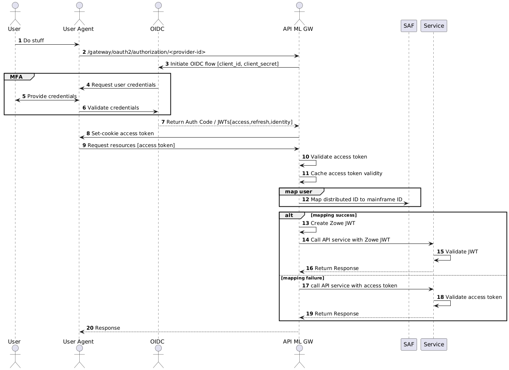

# Zowe API Mediation Layer OIDC Authentication

The OpenID/Connect ([OIDC](https://openid.net/specs/openid-connect-core-1_0.html)) protocol adds an authentication layer on top of the [OAuth2](https://www.rfc-editor.org/rfc/rfc6749) Authorization protocol.
OIDC authentication, together with the z/OS [Identity Propagation](https://www.redbooks.ibm.com/redbooks/pdfs/sg247850.pdf) mechanism, is the foundation of the API ML Identity Federation.
Herein we often refer to OIDC as provider, while the token related functionality is actually provided by the OAuth2 component of the OIDC implementation.

Zowe API ML can be configured to authenticate users by accepting Access Tokens issued by an external OIDC/OAuth2 provider.
This configuration is useful in advanced deployments of Zowe where client applications need to access mainframe as well as enterprise/distributed systems while simultaneously offering single sign-on (SSO) across system boundaries.  

Review this topic for details about the API ML OIDC authentication functionality and how to configure this feature. 

- [Usage](#usage)
- [Authentication flow](#authentication-flow)
- [Prerequisites](#prerequisites)
  * [OIDC provider](#oidc-provider)
  * [ESM configuration](#esm-configuration)
- [API ML configuration](#api-ml-configuration)
- [Troubleshooting](#troubleshooting)

## Usage
The OIDC protocol is used by API ML client applications to verify the identity of a user with a distributed OIDC provider trusted by the mainframe security manager.
Upon successful user login, the OIDC provider grants the client application a JWT Access Token along with an (JWT) Identity Token.
The client application can pass this Access Token with subsequent requests to mainframe services routed through the API ML Gateway.
The API ML Gateway then validates the OIDC Access Token. If the token is valid, the user identity from that token is mapped to the mainframe identity of the user.
The API ML Gateway can then create mainframe user credentials (JWT or a Passticket) according to the service's authentication schema configuration.
The request is routed to the target API services with correct mainframe user credentials.

## Authentication Flow
The following diagram illustrates the interactions between the participants of the OIDC/OAuth2 based API ML authentication process.



* When a user wants to access mainframe resources or services using the client application without a valid authentication / access token, the client redirects the user agent to the login end-point of the distributed OIDC provider. 
* The user is asked to provide valid credentials (authentication factors).
* After successful validation of all authentication factors, the OIDC provider grants the client an Access Token.
* The client can then request from API ML Gateway the needed mainframe resources presenting the access token in the request. 
* The Gateway validates the access token at the provider's OIDC/introspection end-point. If the access token is validated, the outcome is cached for a short time (20 sec by default). 
* In subsequent calls with the same token, the Gateway reuses the cached validation outcome. As such, round trips to the OIDC /introspection end-point are not required between short intervals, when the client needs to access multiple resources in a row to complete a unit of work. The caching interval is configurable with a default value of 20 seconds, a sufficient time allotment to allow most client operations requiring multiple API requests to complete, while also providing adequate protection against unauthorized access. 
* The API ML Gateway fetches the distributed user identity from the distributed access token and maps this user identity to the user mainframe identity using SAF. 
* The API ML Gateway calls the requested mainframe service/s with mainframe user credentials (Zowe, SAF JWT, or pass-ticket) which are expected by the target mainframe service.

## Prerequisites
Ensure that the following prerequisites are met:  

- Users who require access to mainframe resources using OIDC authentication have a mainframe identity managed by SAF/ESM.
- Client application users have distributed identity managed by the OIDC provider. For details, see the section [OIDC provider](#oidc-provider) in this topic.
- SAF/ESM is configured with mapping between the mainframe and distributed user identities. For details, see the section [ESM configuration](#esm-configuration) in this topic.
- ZSS must be enabled and properly configured in the Zowe installation 
  
### OIDC provider

- Client Application configuration in the OIDC provider.

  Depending on the OIDC provider and client application capabilities, configuration of the OIDC provider varies.
For example Web Applications with a secure server side component can use `code grant authorization flow` and can be granted a Refresh Token, whereas a Single Page Application running entirely in the User Agent (browser) is more limited regarding its security capabilities.  

  **Tip:** Consult your OIDC provider documentation for options and requirements available for your type of client application. 

- Users have been assigned to the Client Application.

  To access mainframe resources, users with a distributed authentication must either be directly assigned by the OIDC provider to the client application, or must be part of group which is allowed to work with the client application.     

### ESM configuration 
Execute the following two tasks to ensure that ESM is properly configured for Identity Mapping of distributed to mainframe user identity.

1. Distributed users identity configuration

The users' identity mappings are defined as distributed user identity filters, which are maintained by the System Authorization Facility (SAF) / External Security Manager (ESM).
A distributed identity consists of two parts: a distributed identity name, and a trusted registry which governs that identity. 
API ML provides a Zowe CLI plugin to help administrators to generate a JCL for creating the mapping filter specific for the ESM installed on the target mainframe system. 

  See the [Identity Federation cli plugin](../../user-guide/cli-idfplugin.md)

Alternatively, administrators can use the installed ESM functionality to create, delete, list, and query a distributed identity filter/s:
 - For RACF consult [RACMAP command](https://www.ibm.com/docs/en/zos/2.3.0?topic=rcs-racmap-create-delete-list-query-distributed-identity-filter).
 - For CA Top Secret use the [IDMAP Keyword - Implement z/OS Identity Propagation Mapping](https://techdocs.broadcom.com/us/en/ca-mainframe-software/security/ca-top-secret-for-z-os/16-0/administrating/issuing-commands-to-communicate-administrative-requirements/keywords/idmap-keyword-implement-z-os-identity-propagation-mapping.html).
 - For CA ACF2 use [IDMAP User Profile Data Records](https://techdocs.broadcom.com/us/en/ca-mainframe-software/security/ca-acf2-for-z-os/16-0/administrating/administer-records/user-profile-records/idmap-user-profile-records.html).

2. External Mapper user's permissions.
  The External Mapper functionality is executed on behalf of the calling `externalMapperUser`. By default, this will be the ZOWE runtime user `ZWESVUSR`.   
  For the identity mapping calls to succeed, the externalMapperUser needs special privileges which may vary per installed ESM type.

  Perform following validations and configuration steps to ensure that externalMapperUser is properly configured:   
1. Make sure that the user has a default user group set. The default group could be any existing group.   
   
  - For Top Secret, execute the following commands to set default group in the externalMapperUser profile:
   
    ```
    TSS ADD(user_id) GROUP(group_id)
    TSS ADD(user_id) DFLTGRP(group_id)
    ```
   
    **TIP:** The externalMapperUser must be able to login (with a passticket) to the z/OSMF (that's why it must be in one of the IZU* groups) and in order to do that it must have a password set (i.e. it must not have NOPASSWORD property in his security profile) .


  - For RACF, validate that the user already has DFLTGRP, which should be set by default     


  - For ACF2, execute the following command:

    `#TODO- Find what command is needed`

2. Make sure that the externalMappingUser has READ access to the Master Facility class set in the user profile. 
  - For Top Secret, execute the following command: 

    ```TSS PERMIT(user) IBMFAC(IRR.IDIDMAP.QUERY) ACCESS(READ)```


  - For RACF, it is not required that the externalMapperUser has permissions to the Master Facility class.

    
  - For ACF2, execute the following command:

    `#TODO- Find what command is needed`

3. Make sure that the externalMapperUser has access to the ZOWE facility.
  - For Top Secret, execute the following command:

    ```TSS ADDTO(user) FACILITY(ZOWE) ```


  - For RACF it is not required that the externalMapperUser has permissions to the ZOWE Facility class.
   
    `#TODO- Find what command is needed`


  - For ACF2 take the following command:

    `#TODO- Find what command is needed`

4. Make sure that the externalMapperUser has permissions for the OMVSAPPL.
  - For Top Secret, execute the following command:

    ```TSS PERMIT(user) APPL(OMVSAPPL)```
   

  - For RACF, execute the following commands:
    ```
    PERMIT OMVSAPPL CLASS(APPL) ID(user) ACCESS(READ)
    SETR RACLIST(APPL) REFRESH
    ```

  - For ACF2, execute the following command:

    `#TODO- Find what command is needed`

5. Make sure the externalMapperUser has access to the `IRR.IDIDMAP.QUERY` facility.
  - For Top Secret, execute the following command:

    `TSS PERMIT(user) IBMFAC(IRR.IDIDMAP.QUERY) ACCESS(READ)`


  - For RACF, execute the following commands:
    ```
    PERMIT IRR.IDIDMAP.QUERY CLASS(FACILITY) ID(SDKTST2) ACCESS(NONE)
    SETR RACLIST(FACILITY) REFRESH
    ```

  - For ACF2, execute the following command:
    ```
    SET RESOURCE(FAC)                                          
    RECKEY IRR ADD(IDIDMAP.QUERY UID(SDKTST2) SERVICE(READ) ALLOW)
    F ACF2,REBUILD(FAC)
    ```

**Note:** If the ZOWE runtime user ZWESVUSR is configured as the externalMapperUser, some permissions listed above may be already configured during the ZOWE installation.

## API ML configuration
Use the following procedure to enable the feature to use an OIDC Access Token as the method of authentication for the API Mediation Layer Gateway.

 In the zowe.yaml file, configure the following properties:
          
   * **`components.gateway.apiml.security.oidc.enabled`**  
   Specifies the global feature toggle. Set the value to true to enable OIDC authentication functionality.

   * **`components.gateway.apiml.security.oidc.clientId`**  
   Specifies the value of the client identification (client_id) assigned by the OIDC provider to the API ML Gateway.
   
   * **`components.gateway.apiml.security.oidc.clientSecret`**   
   Specifies the client secret assigned by the OIDC provider to the API ML Gateway. It is used in combination with the client_id in Access Token validation requests at the /introspect endpoint of the OIDC provider.

   * **`components.gateway.apiml.security.oidc.registry`**  
   Specifies the trusted registry name used by SAF to group the identities recognized as having a OIDC identity mapping. 
   The trusted registry name is the string used during the creation of the mapping between the distributed and mainframe user identities. See the [ESM configuration](#esm-configuration) for more information.

   * **`components.gateway.apiml.security.oidc.introspectEndpoint`**
   Specifies the path portion of the token introspection endpoint URL, provided by the OAuth2/OIDC provider. The Token Introspection endpoint is defined by the [OAuth 2.0 Token Introspection extension](https://datatracker.ietf.org/doc/html/rfc7662) as an OAuth2 endpoint, that takes a parameter representing an OAuth 2.0 token and returns a JSON document representing the meta information surrounding the token, including whether this token is currently active.


**Note:** Provide externalMapperUser and externalMapperUrl if they differ from the default values.     
   
  * **'components.gateway.apiml.security.x509.externalMapperUser'**
    The user ID used to call the external mapper. Needs to be set properly according to the permissions requirements listed in the step 2 of the [ESM configuration](#esm-configuration) above.   

  **Note:** Skip this property if the Zowe runtime userId is not altered from the default `ZWESVUSR`.

To authenticate to the mapping API, a JWT is sent with the request. The token represents the user that is configured with this property. The user authorization is required to use the `IRR.RUSERMAP` resource within the `FACILITY` class. The default value is `ZWESVUSR`. Permissions are set up during installation with the `ZWESECUR` JCL or workflow.

If you customized the `ZWESECUR` JCL or workflow (the customization of zowe runtime user: `// SET ZOWEUSER=ZWESVUSR * userid for Zowe started task`) and changed the default USERID, create the `components.gateway.apiml.security.x509.externalMapperUser` property and set the value by adding a new line as in the following example:

**Example:**

   ```
   components.gateway.apiml.security.x509.externalMapperUser: yournewuserid  
   ```

   * **`components.gateway.apiml.security.oidc.identityMapperUrl`**  
  Defines the URL where Gateway can query the mapping of distributed user ID to mainframe user ID. 
  This property informs the Gateway about the location of this API. ZSS is the default API provider in Zowe. You can provide your own API to perform the mapping. In this case, it is necessary to customize this value.

The following URL is the default value for Zowe and ZSS: `https://${ZWE_haInstance_hostname}:${GATEWAY_PORT}/zss/api/v1/certificate/dn`

## Troubleshooting
- API ML is not able to validate distributed Access Tokens with the OIDC provider because connection to the OIDC provider cann't be established or the provider is not running.

  If you find the following message in the log:
  
    ```Failed to validate the OIDC access token. Can not establish connection to the OIDC provider.``` 

  Make sure that:
    - The OIDC provider is up and running
    - The OIDC provider can be accessed from the system where AI ML GW is running
  
   
- Calls to OIDC provider introspection endpoint finish with unexpected response code.

  If you find following message in the gateway log:

    ```Failed to validate the OIDC access token. Unexpected response: ```

  Make sure that:
  - Your OIDC provider is configured properly 
  - The OIDC client credentials - `clientId` and `client_scret` are correctly set in the API ML Gateway configuration. 

- ZSS is not enabled or not running
  - #TODO: Do we have an error code ? See code, try.
    - @PZA: Ask Shobha, Lena
  
  To fix the issue:
    - Enable ZSS in the Zowe configuration (zowe.yaml) 
    - Start the ZSS component.
  
- The configured external mapper user doesn't have required permissions to call the identity mapper.
       Call ZSS with ZoweSVUser 
    - #TODO: Return codes from ZSS - logged to GW - find what and what level
    
    To fix the issue: 
      - Validate the [ESM configuration](#esm-configuration) depending on installed ESM.
      - Contact your security administrator to assign all the necessary permissions to the mapper's username according to your OIDC configuration. 
     
 - The configured external mapper user, doesn't have sufficient access rights to create passtickets and/or to call z/OSMF
      - (PZA#See troubleshooting of x509)
    
      To fix the issue:
        - Contact your security administrator to assign all the neccessary permisions to the mapper user name according to your OIDC configuration.

- Distributed user identity is not mapped properly by SAF to a mainframe user identity. 
      - Start ZSS and API ML in Debug to see reason codes and more details.
      - Check the mapping definitions in SAF to contain correct values for both, distributed user ID and distributed registry. 

#TODO$Unresolved issues:
  - ZOWE facility is needed for users to authenticate when the SAF provider is used
  - Resources required are not documented and included in the security job
  - ZSS messages are misleading
  - ZSS does not provide a response with ACF2
  - Does not work with SAF provider
-- 