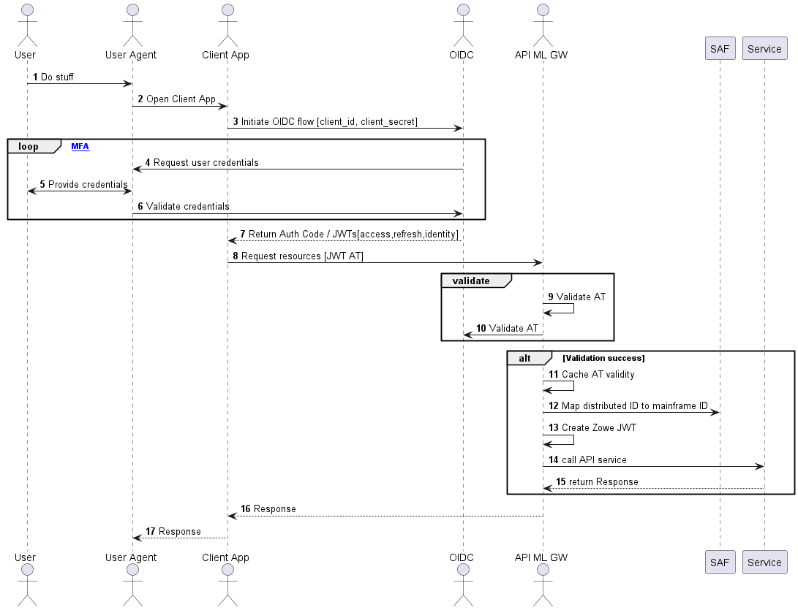

# Authenticating with OIDC 

:::info Required roles: system administrator, security administrator
:::

The OpenID/Connect ([OIDC](https://openid.net/specs/openid-connect-core-1_0.html)) protocol adds an authentication layer on top of the [OAuth2](https://www.rfc-editor.org/rfc/rfc6749) Authorization protocol.

OIDC authentication, together with the z/OS [Identity Propagation](https://www.redbooks.ibm.com/redbooks/pdfs/sg247850.pdf) mechanism, is the foundation of the API ML Identity Federation.
In this article, OIDC is often referred to as the provider, while the token-related functionality is actually provided by the OAuth2 component of the OIDC implementation.

You can configure Zowe API ML to authenticate users by accepting Access Tokens issued by an external OIDC/OAuth2 provider.
This configuration is useful in advanced deployments of Zowe where client applications need to access mainframe as well as enterprise/distributed systems while simultaneously offering single sign-on (SSO) across system boundaries.  

This article details the API ML OIDC authentication functionality, and how to configure the OIDC Authentication feature.

:::note
The OIDC feature is currently unavailable on ACF2 systems.
:::

- [Usage](#usage)
- [Authentication flow](#authentication-flow)
- [Prerequisites](#prerequisites)
  - [OIDC provider](#oidc-provider)
  - [ESM configuration](#esm-configuration)
- [API ML configuration](#api-ml-oidc-configuration)
- [Troubleshooting](#troubleshooting)

## Usage

The OIDC protocol is used by API ML client applications to verify the identity of a user with a distributed OIDC provider trusted by the mainframe security manager.
After successful user login, the OIDC provider grants the client application a JWT Access Token along with an (JWT) Identity Token.
The client application can pass this Access Token with subsequent requests to mainframe services routed through the API ML Gateway.
The API ML Gateway then validates the OIDC Access Token. If the token is valid, the user identity from that token is mapped to the mainframe identity of the user.
The API ML Gateway can then create mainframe user credentials (JWT or a PassTicket) according to the service's authentication schema configuration.
The request is routed to the target API services with correct mainframe user credentials.

## Authentication Flow

The following diagram illustrates the interactions between the participants of the OIDC/OAuth2 based API ML authentication process.



- When a user wants to access mainframe resources or services using the client application without valid authentication or an access token, the client redirects the user agent to the login end-point of the distributed OIDC provider.
- The user is asked to provide valid credentials (authentication factors).
- After successful validation of all authentication factors, the OIDC provider grants the client an Access Token.
- The client can then request from API ML Gateway the needed mainframe resources presenting the access token in the request.
- The Gateway validates the access token by comparing the key id of the token against the key ids obtained from the authorization server's JWK keys endpoint.
- The URL to the specific authorization server's JWK keys endpoint should be set using the property `jwks_uri`. If the access token is validated, the outcome is cached for a short time (20 sec by default).
- The JWK Keys obtained from the authorization server's endpoint are cached for a while to prevent repeated calls to the endpoint. The interval can be set using the property `jwks.refreshInternalHours` (The default value is one hour).
- In subsequent calls with the same token, the Gateway reuses the cached validation outcome. As such, round trips to the OIDC authorization server for JWK keys and JWT Token validation are not required between short intervals when the client needs to access multiple resources in a row to complete a unit of work.
- The caching interval is configurable with a default value of 20 seconds, which is typically a sufficient amount of time to allow most client operations requiring multiple API requests to complete, while also providing adequate protection against unauthorized access.
- The API ML Gateway fetches the distributed user identity from the distributed access token and maps this user identity to the user mainframe identity using SAF.
- The API ML Gateway calls the requested mainframe service/s with mainframe user credentials (Zowe, SAF JWT, or PassTicket) which are expected by the target mainframe service.

## Prerequisites

Ensure that the following prerequisites are met:  

- Users who require access to mainframe resources using OIDC authentication have a mainframe identity managed by SAF/ESM.
- Client application users have their distributed identity managed by the OIDC provider. For details, see the section [OIDC provider](#oidc-provider) in this topic.
- SAF/ESM is configured with mapping between the mainframe and distributed user identities. For details, see the section [ESM configuration](#esm-configuration) in this topic.
- If you are using Zowe release 2.14 or a later release, ensure that the API ML Gateway is configured to use the internal mapper functionality. For information about enabling the API ML mapper, see [Enabling the internal API ML mapper](../../user-guide/authenticating-with-client-certificates.md#enabling-the-internal-api-ml-mapper).  Alternatively, enable ZSS in the Zowe installation, however using the internal mapper is the recommended method. ZSS is enabled by default.
  
### OIDC provider prerequisites

- Client Application configuration in the OIDC provider

  Depending on the OIDC provider and client application capabilities, configuration of the OIDC provider varies.
For example, web applications with a secure server side component can use `code grant authorization flow` and can be granted a Refresh Token, whereas a Single Page Application running entirely in the User Agent (browser) is more limited regarding its security capabilities.  

  :::tip
  Consult your OIDC provider documentation for options and requirements available for your type of client application.
  :::

- Users have been assigned to the Client Application

  To access mainframe resources, users with a distributed authentication must either be directly assigned by the OIDC provider to the client application, or must be part of group which is allowed to work with the client application.

### ESM configuration prerequisites

The user identity mapping is defined as a distributed user identity mapping filter, which is maintained by the System Authorization Facility (SAF) / External Security Manager (ESM).
A distributed identity consists of two parts:

- A distributed identity name
- A trusted registry which governs that identity

Administrators can use the installed ESM functionality to create, delete, list, and query a distributed identity mapping filter or filters:

Use the commands specific to your ESM to create distributed identity mapping filter.

:::note
User specified parameters are presented in the section [Parameters in the ESM commands](#parameters-in-the-esm-commands).
:::

- **For RACF:**

```markup
  RACMAP ID(userid) MAP USERDIDFILTER(NAME('distributed-identity-user-name')) REGISTRY(NAME('distributed-identity-registry-name' )) WITHLABEL('label-name')

  SETROPTS RACLIST(IDIDMAP) REFRESH
 ```

  For more details about the RACMAP command, see [RACMAP command](https://www.ibm.com/docs/en/zos/2.3.0?topic=rcs-racmap-create-delete-list-query-distributed-identity-filter).

- **For Top Secret:**

```markup
  TSS ADD(userid) IDMAP(ZWEDNMAP) IDMAPDN('distributed-identity-user-name') - <br>
  IDMAPRN('distributed-identity-registry-name') IDLABEL('label-name')

  TSS REFRESH
```

  For more details about mapping a distributed identity username and a distributed registry name to a Top Secret ACID, see [IDMAP Keyword - Implement z/OS Identity Propagation Mapping](https://techdocs.broadcom.com/us/en/ca-mainframe-software/security/ca-top-secret-for-z-os/16-0/administrating/issuing-commands-to-communicate-administrative-requirements/keywords/idmap-keyword-implement-z-os-identity-propagation-mapping.html).

- **For ACF2:**

```markup
  ACF
  SET PROFILE(USER) DIVISION(IDMAP)
  INSERT userid.ZWEDNMAP IDMAPDN(distributed-identity-user-name) -
  IDMAPRN(distributed-identity-registry-name) IDLABEL(label-name)

  F ACF2,REBUILD(USR),CLASS(P),DIVISION(IDMAP)
  END
```

  For more details about mapping a distributed user to a logonid, see [IDMAP User Profile Data Records](https://techdocs.broadcom.com/us/en/ca-mainframe-software/security/ca-acf2-for-z-os/16-0/administrating/administer-records/user-profile-records/idmap-user-profile-records.html).

#### Parameters in the ESM commands

- **`userid`**  
   Specifies the ESM user id
- **`distributed-identity-user-name`**  
   Specifies the user id for distributed-identity-registry
- **`distributed-identity-registry-name`**  
   Specifies the URL value of the distributed-identity-registry where user is defined
- **`label-name`**  
   Specifies the name for the distributed-identity mapping filter

   **Example for RACF:**

   ```markup
   RACMAP ID(ab00001) MAP USERDIDFILTER(NAME('aaa.bbb@richradioham.com')) REGISTRY(NAME('ldaps://us.richradioham.com')) WITHLABEL('identity mapping for ab00001')
   ```

Alternatively, API ML provides a Zowe CLI plug-in to help administrators generate a JCL for creating the mapping filter specific for the ESM installed on the target mainframe system. These JCLs can be submitted on the corresponding ESM to create a distributed identity mapping filter.

For details about how to use the plug-in tool to set up mapping in the ESM of your z/OS system, see the [Identity Federation cli plug-in](../../user-guide/cli-idfplugin.md) documentation.

## API ML OIDC configuration

Use the following procedure to enable the feature to use an OIDC Access Token as the method of authentication for the API Mediation Layer Gateway.

:::tip
You can leverage the Zowe CLI Identity Federation (IDF) Plug-in for Zowe CLI to extend Zowe CLI to make it easier to map mainframe users with an identity provided by an external identity provider.
The Plug-in is designed to work with the ESMs: IBM RACF, Broadcom ACF2, and Broadcom Top Secret.

For more information about the Zowe CLI Identity Federation Plug-in, see the [README file in the api-layer repo](https://github.com/zowe/api-layer/edit/v3.x.x/zowe-cli-id-federation-plugin/README.md).
:::

 In the zowe.yaml file, configure the following properties:

- **`components.gateway.apiml.security.oidc.enabled`**  
   Specifies the global feature toggle. Set the value to `true` to enable OIDC authentication functionality.

- **`components.gateway.apiml.security.oidc.registry`**  
   Specifies the SAF registry used to group the identities recognized as having a OIDC identity mapping. The registry name is the string used during the creation of the mapping between the dustributed and mainframe user identities. For more information, see the [ESM configuration](#esm-configuration).

- **`components.gateway.apiml.security.oidc.jwks.uri`**  
   Specifies the URI obtained from the authorization server's metadata where the Gateway will query for the JWK used to sign and verify the access tokens.

- **`components.gateway.apiml.security.oidc.jwks.refreshInternalHours`**
   Specifies the frequency in hours to refresh the JWK keys from the OIDC provider. Defaults to one hour.  

- **`components.gateway.apiml.security.oidc.identityMapperUser`**  
    (Optional) If the userId is different from the default Zowe runtime userId (`ZWESVUSR`), specify the `identityMapperUser` userId to configure API ML access to the external user identity mapper.

    **Note:** User authorization is required to use the `IRR.RUSERMAP` resource within the `FACILITY` class. The default value is `ZWESVUSR`. Permissions are set up during installation with the `ZWESECUR` JCL or workflow. To authenticate to the mapping API, a JWT is sent with the request. The token represents the user that is configured with this property.

- **`apiml.security.oidc.identityMapperUrl`**  
  Defines the URL where the Gateway can query the mapping of the distributed user ID to the mainframe user ID.
  This property informs the Gateway about the location of this API. ZSS is the default API provider in Zowe. You can provide your own API to perform the mapping. In this case, it is necessary to customize this value.

    The following URL is the default value for Zowe and ZSS:

    ```
    https://${ZWE_haInstance_hostname}:${GATEWAY_PORT}/zss/api/v1/certificate/dn
    ```

## Troubleshooting

### API ML fails to validate the OIDC access token with the Distributed Identity Provider

**Symptom**  
The Gateway log contains the following ERROR message:  
`Failed to validate the OIDC access token. Unexpected response: XXX.`

- **_XXX_**  
is the HTTP status code returned by the Identity Provider.

**Explanation**  
The HTTP code is one of the 40X variants that provides the reason for the failure.

**Solution**  

Correct the Gateway configuration according to the code returned by the OIDC Identity Provider.

### The access token validation fails with HTTP error

**Symptom**  

The OIDC provider returns an HTTP 40x error code.

**Explanation**  

The client application is not properly configured in the API ML Gateway.

**Solution**  
Check that the URL `jwks_uri` contains the key for  OIDC token validation.

:::tip
API ML Gateway exposes a validate token operation which is suitable during the OIDC setup. The call to the endpoint `/gateway/api/v1/auth/oidc-token/validate` verifies if the OIDC token is trusted by API ML. Note that the Gateway service does not perform the mapping request to the ESM when the `/gateway/api/v1/auth/oidc-token/validate` endpoint is called.

Use the following curl command to make a REST request with the OIDC token to the validate token endpoint:

```shell
curl --location 'https://"$HOSTNAME:$PORT"/gateway/api/v1/auth/oidc-token/validate --data '{"token": "$OIDC_TOKEN","serviceId": "$SERVICE_ID"}'
```

An HTTP `200` code is returned if the validation passes. Failure to validate returns an HTTP `40x` error.
:::

:::note Azure Entra ID OIDC notes:
API ML uses the `sub` claim of the ID Token to identify the user, and to map to the mainframe account. Note that the structure of the `sub` claim varies between the Azure token and the OKTA ID token:
- The Azure token `sub` is an alphanumeric value.  
For more information, see the topic _Use claims to reliably identify a user_ in the Microsoft Learn documentation.
- The OKTA ID token has an email in the `sub` claim.

For more information about Entra ID token format see _ID token claims reference_ in the Microsoft documentation.
:::
