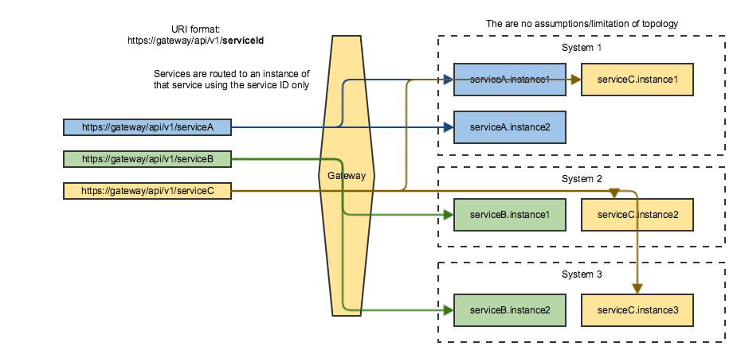

# API Mediation Layer routing

`Service` - A service provides one or more APIs. A service is identified by its service ID (sometimes the term service name is used in the same meaning). 
The default service ID is provided by service developer in the service configuration file. 
The service ID can be replaced with deployment environment specific name by the system administrator using additional configuration external to the service deployment unit (most often a jar or war file). 
Services are deployed using one or more service instances, which share the same service ID and implementation.

`URI (Uniform Resource Identifier)` is a string of characters used to identify a resource. The same URI should always go to the same resource without any need to other information (e.g. HTTP headers).

### APIML Basic Routing (Service ID and version-based)

Basic routing is based on the service ID that is used to identify the service. The specific instance is selected by the API gateway. The response needs to be the same for all instances. This is the type of routing that is expected by Eureka and Zuul.

The URI identifies the resource. It does not identify uniquely the instance of the same service in the case when there multiple instances that are providing the same service (i.e. service is running in HA mode). 
Services of the same product that are providing different resources (e.g. SYSVIEW on one system and SYSVIEW in a different sysplex) cannot have the same service ID (the same URI cannot have two different meanings). 

In addition to the basic Zuul routing, the Zowe API Gateway adds support for versioning where a major version can be specified. 
The gateway routes request only to an instance that provide the specified major version of the API. 
The `/api/` prefix is used for REST APIs. There is also `/ui/` prefix for web UIs and `/ws/` for WebSockets.

Additional routing can be implemented using a Zuul Pre-filter.

The URL format expected by the API Gateway is:

`https://{gatewayHost}:{port}/api/v{majorVersion}/{serviceId}/{resource}`

**Example: z/OSMF routes (without version)**

* z/OSMF direct URL: `https://ca32.ca.com:1443/zosmf/restjobs/1.0/...`
* Gateway URL: `https://ca3x.ca.com:10010/api/zosmfca32/restjobs/1.0/...`

 
