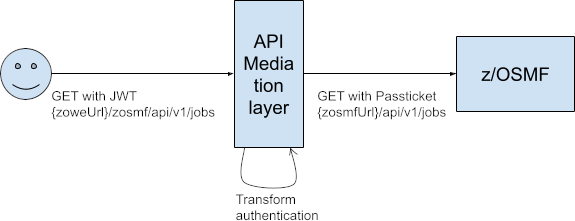
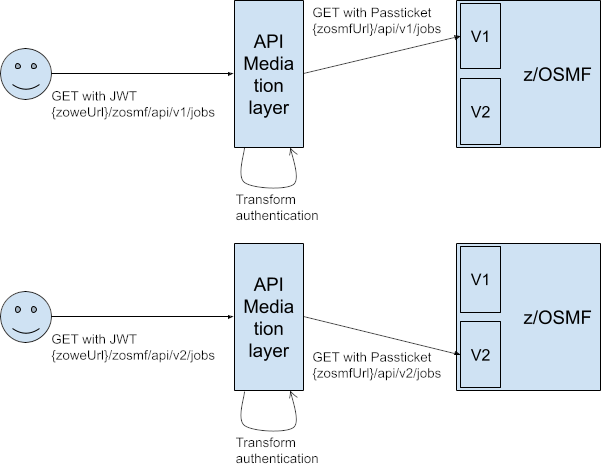
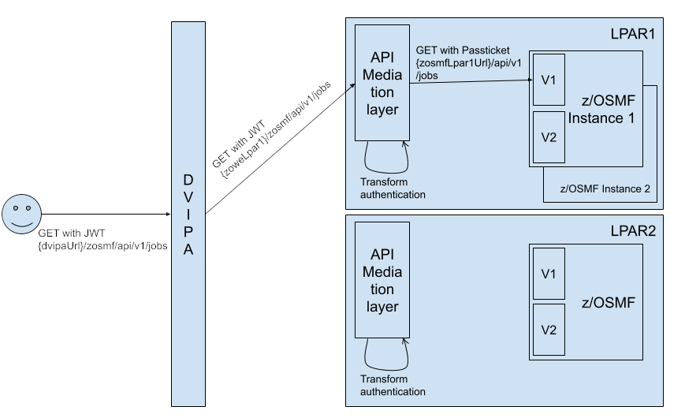
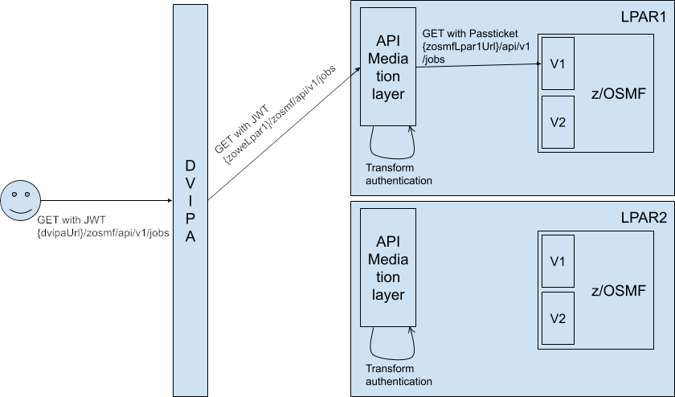
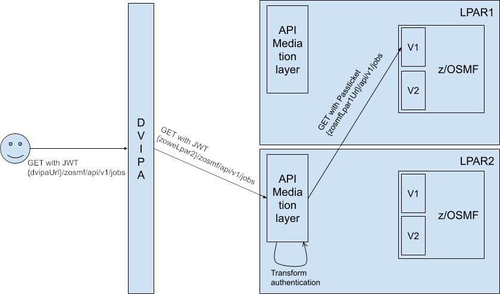

# API Mediation Layer Routing Documentation

## Overview

The API Mediation Layer (APIML) in Zowe acts as a Level 7 Load Balancer, using the API Gateway to route requests to backend 
services. It supports both single and multiple APIML instances.


**Key Concepts**
- Service ID: Unique identifier for each service.
- Instance Routing: Routes requests based on service instances.
- Versioning: Supports routing to specific service versions.

**Basic Routing**

Requests are routed using the service ID and optionally, the service version:

- Example: https://gateway-url/api/v1/service-id

**Routing Mechanism**

1. Single APIML Instance: Routes directly to the service based on service ID.
2. Multiple APIML Instances: Uses Eureka metadata for service discovery and load balancing.

**Implementation Details**
Routing configuration is defined in Eureka metadata. Ensure proper setup for accurate routing. Below is an example of Eureka metadata configuration:

```yaml
apiml:
    service:                               
        routes:
            -   gateway-url: "ui/v1"
                service-url: ${apiml.service.contextPath}
            -   gateway-url: "api/v1"
                service-url: ${apiml.service.contextPath}/api/v1
            -   gateway-url: "ws/v1"
                service-url: ${apiml.service.contextPath}/ws
```


**Instance Routing**
APIML supports routing to multiple instances of the same service, distributing requests based on load balancing policies. Ensure each service instance registers with a unique instance ID in Eureka.

**Versioning**
APIML allows specifying a version for a service in the route. If a version is not specified, the latest version is used by default. This provides flexibility in deploying and updating services without affecting existing clients.

**Example Usage**
To route to a specific version of a service:

```http
https://gateway-url/api/v1/service-id?version=1.2
```

If no version is specified, the request defaults to the latest service version:

```http
https://gateway-url/api/v1/service-id
```

### Advanced Configuration

Advanced routing configurations can include custom load balancing rules, fallback options, and route-specific policies. Refer to the detailed configuration guide for more advanced settings and examples.

### Troubleshooting

- Common Issues: Misconfigured metadata, incorrect service IDs, and network issues.
- Debugging Tips: Check Eureka registration details, API Gateway logs, and network connectivity.

## Terminology

* **Service**

  A service provides one or more APIs, and is identified by a service ID. Note that sometimes the term "service name" is
  used to mean service ID.

  The default service ID is provided by the service developer in the service configuration file.

  A system administrator can replace the service ID with a deployment environment specific name using additional
  configuration that is external to the service deployment unit. Most often, this is configured in a JAR or WAR file. 
  Explain how to do that in your documentation of the specific service. 

  Services are deployed using one or more service instances, which share the same service ID and implementation.

* **Instance**

  Instance of a specific service providing one or more APIs.

### Single API Mediation Layer Instance

When there is one instance of the API Mediation Layer in the system, we expect the API Mediation Layer to be the
entry point to the system.

#### Single instance of service

The service can be deployed with one instance or with multiple instances. The service exposes APIs, these APIs may
be versioned.

##### One version of the API



##### Multiple version of the API



#### Multiple instances of service



### Multiple API Mediation Layer Instances

This reflects the High Availability setup for the API Mediation Layer, where L5 load balancer in front of the 
API Gateway is used. 

#### Same LPAR Multiple API Mediation Layer Instances



#### Different LPAR Multiple API Mediation Layer Instances

