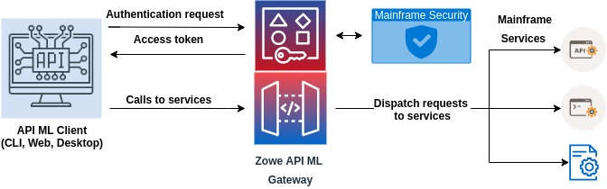

# Utilizing Zowe API Mediation Layer Single-Sign-On

As a contributer to Zowe, you can extend Zowe and utilize Zowe Single-Sign-On (SSO) provided by Zowe API Mediation Layer.

Zowe Single-Sign-On is based on a single authentication/identity token that identifies the z/OS user. This token needs to be trusted by extensions in order to be used. Only Zowe API ML and the ZAAS component can issue an authentication token based on valid z/OS credentials. This article describes the multiple [authentication methods](api-mediation-security.md#Supported-authentication-methods) you can use to obtain the token.
In the current release of Zowe, only a single z/OS security domain can be used.

This following section outlines the high-level steps necessary to achieve the sign-on. The following diagram shows the high-level overview of the process. 

There are two main types of components that are used in Zowe SSO via API ML:

* Zowe API ML client

   - This type of component is user-facing and can obtain credentials from the user through a user interface (web, CLI, desktop)
   - The Zowe API ML client calls API services through the API ML
   - An example of such clients are Zowe CLI or Zowe Desktop. Clients can be web or mobile applications.

* An API service accessed through Zowe API ML

   - A service that is registered to API ML and is accessed through the API Gateway.

The following sections describe what is necessary to utilize SSO for both types.

### Zowe API ML client

* Zowe API ML client needs to obtain an authentication token via the `/login` endpoint of ZAAS described above. This endpoint requires valid credentials.
* The client should not rely on the token format but use the ZAAS `/query` endpoint to validate the token and get information about it. This is useful when the API client has the token but does not store the associated data such as the user ID.
* The API client needs to provide the authentication token to API services in the form of a Secure HttpOnly cookie with the name `apimlAuthenticationToken`, or in the `Authorization: Bearer` HTTP header as described in [Authenticated Request](https://github.com/zowe/sample-spring-boot-api-service/blob/master/zowe-rest-api-sample-spring/docs/api-client-authentication.md#authenticated-request).

**Note:** Future plans for Zowe CLI to serve as an API ML client are desribed at [Zowe CLI: Token Authentication, MFA, and SSO](https://medium.com/zowe/zowe-cli-token-authentication-mfa-and-sso-b88bca3efa35).

### API service accessed via Zowe API ML

This section describes the requirements of a service to adopt a Zowe authentication token. In the future, we intend to allow Zowe to support services that accept PassTickets. 

* The API service must accept the authentication token to the API services in the form of a Secure HttpOnly cookie with the name `apimlAuthenticationToken` or in the `Authorization: Bearer` HTTP header as described in the [Authenticated Request](https://github.com/zowe/sample-spring-boot-api-service/blob/master/zowe-rest-api-sample-spring/docs/api-client-authentication.md#authenticated-request).
* The API service must validate the token and extract information about the user ID by calling the `/query` endpoint of the ZAAS described above. The alternative is to validate the signature of the JWT token. The format of the signature and location of the public key is described above. We recommend that you use this alternative only when calling the `/query` endpoint is not feasible.
* The API service needs to trust the Zowe API Gateway that hosts the ZAAS. The service is required to have the certificate of the CA that signed the Zowe API Gateway in its truststore.

The REST API of the ZAAS can be easily called from a Java application using the [ZAAS Client](api-mediation-security.md#zaas-client) described below.

### Existing services that cannot be modified

If you have a service that cannot be changed to adopt the Zowe authentication token, the service can still utilize Zowe Single-Sign-On through the API ML.

In this case, the service needs to accept a PassTicket in the HTTP Authorization header.

**Note:** For more information, see [Enabling PassTicket creation for API Services that Accept PassTickets](api-mediation-passtickets.md) for more details.

## Further resources

* [User guide for SSO in Zowe CLI ](https://docs.zowe.org/stable/user-guide/cli-usingcli.html#accessing-multiple-services-with-sso)
* [System requirements for using web tokens for SSO in Zlux and ZSS](https://docs.zowe.org/stable/user-guide/systemrequirements.html#using-web-tokens-for-sso-on-zlux-and-zss)
* [Certificate configuration for the usage of web tokens for SSO in Zlux and ZSS](https://docs.zowe.org/stable/user-guide/configure-certificates.html#using-web-tokens-for-sso-on-zlux-and-zss) 

