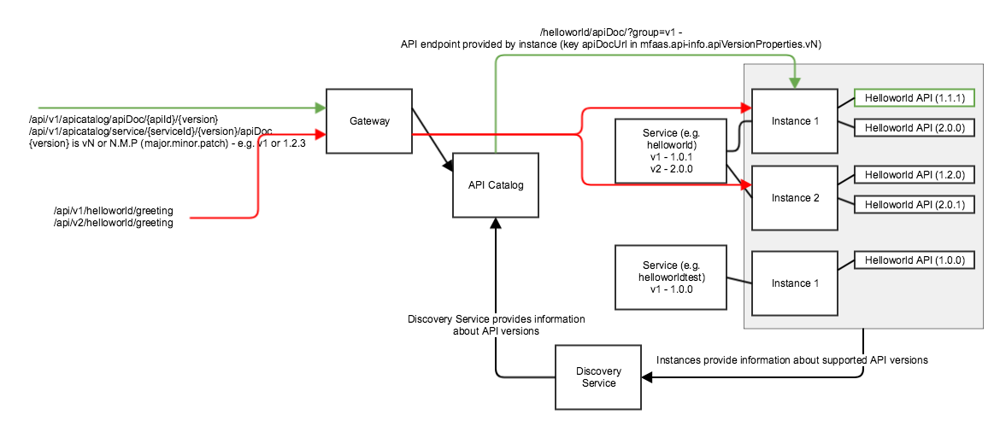

# Understanding API Versioning

As a Zowe extender, review concepts relating to API versioning including key terminology, the data model between APIs and API services, and the recommended guidelines for API versioning.

:::info Required roles: Zowe extender, application developer
:::

## Terminology

To understand API versioning, it is useful to be familiar with the following terms as they are applied within Zowe.

* **REST APIs**  
REST APIs are a way how to access and manipulate textual
 representations of Web resources using uniform and a predefined set of stateless operations.
 Usually via HTTP(S) protocol and using JSON format. Resources are identified by their Uniform
 Resource Identifier (URIs). The services are accessed via API ML Gateway. Example of a URI:
 `https://host:10010/endevormfno/api/v1/ENWSQA01/packages/PACKAGETST
 (https://{gatewayHost}:{port}/{serviceName}/api/v{majorVersion}/{resource}`)

* **API Catalog**  
  The API Catalog is the catalog of published API services and their associated documentation that have been
 discovered or available if provisioned from the service catalog.
 
    The Zowe API Catalog contains APIs of services provided by implementations of mainframe products. Service can be implemented by one or more service instances that provide exactly the same service for high availability and scalability.

* **Catalog Tile**  
 The API Catalog UI groups API services into tiles. An API service can be accessible in multiple tiles. The
 purpose of titles is to organize API services on the dashboard of the API Catalog. Default catalog tiles
 are constructed from the definitions provided by the services. 

 * **Service**  
 A Service (or application) is a logical entity that is comprised of functionality to access and manipulate specific resources and represents a collection of all service instances. The description and title are taken
 from the service with highest version, or when not specified, by the latest version. API clients use a service and the API Gateway chooses what service instance is
 accessed. The same API version can be implemented by multiple services. Such services are not
 interchangeable because they contain or access different data.

 * **Service instance**  
 In Zowe, a service instance refers to a specific deployment or configuration of a service. A service instance is a running copy of a service that can be interacted with or configured independently from other instances. For example, you might have multiple instances of the Zowe API ML, each with its own set of configuration parameters, APIs, and endpoints. An instance allows for flexibility in managing multiple environments, scaling, or offering different configurations of the same service to different users or use cases, and could apply to services or components that can be deployed multiple times. Instances are interchangeable whereby high availability can be provided.

* **Swagger**  
 The Swagger specification instance is provided for a specific API version. For details about Swagger, see the Swagger documentation: swagger.io/docs/specification/ .

 * **Route**  
 Specifies how service URLs are mapped to the Gateway. The Gateway translates a URL based on the start of the base path on the Gateway, and is translated to a base path that is
 used in the URL to access the service in order for services to be accessible via the
 gateway with a consistent URL format, independent of the service format. 
 
  * **Versioning**  
  APIs are versioned whereby the the major version (`v1`, `v2`) of the API is specified. Backward incompatible
 changes can be introduced only though changes of the major version. Any service can provide multiple
 versions of the API. For details about semantic versioning, see Semantic Versioning 2.0.0://semver.org/.

 * **API Association**  
 Details about how a specific API version is provided by a specific
 service. Different services can use a different basePath. The full path to access endpoints is:
 `scheme://host:port/basePath/endpointPath`. This information is set by the service developer.

 ## Data Model

 The following  diagram illustrates the data model between APIs and API services in the API Catalog.
 Most API data are provided during service registration. In the case of dynamic registration, data are 
 provided by the service, and are determined by the service developer (API-related), system
 administrator (service-related), and can potentially be altered by the user.

 ## API Versioning

 Service instances provide one or more different API versions. 
 
 :::note
 A single service instance should not provide two versions with the same major version. An instance can provide only one version. A separate instance can provide a different version.
 :::

 The API user specifies only the major version in the URI. The API catalog needs to differentiate
 between different _full versions_ internally and is subsequently able to return a specific full version or return
 documentation for the highest minor version of the specified major version that is supported by all running services.

### Guidelines for API versioning

- The version of the API is not dependent on the product release.

- Two last versions are supported.

 - The **Major version** is specified by the user of the API in the URI  and is increased only when a backward
 incompatible change is introduced. This is a rare occurance because the REST APIs should be designed to allow for
 extensibility.

 - The **Minor version** is not specified in the URI but the user should be aware of this minor version as it is important to
 display the correct level of documentation. The minor version is increased when the API is extended with a new feature. For example, if a new resource is available in v1.2, the service has to provide at least v1.2 as the request
 fails on v1.1. 
 
 <!-- Please complete this statement: 
 If there are multiple instances of the services that have different minor versions ... 

-->

 - The **Patch version** is not specified in the URI. The API in this case remains the same. This version is used only when the API
 documentation is patched or a bug was fixed.

 
