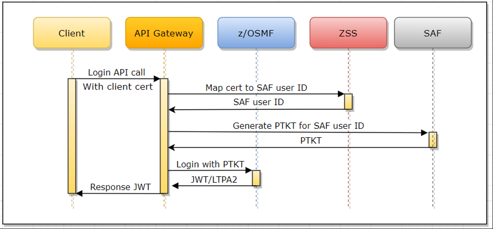

# Authentication for API ML services

Review how services of the API Mediation Layer address authentication.

- [Services of API Mediation Layer](#services-of-api-mediation-layer)
- [Authentication endpoints](#authentication-endpoints)
- [Supported authentication methods](#supported-authentication-methods)
    - [Authentication with Username Password](#authentication-with-usernamepassword)
    - [Authentication with Client certificate](#authentication-with-client-certificate)
    - [Authentication with JWT Token](#authentication-with-jwt-token)
- [Authentication parameters](#authentication-parameters)
- [Authentication providers](#authentication-providers)
    * [z/OSMF Authentication Provider](#z-osmf-authentication-provider)
    * [SAF Authentication Provider](#saf-authentication-provider)
    * [Dummy Authentication Provider](#dummy-authentication-provider)
- [Authorization](#authorization)
- [Discovery Service authentication](#discovery-service-authentication)

## Services of API Mediation Layer

- **API Gateway**

    - The API Gateway handles authentication
    - There are two authentication endpoints that allow authentication of the resource by providers
    - Diagnostic endpoints `https://{gatewayUrl}:{gatewayPort}/application/**` in API Gateway are protected by basic authentication, Zowe JWT token, or a client certificate

- **API Catalog**

    - API Catalog is accessed by users and requires a login
    - Protected access is performed by the Authentication and Authorization Service

- **Discovery Service**

    - Discovery Service is accessed by API Services
    - This access (reading information and registration) requires protection by means of a client certificate
    - (Optional) Access can be granted to users (administrators)
    - Diagnostic endpoints `https://{gatewayUrl}:{gatewayPort}/application/**` in Discovery Service are protected by basic authentication, Zowe JWT token, or a client certificate

- **API Services**

    - Authentication is service-dependent
    - It is recommended to use the Authentication and Authorization Service for authentication


## Authentication endpoints

The API Gateway contains the following REST API authentication endpoints:

- **`auth/login`**  
The full path of the `auth/login` endpoint appears as `https://{gatewayUrl}  :{gatewayPort}/gateway/api/v1/auth/login`.

  The `auth/login` endpoint authenticates mainframe user credentials and   returns an authentication token. The login request requires user   credentials though one of the following methods:
    * Basic access authentication
    * JSON with user credentials
    * Client certificate
  
  When authentication is successful, the response to the request is an empty body and a token is contained in a secure `HttpOnly` cookie named `apimlAuthenticationToken`. When authentication fails, the user receives a 401 status code.

- **`auth/query`**  
The full path of the `auth/query` endpoint appear as `https://{gatewayUrl}:   {gatewayPort}/gateway/api/v1/auth/query`.

   The `auth/query` endpoint validates the token and retrieves the    information associated with the token.
   The query request requires the token through one of the following methods:
     * A cookie named `apimlAuthenticationToken`
     * Bearer authentication

   When authentication is successful, the response to the request is a JSON object which contains information associated with the token. When authentication fails, the user receives a 401 status code.

- **`auth/ticket`**  
The `auth/ticket` endpoint generates a PassTicket for the user associated with a token. The full path of the `auth/ticket` endpoint appears as `https://{gatewayUrl}:{gatewayPort}/gateway/api/v1/auth/ticket`.

  This endpoint is protected by a client certificate.
  The ticket request requires the token in one of the following formats:
  
  - Cookie named `apimlAuthenticationToken`.
  - Bearer authentication
  
  The request takes the `applicationName` parameter, which is the name of the application for which the PassTicket should be generated. Supply this parameter.

  The response is a JSON object, which contains information associated with the ticket.

- **`auth/refresh`**  
 The `auth/refresh` endpoint generates a new token for the user based on valid jwt token. The full path of the `auth/refresh` endpoint appears as `https://{gatewayUrl}:{gatewayPort}/gateway/api/v1/auth/refresh`. The new token overwrites the old cookie with a `Set-Cookie` header. As part of the process, the old token gets invalidated and is not usable anymore.

  **Notes:** 
  
   - The endpoint is disabled by default. For more information, see [Enable JWT token endpoint](../../user-guide/api-mediation/api-gateway-configuration.md#enable-jwt-token-refresh-endpoint).
   - The endpoint is protected by a client certificate.

  The refresh request requires the token in one of the following formats:
  
  - Cookie named `apimlAuthenticationToken`.
  - Bearer authentication
  
  For more information, see the OpenAPI documentation of the API Mediation Layer in the API Catalog.

## Supported authentication methods

The API Mediation Layer provides multiple methods which clients can use to authenticate. When the API ML is run as part
of Zowe, all of the following methods are enabled and supported. All methods are supported at least to some extent
with each authentication provider. 

### Authentication with Username/Password

The client can authenticate via Username and password. There are multiple methods which can be used to deliver  
credentials. For more details, see the ZAAS Client documentation. 

### Authentication with Client certificate

Beginning with release 1.19 LTS, it is possible to perform authentication with client certificates. This feature is functional and tested, but automated testing on various security systems is not yet complete. As such, the feature is provided as a beta release for early preview. If you would like to offer feedback using client certificate authentication, please create an issue against the api-layer repository. Client Certificate authentication will move out of Beta once test automation is fully implemented across different security systems.

If the keyring or a truststore contains at least one valid certificate authority (CA) other than the CA of the API ML, it is possible to use the client certificates issued by this CA to authenticate to the API ML. This feature is not enabled by default and needs to be configured.

When providing credentials in any form together with client certificate on the same login request, the credentials take precedence and client certificate is ignored.

Authentication is performed in the following ways:

* The client calls the API ML Gateway login endpoint with the client certificate.
* The client certificate and private key are checked as a valid TLS client certificate against the Gateway's trusted CAs.
* The public part of the provided client certificate is checked against SAF, and SAF subsequently returns a user ID that owns this certificate. ZSS  provides this API for the Mediation Layer.
* The Gateway performs the login of the mapped user and returns a valid JWT token.



**Prerequisites:**

* Alter the Zowe runtime user and set protection by password. The user is created with the `NOPASSWORD` parameter by the Zowe installer. It is necessary to change this password. For RACF, issue the following TSO command: 
  
      ALTUSER <ZOWE_RUNTIME_USER (ZWESVUSR by default)> PASSWORD(<NEWPASSWORD>)
  
  For other security systems, please refer to the documentation for an equivalent command.
* Ensure that the Zowe runtime user is allowed to log in to z/OSMF (For example user is member of the default IZUUSER group)
* Ensure that you have an external Certificate Authority and signed client certificates, or generate these certificates in SAF. The client certificate has to have correct `Extended Key Usage` metadata to allow being used for TLS client authentication. (`OID: 1.3.6.1.5.5.7.3.2`)
* Import the client certificates to SAF, or add them to a user profile. (Examples: `RACDCERT ADD` or `RACDCERT GENCERT`). For more information, see your security system documentation.
* Import the external CA to the truststore or keyring of the API Mediation Layer.
* [Configure Gateway for client certificate authentication](../../user-guide/api-mediation/api-gateway-configuration.md#gateway-client-certificate-authentication).
* To upgrade from Zowe 1.18 or lower, see the [Additional security rights that need to be granted](../../user-guide/configure-zos-system.md#configure-main-Zowe-server-use-identity-mapping).
* PassTicket generation must be enabled for the Zowe runtime user. The user has to be able to generate PassTicket for itself and for the APPLID of z/OSMF. For more information, see [Configure Passticket](api-mediation-passtickets.md).
* The Zowe runtime user has to be enabled to perform identity mapping in SAF. For more information, see [Additional security rights that need to be granted](../../user-guide/configure-zos-system.md#configure-main-Zowe-server-use-identity-mapping).
* ZSS has to be configured to participate in Zowe SSO. For more information, see [Using web tokens for sso on Zlux and ZSS](../../user-guide/configure-certificates-keystore.md#using-web-tokens-for-sso-on-zlux-and-zss).

### Authentication with JWT Token

When the client authenticates with the API ML, the client receives the JWT token in exchange. This token can be used for further authentication. If z/OSMF is configured as the authentication provider and the client already received a JWT token produced by z/OSMF, it is possible to reuse this token within API ML for authentication.  

### Authentication with Personal Access Token

A Personal Access Token (PAT) is an alternative to using passwords for authentication.
It is possible to generate a Personal Access Token that can be used for an instance of Version Control Systems on mainframe without having to store mainframe credentials
or use a certificate. For more information about the PAT functionality, see the [Personal Access Token documentation](../../user-guide/api-mediation/api-mediation-personal-access-token.md).

## Authentication parameters

Parameters are specified in the onboarding enablers.

Authentication parameters enable a service to accept a Zowe JWT or client certificate. The API Gateway translates the authentication token to an authentication method supported by a service.

The following example shows the parameters that define the service authentication method:

**Example:**

```yaml
authentication:
    scheme: httpBasicPassTicket
    applid: ZOWEAPPL
```

* **authentication.scheme**  
The value of this parameter specifies a service authentication scheme. Any valid headers or `X-Zowe-Auth-Failure` error headers are set and passed to southbound services. In addition, any `X-Zowe-Auth-Failure` error headers coming from the northbound service are also be passed to the southbound services without setting the valid headers. The `X-Zowe-Auth-Failure` error header contains details about the error and suggests potential actions.
  The following schemes are supported by the API Gateway:

    * **bypass**  
    This value specifies that the token is passed unchanged to service.

      **Note:** This is the default scheme when no authentication parameters are specified.

    * **zoweJwt**  
      * When a Zowe JWT is provided, this scheme value specifies that the service accepts the Zowe JWT. No additional processing is done by the API Gateway.
      * When a client certificate is provided, the certificate is transformed into a Zowe JWT, and the southbound service performs the authentication.
      * If the southbound service needs to consume the JWT token from a custom HTTP request header to participate in the Zowe SSO, it is possible to provide a header in the Gateway configuration.
      The HTTP header is then added to each request towards the southbound service and contains the Zowe JWT to be consumed by the service. See [Advanced Gateway features configuration](../../user-guide/api-mediation/api-gateway-configuration.md) for more information about the custom HTTP request header.
    * **httpBasicPassTicket**  
    This value specifies that a service accepts PassTickets in the Authorization header of the HTTP requests using the basic authentication scheme.
      It is necessary to provide a service APPLID in the `authentication.applid` parameter to prevent passticket generation errors.

        * When a JWT is provided, the service validates the Zowe JWT to use for passticket generation.
        * When a client certificate is provided, the service validates the certificate by mapping it to a mainframe user to use for passticket generation.
        * If the southbound service needs to consume the user ID and the passticket from custom HTTP request headers (i.e. to participate in the Zowe SSO), it is possible to provide the headers in the Gateway configuration.
      The HTTP headers are then added to each request towards the southbound service. The headers contain the user ID and the passticket to be consumed by the service. See [Advanced Gateway features configuration](../../user-guide/api-mediation/api-gateway-configuration.md) for more information about the custom HTTP request headers.
      
      For more information, see [Enabling PassTicket creation for API Services that Accept PassTickets](api-mediation-passtickets.md)

    * **zosmf**  
This value specifies that a service accepts z/OSMF LTPA (Lightweight Third-Party Authentication).
      This scheme should only be used only for a z/OSMF service used by the API Gateway Authentication Service and other z/OSMF services that use the same LTPA key.

        * When a JWT is provided, the token extracts the LTPA and forwards it to the service.
        * When a client certificate is provided, the certificate translates into a z/OSMF token, and also extracts the LTPA for the service to use.

      For more information about z/OSMF Single Sign-on, see [Establishing a single sign-on environment](https://www.ibm.com/support/knowledgecenter/SSLTBW_2.4.0/com.ibm.zosmfcore.multisysplex.help.doc/izuG00hpManageSecurityCredentials.html)

    * **safIdt**  
This value specifies that the service accepts SAF IDT, and expects that the token produced by the SAF IDT provider implementation is in the `X-SAF-Token` header. It is necessary to provide a service APPLID in the `authentication.applid` parameter.

      For more information, see [Implement a SAF IDT provider](implement-new-saf-provider.md).

    * **x509**  
This value specifies that a service accepts client certificates forwarded in the HTTP header. The Gateway service extracts information from a valid client certificate. For validation, the certificate needs to be trusted by API Mediation Layer, and needs to contain a Client Authentication (1.3.6.1.5.5.7.3.2) entry in Extended Key Usage. To use this scheme, it is also necessary to specify which headers to include. Specify these parameters in `headers`.

* **authentication.headers**  
When the `x509` scheme is specified, use the `headers` parameter to select which values to send to a service. Use one of the following values:

    * `X-Certificate-Public`  
The public part of client certificate base64 encoded

    * `X-Certificate-DistinguishedName`  
The distinguished name from client certificate

    * `X-Certificate-CommonName`  
The common name from the client certificate

* **authentication.applid**  
This parameter specifies a service APPLID.
  This parameter is valid only for the `httpBasicPassTicket` authentication scheme.

## Authentication providers

API ML contains the following providers to handle authentication for the API Gateway:
* `z/OSMF Authentication Provider`
* `SAF Authentication Provider`
* `Dummy Authentication Provider`

### z/OSMF Authentication Provider

The `z/OSMF Authentication Provider` allows the API Gateway to authenticate with the z/OSMF service. The user needs z/OSMF access in order to authenticate.

Use the following properties of the API Gateway to enable the `z/OSMF Authentication Provider`:
```
apiml.security.auth.provider: zosmf
apiml.security.auth.zosmfServiceId: zosmf  # Replace me with the correct z/OSMF service id
```
### SAF Authentication Provider

The `SAF Authentication Provider` allows the API Gateway to authenticate directly with the z/OS SAF provider that is installed on the system. The user needs a SAF account to authenticate. 

Use the following property of the API Gateway to enable the `SAF Authentication Provider`:
```
apiml.security.auth.provider: saf
```
**Note:** To provide your own implementation of the SAF IDT provider, see the [Implement new SAF provider](implement-new-saf-provider.md) guidelines.

### Dummy Authentication Provider

The `Dummy Authentication Provider` implements simple authentication for development purposes using dummy credentials (username:  `user`, password `user`). The `Dummy Authentication Provider` makes it possible for the API Gateway to run without authenticating with the z/OSMF service.

Use the following property of API Gateway to enable the `Dummy Authentication Provider`:
```
apiml.security.auth.provider: dummy
```

## Authorization

Authorization is a method used to determine access rights of an entity.

In the API ML, authorization is performed by the z/OS security manager ([ACF2](https://www.broadcom.com/products/mainframe/identity-access/acf2), [IBM RACF](https://www.ibm.com/support/knowledgecenter/zosbasics/com.ibm.zos.zsecurity/zsecc_042.htm), [Top Secret](https://www.broadcom.com/products/mainframe/identity-access/top-secret)). An authentication token is used as proof of valid authentication. The authorization checks, however, are always performed by the z/OS security manager.
## Discovery Service authentication

There are several authentication mechanisms, depending on the desired endpoint, as described by the following matrix:

| Endpoint | Authentication method | Note |
|----|-----|------|
| UI (eureka homepage)                 | basic auth(MF), token              | see note about mainframe authentication  |
| application/**                       | basic auth(MF), token              |  see note about mainframe authentication  |
| application/health, application/info | none                          |     |
| eureka/**                            | client certificate                   | Allows for the other services to register without mainframe credentials or token. API ML's certificate can be used. It is stored in the `keystore/localhost/localhost.keystore.p12` keystore or in the SAF keyring. It is exported to .pem format for convenience. Any other certificate which is valid and trusted by Discovery service can be used. |
| discovery/**                         | certificate, basic auth(MF), token | see note about mainframe authentication |

**Note:** Some endpoints are protected by mainframe authentication. The authentication function is provided by the API Gateway. This functionality is not available until the Gateway registers itself to the Discovery Service.

Since the Discovery Service uses HTTPS, your client also requires verification of the validity of its certificate. Verification is performed by validating the client certificate against certificates stored in the truststore or SAF keyring.

  Some utilities including HTTPie require the certificate to be in PEM format. The exported certificate in .pem format is located here: `keystore/localhost/localhost.pem`.

 The following example shows the HTTPie command to access the Discovery Service endpoint for listing registered services and provides the client certificate:

 ```
 http --cert=keystore/localhost/localhost.pem --verify=false -j GET https://localhost:10011/eureka/apps/
 ```

