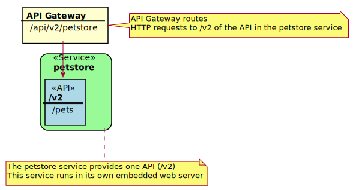

# Onboarding Overview

## What can you expect from this guide

This guide shows how to onboard [sample service](#Sample-REST-API-Service) into Zowe. There are various ways how to achieve this, depending on the language your service is written in, or the choice of framework. The intent of this guide is to demonstrate various approaches you can take and explain the process in detail. At the end of the guide, you will:
- have the [sample service](#Sample-REST-API-Service) onboarded in Zowe
- be able to select and apply appropriate onboarding method for your service

## Prerequisites

- Running instance of Zowe
 
  Zowe instance with API Mediation Layer running is mandatory prerequisite for service to onboard into. You should be able to login to API Catalog to verify service's onboarding is successful.
  
  For [static onboarding](#//TODO), access to Zowe runtime is required, so the static service definition can be created.
  
- Certificate that is trusted by Zowe

  Zowe uses secured communication over TLSv1.2 so protocol version and use of certificate is required. The certificate needs to be trusted by Zowe so the service can register in Discovery service. More information about [API Mediation Layer security setup](api-mediation-security.md#certificate-management-in-zowe-api-mediation-layer)      

- Rest API enabled service that you want to onboard

  This can be arbitrary Rest API enabled service or you can use the [sample service](#Sample-REST-API-Service).
  
  Service should document it's Rest API by providing valid Swagger Json. This documentation is displayed in API Catalog. OpenApi 2.0/3.0 standards are supported.

- Access to Zowe artifactory

    ```
    Repository URL: https://zowe.jfrog.io/zowe/libs-release
    ```

- Gradle or Maven build system

    The guide is describing how to achieve it's objective using these tools.
  
## Service Onboarding Guides

Services can be updated to support the API Mediation Layer natively by updating the service code. Use the following guides to onboard your REST service to the Zowe API Mediation Layer:

### Recommended for services using Java

- [Onboard a REST API service with the Plain Java Enabler (PJE)](onboard-plain-java-enabler.md)
- [Onboard a Spring Boot based REST API Service](onboard-spring-boot-enabler.md)

### Other options

Use the following options If your service is not created in Java, you do not want to change your codebase or use the libraries above. 

- [Onboard a REST API using static definition without code changes](onboard-static-definition.md)
- [Onboard a REST API directly calling Zowe Discovery Service](onboard-direct-eureka-call.md)

### Legacy enablers

For legacy enabler documentation (version 1.2 and lower) please refer to the previous version of the documentation: 

- [Zowe Docs version 1.8.x](https://docs.zowe.org/v1-8-x/extend/extend-apiml/api-mediation-onboard-overview)

**Tip:** We recommend you use the enabler version 1.3 and higher to onboard your REST API service to the Zowe&trade; API Medaition Layer. Future fixes will not be published for enablers using version 1.2 and lower. 

**Tip:** When developing a new service, we recommend that you update the code to support the API Mediation Layer natively. The benefit of supporting the API Mediation Layer natively is that it requires less configuration for the system administrator. Additionally, natively onboarded services can be moved to different systems, can be listened to on a different port, and additional instances can be started without the need to change API Mediation Layer configuration.

## Validating the discoverability of onboarded service

Once you are able to build and start your service successfully, you can validate that your service is registered correctly.

Validating your service registration can be done in the API ML Discovery Service or the API ML Catalog. If your service appears in the Discovery Service UI but is not visible in the API Catalog first wait 2 minutes, then check to make sure that your configuration settings are correct.

Specific addresses and user credentials for the individual API ML components depend on your target runtime environment.

**Note:** If you are working with local installation of API ML and you are using our dummy identity provider, enter `user`
for both `username` and `password`. If API ML was installed by system administrators, ask them to provide you
with actual addresses of API ML components and the respective user credentials.

**Tip:** Wait for the Discovery Service to discover your service. This process may take a few minutes after your service was successfully started.

### Verify service discovery through Api Catalog:

  1. Check that your API service is displayed in the API Catalog UI and all information including API documentation is correct.

  2. Check that you can access your API service endpoints through the Gateway.

### Verify service discovery through Discovery Service:

 1. Issue HTTP GET request to the Discovery Service endpoint `/eureka/apps` for your service instance information:

    ```
    https://{zowe-hostname}:{discovery-service-port}/eureka/apps/{serviceId}
    ```

**Tip:** This endpoint is protected by client certificate verification. A valid trusted certificate must be provided with this request.

 2. Check your service metadata.

    **Response example:**

    ```xml
    <application>
        <name>{serviceId}</name>
        <instanceId>{hostname}:{serviceId}:{port}</instanceId>
        <hostName>{hostname}</hostName>
        <app>{serviceId}</app>
        <ipAddr>{ipAddress}</ipAddr>
        <status>UP</status>
        <port enabled="false">{port}</port>
        <securePort enabled="true">{port}</securePort>
        <vipAddress>{serviceId}</vipAddress>
        <secureVipAddress>{serviceId}</secureVipAddress>
        <metadata>
                <apiml.service.description>Sample API service showing how to onboard the service</apiml.service.description>
                <apiml.routes.api__v1.gatewayUrl>api/v1</apiml.routes.api__v1.gatewayUrl>
                <apiml.catalog.tile.version>1.0.1</apiml.catalog.tile.version>
                <apiml.routes.ws__v1.serviceUrl>/sampleclient/ws</apiml.routes.ws__v1.serviceUrl>
                <apiml.routes.ws__v1.gatewayUrl>ws/v1</apiml.routes.ws__v1.gatewayUrl>
                <apiml.catalog.tile.description>Applications which demonstrate how to make a service integrated to the API Mediation Layer ecosystem</apiml.catalog.tile.description>
                <apiml.service.title>Sample Service ©</apiml.service.title>
                <apiml.routes.ui__v1.gatewayUrl>ui/v1</apiml.routes.ui__v1.gatewayUrl>
                <apiml.apiInfo.0.apiId>org.zowe.sampleclient</apiml.apiInfo.0.apiId>
                <apiml.apiInfo.0.gatewayUrl>api/v1</apiml.apiInfo.0.gatewayUrl>
                <apiml.apiInfo.0.documentationUrl>https://www.zowe.org</apiml.apiInfo.0.documentationUrl>
                <apiml.catalog.tile.id>samples</apiml.catalog.tile.id>
                <apiml.routes.ui__v1.serviceUrl>/sampleclient</apiml.routes.ui__v1.serviceUrl>
                <apiml.routes.api__v1.serviceUrl>/sampleclient/api/v1</apiml.routes.api__v1.serviceUrl>
                <apiml.apiInfo.0.swaggerUrl>https://hostname/sampleclient/api-doc</apiml.apiInfo.0.swaggerUrl>
                <apiml.catalog.tile.title>Sample API Mediation Layer Applications</apiml.catalog.tile.title>
        </metadata>
    </application>
    ```

## Sample REST API Service

To demonstrate the concepts that apply to REST API services, we use an  [example of a Spring Boot REST API service](https://github.com/swagger-api/swagger-samples/tree/master/java/java-spring-boot). This example is used in the REST API onboarding guide [REST APIs without code changes required](onboard-static-definition.md) (static onboarding).  

You can build this service using instructions in the source code of the [Spring Boot REST API service example](https://github.com/swagger-api/swagger-samples/blob/master/java/java-spring-boot/README.md).

The Sample REST API Service has a base URL. When you start this service on your computer, the _service base URL_ is: `http://localhost:8080`. 

**Note:** If a service is deployed to a web application server, the base URL of the service (application) has the following format: `https://application-server-hostname:port/application-name`.

This sample service provides one API that has the base path `/v2`, which is represented in the base URL of the API as `http://localhost:8080/v2`. In this base URL, `/v2` is a qualifier of the base path that was chosen by the developer of this API. Each API has a base path depending on the particular implementation of the service. 

This sample API has only one single endpoint:

- `/pets/{id}` - *Find pet by ID*. 

This endpoint in the sample service returns information about a pet when the `{id}` is between 0 and 10. If `{id}` is greater than 0 or a non-integer, an error is returned. These are conditions set in the sample service.

**Tip:** Access http://localhost:8080/v2/pets/1 to see what this REST API endpoint does. You should get the following response:

```json
{
    "category": {
        "id": 2,
        "name": "Cats"
    },
    "id": 1,
    "name": "Cat 1",
    "photoUrls": [
        "url1",
        "url2"
    ],
    "status": "available",
    "tags": [
        {
            "id": 1,
            "name": "tag1"
        },
        {
            "id": 2,
            "name": "tag2"
        }
    ]
}
```

**Note:** The onboarding guides demonstrate how to add the Sample REST API Service to the API Mediation Layer to make the service available through the `petstore` service ID.

The following diagram shows the relations between the Sample REST API Service and its corresponding API, REST API endpoint, and API Gateway:



This sample service provides a Swagger document in JSON format at the following URL:

 ```
 http://localhost:8080/v2/swagger.json
 ```

The Swagger document is used by the API Catalog to display API documentation.


