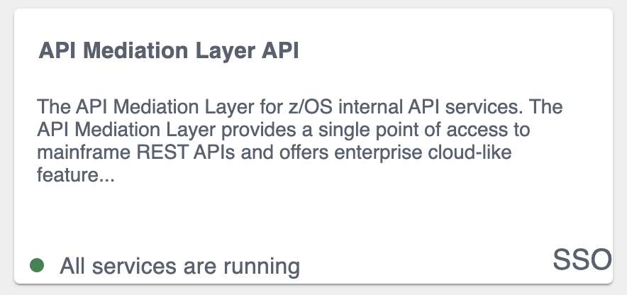

# Onboarding a REST API service with the Plain Java Enabler (PJE)

This article is part of a series of onboarding guides, which outline the process of onboarding REST API services to the Zowe API Mediation Layer (API ML). As a service developer, you can onboard a REST service with the API ML with the Zowe API Mediation Layer using our Plain Java Enabler (PJE). This enabler is built without a dependency on Spring Cloud, Spring Boot, or SpringFramework.

**Tip:** For more information about onboarding API services with the API ML, see the [Onboarding Overview](onboard-overview.md).

## Introduction

Zowe API ML is a lightweight API management system based on the following Netflix components:

* Eureka - a discovery service used for services registration and discovery
* Zuul - reverse proxy / API Gateway
* Ribbon - load balancer

The API ML Discovery Service component uses Netflix/Eureka as a REST services registry.
Eureka endpoints are used to register a service with the API ML Discovery Service.

The API ML provides onboarding enabler libraries. The libraries are JAR artifacts available through an artifactory. Using these libraries is the recommended approach to onboard a REST service with the API ML. 

The PJE library serves the needs of Java developers who are not using either [Spring Boot](https://spring.io/projects/spring-boot) or the [Spring Framework](https://spring.io/). If Spring Boot or the Spring framework are used in the project you would like to onboard, see the [Onboarding Overview](onboard-overview.md) for the corresponding enablers.  

Additionally, this enabler is not intended for use in projects that depend on [Spring Cloud Netflix](https://spring.io/projects/spring-cloud-netflix) components. Configuration settings in the PJE and Spring Cloud Netflix Eureka Client are different. Using the two configuration settings in combination makes the result state of the discovery registry unpredictable.

**Tip:** For more information about how to utilize another API ML enablers, see the documentation in
the [Onboarding Overview](onboard-overview.md).

## Onboarding your REST service with API ML

The following steps outline the overall process to onboard a REST service with the API ML using the PJE. Each step is described in further detail in this article.

1. [Prerequisites](#prerequisites)

2. [Configuring your project](#configuring-your-project)

    * [Gradle build automation system](#gradle-build-automation-system)
    * [Maven build automation system](#maven-build-automation-system)

3. [Configuring your service](#configuring-your-service)
    * [REST service identification](#rest-service-identification)
    * [Administrative endpoints](#administrative-endpoints)
    * [API info](#api-info)
    * [API routing information](#api-routing-information)
    * [API Catalog information](#api-catalog-information)
    * [Authentication parameters](#authentication-parameters)
    * [API Security](#api-security)
    * [Eureka Discovery Service](#eureka-discovery-service)

4. [Registering your service with API ML](#registering-your-service-with-api-ml)

5. [Adding API documentation](#adding-api-documentation)

6. (Optional) [Validating your API service discoverability](#validating-the-discoverability-of-your-api-service-by-the-discovery-service)

## Prerequisites

Ensure that the prerequisites from the [Onboarding Overview](onboard-overview.md) are met.

* The REST API service to onboard is written in Java.
* The service is enabled to communicate with API ML Discovery Service over a TLS v1.2 secured connection.

**Notes:**

* This documentation is valid for API ML version `ZoweApimlVersion 1.3.0` and higher. We recommend that you check the [Zowe Artifactory](https://zowe.jfrog.io/zowe/libs-release/org/zowe/apiml/sdk/onboarding-enabler-java/) for latest stable versions.

* Following this guide enables REST services to be deployed on a z/OS environment. Deployment to a z/OS environment, however, is not required. As such, you can first develop on a local machine before you deploy on z/OS.

## Configuring your project

Use either _Gradle_ or _Maven_ build automation systems to configure the project with service to be onboarded. Use the appropriate configuration procedure that corresponds to your build automation system.

**Note:** You can use either the Zowe Artifactory or an artifactory of your choice. However, if you decide to build the API ML from source, you are required to publish the enabler artifact to your artifactory. Publish the enabler artifact by using the _Gradle_ tasks provided in the source code.

### Gradle build automation system
Use the following procedure to use _Gradle_ as your build automation system.

**Follow these steps:**

1. Create a `gradle.properties` file in the root of your project if one does not already exist.

2. In the `gradle.properties` file, set the URL of the specific artifactory containing the PJE artifact. Provide the corresponding credentials to gain access to the Maven repository.

    ```ini
    # Repository URL for getting the enabler-java artifact
    artifactoryMavenRepo=https://zowe.jfrog.io/zowe/libs-release/
    ```

3. Add the following _Gradle_ code block to the `repositories` section of your `build.gradle` file:

    ```gradle
    repositories {
        ...

        maven {
            url artifactoryMavenRepo
        }
    }
    ```
4. In the same `build.gradle` file, add the necessary dependencies for your service. If you use the Java enabler from the Zowe Artifactory, add the following code block to your `build.gradle` script. Replace the `$zoweApimlVersion` with the proper version of the enabler, for example: `1.3.0`:

    ```gradle
    implementation "org.zowe.apiml.sdk:onboarding-enabler-java:$zoweApimlVersion"
    implementation "org.zowe.apiml.sdk:common-service-core:$zoweApimlVersion"
    ```
    **Note:** The published artifact from the Zowe Artifactory also contains the enabler dependencies from other software packages. If you are using an artifactory other than Zowe, add also the following dependencies in your service `build.gradle` script:

    ```gradle
    implementation libraries.eureka_client
    implementation libraries.httpcore
    implementation libraries.jackson_databind
    implementation libraries.jackson_dataformat_yaml

    providedCompile libraries.javax_servlet_api
    compileOnly libraries.lombok
    ```

    **Notes:**
    * You may need to add more dependencies as required by your service implementation.
    * The information provided in this file is valid for `ZoweApimlVersion 1.3.0` and above.

5. In your project home directory, run the `gradle clean build` command to build your project. Alternatively, you can run `gradlew` to use the specific gradle version that is working with your project.

### Maven build automation system

Use the following procedure if you use _Maven_ as your build automation system.

**Follow these steps:**

1. Add the following _XML_ tags within the newly created `pom.xml` file:
    ```xml
    <repositories>
        <repository>
            <id>libs-release</id>
            <name>libs-release</name>
            <url>https://zowe.jfrog.io/zowe/libs-release/</url>
            <snapshots>
                <enabled>false</enabled>
            </snapshots>
        </repository>
    </repositories>
    ```
   
    ```
    **Tip:** If you want to use snapshot version, replace libs-release with libs-snapshot in the repository url and change snapshots->enabled to true.

2. Add the proper dependencies:
   ```maven
   <dependency>
       <groupId>org.zowe.apiml.sdk</groupId>
       <artifactId>onboarding-enabler-java</artifactId>
       <version>$zoweApimlVersion</version>
   </dependency>
   <dependency>
       <groupId>org.zowe.apiml.sdk</groupId>
       <artifactId>common-service-core</artifactId>
       <version>$zoweApimlVersion</version>
   </dependency>
    ```

3. In the directory of your project, run the `mvn clean package` command to build the project.


## Configuring your service

To configure your service, provide default service configuration in the `service-configuration.yml` file located in your service source tree resources directory.

**Note:** To externalize service onboarding configuration, see: [Externalizing onboarding configuration](onboard-plain-java-enabler-external-configuration.md).

The following code snippet shows an example of `service-configuration.yml`. Some parameters which are specific for your service deployment
are written in `${parameterValue}` format. For your service configuration file, provide actual values or externalize your onboarding configuration.

**Example:**

 ```yaml
 serviceId: sampleservice
 title: Hello API ML
 description: Sample API ML REST Service
 baseUrl: https://${samplehost}:${sampleport}/${sampleservice}
 serviceIpAddress: ${sampleHostIpAddress}

 homePageRelativeUrl: /application/home
 statusPageRelativeUrl: /application/info
 healthCheckRelativeUrl: /application/health

 discoveryServiceUrls:
     - https://${discoveryServiceHost1}:${discoveryServicePort1}/eureka
     - https://${discoveryServiceHost2}:${discoveryServicePort2}/eureka

 routes:
     - gatewayUrl: api/v1
       serviceUrl: /sampleservice/api/v1

authentication:
    scheme: httpBasicPassTicket
    applid: ZOWEAPPL

 apiInfo:
     - apiId: org.zowe.sampleservice
       version: v1
       gatewayUrl: api/v1
       swaggerUrl: http://${sampleServiceSwaggerHost}:${sampleServiceSwaggerPort}/sampleservice/api-doc
       doumentationUrl: http://
 catalog:
     tile:
         id: sampleservice
         title: Hello API ML
         description: Sample application to demonstrate exposing a REST API in the ZOWE API ML
         version: 1.0.0

 ssl:
    enabled: true
    verifySslCertificatesOfServices: true
    protocol: TLSv1.2
    ciphers: TLS_RSA_WITH_AES_128_CBC_SHA, TLS_DHE_RSA_WITH_AES_256_CBC_SHA,TLS_ECDH_RSA_WITH_AES_128_CBC_SHA256,TLS_ECDH_RSA_WITH_AES_256_CBC_SHA384,TLS_ECDH_RSA_WITH_AES_128_GCM_SHA256,TLS_ECDH_RSA_WITH_AES_256_GCM_SHA384,TLS_ECDH_ECDSA_WITH_AES_128_CBC_SHA256,TLS_ECDH_ECDSA_WITH_AES_256_CBC_SHA384,TLS_ECDH_ECDSA_WITH_AES_128_GCM_SHA256,TLS_ECDH_ECDSA_WITH_AES_256_GCM_SHA384,TLS_ECDHE_RSA_WITH_AES_128_CBC_SHA256,TLS_ECDHE_RSA_WITH_AES_256_CBC_SHA384,TLS_ECDHE_RSA_WITH_AES_128_GCM_SHA256,TLS_ECDHE_RSA_WITH_AES_256_GCM_SHA384,TLS_ECDHE_ECDSA_WITH_AES_128_CBC_SHA256,TLS_ECDHE_ECDSA_WITH_AES_256_CBC_SHA384,TLS_ECDHE_ECDSA_WITH_AES_128_GCM_SHA256,TLS_ECDHE_ECDSA_WITH_AES_256_GCM_SHA384,TLS_EMPTY_RENEGOTIATION_INFO_SCSV
    keyAlias: localhost
    keyPassword: password
    keyStore: keystore/localhost.keystore.p12
    keyStoreType: PKCS12
    keyStorePassword: password
    trustStore: keystore/localhost.truststore.p12
    trustStoreType: PKCS12
    trustStorePassword: password
 ```

Optional metadata section
```yaml
customMetadata:
    yourqualifier:
        key1: value1
        key2: value2
```
The onboarding configuration parameters are broken down into the following groups:

- [REST service identification](#rest-service-identification)
- [Administrative endpoints](#administrative-endpoints)
- [API info](#api-info)
- [API routing information](#api-routing-information)
- [API catalog information](#api-catalog-information)
* [Authentication parameters](#authentication-parameters)
- [API security](#api-security)
- [Eureka Discovery Service](#eureka-discovery-service)
- [Custom Metadata](#custom-metadata)

### REST service identification

* **serviceId**

    The `serviceId` uniquely identifies one or more instance of a microservice in the API ML and is used as part of the service URL path in the API ML Gateway address space.
    Additionally, the API ML Gateway uses the `serviceId` for routing to the API service instances.
    When two API services use the same `serviceId`, the API Gateway considers the services as clones of each other.
    An incoming API request can be routed to either of them through utilized load balancing mechanism.

    **Important!**  Ensure that the `serviceId` is set properly with the following considerations:

    * The same `servicedId` should only be set for multiple API service instances for API scalability.
    * The `servicedId` value must only contain lowercase alphanumeric characters.
    * The `servicedId` cannot contain more than 40 characters.

    **Example:**
    * If the `serviceId` is `sampleservice`, the service URL in the API ML Gateway address space appears as the following path:

       ```
       https://gateway-host:gateway-port/api/v1/sampleservice/...
       ```

* **title**

  This parameter specifies the human readable name of the API service instance. This value is displayed in the API Catalog when a specific API service instance is selected.
  This parameter can be externalized and set by the customer system administrator.

  **Tip:** We recommend that service developer provides a default value of the `title`. Use a title that describes the service instance so that the end user knows the specific purpose of the service instance.

* **description**

    This parameter is a short description of the API service. This value is displayed in the API Catalog when a specific API service instance is selected. This parameter can be externalized and set by the customer system administrator.

  **Tip:** Describe the service so that the end user understands the function of the service.

* **baseUrl**

    This parameter specifies the base URL for the following administrative endpoints:

    * **homePageRelativeUrl**
    * **statusPageRelativeUrl**
    * **healthCheckRelativeUrl**

    Use the following format to include your service name in the URL path:

     `protocol://host:port/servicename`

*  **serviceIpAddress** (Optional)


    This parameter specifies the IP address of the service and can be provided by system administrator in externalized service configuration.
    If this parameter is not present in the configuration file or is not set as a service context parameter, it will be resolved from the hostname part of the `baseUrl`.


### Administrative endpoints

   The following snippet presents the format of the administrative endpoint properties:

```yaml
homePageRelativeUrl:
statusPageRelativeUrl: /application/info
healthCheckRelativeUrl: /application/health
```

where:

* **homePageRelativeUrl**

    specifies the relative path to the home page of your service. 
    
    Start this path with `/`. If your service has no home page, leave this parameter blank.

    **Examples:**
    * `homePageRelativeUrl: ` This service has no home page
    * `homePageRelativeUrl: /` This service has a home page with URL `${baseUrl}/`


* **statusPageRelativeUrl**

    specifies the relative path to the status page of your service.

    Start this path with `/`.

    **Example:**

    `statusPageRelativeUrl: /application/info`

     This results in the URL:
    `${baseUrl}/application/info`

* **healthCheckRelativeUrl**

    specifies the relative path to the health check endpoint of your service.

    Start this path with `/`.

    **Example:**

    `healthCheckRelativeUrl: /application/health`

     This results in the URL:
    `${baseUrl}/application/health`

### API info

REST services can provide multiple APIs. Add API info parameters for each API that your service wants to expose on the API ML.

The following snippet presents the information properties of a single API:

```
apiInfo:
    - apiId: org.zowe.sampleservice
    version: v1
    gatewayUrl: api/v1
    swaggerUrl: http://localhost:10021/sampleservice/api-doc
    documentationUrl: http://your.service.documentation.url
```

where:
* **apiInfo.apiId**

    specifies the API identifier that is registered in the API ML installation.
        The API ID uniquely identifies the API in the API ML.
         The `apiId` can be used to locate the same APIs that are provided by different service instances. The API developer defines this ID.
        The `apiId` must be a string of up to 64 characters
        that uses lowercase alphanumeric characters and a dot: `.` .

* **apiInfo.version**

    specifies the api `version`. This parameter is used to correctly retrieve the API documentation according to requested version of the API.

* **apiInfo.gatewayUrl**

    specifies the base path at the API Gateway where the API is available.
    Ensure that this value is the same path as the `gatewayUrl` value in the `routes` sections that apply to this API.

* **apiInfo.swaggerUrl** (Optional)

     specifies the Http or Https address where the Swagger JSON document is available.

* **apiInfo.documentationUrl** (Optional)

     specifies the link to the external documentation. A link to the external documentation can be included along with the Swagger documentation.


### API routing information

The API routing group provides the required routing information used by the API ML Gateway when routing incoming requests to the corresponding REST API service.
A single route can be used to direct REST calls to multiple resources or API endpoints. The route definition provides rules used by the API ML Gateway to rewrite the URL
in the Gateway address space. Currently, the routing information consists of two parameters per route: The `gatewayUrl` and `serviceUrl`. These two parameters together specify a rule for how the API service endpoints are mapped to the API Gateway endpoints.

The following snippet is an example of the API routing information properties.

**Example:**

```yaml
routes:
    - gatewayUrl: api
      serviceUrl: /sampleservice
    - gatewayUrl: api/v1
      serviceUrl: /sampleservice/api/v1
    - gatewayUrl: api/v1/api-doc
      serviceUrl: /sampleservice/api-doc
```
   where:

* **routes**

    specifies the container element for the routes.

* **routes.gatewayUrl**

    The gatewayUrl parameter specifies the portion of the gateway URL which is replaced by the serviceUrl path part.

* **routes.serviceUrl**

    The serviceUrl parameter provides a portion of the service instance URL path which replaces the gatewayUrl part.

**Note:** The routes configuration contains a prefix before the `gatewayUrl` and `serviceUrl`.
This prefix is used to differentiate the routes. It is automatically calculated by the API ML enabler.

**Tip:** For more information about API ML routing, see: [API Gateway Routing](https://github.com/zowe/api-layer/wiki/API-Gateway-Routing).

### API Catalog information

The API ML Catalog UI displays information about discoverable REST services registered with the API ML Discovery Service.
Information displayed in the Catalog is defined by the metadata provided by your service during registration. The Tile will look similar to the one shown on following image.
 
  

The Catalog groups correlated services in the same tile, if these services are configured with the same `catalog.tile.id` metadata parameter.

The following code block is an example of configuration of a service tile in the Catalog:

**Example:**

```yaml
    catalog:
      tile:
        id: apimediationlayer
        title:  API Mediation Layer API
        description: The API Mediation Layer for z/OS internal API services.
        version: 1.0.0
```

where:

* **catalog.tile.id**

    specifies the unique identifier for the product family of API services.
    This is a value used by the API ML to group multiple API services into a single tile.
    Each unique identifier represents a single API dashboard tile in the Catalog.

    **Tip:**  Specify a value that does not interfere with API services from other products. We recommend that you use your company and product name as part of the ID.

* **catalog.tile.title**

    specifies the title of the product family of the API service. This value is displayed in the API Catalog dashboard as the tile title.

* **catalog.tile.description**

    is the detailed description of the API services product family. This value is displayed in the API Catalog UI dashboard as the tile description.

* **catalog.tile.version**

    specifies the semantic version of this API Catalog tile.

    **Note:** Ensure that you increase the version number when you introduce changes to the API service product family details.

### Authentication parameters
These parameters are not required. When not specified, the default values are used.

Allows a service to accept the Zowe JWT token. The API Gateway translates the token to an authentication method supported by a service.

The following parameters define service authentication method:

**Example:**

```yaml
authentication:
    scheme: httpBasicPassTicket
    applid: ZOWEAPPL
```

* **authentication.scheme**

    This parameter specifies a service authentication scheme. 
    The following schemes are supported by the API Gateway:
    
    * **bypass**
    
        This value specifies the token is passed unchanged to service.
          
        **Note:** This is the default scheme when no authentication parameters are specified. 
        
     * **zoweJwt**   
     
        This value specifies that a service accepts the Zowe JWT token. No additional processing is done by the API Gateway.
     
     * **httpBasicPassTicket**
     
        This value specifies that a service accepts PassTickets in the Authorization header of the HTTP requests using the basic authentication scheme.
        It is necessary to provide a service APPLID in `authentication.applid` parameter.
        
        For more information, see [Enabling PassTicket creation for API Services that Accept PassTickets](api-mediation-passtickets.md)
     
     * **zosmf**
     
        This value specifies that a service accepts z/OSMF LTPA (Lightweight Third-Party Authentication).
        This scheme should be used only for z/OSMF service used by the API Gateway Authentication Service and other z/OSMF services that are using the same LTPA key.
        
        For more information about z/OSMF Single Sign-on, see [Establishing a single sign-on environment](https://www.ibm.com/support/knowledgecenter/SSLTBW_2.4.0/com.ibm.zosmfcore.multisysplex.help.doc/izuG00hpManageSecurityCredentials.html)

* **authentication.applid**

    This parameter specifies a service APPLID.
    This parameter is valid only for `httpBasicPassTicket` authentication scheme.
    
### API info

REST services can provide multiple APIs. Add API info parameters for each API that your service wants to expose on the API ML.

The following snippet presents the information properties of a single API:

**Example:**

```
apiInfo:
    - apiId: org.zowe.sampleservice
    version: v1
    gatewayUrl: api/v1
    swaggerUrl: http://localhost:10021/sampleservice/api-doc
    documentationUrl: http://your.service.documentation.url
```

where:
* **apiInfo.apiId**

    specifies the API identifier that is registered in the API ML installation.
        The API ID uniquely identifies the API in the API ML.
         The `apiId` can be used to locate the same APIs that are provided by different service instances. The API developer defines this ID.
        The `apiId` must be a string of up to 64 characters
        that uses lowercase alphanumeric characters and a dot: `.` .

* **apiInfo.version**

    specifies the api `version`. This parameter is used to correctly retrieve the API documentation according to requested version of the API.

* **apiInfo.gatewayUrl**

    specifies the base path at the API Gateway where the API is available.
    Ensure that this value is the same path as the `gatewayUrl` value in the `routes` sections that apply to this API.

* **apiInfo.swaggerUrl** (Optional)

     specifies the Http or Https address where the Swagger JSON document is available.

* **apiInfo.documentationUrl** (Optional)

     specifies the link to the external documentation. A link to the external documentation can be included along with the Swagger documentation.    

### API Security

REST services onboarded with the API ML act as both a client and a server. When communicating to API ML Discovery service, a REST service acts as a client. When the API ML Gateway is routing requests to a service, the REST service acts as a server.
These two roles have different requirements.
The Zowe API ML Discovery Service communicates with its clients in secure Https mode. As such, TLS/SSL configuration setup is required when a service is acting as a server. In this case, the system administrator decides if the service will communicate with its clients securely or not.

Client services need to configure several TLS/SSL parameters in order to communicate with the API ML Discovery service.
When an enabler is used to onboard a service, the configuration is provided in the `ssl` section/group in the same _YAML_ file that is used to configure the Eureka parameters and the service metadata.

For more information about API ML security see: [API ML security](api-mediation-security.md)

TLS/SSL configuration consists of the following parameters:

* **verifySslCertificatesOfServices**

  This parameter makes it possible to prevent server certificate validation.

  **Important!** Ensure that this parameter is set to `true` in production environments. Setting this parameter to `false` in production environments significantly degrades the overall security of the system.

* **protocol**

    This parameter specifies the TLS protocol version currently used by Zowe API ML Discovery Service.

    **Tip:** We recommend you use `TLSv1.2` as your security protocol

* **keyAlias**

  This parameter specifies the `alias` used to address the private key in the keystore.

* **keyPassword**

  This parameter specifies the password associated with the private key.

* **keyStore**

  This parameter specifies the keystore file used to store the private key.

* **keyStorePassword**

  This parameter specifies the password used to unlock the keystore.

* **keyStoreType**

  This parameter specifies the type of the keystore.

* **trustStore**

  This parameter specifies the truststore file used to keep other parties public keys and certificates.

* **trustStorePassword: password**

  This parameter specifies the password used to unlock the truststore.

* **trustStoreType: PKCS12**

  This parameter specifies the truststore type. The default for this parameter is PKCS12.

* **ciphers:** (Optional)

    This parameter specifies the recommended ciphers.

    ```
    TLS_RSA_WITH_AES_128_CBC_SHA, TLS_DHE_RSA_WITH_AES_256_CBC_SHA,TLS_ECDH_RSA_WITH_AES_128_CBC_SHA256,TLS_ECDH_RSA_WITH_AES_256_CBC_SHA384,TLS_ECDH_RSA_WITH_AES_128_GCM_SHA256,TLS_ECDH_RSA_WITH_AES_256_GCM_SHA384,TLS_ECDH_ECDSA_WITH_AES_128_CBC_SHA256,TLS_ECDH_ECDSA_WITH_AES_256_CBC_SHA384,TLS_ECDH_ECDSA_WITH_AES_128_GCM_SHA256,TLS_ECDH_ECDSA_WITH_AES_256_GCM_SHA384,TLS_ECDHE_RSA_WITH_AES_128_CBC_SHA256,TLS_ECDHE_RSA_WITH_AES_256_CBC_SHA384,TLS_ECDHE_RSA_WITH_AES_128_GCM_SHA256,TLS_ECDHE_RSA_WITH_AES_256_GCM_SHA384,TLS_ECDHE_ECDSA_WITH_AES_128_CBC_SHA256,TLS_ECDHE_ECDSA_WITH_AES_256_CBC_SHA384,TLS_ECDHE_ECDSA_WITH_AES_128_GCM_SHA256,TLS_ECDHE_ECDSA_WITH_AES_256_GCM_SHA384,TLS_EMPTY_RENEGOTIATION_INFO_SCSV
    ```
  
    To secure the transfer of data, TLS/SSL uses one or more cipher suites. A cipher suite is a combination of authentication, encryption, and message authentication code (MAC) algorithms. Ciphers are used during the negotiation of security settings for a TLS/SSL connection as well as for the transfer of data.

**Notes:**

* Ensure that you define both the key store and the trust store even if your server is not using an Https port.
* Currently `ciphers` is not used. It is optional and serves as a place holder only.

### Eureka Discovery Service

The Eureka Discovery Service parameters group contains a single parameter used to address Eureka Discovery Service location.
An example is presented in the following snippet:

**Example:**

```yaml
discoveryServiceUrls:
- https://localhost:10011/eureka
- http://......
```

where:

* **discoveryServiceUrls**

    Specifies the public URL of the Discovery Service. The system administrator at the customer site defines this parameter.
    It is possible to provide multiple values in order to utilize fail over and/or load balancing mechanisms.

### Custom Metadata

   (Optional) Additional metadata can be added to the instance information that is registered in the Discovery Service through the `customMetadata` section. This information is propagated from the Discovery Service to onboarded services (clients). In general, additional metadata do not change the behavior of the client. Some specific metadata can configure the functionality of the API Mediation Layer. Such metadata are generally prefixed with the `apiml.` qualifier. It is recommended to define your own qualifier and group the metadata you wish to publish under this qualifier. The following parameter is an example of custom metadata.

#### Api Mediation Layer specific metadata

* **customMetadata.apiml.enableUrlEncodedCharacters**
      
    When this parameter is set to `true`, encoded characters in a request URL are allowed to pass through the Gateway to the service. The default setting of `false` is the recommended setting. Change this setting to `true` only if you expect certain encoded characters in your application's requests. 
          
    **Important!**  When the expected encoded character is an encoded slash or backslash (`%2F`, `%5C`), make sure the Gateway is also configured to allow encoded slashes. For more info see [Installing the Zowe runtime on z/OS](../../user-guide/install-zos.md).
    
##  Registering your service with API ML

The following steps outline the process of registering your service with API ML. Each step is described in detail in this article. The process describes the integration with the usage of the Java application server. The guideline is tested with the Tomcat application server. The specific steps that apply for other application servers may differ.  

1. Add a web application context listener class
2. Register a web application context listener
3. Load service configuration
4. Register with Eureka discovery service
5. Unregister your service

**Follow these steps:**

1. Implement and add a web application context listener class 

    ```implements javax.servlet.ServletContextListener```

    The web application context listener implements two methods to perform necessary actions at application start-up time as well as when the application context is destroyed:

     - The `contextInitialized` method invokes the `apiMediationClient.register(config)` method to register the application with API Mediation Layer when the application starts.
     - The `contextDestroyed` method invokes the `apiMediationClient.unregister()` method when the application shuts down. This unregisters the application from the API Mediation Layer.

2. Register a web application context listener.

    Add the following code block to the deployment descriptor `web.xml` to register a context listener:
    
    ```xml
    <listener>
        <listener-class>com.your.package.ApiDiscoveryListener</listener-class>
    </listener>
    ```

3. Load the service configuration.

    Load your service configuration from a file `service-configuration.yml` file.
    The configuration parameters are described in the preceding section, [Configuring your service](#configuring-your-service).

    Use the following code as an example of how to load the service configuration.

    **Example:**
    
    ```java
    @Override
    public void contextInitialized(ServletContextEvent sce) {
        ...
        String configurationFile = "/service-configuration.yml";
        ApiMediationServiceConfig config = new ApiMediationServiceConfigReader().loadConfiguration(configurationFile);
        ...
    ```
   
    **Note:** The `ApiMediationServiceConfigReader` class also provides other methods for loading the configuration from two files, `java.util.Map` instances, or directly from a string. Check the `ApiMediationServiceConfigReader` class JavaDoc for details.

4. Register with Eureka Discovery Service.

     Use the following call to register your service instance with Eureka Discovery Service:

     **Example:**   

      ```java
      try {
          apiMediationClient = new ApiMediationClientImpl()
          apiMediationClient.register(config);
      } catch (ServiceDefinitionException sde) {
          log.error("Service configuration failed. Check log for previous errors: ", sde);
      }
      ```

5. Unregister your service.

    Use the `contextDestroyed` method to unregister your service instance from Eureka Discovery Service in the following format:
    
    **Example:**

    ```java
    @Override
    public void contextDestroyed(ServletContextEvent sce) {
        if (apiMediationClient != null) {
            apiMediationClient.unregister();
        }

        apiMediationClient = null;
    }
    ```
   
The following code block is a full example of a context listener class implementation.

**Example:**

    import org.zowe.apiml.eurekaservice.client.ApiMediationClient;
    import org.zowe.apiml.eurekaservice.client.config.ApiMediationServiceConfig;
    import org.zowe.apiml.eurekaservice.client.impl.ApiMediationClientImpl;
    import org.zowe.apiml.eurekaservice.client.util.ApiMediationServiceConfigReader;
    import org.zowe.apiml.exception.ServiceDefinitionException;
    import lombok.extern.slf4j.Slf4j;

    import javax.servlet.ServletContextEvent;
    import javax.servlet.ServletContextListener;

    /**
     *  API ML Micro service implementation of ServletContextListener interface.
     */
    @Slf4j
    public class ApiDiscoveryListener implements ServletContextListener {

        /**
         * @{link ApiMediationClient} instance used to register and unregister the service with API ML Discovery service.
         */
        private ApiMediationClient apiMediationClient;

        /**
         *  Loads a {@link ApiMediationServiceConfig} using an instance of class ApiMediationServiceConfigReader
         *  and registers this micro service with API ML.
         *
         *  {@link ApiMediationServiceConfigReader} has several methods for loading configuration from YAML file,
         *  {@link java.util.Map} or a string containing the configuration data.
         *
         *  Here we use the most convenient method for our Java Servlet based service,
         *  i.e expecting all the necessary initialization information to be present
         *  in the  {@link javax.servlet.ServletContext} init parameters.

         *  After successful initialization, this method creates an {@link ApiMediationClient} instance,
         *  which is then used to register this service with API ML Discovery Service.
         *
         *  The registration method of ApiMediationClientImpl catches all RuntimeExceptions
         *  and only can throw {@link ServiceDefinitionException} checked exception.
         *
         * @param sce
         */
        @Override
        public void contextInitialized(ServletContextEvent sce) {
            try {
                /*
                 * Load configuration method with ServletContext
                 */
                ApiMediationServiceConfig config = new ApiMediationServiceConfigReader().loadConfiguration(sce.getServletContext());
                if (config  != null) {
                    /*
                     * Instantiate {@link ApiMediationClientImpl} which is used to un/register the service with API ML Discovery Service.
                     */
                    apiMediationClient = new ApiMediationClientImpl();

                    /*
                     * Call the {@link ApiMediationClient} instance to register your micro service with API ML Discovery Service.
                     */
                    apiMediationClient.register(config);
                }
            } catch (ServiceDefinitionException sde) {
                log.error("Service configuration failed. Check log for previous errors: ", sde);
            }
        }

        /**
         * If apiMediationClient is not null, attempt to unregister this service from API ML registry.
         */
        @Override
        public void contextDestroyed(ServletContextEvent sce) {
            if (apiMediationClient != null) {
                apiMediationClient.unregister();
            }

            apiMediationClient = null;
        }
    }

## Validating the discoverability of your API service by the Discovery Service

Once you are able to build and start your service successfully, you can use the option of validating that your service is registered correctly with the API ML Discovery Service.

Validating your service registration can be done in the API ML Discovery Service or the API ML Catalog. If your service appears in the Discovery Service UI but is not visible in the API Catalog, check to make sure that your configuration settings are correct.

Specific addresses and user credentials for the individual API ML components depend on your target runtime environment.

**Note:** If you are working with local installation of API ML and you are using our dummy identity provider, enter `user`
for both `username` and `password`. If API ML was installed by system administrators, ask them to provide you
with actual addresses of API ML components and the respective user credentials.

**Tip:** Wait for the Discovery Service to discover your service. This process may take a few minutes after your service was successfully started.

**Follow these steps:**

 1. Use the Http `GET` method in the following format to query the Discovery Service for your service instance information:

    ```
    http://{eureka_hostname}:{eureka_port}/eureka/apps/{serviceId}
    ```

 2. Check your service metadata.

    **Response example:**

    ```xml
    <application>
        <name>{serviceId}</name>
        <instanceId>{hostname}:{serviceId}:{port}</instanceId>
        <hostName>{hostname}</hostName>
        <app>{serviceId}</app>
        <ipAddr>{ipAddress}</ipAddr>
        <status>UP</status>
        <port enabled="false">{port}</port>
        <securePort enabled="true">{port}</securePort>
        <vipAddress>{serviceId}</vipAddress>
        <secureVipAddress>{serviceId}</secureVipAddress>
        <metadata>
                <apiml.service.description>Sample API service showing how to onboard the service</apiml.service.description>
                <apiml.routes.api__v1.gatewayUrl>api/v1</apiml.routes.api__v1.gatewayUrl>
                <apiml.catalog.tile.version>1.0.1</apiml.catalog.tile.version>
                <apiml.routes.ws__v1.serviceUrl>/sampleclient/ws</apiml.routes.ws__v1.serviceUrl>
                <apiml.routes.ws__v1.gatewayUrl>ws/v1</apiml.routes.ws__v1.gatewayUrl>
                <apiml.catalog.tile.description>Applications which demonstrate how to make a service integrated to the API Mediation Layer ecosystem</apiml.catalog.tile.description>
                <apiml.service.title>Sample Service ©</apiml.service.title>
                <apiml.routes.ui__v1.gatewayUrl>ui/v1</apiml.routes.ui__v1.gatewayUrl>
                <apiml.apiInfo.0.apiId>org.zowe.sampleclient</apiml.apiInfo.0.apiId>
                <apiml.apiInfo.0.gatewayUrl>api/v1</apiml.apiInfo.0.gatewayUrl>
                <apiml.apiInfo.0.documentationUrl>https://www.zowe.org</apiml.apiInfo.0.documentationUrl>
                <apiml.catalog.tile.id>samples</apiml.catalog.tile.id>
                <apiml.routes.ui__v1.serviceUrl>/sampleclient</apiml.routes.ui__v1.serviceUrl>
                <apiml.routes.api__v1.serviceUrl>/sampleclient/api/v1</apiml.routes.api__v1.serviceUrl>
                <apiml.apiInfo.0.swaggerUrl>https://hostname/sampleclient/api-doc</apiml.apiInfo.0.swaggerUrl>
                <apiml.catalog.tile.title>Sample API Mediation Layer Applications</apiml.catalog.tile.title>
        </metadata>
    </application>
    ```

  3. Check that your API service is displayed in the API Catalog and all information including API documentation is correct.

  4. Check that you can access your API service endpoints through the Gateway.

  5. (Optional) Check that you can access your API service endpoints directly outside of the Gateway.
