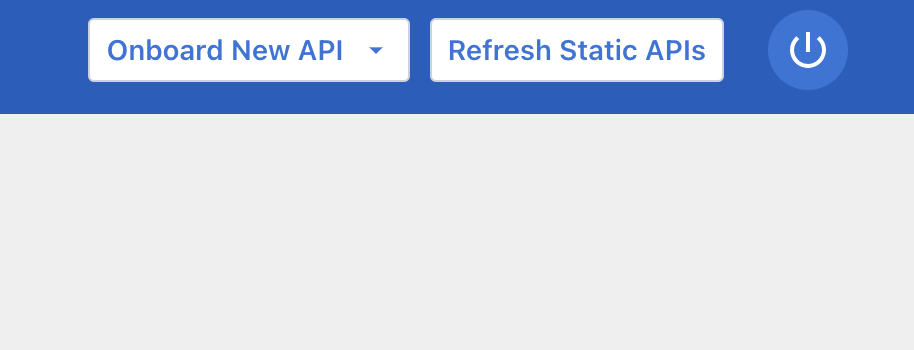
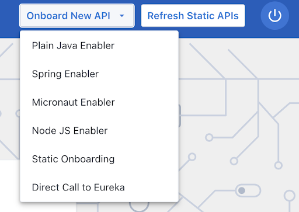
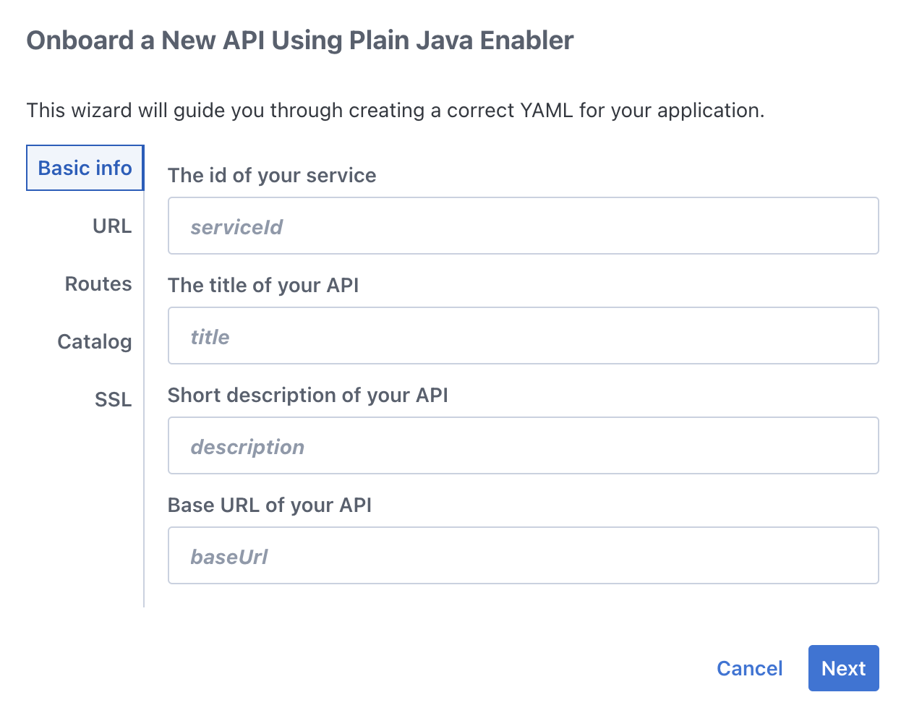
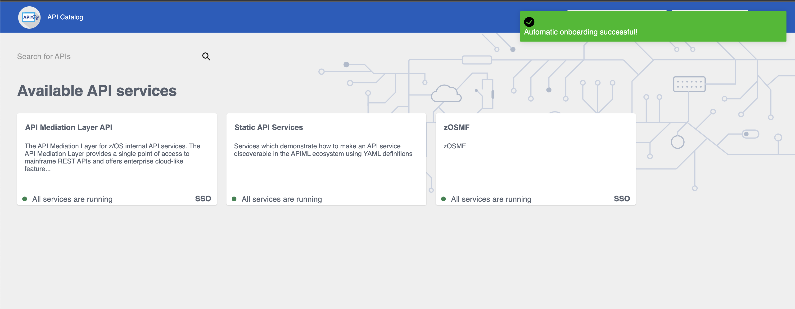
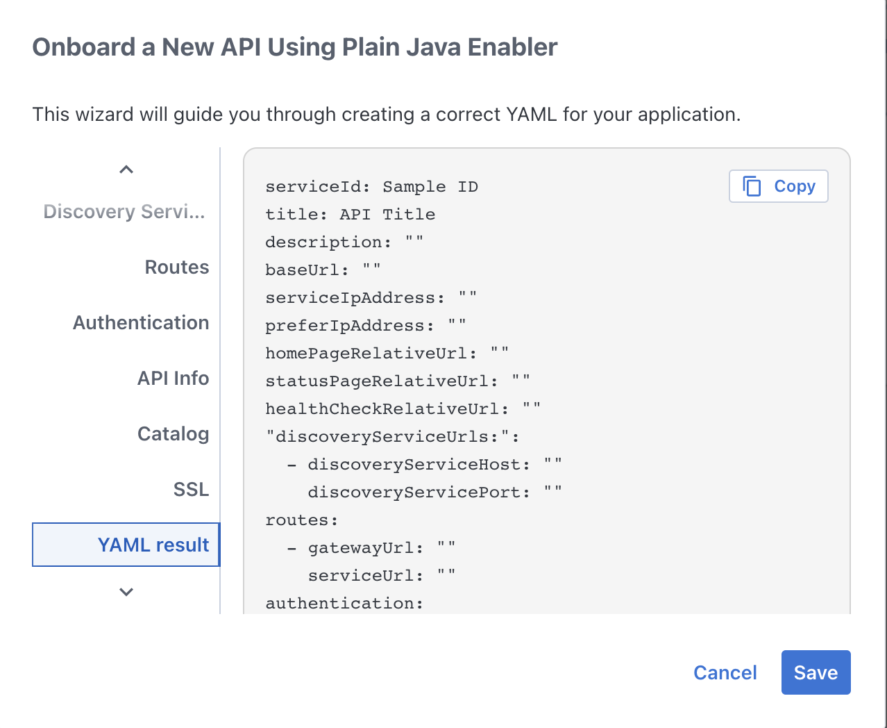

# Onboarding a REST API service with the YAML Wizard

As an API developer, you can use the Yaml Onboarding Wizard to simplify the process of onboarding new REST API services to the Zowe API Mediation Layer. The wizard offers a walkthrough of the required steps to create a correct configuration file which is used to set the application properties and Eureka metadata.

## Onboarding your REST service with the Wizard

The following procedure describes how to onboard your REST service with the Wizard.

**Follow these steps:**

1. In the dashboard of the API Catalog, click the **Onboard New API** dropdown located in the navbar.  
   
2. Choose the type of onboarding according to your preference (static or via enablers).
   
3. Fill in the input fields according to your service specifications.
4. Address each of the categories in the dialog dropdown. 
   
5. Click **Save** to apply your changes.
6. In case you are onboarding your service statically, the process has been successful, if a validation message appears on the screen.  
     
   If you are onboarding your service via enablers, click the copy button to save the generated YAML file to your clipboard and then paste it in your project's service-configuration.yml file.   
     
   
If you see your service in the list of API Catalog available services, you have onboarded your service successfully.

