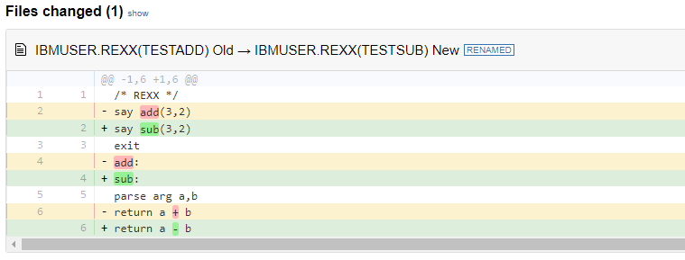

# Developing a new Zowe CLI plug-in

Before you begin, complete the [Extending an existing plug-in](cli-extending-a-plugin.md) tutorial.

## Overview

The advantage of Zowe CLI and of the CLI approach in mainframe development is that it allows for combining different developer tools for new and interesting uses.

This tutorial demonstrates how to create a brand new Zowe CLI plug-in that uses Node.js to create a client-side API.

After following all the steps, you will have created a data set diff utility plug-in called **Files Util Plug-in**. This plug-in takes in any two data sets, or files, and returns a plain text output in the terminal showing how they differ. This tutorial also shows you how you can integrate your new plug-in with a third-party utility to make your output colorful and easier to read, as shown in the image at the [bottom of this page](../extend-cli/cli-developing-a-plugin#bringing-together-new-tools).

If you are ready to create your own unique Zowe CLI plug-in, refer to the notes at the end of each tutorial step for guidance.

If you are interested in creating a credential manager plug-in, see the [Zowe CLI secrets for kubernetes plug-in](https://github.com/zowe/zowe-cli-secrets-for-kubernetes) repository.

## Setting up the new sample plug-in project

 Download the sample plug-in source and delete the irrelevant content to set up your plug-in project:

1. Open a terminal and run the command `mkdir zowe-tutorial`.
    
    :::note
    All the files created through this tutorial are saved in this tutorial directory.
    :::
2. Enter `cd zowe-tutorial` to change directory into your `zowe-tutorial` folder.
3. Download the [source code zip file](https://github.com/zowe/zowe-cli-sample-plugin/archive/refs/heads/master.zip) from the Zowe CLI sample plug-in repository.
4. In your File Explorer, extract the zip file to the  `zowe-tutorial` folder.
5. Rename the `zowe-cli-sample-plugin-master` directory to `files-util`.
    
    This is the project directory used throughout the rest of this tutorial. 
6. Delete all content within the following folders:
    - `src/api`
    - `src/cli`
    - `docs` folders
    - `__tests__/__system__/api`
    - `__tests__/__system__/cli`
    -  `__tests__/api`
    - `__tests__/cli`
7. Return to your terminal and run `cd files-util` to enter the project directory.
8. Enter `git init` to set up a new Git repository.
9. Enter `git add --all` to *stage* (track) all files in the current directory with Git.

10. Enter `git commit --message "Initial commit"` to save a snapshot of the staged files in your repository.
11. Run `npm install` to install third-party dependencies defined in the `package.json` file of your Node.js project.

    When successful, a progress bar displays. Once the plug-in is installed, a message displays the status of the packages in the `node_modules` directory.

    :::note
    If vulnerabilities are found in any of the installed dependencies, refer to [npm Docs](https://docs.npmjs.com/cli/v9/commands/npm-audit) for how to fix them.
    :::

:::tip To create a unique plug-in

Change the `files-util` directory to a name applicable for your project.

:::

## Updating `package.json`

Change the name property in the `package.json` file to the plug-in name.

Open the `package.json` file in a text editor and replace the name field with the following information:

```typescript
  "name": "@zowe/files-util",
```

This tutorial uses `@zowe/files-util` as the tutorial plug-in name.

:::tip To create a unique plug-in

Replace `@zowe/files-util` with a unique plug-in name. This allows you to publish the plug-in under that name to the `npm` registry in the future. For information regarding npm scoping, see the [npm documentation](https://docs.npmjs.com/cli/v9/using-npm/scope).

:::

## Adjusting Imperative CLI Framework configuration

Define json configurations for the plug-in to Imperative.

Change the `src/pluginDef.ts` file to contain the following configurations:

```typescript
import { IImperativeConfig } from "@zowe/imperative";

const config: IImperativeConfig = {
    commandModuleGlobs: ["**/cli/*/*.definition!(.d).*s"],
    rootCommandDescription: "Files utility plugin for Zowe CLI",
    productDisplayName: "Files Util Plugin",
    name: "files-util"
};

export = config;
```

When successful, the `src/pluginDef.ts` file contains the new configurations.

:::tip To create a unique plug-in

Change the plug-in name, display name, and description according to your project.

:::

## Adding third-party packages

Install third-party packages as dependencies for the plug-in's client-side API:

1. Run `npm install --save-exact diff` to install the diff package (which includes methods for comparing text).

2. Run `npm install --save-dev @types/diff` to install the typescript type definitions for the diff package as a [development dependency](https://docs.npmjs.com/specifying-dependencies-and-devdependencies-in-a-package-json-file).

    When successful, the `diff` and `@types/diff` packages are added to the dependency list in the `package.json` file.

:::tip To create a unique plug-in

Instead of the `diff` package, install the package(s) that are required for your API, if any.

:::

## Creating a Node.js client-side API

Create a client-side API that compares the contents of two data sets on the mainframe:

1. In the `src/api` directory, create a file named `DataSetDiff.ts`. 

2. Copy and paste the following code into the `DataSetDiff.ts` file:

    ```typescript
    import { AbstractSession } from "@zowe/imperative";
    import { Download, IDownloadOptions, IZosFilesResponse } from "@zowe/cli";
    import * as diff from "diff";
    import { readFileSync } from "fs";

    export class DataSetDiff {

        public static async diff(session: AbstractSession, oldDataSet: string, newDataSet: string) {

            let error;
            let response: IZosFilesResponse;

            const options: IDownloadOptions = {
                extension: "dat",
            };

            try {
                response = await Download.dataSet(session, oldDataSet, options);
            } catch (err) {
                error = "oldDataSet: " + err;
                throw error;
            }

            try {
                response = await Download.dataSet(session, newDataSet, options);
            } catch (err) {
                error = "newDataSet: " + err;
                throw error;
            }

            const regex = /\.|\(/gi; // Replace . and ( with /
            const regex2 = /\)/gi;   // Replace ) with .

            // convert the old data set name to use as a path/file
            let file = oldDataSet.replace(regex, "/");
            file = file.replace(regex2, ".") + "dat";
            // Load the downloaded contents of 'oldDataSet'
            const oldContent = readFileSync(`${file}`).toString();

            // convert the new data set name to use as a path/file
            file = newDataSet.replace(regex, "/");
            file = file.replace(regex2, ".") + "dat";
            // Load the downloaded contents of 'oldDataSet'
            const newContent = readFileSync(`${file}`).toString();

            return diff.createTwoFilesPatch(oldDataSet, newDataSet, oldContent, newContent, "Old", "New");
        }
    }
    ```

3. In the `src` directory, replace the contents of the `index.ts` file with the following code in order to make the API available for other developers to import:

    ```typescript
    export * from "./api/DataSetDiff";
    ```

    When successful, the `index.ts` file contains the new code.

:::tip To create a unique plug-in

The file name and code in Step 2 may be entirely different if you want to implement an API to do something else.

:::

## Building your plug-in source

Confirm that your project builds successfully:

1. Due to missing license headers, you will come across linting errors. Run `npm run lint:fix` to resolve the errors automatically.

    When successful, no errors are returned, although an unrelated warning might display. Additionally, the `lib` directory contains the built javascript files.

2. In the terminal, run `npm run build` to verify there are no errors.

    This command builds your typescript files by looking at the configuration details in `tsconfig.json` and placing the output javascript files in the `lib` directory.
    
    The `lib` directory is configurable by modifying [this value](https://github.com/zowe/zowe-cli-sample-plugin/blob/master/tsconfig.json#L12) in the `tsconfig.json` file.

:::tip To create a unique plug-in

Follow these same steps.

:::

## Creating a Zowe CLI command

To define the command that calls the client-side API:

1. In `src/cli`, create a folder named `diff`.
2. In the `diff` directory, create a file named `Diff.definition.ts`.
3. Copy and paste the following code into the `Diff.definition.ts` file:

    ```typescript
    import { ICommandDefinition } from "@zowe/imperative";
    import { DataSetsDefinition } from "./data-sets/DataSets.definition";
    const IssueDefinition: ICommandDefinition = {
        name: "diff",
        summary: "Diff two data sets content",
        description: "Uses open source diff packages to diff two data sets content",
        type: "group",
        children: [DataSetsDefinition]
    };

    export = IssueDefinition;
    ```

4. In the `diff` folder, create a folder named `data-sets`.
5. In the `data-sets` folder, create the following two files: 
    - `DataSets.definition.ts`
    - `DataSets.handler.ts`

6. Copy and paste the following code into the `DataSets.definition.ts` file:
    ```typescript
    import { ICommandDefinition } from "@zowe/imperative";

    export const DataSetsDefinition: ICommandDefinition = {
        name: "data-sets",
        aliases: ["ds"],
        summary: "data sets to diff",
        description: "diff the first data set with the second",
        type: "command",
        handler: __dirname + "/DataSets.handler",
        positionals: [
            {
                name: "oldDataSet",
                description: "The old data set",
                type: "string"
            },
            {
                name: "newDataSet",
                description: "The new data set",
                type: "string"
            }
        ],
        profile: {
            optional: ["zosmf"]
        }
    };
    ```

7. Copy and paste the following code into the `DataSets.handler.ts` file:
    ```typescript
    import { ConnectionPropsForSessCfg, ICommandHandler, IHandlerParameters, ISession, Session } from "@zowe/imperative";
    import { DataSetDiff } from "../../../api/DataSetDiff";

    export default class DataSetsDiffHandler implements ICommandHandler {
        public async process(params: IHandlerParameters): Promise<void> {
            const sessCfg: ISession = {
                hostname: params.arguments.host,
                port: params.arguments.port,
                basePath: params.arguments.basePath,
                rejectUnauthorized: params.arguments.rejectUnauthorized,
                protocol: params.arguments.protocol || "https"
            };
            const sessCfgWithCreds = await ConnectionPropsForSessCfg.addPropsOrPrompt<ISession>(sessCfg, params.arguments,
                { doPrompting: true, parms: params });
            const session = new Session(sessCfgWithCreds);

            const resp = await DataSetDiff.diff(session, params.arguments.oldDataSet, params.arguments.newDataSet);
            params.response.console.log(resp);
        }
    }    
    ```
    When successful, the `Diff.definition.ts`, `DataSets.definition.ts`, and `DataSets.handler.ts` files contain the new code.

:::note

If you are adding multiple commands to your CLI plug-in, consider moving the code that creates a session into a base handler class that can be shared across multiple commands. See the [sample plugin code](https://github.com/zowe/zowe-cli-sample-plugin/blob/master/src/cli/list/ListBaseHandler.ts) for an example of how this can be done.

:::

:::tip To create a unique plug-in

Refer to file names specific to your project. Your code likely follows the same structure, but command name, handler, definition, and other information would differ.

:::

## Trying your command

Before you test your new command, confirm that you are able to connect to the mainframe.

In order for the client-side API to reach the mainframe (to fetch data sets), Zowe CLI needs a z/OSMF profile for access. See [Team configurations](../../user-guide/cli-using-using-team-profiles/) for information. 

Once the connection between Zowe CLI and z/OSMF is confirmed, build and install the plug-in before running it for the first time:

1. Repeat the steps in [Building your plug-in source](../extend-cli/cli-developing-a-plugin#building-your-plug-in-source).

    As you make changes, repeat these steps to make sure the changes are reflected in the working plug-in.

2. Issue the following command to install **Files Util Plug-in** into Zowe CLI:

    ```
    zowe plugins install .
    ```

    A success message displays if installed correctly.

    :::note
    If you encounter installation errors due to conflicting profiles or command groups, uninstall the sample plug-in or modify the profile definition in the `src/pluginDef.ts` file.
    :::

3. Replace the data set names with valid mainframe data set names on your system:

    ```
    zowe files-util diff data-sets "IBMUSER.REXX(TESTADD)" "IBMUSER.REXX(TESTSUB)"
    ```
    The raw diff output displays as a command response:

    ```
    $ zowe files-util diff data-sets "IBMUSER.REXX(TESTADD)" "IBMUSER.REXX(TESTSUB)"
    ===================================================================
    --- IBMUSER.REXX(TESTADD)        Old
    +++ IBMUSER.REXX(TESTSUB)        New
    @@ -1,6 +1,6 @@
    /* REXX */
    -say add(3,2)
    +say sub(3,2)
    exit
    -add:
    +sub:
    parse arg a,b
    -return a + b
    +return a - b
    ```

    When successful, the output displays plain text diffs of the entered data sets.

:::tip To create a unique plug-in

Use Step 3 to run your new command. Note that the command is different based on the plug-in name in the `src/pluginDef.ts` file.

:::

## Bringing together new tools

You have created a simple CLI plug-in that provides plain text diffs of two data sets. But you may not want to end there.

Depending on the complexity of your changes, it can be difficult to identify data set differences with plain text.

To help fix this, you can extend **Files Util Plug-in** to create a more visual output. For this tutorial, use [diff2html](https://diff2html.xyz/) to generate side-by-side diffs that make it easier to compare changes, as seen in the image below.

|  |
|:--:|
| <b>Diff to HTML by [rtfpessoa](https://github.com/rtfpessoa)</b>|

1. Run `npm install --global diff2html-cli` to install `diff2html`.

    :::note

    Zowe is not associated with `diff2html-cli`.
    
    :::

2. To pipe your Zowe CLI plug-in output to `diff2html`, run the following command with your information:

    ```
    zowe files-util diff data-sets "IBMUSER.REXX(TESTADD)" "IBMUSER.REXX(TESTSUB)" | diff2html -i stdin
    ```

    When successful, this launches a web browser that displays side-by-side diffs using HTML.

For a unique plug-in, consider integrating with more modern tools that make outputs easier to read or manage, or that can use outputs in scripts.

## Next steps
Try the [Implementing profiles in a plug-in](cli-implement-profiles.md) tutorial to learn about defining new profiles with your plug-in.
