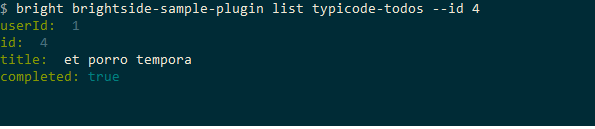

# Extending a plug-in

Before you begin, be sure to complete the [Installing the sample plug-in](cli-installing-sample-plugin.md) tutorial.

## Overview

This tutorial uses the Typicode REST API as a guide for how to build a Zowe CLI plug-in that interacts with REST APIs on the mainframe.

At the end of this tutorial, you are able to use the following new command from the Zowe CLI interface:

```
zowe zowe-cli-sample list typicode-todos
```

The completed source for this tutorial can be found on the `typicode-todos` branch of the [`zowe-cli-sample-plugin`](https://github.com/zowe/zowe-cli-sample-plugin/#zowe-cli-sample-plug-in) repository.

### Creating a Typescript interface for the Typicode response data

First, create a Typescript interface to map the response data from a server:

1. Within `zowe-cli-sample-plugin/src/api`, create a folder named `doc` to contain the interface. The interface specifies the properties that we expect from the JSON response.

2. In the `doc` folder, create a file named `ITodo.ts`.

3. Edit the `ITodo.ts` file to contain the following code:

    ```typescript
    export interface ITodo {
        userId: number;
        id: number;
        title: string;
        completed: boolean;
    }
    ```

### Creating a programmatic API

Next, create a Node.js API for the command handler to use.

This API can also be used in any Node.js application.

1. Create a file named `Typicode.ts` in the `zowe-cli-sample-plugin/src/api` directory.

2. Edit the `Typicode.ts` file to contain the following code:

    ```typescript
    import { ITodo } from "./doc/ITodo";
    import { RestClient, AbstractSession, ImperativeExpect, Logger } from "@zowe/imperative";

    export class Typicode {

        public static readonly TODO_URI = "/todos";

        public static getTodos(session: AbstractSession): Promise<ITodo[]> {
            Logger.getAppLogger().trace("Typicode.getTodos() called");
            return RestClient.getExpectJSON<ITodo[]>(session, Typicode.TODO_URI);
        }

        public static getTodo(session: AbstractSession, id: number): Promise<ITodo> {
            Logger.getAppLogger().trace("Typicode.getTodos() called with id " + id);
            ImperativeExpect.toNotBeNullOrUndefined(id, "id must be provided");
            const resource = Typicode.TODO_URI + "/" + id;
            return RestClient.getExpectJSON<ITodo>(session, resource);
        }
    }

    ```

    The `Typicode` class provides two programmatic APIs, `getTodos` and `getTodo`, to get an array of `ITodo` objects or a specific `ITodo`, respectively.

    The Node.js APIs use `@zowe/imperative` infrastructure to provide logging, parameter validation, and to call a REST API. See the [Imperative CLI Framework documentation](https://github.com/zowe/zowe-cli/wiki) for more information.

#### Exporting the interface and programmatic API for other Node.js applications

Edit the [zowe-cli-sample-plugin/src/index.ts](https://github.com/zowe/zowe-cli-sample-plugin/blob/master/src/index.ts) file to contain the following code:

```typescript
export * from "./api/doc/ITodo";
export * from "./api/Typicode";
```

This allows a separate, standalone Node.js application to use APIs from the sample Typicode plug-in to get data from the REST API at jsonplaceholder.typicode.com.

The following code is an example of how a Node.js application could import classes from your API to interact with the Typicode REST API:

```typescript
import { Typicode } from "@zowe/zowe-cli-sample-plugin";
import { Session, Imperative } from "@zowe/imperative";
import { inspect } from "util";

const session = new Session({ hostname: "jsonplaceholder.typicode.com"});
(async () => {
    const firstTodo = await Typicode.getTodo(session, 1);
    Imperative.console.debug("First todo was: " + inspect(firstTodo));
})();
```

### Verify that you can build the programmatic API

In your terminal, issue `npm run build` in your terminal to verify a clean compilation and confirm that no lint errors are present.

At this point, you have a programmatic API that can be used by your handler or another Node.js application. Next, define the command syntax for the command that uses your programmatic Node.js APIs.

### Creating a command definition

This tutorial creates the following command in Zowe CLI:

```
zowe zowe-cli-sample list typicode-todos`
```

#### Defining the syntax of your command

1. Navigate to `zowe-cli-sample-plugin/src/cli/list` and create a folder titled `typicode-todos`. 

2. In this folder, create a file named `TypicodeTodos.definition.ts`.

    Edit the `TypicodeTodos.definition.ts` file to contain the following code:

    ```typescript
    import { ICommandDefinition } from "@zowe/imperative";
    export const TypicodeTodosDefinition: ICommandDefinition = {
        name: "typicode-todos",
        aliases: ["td"],
        summary: "Lists typicode todos",
        description: "List typicode REST sample data",
        type: "command",
        handler: __dirname + "/TypicodeTodos.handler",
        options: [
            {
                name: "id",
                description: "The todo to list",
                type: "number"
            }
        ]
    };
    ```

    The `TypicodeTodos.definition.ts` file describes the syntax of your command.

#### Adding a command to a command group

Add the newly created `TypicodeTodosDefinition` to the `list` command group to enable users to list to-dos by running the `zowe zowe-cli-sample list typicode-todos` command.

1. In `zowe-cli-sample-plugin/src/cli/list/List.definition.ts`, add the following code below other `import` statements near the top of the file:
    ```typescript
    import { TypicodeTodosDefinition } from "./typicode-todos/TypicodeTodos.definition";
    ```

2. To the children array, add `TypicodeTodosDefinition`.

    For example:
    ```
    children: [DirectoryContentsDefinition, TypicodeTodosDefinition]
    ```
    The command is added to the `list` command group.

### Creating a command handler

1. In the `typicode-todos` folder, create the file `TypicodeTodos.handler.ts`.

2. Add the following code to the `TypicodeTodos.handler.ts` file:
    ```typescript
    import { ICommandHandler, IHandlerParameters, TextUtils, Session } from "@zowe/imperative";
    import { Typicode } from "../../../api/Typicode";
    export default class TypicodeTodosHandler implements ICommandHandler {

        public static readonly TYPICODE_HOST = "jsonplaceholder.typicode.com";
        public async process(params: IHandlerParameters): Promise<void> {

            const session = new Session({ hostname: TypicodeTodosHandler.TYPICODE_HOST});
            if (params.arguments.id) {
                const todo = await Typicode.getTodo(session, params.arguments.id);
                params.response.data.setObj(todo);
                params.response.console.log(TextUtils.prettyJson(todo));
            } else {
                const todos = await Typicode.getTodos(session);
                params.response.data.setObj(todos);
                params.response.console.log(TextUtils.prettyJson(todos));
            }
        }
    }
    ```

    The `if` statement checks if a user provides an `--id` flag. If yes, the command  handler calls `getTodo`. Otherwise, the command  handler calls `getTodos`.
    
    If the Typicoce API throws an error, the error is forwarded to `@zowe/imperative` to log the error and display an error message in the terminal.

### Verify that you can build your plug-in

Issue `npm run build` to verify a clean compilation and confirm that no lint errors are present.

You now have a command definition, the command has been added to the `list` command group, and you have a handler.

## Using the installed plug-in

Issue the command `zowe zowe-cli-sample list typicode-todos`.

Refer to `zowe zowe-cli-sample list typicode-todos --help` for more information about your command and to see how text in the command definition is presented to the end user. You can also see how to use your optional `--id` flag:



## Summary

You extended an existing Zowe CLI plug-in by introducing a Node.js programmatic API, and you created a command definition with a handler.

For an official Zowe CLI plug-in, you would also add [JSDoc](https://jsdoc.app/) to your code and create automated tests.

## Next steps

Try the [Developing a new plug-in](cli-developing-a-plugin.md) tutorial next to create a new plug-in for Zowe CLI.
