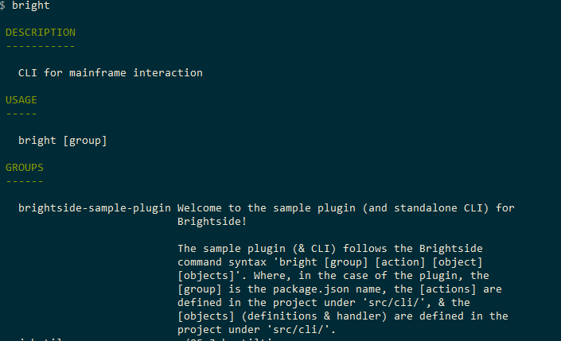
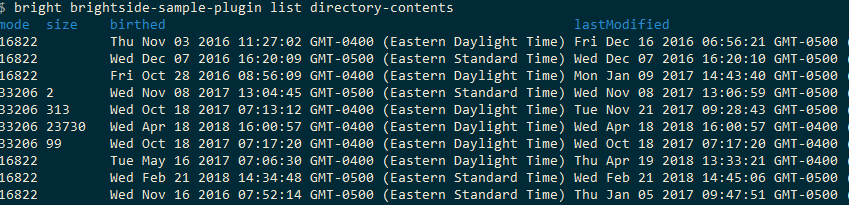

# Installing the sample plug-in

This tutorial covers installing and running the [Zowe&trade; CLI sample plug-in](https://github.com/zowe/zowe-cli-sample-plugin/#zowe-cli-sample-plug-in), which adds a command to the CLI to list the contents of a directory on your computer.

Before you begin, [set up](cli-setting-up.md) your local environment to install a plug-in.

## Installing the sample plug-in to Zowe CLI

To install the Zowe CLI sample plug-in:

1. Open a terminal and enter `cd zowe-tutorial` to change directory into your `zowe-tutorial` folder.

    See [Initial setup](cli-setting-up.md#initial-setup) for instructions on creating the `zowe-tutorial` folder.

2. Issue the following command to install the sample plug-in to Zowe CLI:

    ```
    zowe plugins install ./zowe-cli-sample-plugin
    ```

    The Zowe CLI Sample Plug-in is installed.

## Viewing the installed plug-in

Open a terminal and issue the `zowe --help`command to return information for the installed `zowe-cli-sample` command group:



## Using the installed plug-in

Open a terminal and issue the `zowe zowe-cli-sample list directory-contents` command:



## Testing the installed plug-in

1. Open a terminal and enter `cd zowe-tutorial/zowe-cli-sample-plugin` to run automated tests against the plug-in.

2. Issue the following command:

    ```
    npm run test
    ```
    The command runs the automated unit and system tests defined in the `__tests__` folder. Test results are displayed in the terminal with the count of passed and failed tests. Failed tests are identified in the results.

## Next steps

You successfully installed a plug-in to Zowe CLI! Next, try the [Extending a plug-in](cli-extending-a-plugin.md) tutorial to learn about developing new commands for this plug-in.
