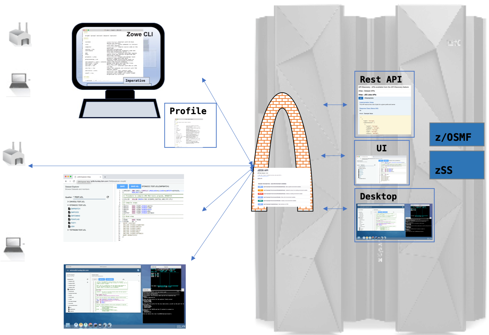

# The Zowe Architecture.

Zowe is a collection of components that together form a framework allowing z based functionality to be accessible across an organisation. This includes exposing z based components such as z/OSMF and zSS, as RestAPI's but critically the framework provides an environment into which any other components can be included and exposed to a broader non-z based audience.

## Desktop, CLI, API Mediation.

So what do all of these terms relate to and what do the do?.

### Zowe Gateway
Starting in the middle.... The Zowe Gateway or API Mediation layer provides several functions but is primarily the single central location at which all your API's converge. This means that instead of your z system users having to configure access to multiple services and port numbers they can just plug into one. In an organisation with several services potentially some of which are legacy or in cases where services are constantly being redeveloped the gateway insulates your z system users from services by using version control for example.

### Explorer Server
The Explorer server is one of several components that provides important z functionality related to jobs, files and datasets. It also includes a comprehensive ReactJS based WebUI that presents jobs, files and datasets in a navigator UI. The component is written in Java and based around a JEE server and also serves as a template for developing similar applications.

### Zowe Desktop (zLUX Server)
The Zowe desktop provides a revolutionary "Operating System" like view of z providing a single user interface that contains windows and widgets that integrate together "on the glass". The Node based zLUX server supporting the Desktop provides the framework which allows more windows and widgets to be added. 

### z/OSMF and zSS services
If present these functions integrate with the Explorer Server and Zowe Desktop Server.

### Zowe CLI
The Zowe CLI is not built on but instead runs under windows, Linux, OSx etc. Using API's from Zowe the CLI uses plugins that wraps functionality of particular systems such as z or applications running under z such as CICS or IMS. This allow users to use specific commands to compete tasks and is particularly applicable when considering automated DevOps processes.

## Extending Zowe
These components are just the start and it is intended that the Zowe environment enlarges and becomes more comprehensive as more functionality is incorporated into the infrastructure. To start with however the following diagram describes where you may wish to start.

