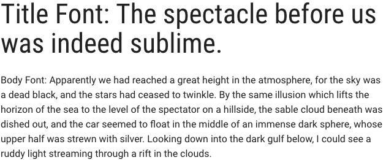
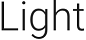
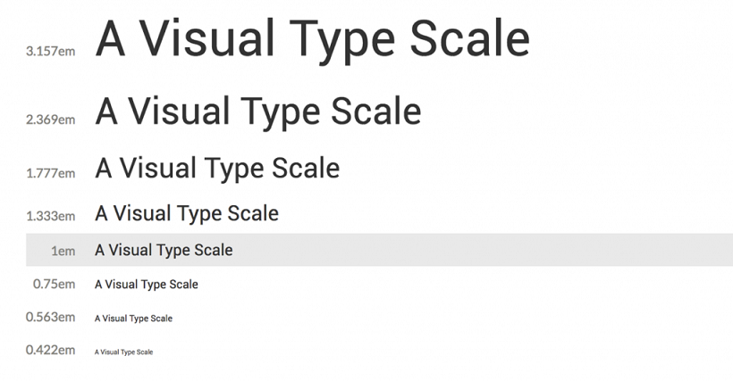
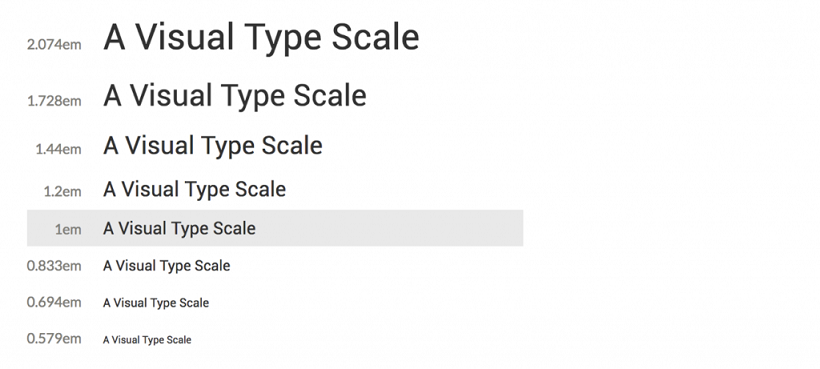

# Typography

Typography is used to create clear hierarchies, useful organizations, and purposeful alignments that guide users through the product and experience. It is the core structure of any well designed interface.

## Typeface

Title typeface: Roboto Condensed

Body typeface: Roboto

Sample:




## Font weight

Font weight is an important typographic style that can add emphasis and is used to differentiate content hierarchy. Font weight and size pairings must be carefully balanced. A bold weight will always have more emphasis than a lighter weight font of the same size. However, a lighter weight font can rank hierarchically higher than a bold font if the lighter weight type size is significantly larger than the bold.

Roboto font family provides a wide range of weights. However, only SemiBold, Regular, Light should be used for product design.

- Font-weight: 300 / Light

  

  Should only be used at sizes greater than or equal to 18px / 1.125rem

- Font-weight: 400 / Normal

  

- Font-weight: 500 / Semi-bold

  

## Body copy

We recommended that you use two sizes for body copy. The first size is UI specific. To maximize screen real estate we chose a smaller 14px / 0.875rem body copy size for the standard UI console. However, for areas that have prolonged reading, such as Documentation, we use a larger body copy size of 16px / 1rem to enhance readability.

## Line scale

- 1.333 Perfect Fourth-type scale - desktop

  

- 1.2 Minor Third type-scale - mobile

  


## Line-height

Line-height, traditionally known as leading, is one of several factors that directly contribute to readability and pacing of copy. Line-heights are based on the size of the font itself. Ideal line-heights for standard copy have a ratio of 1:1.5 (typesize : line-height). For example, a type at 16px / 1rem would have a line-height of 1.5rem / 24px (16 x 1.5). The exception to this rule are headings, which need less spacing and therefore have a line-height ratio of 1:1.25.

## Embed font

To embed your selected fonts into a web page, copy the following code into the `<head>` of your HTML document:

```
<link href="https://fonts.googleapis.com/css?family=Roboto+Condensed|Roboto:300,400,500" rel="stylesheet">
```

## Import font

```
<style>
@import url('https://fonts.googleapis.com/css?family=Roboto+Condensed|Roboto:300,400,500');
</style>
```

## Specify in CSS

Use the following CSS rules to specify these families:

```
font-family: 'Roboto', sans-serif;
font-family: 'Roboto Condensed', sans-serif;
```
