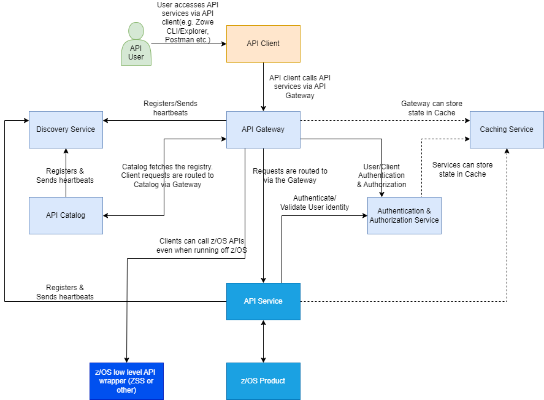
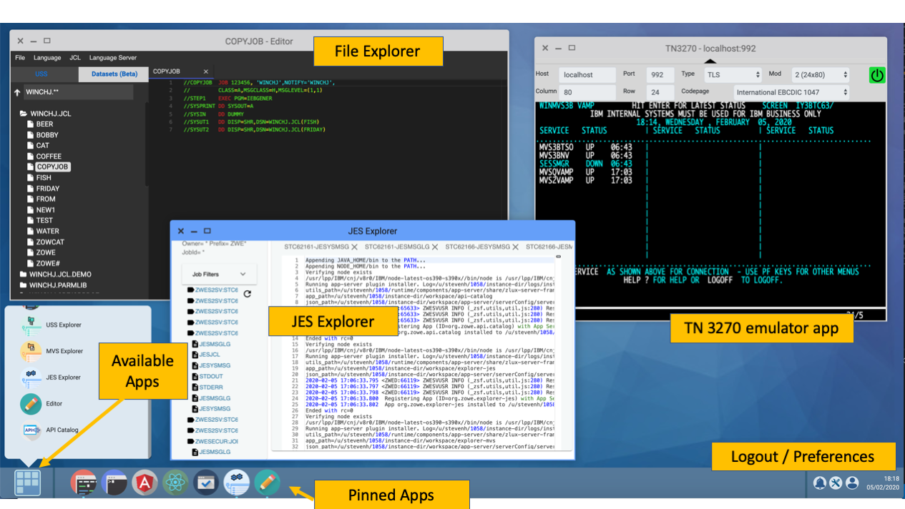
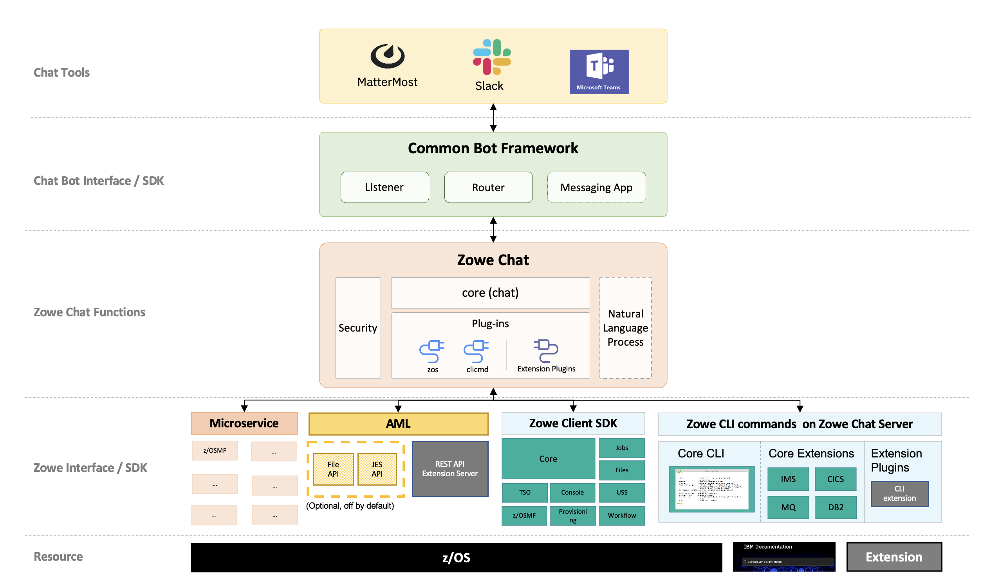

---
meta:
  - name: description
    content: Zowe is an open source project within the Open Mainframe Project that is part of The Linux Foundation. Zowe is an extensible framework that simplifies and speeds application development, deployment, and operations on z/OS, and provides the ability for extension through CLI plug-ins, new applications to be added to the web desktop, and onboarding of REST APIs to the API Mediation Layer. It narrows the skills gap between new and legacy z/OS developers by offering the choice to work with z/OS either through a Command Line Interface, a Zowe Explorer Visual Studio extension, a web browser served from the Zowe Application Framework, or through REST APIs and web sockets served through the API Mediation Layer.
---

# Zowe overview

Zowe™ is an open source software which provides both an extensible framework, and a set of tools that allow mainframe development and operation teams to securely manage, develop, and automate resources and services on z/OS family mainframes.
Zowe offers modern interfaces to interact with z/OS and allows users to interact with the mainframe system in a way that is similar to what they experience on cloud platforms today.
Users can work with these interfaces as delivered or through plug-ins and extensions created by customers or third-party vendors.
All members of the IBM Z platform community, including Independent Software Vendors (ISVs), System Integrators, and z/OS consumers, benefit from the modern and open approach to mainframe computing delivered by Zowe.

Zowe is a member of the Open Mainframe Project governed by Linux Foundation™.

## Zowe demo video

Watch this [video](https://www.youtube.com/embed/NX20ZMRoTtk) to see a quick demo of Zowe. 

<iframe class="embed-responsive-item" id="youtubeplayer" title="Zowe overview demo" type="text/html" width="640" height="390" src="https://www.youtube.com/embed/7XpOjREP8JU" frameborder="0" webkitallowfullscreen="true" mozallowfullscreen="true" allowfullscreen="true"> </iframe>

[Download the deck for this video](/Zowe_introduction_video_deck.pptx) | [Download the script](/Zowe_introduction_video_script.txt)

## Component overview

Zowe consists of the following components:

- [Zowe Launcher](#zowe-launcher)
- [API Mediation Layer](#api-mediation-layer)
- [Zowe Application Framework](#zowe-application-framework)
- [Zowe CLI](#zowe-cli)
- [Zowe Explorer](#zowe-explorer)
- [Zowe Client Software Development Kits SDKs](#zowe-client-software-development-kits-sdks)
- [ZEBRA (Zowe Embedded Browser for RMF/SMF and APIs) - Incubator](#zebra-zowe-embedded-browser-for-rmfsmf-and-apis---incubator)

### Zowe Launcher

The Zowe Launcher makes it possible to launch Zowe z/OS server components in a high availability configuration, and performs the following operations:

- Start all Zowe server components using the `START` (or `S`) operator command.
- Stop Zowe server components using the `STOP` (or `P`) operator command.
- Stop and start specific server components without restarting the entire Zowe instance using `MODIFY` (or `F`) operator command.

### API Mediation Layer

The API Mediation Layer provides a single point of access for APIs of mainframe services, and provides a [Single Sign On (SSO)](../user-guide/api-mediation-sso) capability for mainframe users.

The API Mediation Layer (API ML) facilitates secure communication between loosely coupled clients and services through a variety of API types, such as REST, GraphQL or Web-Socket. 
API ML consists of these core components: the API Gateway, the Discovery Service, the API Catalog, and the Caching service:

- The API Gateway provides secure routing of API requests from clients to registered API services.
- The Discovery Service allows dynamic registration of microservices and enables their discoverability and status updates.
- The API Catalog provides a user-friendly interface to view and try out all registered services, read their associated APIs documentation in OpenAPI/Swagger format.
- The API ML Caching Service allows components to store, search and retrieve their state. The Caching service can be configured to store the cached data using various backends. Recommended is usage of Inifinispan packaged with the Caching Service.  

The API Mediation Layer offers enterprise, cloud-like features such as high-availability, scalability, dynamic API discovery, consistent security, a single sign-on experience, and API documentation.

 Learn more 

#### Key features
* Consistent Access: API routing and standardization of API service URLs through the Gateway component provides users with a consistent way to access mainframe APIs at a predefined address.
* Dynamic Discovery: The Discovery Service automatically determines the location and status of API services.
* High-Availability: API Mediation Layer is designed with high-availability of services and scalability in mind.
* Caching Service: This feature is designed for Zowe components in a high availability configuration, and supports high availability of all components within Zowe. As such, components can remain stateless whereby the state of the component is offloaded to a location accessible by all instances of the service, including those which just started.
* Redundancy and Scalability: API service throughput is easily increased by starting multiple API service instances without the need to change configuration.
* Presentation of Services: The API Catalog component provides easy access to discovered API services and their associated documentation in a user-friendly manner. 
* Encrypted Communication: API ML facilitates secure and trusted communication across both internal components and discovered API services.

#### API Mediation Layer structural architecture
The following diagram illustrates the single point of access through the Gateway, and the interactions between API ML components and services:

#### Components
The API Layer consists of the following key components:

**Gateway Service**

Services that comprise the API ML service ecosystem are located behind a gateway (reverse proxy). All end users and API 
client applications interact through the Gateway. Each service is assigned a unique service ID that is used in the access URL. 
Based on the service ID, the Gateway forwards incoming API requests to the appropriate service. Multiple Gateway instances 
can be started to achieve high-availability. The Gateway access URL remains unchanged. The Gateway Service is built on Spring
Cloud Gateway and Spring Boot technology.

**Discovery Service**

The Discovery Service is the central repository of active services in the API ML ecosystem. The Discovery Service 
continuously collects and aggregates service information and serves as a repository of active services. When a service is 
started, it sends its metadata, such as the original URL, assigned serviceId, and status information to the Discovery Service. 
Back-end microservices register with this service either directly or by using a Eureka client. Multiple enablers are 
available to help with service on-boarding of various application architectures including plain Java applications and 
Java applications that use the Spring Boot framework. The Discovery Service is built on Eureka and Spring Boot technology.

**API Catalog**

The API Catalog is the catalog of published API services and their associated documentation. The Catalog provides both 
the REST APIs and a web user interface (UI) to access them. The web UI follows the industry standard Swagger UI component 
to visualize API documentation in OpenAPI JSON format for each service. A service can be implemented by one or more service 
instances, which provide exactly the same service for high-availability or scalability. API Catalog requires authentication
from the accessing user. 

**Caching Service**

An API is provided in high-availability mode which offers the possibility to store, retrieve, and delete data associated 
with keys. 

#### Onboarding APIs
Essential to the API Mediation Layer ecosystem is the API services that expose their useful APIs. Use the following topics 
to learn more about adding new APIs to the API Mediation Layer and using the API Catalog:

* [Onboarding Overview](../extend/extend-apiml/onboard-overview.md)
* [Onboard an existing Spring Boot REST API service using Zowe API Mediation Layer](../extend/extend-apiml/onboard-spring-boot-enabler.md)
* [Onboard an existing Node.js REST API service using Zowe API Mediation Layer](../extend/extend-apiml/onboard-nodejs-enabler.md)
* [Using API Mediation Layer](../user-guide/api-mediation/using-api-mediation-layer.md)

To learn more about the architecture of Zowe, see [Zowe architecture](zowe-architecture.md).

### Zowe Application Framework

A web user interface (UI) that provides a virtual desktop containing a number of apps allowing access to z/OS function.  Base Zowe includes apps for traditional access such as a 3270 terminal and a VT Terminal, as well as an editor and explorers for working with JES, MVS Data Sets and Unix System Services.

 Learn more 

The Zowe Application Framework modernizes and simplifies working on the mainframe. With the Zowe Application Framework, you can create applications to suit your specific needs. The Zowe Application Framework contains a web UI that has the following features:

- The web UI works with the underlying REST APIs for data, jobs, and subsystem, but presents the information in a full screen mode as compared to the command line interface.
- The web UI makes use of leading-edge web presentation technology and is also extensible through web UI plug-ins to capture and present a wide variety of information.
- The web UI facilitates common z/OS developer or system programmer tasks by providing an editor for common text-based files like REXX or JCL along with general purpose data set actions for both Unix System Services (USS) and Partitioned Data Sets (PDS) plus Job Entry System (JES) logs.

The Zowe Application Framework consists of the following components:

- **Zowe Desktop**

    The desktop, accessed through a browser.  The desktop contains a number of applications, including a TN3270 emulator for traditional Telnet or TLS terminal access to z/OS, a VT Terminal for SSH commands, as well as rich web GUI applications including a JES Explorer for working with jobs and spool output, a File Editor for working with USS directories and files and MVS data sets and members.   The Zowe desktop is extensible and allows vendors to provide their own applications to run within the desktop. See [Extending the Zowe Desktop](../extend/extend-desktop/mvd-extendingzlux.md).  The following screen capture of a Zowe desktop shows some of its composition as well as the TN3270 app, the JES Explorer, and the File Editor open and in use.

    

- **Zowe Application Server**

    The Zowe Application Server runs the Zowe Application Framework. It consists of the Node.js server plus the Express.js as a webservices framework, and the proxy applications that communicate with the z/OS services and components.

- **ZSS Server**

    The ZSS Server provides secure REST services to support the Zowe Application Server.  For services that need to run as APF authorized code, Zowe uses an angel process that the ZSS Server calls using cross memory communication.  During installation and configuration of Zowe, you will see the steps needed to configure and launch the cross memory server.

- **Application plug-ins**

    Several application-type plug-ins are provided. For more information, see [Using the Zowe Application Framework application plug-ins](../user-guide/mvd-using.md#zowe-desktop-application-plugins).

### Zowe CLI
Zowe CLI is a command-line interface that lets you interact with the mainframe in a familiar, off-platform format. Zowe CLI helps to increase overall productivity, reduce the learning curve for developing mainframe applications, and exploit the ease-of-use of off-platform tools. Zowe CLI lets you use common tools such as Integrated Development Environments (IDEs), shell commands, bash scripts, and build tools for mainframe development. Though its ecosystem of plug-ins, you can automate actions on systems such as IBM Db2, IBM CICS, and more. It  provides a set of utilities and services for users that want to become efficient in supporting and building z/OS applications quickly.

 Learn more 

Zowe CLI provides the following benefits:

- Enables and encourages developers with limited z/OS expertise to build, modify, and debug z/OS applications.
- Fosters the development of new and innovative tools from a computer that can interact with z/OS. Some Zowe extensions are powered by Zowe CLI, for example the [Visual Studio Code Extension for Zowe](../user-guide/ze-install.md).
- Ensure that business critical applications running on z/OS can be maintained and supported by existing and generally available software development resources.
- Provides a more streamlined way to build software that integrates with z/OS.

**Note:** For information about software requirements, installing, and upgrading Zowe CLI, see
[Installing Zowe](../user-guide/installandconfig.md).

#### Zowe CLI capabilities

With Zowe CLI, you can interact with z/OS remotely in the following ways:

- **Interact with mainframe files:**
    Create, edit, download, and upload mainframe files (data sets) directly from Zowe CLI.
- **Submit jobs:**
    Submit JCL from data sets or local storage, monitor the status, and view and download the output automatically.
- **Issue TSO and z/OS console commands:**
    Issue TSO and console commands to the mainframe directly from Zowe CLI.
- **Integrate z/OS actions into scripts:**
    Build local scripts that accomplish both mainframe and local tasks.
- **Produce responses as JSON documents:**
    Return data in JSON format on request for consumption in other programming languages.

For detailed information about the available functionality in Zowe CLI, see [Zowe CLI Command Groups](../user-guide/cli-using-understanding-core-command-groups.md).

For information about extending the functionality of Zowe CLI by installing plug-ins, see [Extending Zowe CLI](../user-guide/cli-extending.md).

**More Information:**

- [System requirements for Zowe CLI](../user-guide/systemrequirements-cli.md)
- [Installing Zowe CLI](../user-guide/cli-installcli.md)

### Zowe Explorer

Zowe Explorer is a Visual Studio Code extension that modernizes the way developers and system administrators interact with z/OS mainframes. Zowe Explorer lets you interact with data sets, USS files, and jobs that are stored on z/OS. The extension complements your Zowe CLI experience and lets you use authentication services like API Mediation Layer. The extension provides the following benefits:

- Enables you to create, modify, rename, copy, and upload data sets directly to a z/OS mainframe.
- Enables you to create, modify, rename, and upload USS files directly to a z/OS mainframe.
- Provides a more streamlined way to access data sets, uss files, and jobs.
- Letting you create, edit, and delete Zowe CLI `zosmf` compatible profiles.
- Lets you use the Secure Credential Store plug-in to store your credentials securely in the settings.
- Lets you leverage the API Mediation Layer token-based authentication to access z/OSMF.

For more information, see [Information roadmap for Zowe Explorer](user-roadmap-zowe-explorer.md).

### Zowe Client Software Development Kits (SDKs)

The Zowe Client SDKs consist of programmatic APIs that you can use to build client applications or scripts that interact with z/OS. The following SDKs are available:

- Zowe Node.js Client SDK
- Zowe Java Client SDK
- Zowe Kotlin Client SDK
- Zowe Python Client SDK

For more information, see [Using the Zowe SDKs](../user-guide/sdks-using.md).

### Zowe Chat (Technical Preview)

Zowe Chat is a chatbot that aims to enable a ChatOps collaboration model including z/OS resources and tools. Zowe Chat enables you to  interact with the mainframe from chat clients such as Slack, Microsoft Teams, and Mattermost. Zowe Chat helps to increase your productivity by eliminating or minimizing the context switching between different tools and user interfaces.

 Learn more 

#### Zowe Chat key features

- **Manage z/OS resource in chat tool channels**
  Check your z/OS job, data set, and USS files status directly in chat tool channels. You can also issue z/OS console commands directly in the chat tool. You can drill down on a specific job, data set, error code, and so on to get more details through button or drop-down menu that Zowe Chat provides.

- **Execute Zowe CLI commands in chat tool channels**

  You can also issue Zowe CLI commands to perform operations such as help and z/OS resource management including z/OS job, data set, USS file, error code, and console command. Theoretically, most of Zowe CLI commands are supported as long as it is executable with single-submit.

- **Extensibility**

  Zowe Chat is extensible via plug-ins. You can extend Zowe Chat by developing plug-ins and contributing code to the base Zowe Chat or existing plug-ins.

- **Security:**
   
  Zowe Chat makes use of z/OS SAF calls and supports the three main security management products on z/OS (RACF, Top Secret, ACF2). You can log in to the chat client via enterprise standards, including two factor authentication if required. The first time you issue a command to the Zowe Chat installed in the chat workspace, it prompts you to log in with the mainframe ID using a one-time URL. Once authenticated against the mainframe security, Zowe Chat securely caches in memory the relationship between your Chat tool ID and the mainframe ID. Zowe Chat’s Security Facility will generate credentials for downstream API requests.

- **Display alerts:**

  Allows you to send alert or event to a channel in the chat tool in use. An event data model enables Zowe Chat extenders to send alerts to a channel in the chat through Zowe Chat.

Read the following blogs to learn more about Zowe Chat:

- [Zowe Gets Chatty](https://medium.com/zowe/zowe-gets-chatty-842e3b548902)
- [Zowe Chat can make you more productive: user scenarios](https://medium.com/zowe/zowe-chat-can-make-you-more-productive-user-scenarios-f52a9985dd50)

#### Zowe Chat architecture

Zowe Chat is based on the Common Bot framework, which is required for the chat platform Slack, Mattermost, and Microsoft Teams. 

For more information, see [Installing Zowe Chat](../user-guide/zowe-chat/chat_install_overview.md) and [Using Zowe Chat](../user-guide/zowe-chat/chat_use_interact_methods.md). 

### ZEBRA (Zowe Embedded Browser for RMF/SMF and APIs) - Incubator 

ZEBRA Provides re-usable and industry compliant JSON formatted RMF/SMF data records, so that many other ISV SW and users can exploit them using open-source SW for many ways.

For more information, see the [ZEBRA documentation](https://github.com/zowe/zebra/tree/main/Documentation).

### Zowe Explorer plug-in for IntelliJ IDEA

Zowe Explorer plug-in for IntelliJ IDEA is a smart and interactive mainframe code editing tool that allows you to browse, edit, and create data on z/OS via z/OSMF REST API. 

The plug-in helps to: 
- Start working with z/OS easily with no complex configurations
- Organize data sets on z/OS, files on USS into working sets
- Allocate data sets, create members, files and directories with different permissions
- Perform operations like renaming, copying and moving data in a modern way
- Edit data sets, files and members. Smart auto-save keeps your content both in the editor and on the mainframe in sync
- Create multiple connections to different z/OS systems
- Perform all available operations with jobs
- Work with TSO Console directly in the IDE

To learn more about the plug-in, you can start with [Zowe Explorer plug-in for IntelliJ IDEA use cases](../user-guide/intellij-use-cases.md).

## Zowe Bill of Materials

<!-- 

<Tpsr /> is a React component which will create a dynamic link to latest versioned tpsr file
tpsrLatestLink = "https://github.com/zowe/docs-site/tree/master/src/tpsr/tpsr-" + latestVersion + ".md";
This returns <a href={tpsrLatestLink}>Third-Party Software Requirements (TPSR)</a>

-->

For information about the [Zowe Bill of Materials (BOM)](../appendix/bill-of-materials.md), see this link to the appendix.
