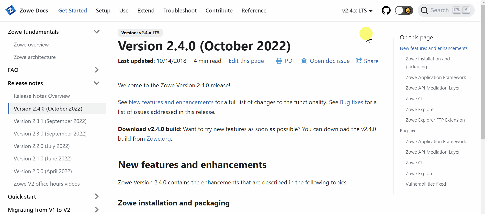

# Release Notes Overview

The release notes for all Zowe releases are published in this section.

Release notes detail all the new features, enhancements, bug fixes, and security vulnerabilities fixed in a particular Zowe release.

Select a Zowe release version on the **Table of Contents** located on the left of the page to view its release notes.

## Gathering release version information
To find out your release number, see [Checking your Zowe version release number](/docs/troubleshoot/troubleshoot-check-your-zowe-version.md). For more information on Zowe release numbers, see [Understanding Zowe release versions](/docs/troubleshoot/troubleshoot-zowe-release.md).

## Accessing older release notes

To access notes for an older release, go to the **Zowe Docs Version** dropdown menu at the top right of the page and select a release. The release notes for the selected version display under the **Release Notes** section in the **Table of Contents**.

