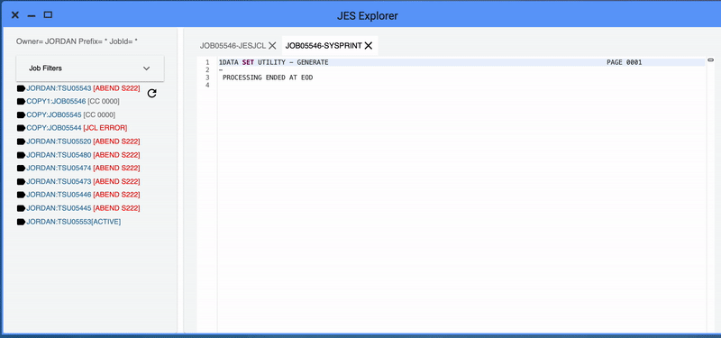

# Release notes <!-- omit in toc -->

Learn about what is new, changed, or removed in Zowe&trade;.

Zowe Version 1.10.0 and later releases include the following enhancements, release by release.

- [Version 1.10.0 LTS (April 2020)](#version-1-10-0-lts-april-2020)
- [Version 1.9.0 LTS (February 2020)](#version-1-9-0-lts-february-2020)
- [Version 1.8.1 (February 2020)](#version-1-8-1-february-2020)
- [Version 1.8.0 (February 2020)](#version-1-8-0-february-2020)
- [Version 1.7.1 (December 2019)](#version-1-7-1-december-2019)
- [Version 1.7.0 (November 2019)](#version-1-7-0-november-2019)
- [Version 1.6.0 (October 2019)](#version-1-6-0-october-2019)
- [Version 1.5.0 (September 2019)](#version-1-5-0-september-2019)
- [Zowe SMP/E Alpha (August 2019)](#zowe-smp-e-alpha-august-2019)
- [Version 1.4.0 (August 2019)](#version-1-4-0-august-2019)
- [Version 1.3.0 (June 2019)](#version-1-3-0-june-2019)
- [Version 1.2.0 (May 2019)](#version-1-2-0-may-2019)
- [Version 1.1.0 (April 2019)](#version-1-1-0-april-2019)
- [Version 1.0.1 (March 2019)](#version-1-0-1-march-2019)
- [Version 1.0.0 (February 2019)](#version-1-0-0-february-2019)

## Version 1.10.0 LTS (April 2020)

### New features and enhancements

<!-- If there is a corresponding GitHub issue, please also include the GitHub issue number. See v1.3.0 release notes as an example.-->

The following features and enhancements were added:

#### API Mediation Layer

The following new feature was added to the Zowe API Mediation Layer in this version:

- Zowe API ML can now use z/OSMF to provide JSON Web Tokens (JWT). [#433](https://github.com/zowe/api-layer/issues/433)

#### ZSS

- Fast EBCDIC to UTF8 character translation is now supported by using the TROO instruction with a "EBCDIC 1047 to ISO/IEC 8859-1" translation table. [#127](https://github.com/zowe/zowe-common-c/pull/127)
- Performance improvements in character conversion, JSON and collections code. [#162](https://github.com/zowe/zss/pull/162)
- The code now prints fewer warnings when attls is not set up. [#130](https://github.com/zowe/zowe-common-c/pull/130)
- ZSS logs belonging in the ZSS repo have been refactored so that they now use the Zowe logger and message IDs. [#163](https://github.com/zowe/zss/pull/163)
- Config variable names have been updated to stay consistent with IBM terminology. [#165](https://github.com/zowe/zss/pull/165)

#### Zowe App Server

- The sample-react-app README has been updated to state prerequisites. [#20](https://github.com/zowe/sample-react-app/pull/20)
- An example of how to use the Zowe Desktop's built-in context menu has been added. [#31](https://github.com/zowe/sample-angular-app/pull/31) 
- Sample angular app has been updated for angular 6 best practices use of HttpClient, RxJS [#33](https://github.com/zowe/sample-angular-app/pull/33)
- Simple conda build scripts have been added. [#46](https://github.com/zowe/zlux-build/pull/46)
- App server logs now have IDs prefixed, for easy lookup in future documentation. [#49](https://github.com/zowe/zlux-platform/pull/49)
- Enhancements for plugin adding. [#51](https://github.com/zowe/zlux-platform/pull/51)
- App server logs now have IDs prefixed, for easy lookup in future documentation [#102](https://github.com/zowe/zlux-app-server/pull/102).
- App server now defaults to prevent apps from being embedded in an iframe that does not come from the same origin. [#104](https://github.com/zowe/zlux-app-server/pull/104)
- The jes-explorer has been updated to support Single Sign On functionality offered by the api-layer. [#160](https://github.com/zowe/explorer-jes/pull/160)
- Desktop now has keybindings to minimize (ctrl-alt-down), maximize windows (ctrl-alt-up), and show launchbar menu (ctrl-alt-m). [#176](https://github.com/zowe/zlux-app-manager/pull/176)
- App server “router”-type dataservices now have a new Storage API within their context object, for standardized in-server state persistence. [#178](https://github.com/zowe/zlux-server-framework/pull/178)
- App server can now add plugins on-demand without a restart, by re-scanning plugins directory via REST API /plugins. [#179](https://github.com/zowe/zlux-server-framework/pull/179)
- App server can now be configured to set HTTP headers that will default and possibly override those of the plugins. [#180](https://github.com/zowe/zlux-server-framework/pull/180)
- App server /auth API now returns which handler is the default. [#183](https://github.com/zowe/zlux-server-framework/pull/183)
- Events and actions for viewports and windows are now accessible to iframe’s via the standardized window.ZoweZLUX.iframe object. [#184](https://github.com/zowe/zlux-app-manager/pull/184)
- Focus on app2app, as well as some package updates. [#188](https://github.com/zowe/zlux-app-manager/pull/188)
- 3 features: 
1. Desktop can now filter the list of apps by search query. 
2. Desktop cleanup has reduced the bootstrapping server requests by half. 
3. Desktop now can load new apps added to the server without a page reload. [#189](https://github.com/zowe/zlux-app-manager/pull/189)
- Desktop’s DOM now has lang attribute as soon as the language preference is known. [#190](https://github.com/zowe/zlux-app-manager/pull/190) 
- Desktop login screen updated with new Zowe logo. [#204](https://github.com/zowe/zlux-app-manager/pull/204)  
- JES, MVS Explorers now have support for APIML’s Single Sign On feature [#344](https://github.com/zowe/zlux/issues/344)


#### Zowe CLI

The Secure Credential Store plug-in is now packaged with tools that build dependencies locally. This fixes an issue where the installation could fail at sites with firewall restrictions. [#9](https://github.com/zowe/zowe-cli-scs-plugin/issues/9)

**Tip:** Zowe CLI release notes are now aggregated in changelogs. Reference the appropriate version in each changelog to learn about features, enhancements, and fixes.

**Core CLI Changelogs:**

- [Zowe CLI - v6.10.1](https://github.com/zowe/zowe-cli/blob/master/CHANGELOG.md)
- [Secure Credential Store Plug-in - v4.0.3 ](https://github.com/zowe/zowe-cli-scs-plugin/blob/master/CHANGELOG.md)

**CLI Plug-in Changelogs:**

- [IBM CICS Plug-in - v4.0.2](https://github.com/zowe/zowe-cli-cics-plugin/blob/master/CHANGELOG.md)
- [IBM DB2 Plug-in - v4.0.5](https://github.com/zowe/zowe-cli-db2-plugin/blob/master/CHANGELOG.md)
- [IBM FTP Plug-in: - v1.0.1](https://github.com/zowe/zowe-cli-ftp-plugin/blob/master/CHANGELOG.md)
- [IBM IMS Plug-in: - v2.0.1](https://github.com/zowe/zowe-cli-ims-plugin/blob/master/CHANGELOG.md)
- [IBM MQ Plug-in: - v2.0.1](https://github.com/zowe/zowe-cli-mq-plugin/blob/master/CHANGELOG.md)

#### Zowe Explorer

Review the [Zowe Explorer Change Log](https://github.com/zowe/vscode-extension-for-zowe/blob/master/CHANGELOG.md) to learn about the latest features, enhancements, and fixes.

You can install the latest version of the extension from the [Visual Studio Code Marketplace](https://marketplace.visualstudio.com/items?itemName=Zowe.vscode-extension-for-zowe).

### Bug fixes

The following bugs were fixed:

#### Zowe z/OS Installation

- Bugfix: `zowe-configure-instance.sh` does not allow the `-c` instance directory location to be an existing Zowe runtime.  This caused a deadloop and running out of `BPXAS` instances. See [Unable to create BPXAS instances](../troubleshoot/troubleshoot-zos.md#unable-to-create-bpxas-instances). [#1123](https://github.com/zowe/zowe-install-packaging/issues/1123)
- Bugfix: Creation of instance dir has incorrect path validation. [#1127](https://github.com/zowe/zowe-install-packaging/issues/1172)

#### Zowe App Server

- Bugfix: subloggers would not inherit message translation maps from parent loggers. [#24](https://github.com/zowe/zlux-shared/pull/24) 
- Bugfix: sample-angular-app could not be run from a folder outside of $ROOT_DIR. [#34](https://github.com/zowe/sample-angular-app/pull/34)
- Bugfix: Menu locations were wrong when multiple apps opened because the numbers used partially came from the previous instance. [#36](https://github.com/zowe/sample-angular-app/pull/36)
- Bugfix: Apps that were the target of app2app communication were not put into focus. [#50](https://github.com/zowe/zlux-platform/pull/50)
- Bugfix: Developers could not run app-server without a certificate authority. [#98](https://github.com/zowe/zlux-app-server/pull/98)
- Bugfix: App server could not work with self-signed/invalid TLS certificates sometimes used in test/development, because the configuration option broke. The option has been restored. [#103](https://github.com/zowe/zlux-app-server/pull/103)
- Bugfix: App server instance settings initialization had inconsistent write permissions. [#105](https://github.com/zowe/zlux-app-server/pull/105)
- BBugfix: App server no longer issues warning about failure to load undefined log file. [#182](https://github.com/zowe/zlux-server-framework/pull/182)
- Bugfix: Fixes unformatted messages when a language is not specified. [#186](https://github.com/zowe/zlux-server-framework/pull/186)
- Bugfix: Editor would not work for unix files when used through api mediation layer due to encoded slash. [#187](https://github.com/zowe/zlux-app-manager/pull/187)
- Bugfix: App framework’s right click menu could go off screen vertically at the bottom. [#200](https://github.com/zowe/zlux-app-manager/pull/200)
- Bugfix: zosmf-auth no longer issues configuration warning during startup. [#398](https://github.com/zowe/zlux/issues/398)
- Doc Bugfix: Sample react app did not state its dependence on the sample angular app. [#405](https://github.com/zowe/zlux/issues/405)
- Bugfix: Substitute zosmf-auth for apiml-auth to remove warning. [#1232](https://github.com/zowe/zowe-install-packaging/pull/1232)


## Version 1.9.0 LTS (February 2020)

Zowe v1.9.x is designated as the current Zowe Long-term Support (LTS) version.  <!-- Is there any further detail we should mention about what LTS means, link to some other announcement about LTS release, etc..? -->

### New features and enhancements

<!-- If there is a corresponding GitHub issue, please also include the GitHub issue number. See v1.3.0 release notes as an example.-->

The following features and enhancements were added:

#### API Mediation Layer

The following new features and enhancements have been made to the Zowe API Mediation Layer in this version:

- Support of special characters has been added to API Mediation Layer core services. In addition, all onboarding enablers now support special characters as well.
- Custom metadata support has been added to the onboarding enablers. Additional parameters can now be easily added to an expandable parameter array. This feature may be used for security configuration in the future.
- Passticket support has been added to API ML Core Services and onboarding enablers. This makes it easier to authenticate existing mainframe applications with the API Mediation Layer.
- New versions of Spring Boot based onboarding enablers (V1 and V2) have been released. These enablers support the new version of the metadata required by the Discovery Service. The new versions of the enablers consume siginifantly less disk space.

The following bug fixes have been introduced:

- A fix of a critial authentication issue with some versions of z/OSMF has been applied.
- A fix has been applied to support multipart requests.
- A fix has been applied to the z/OSMF authorization header.

#### Zowe App Server

- Added support for Node.js - z/OS V12. See [Installing Node.js on z/OS](../user-guide/install-nodejs-zos.md) for details.
- A new endpoint for removing dataservices has been added [#62](https://github.com/zowe/zss/pull/62/files)
- Functionality for removing data sets has been added [#65](https://github.com/zowe/zowe-common-c/pull/65)
- Deletion of data sets and their members is now supported [#88](https://github.com/zowe/zss/pull/88/commits)
- Deletion of data sets and their members is now supported [#85](https://github.com/zowe/zowe-common-c/pull/85/commits)
- The following helper functions have been added to test caller's environment [#115](https://github.com/zowe/zowe-common-c/pull/115):
    - A function to test whether the caller is running in SRB
    - A function to test whether the caller is in cross-memory mode
    - A function to test whether the caller is holding a CPU, CMS, CML or local lock
- The logout endpoint has been re-added for zss [#100](https://github.com/zowe/zlux-app-server/pull/100)
- Added support of SRB and locked callers to the Cross-Memory sever's PC space switch routine [#153](https://github.com/zowe/zss/pull/153)
- This pull request add the following features [#120](https://github.com/zowe/zowe-common-c/pull/120):
Ability to use the lock-free queue intrusively which allows a more flexible storage management on the user's side
Functions to copy to/from foreign address space using destination/source keys and ALETs
- Reformatted the save as modal in zowe editor [#129](https://github.com/zowe/zlux-editor/pull/129)
- Added snackbar notification for directory error [#131](https://github.com/zowe/zlux-editor/pull/131)
- Removed language server tab in editor [#134](https://github.com/zowe/zlux-editor/pull/134)
- Explicitly call zss for logout to make sure cookies are known to be invalid [#28](https://github.com/zowe/zss-auth/pull/28)
- The following changes have been made to Zlux server framework logging [#174](https://github.com/zowe/zlux-server-framework/pull/174):
    - Added English resource files for messages
    - Added code to all error, warning, debug and informational logged outputs
    - Replaced most console.log calls with logger calls
- Support for HTTP-Strict-Transport-Security. Custom headers for static content are now available [#173](https://github.com/zowe/zlux-server-framework/pull/173)
- Functionality for controlling application access for individual users has been added [#216](https://github.com/zowe/zlux/issues/216)
- Out-of-band multi-factor authentication is now supported [#225](https://github.com/zowe/zlux/issues/225)

#### Zowe CLI

To leverage the new features and plug-ins available in this version, you must follow the steps in [Migrating to the LTS version](../user-guide/cli-updatingcli.md#migrating-to-long-term-support-lts-version).

The following new CLI plug-ins are added:

  - [IBM® z/OS FTP Plug-in for Zowe CLI](./../user-guide/cli-ftpplugin.md)
  - [IBM® IMS™ Plug-in for Zowe CLI](./../user-guide/cli-imsplugin.md)
  - [IBM® MQ Plug-in for Zowe CLI](./../user-guide/cli-mqplugin.md)
  - [Secure Credential Store for Zowe CLI](./../user-guide/cli-scsplugin.md)

The following new features and enhancements are added in this version:

- **Notable Change:** The `zowe zos-files download ds` and `zowe zos-files download uf` commands no longer put the full content in the response format json (`--rfj`) output. [More information.](https://github.com/zowe/zowe-cli/pull/331)

- **Notable Change:** The `--pass` option is changed to `--password`  for all commands and profiles (zosmf, cics, etc...). The aliases `--pw` and `--pass` still function. To update a profile, issue the `zowe profiles update` command and use the new option name `--password`.

- **Notable Change:** You can enter `PROMPT*` as a value for any CLI option to enable interactive prompting. If you wrote scripts in which any option is defined with the exact value `PROMPT*`, the script will not execute properly in this version. For more information, see [Using the prompt for sensitive options](./../user-guide/cli-usingcli.md#using-the-prompt-for-sensitive-options).

- Zowe CLI was tested and confirmed to run on Unix System Services (USS) on z/OS. For more information, refer to  blog [Installing Node.js on the Mainframe](https://medium.com/@plape/installing-node-js-on-the-mainframe-both-linux-and-z-os-to-run-zowe-cli-19abb6494e41).

    (The IBM Db2 and Secure Credential Store plug-ins for Zowe CLI will *not* run on z/OS due to native code requirements.)

- The `zowe files copy` command was added for copying the contents of a data set or member to another data set or member. [#580](https://github.com/zowe/zowe-cli/pull/580)

- Zowe CLI now exploits Node.js stream APIs for download and upload of spool files, data sets, and USS files. [(#331)](https://github.com/zowe/zowe-cli/pull/331)

- The following new commands were added for interacting with file systems:
    - `zowe zos-files list fs` [#429](https://github.com/zowe/zowe-cli/issues/429)
    - `zowe zos-files mount fs` [#431](https://github.com/zowe/zowe-cli/issues/431)
    - `zowe zos-files unmount fs` [#432](https://github.com/zowe/zowe-cli/issues/432)

- The following new commands were added for creating USS files and directories:
    - `zowe zos-files create file` [#368](https://github.com/zowe/zowe-cli/issues/368)
    - `zowe zos-files create dir` [#368](https://github.com/zowe/zowe-cli/issues/368)

The IBM® CICS® Plug-in is updated with the following functionality:

  - **Notable Change:** The plug-in now uses HTTPS by default when connecting to CMCI. The option `--protocol http` was added to let you override the default as needed. [#77](https://github.com/zowe/zowe-cli-cics-plugin/issues/77)

  -  Define, enable, install, discard, disable, and delete CICS URIMaps. [#53](https://github.com/zowe/zowe-cli-cics-plugin/issues/53) [#49](https://github.com/zowe/zowe-cli-cics-plugin/issues/49) [#48](https://github.com/zowe/zowe-cli-cics-plugin/issues/48) [#51](https://github.com/zowe/zowe-cli-cics-plugin/issues/51) [#50](https://github.com/zowe/zowe-cli-cics-plugin/issues/50) [#52](https://github.com/zowe/zowe-cli-cics-plugin/issues/52)

  - Define and delete CICS web services. [#58](https://github.com/zowe/zowe-cli-cics-plugin/issues/58) [#59](https://github.com/zowe/zowe-cli-cics-plugin/issues/59)

  - Add and remove CSD Groups to/from CSD Lists [#60](https://github.com/zowe/zowe-cli-cics-plugin/issues/60).

#### Zowe Explorer

Review the [Zowe Explorer Change Log](https://github.com/zowe/vscode-extension-for-zowe/blob/master/CHANGELOG.md) to learn about the latest features, enhancements, and fixes.

You can install the latest version of the extension from the [Visual Studio Code Marketplace](https://marketplace.visualstudio.com/items?itemName=Zowe.vscode-extension-for-zowe).

Watch a video on how to [work with data sets using Zowe Explorer](https://docs.zowe.org/stable/user-guide/cli-vscodeplugin.html).

### Bug fixes

The following bugs were fixed:

#### Zowe App Server

- URL encoding with % sign were always returning with authorizatioz:false with RACF [#27](https://github.com/zowe/zss-auth/pull/27)
- Users are no longer able to delete the initial “/” in the address bar for selected files [#379](https://github.com/zowe/zlux/issues/379)
- The search bar text for datasets has been changed from "Enter a dataset" to "Enter a dataset query". The Address bar text for files has been changed from “Enter a directory” to “Enter an absolute path” [#60](https://github.com/zowe/zlux-file-explorer/pull/60)

## Version 1.8.1 (February 2020)

### Bug fixes for Zowe CLI

A bug was fixed where Zowe CLI installation could fail and users could recieve the following error message when installing Zowe CLI v1.8.0:

```
981 verbose stack Error: EPERM: operation not permitted
```

To install the fix, download the new v1.8.1 package from [Zowe.org](https://www.zowe.org/#download) and retry the installation process.

## Version 1.8.0 (February 2020)

<!--If there is a corresponding GitHub issue, please also include the GitHub issue number. See v1.3.0 release notes as an example.-->

### New features and enhancements

The following features and enhancements were added.

#### Installation of Zowe z/OS components

- The installation now just needs two parameters configured: the USS location of the runtime directory and a data set prefix where a SAMPLIB and LOADLIB will be created.  The runtime directory permissions are set to 755 and when Zowe is run, no data is written to the runtime directory.
- The way to configure Zowe is changed. Previously, you configured Zowe at installation time with the `zowe-install.yaml` file.  This file has been removed and is no longer used in this release.
- A new directory `zowe-instance-dir` has been introduced that contains configuration data used to launch Zowe.  This allows more than one Zowe instance to be started from the same Zowe runtime directory.  A new file `zowe-instance.env` within each `zowe-instance-dir` directory controls which ports are allocated to the Zowe servers as well as location of any dependencies such as Java, z/OSMF or node.  No configuration data is specified at install time.  The data is only read, validated and used at launch time.  The `zowe-instance.env` file contains a parameter value `LAUNCH_COMPONENT_GROUPS` that allows you to control which Zowe subsystems to launch, for example you can run the Zowe desktop and not the API Mediation Layer, or vice-versa; you can run just the API Mediation Layer and not the Zowe desktop.   The `zowe-instance-dir` directory is also where log files are collected.  Static extensions to the API Mediation Layer are recorded in the Zowe instance directory as well as any plug-in extensions to the Zowe desktop.  This allows the runtime directory to be fully replaced during PTF upgrades or moving to later Zowe releases while preserving configuration data and extension definitions that are held in the instance directory.
- A new directory `keystore-directory` has been introduced outside of the Zowe runtime directory which is where the Zowe certificate is held, as well as the truststore for public certificates from z/OS services that Zowe communicates to (such as z/OSMF).  A keystore directory can be shared between multiple Zowe instances and across multiple Zowe runtimes.
- All configuration of z/OS security that was done by Unix shell scripts during installation and configuration has been removed.  A JCL member `ZWESECUR` is provided that contains all of the JCL needed to configure permissions, user IDs and groups, and other steps to prepare and configure a z/OS environment to successfully run Zowe.  Code is included for RACF, Top Secret, and ACF/2.
- The Zowe cross memory server installation script `zowe-install-apf-server.sh` is removed.  In this release, the steps for configuring z/OS security are included in the `ZWESECUR` JCL member.
- Previously, Zowe runs its two started tasks under the user ID of `IZUSVR` and admin of `IZUADMIN`.  These belong to z/OSMF and are no longer used in this release. Instead, Zowe includes two new user IDs of `ZWESVUSR` (for the main Zowe started task), `ZWESIUSR` (for the cross memory server), and `ZWEADMIN` as a group.  These user IDs are defaults and different ones can be used depending on site preferences.
- Previously, the main Zowe started task is called `ZOWESVR`. Now it is called `ZWESVSTC`.
- Previously, the cross memory started task is called `ZWESIS01`. Now it is called `ZWESISTC`.
- The script `zowe-verify.sh` is no longer included with Zowe. Now the verification is done at launch time and dependent on the launch configuration parameters. It is no longer done with a generic script function that `zowe-verify.sh` used to provide.

For more information about how to install Zowe z/OS components, see [Installation roadmap](../user-guide/install-zos.md).

#### API Mediation Layer
- The API Catalog backend has been modified to support the OpenAPI 3.0 version. The API Catalog now supports the display of API documentation in the OpenAPI 3.0 format.

- A new Eureka metadata definition has been developed to enable service registration that does not require using existing pre-prepared enablers. Both new and old metadata versions are supported by the Discovery Service. Corresponding documentation to onboard a service with the Zowe API ML without an onboarding enabler has also been refactored.

- The plain Java enabler has been redesigned for simple and straight-forward API service configuration. Configuration parameters have been refactored to remove duplicates and unused parameters, and improve consistency with other parameters. Documentation to Onboard a REST API service with the Plain Java Enabler (PJE) has also been refactored.


#### Zowe App Server
- The app server now issues a message indicating it is ready, how many plug-ins loaded, and where it can be accessed from [#355](https://github.com/zowe/zlux/issues/355)
- Restructured the App server directories to separate writable configuration items from read-only install content [#911](https://github.com/zowe/zowe-install-packaging/pull/911) [#627](https://github.com/zowe/zowe-install-packaging/issues/627) [#87](https://github.com/zowe/zlux-app-server/pull/87) [#43](https://github.com/zowe/zlux-build/pull/43)
- Move install-app script to instance directory bin folder for ease of use [#966](https://github.com/zowe/zowe-install-packaging/pull/966)
- Access control for app visibility [216](https://github.com/zowe/zlux/issues/216)
- The following features and enhancements were made in the default apps:
    - UI changes for write support for datasets in editor [#340](https://github.com/zowe/zlux/issues/340)
    - Support for QSAM and VSAM deletion in the ZSS dataset REST API [#339](https://github.com/zowe/zlux/issues/339)
    - Editor: Dataset deletion capability[#229][#337]
    - Editor: File deletion UI changes [#338](https://github.com/zowe/zlux/issues/338)
    - Editor fix: When saving a new file use the opened directory in the dialog [#233](https://github.com/zowe/zlux/issues/233)
    - Editor fix: Disable text area for datasets in the absence of write ability [#342](https://github.com/zowe/zlux/issues/342)
    - Editor fix: When saving a new file use the opened directory in the dialog [#233](https://github.com/zowe/zlux/issues/233)

#### Zowe CLI

- The Zowe CLI REST API now supports the following capabilities for managing data sets:
  - Rename sequential and partitioned data sets. [#571](https://github.com/zowe/zowe-cli/issues/571)
  - Migrate data sets. [#558](https://github.com/zowe/zowe-cli/issues/558)
  - Copy data sets to another data set and copy members to another member. [#578](https://github.com/zowe/zowe-cli/issues/578)
- The Zowe CLI REST API now supports HTTP ETags in response data. The ETag mechanism allows client applications to cache data more efficiently. ETAgs can also prevent simultaneous, conflicting updates to a resource. [#598](https://github.com/zowe/zowe-cli/issues/598)

#### Zowe Explorer

Review the [Zowe Explorer Change Log](https://github.com/zowe/vscode-extension-for-zowe/blob/master/CHANGELOG.md) to learn about the latest features, enhancements, and fixes.

You can install the latest version of the extension from the [Visual Studio Code Marketplace](https://marketplace.visualstudio.com/items?itemName=Zowe.vscode-extension-for-zowe).

Check the new "Getting Started with Zowe Explorer" video to learn how to install and get started with the extension. For more information, see [Zowe Explorer Extension for VSCode](https://docs.zowe.org/stable/user-guide/cli-vscodeplugin.html#installing).


### Bug fixes

The following bugs were fixed.

#### Zowe App Server
- Use of environment variables (_TAG_REDIR_XXX) required to run Zowe with node v12 [#333](https://github.com/zowe/zlux/issues/333)
- Install-app.sh sh would not work without first server run, improper permissions [#373](https://github.com/zowe/zlux/issues/373)

#### Zowe CLI
- Fixed an issue where `zowe zos-jobs submit stdin` command returned an error when handling data from standard in. [#601](https://github.com/zowe/zowe-cli/issues/601)
- Updated dependencies to address potential vulnerabilities. Most notably, Yargs is upgraded from v8.0.2 to v15.0.2. [#333](https://github.com/zowe/imperative/issues/333)

## Version 1.7.1 (December 2019)

<!--If there is a corresponding GitHub issue, please also include the GitHub issue number. See v1.3.0 release notes as an example.-->

### New features and enhancements

The following features and enhancements were added.

#### Zowe App Server

- A backup routine for when a non-administrator tries to access the API. Instead of executing privileged commands and failing, it will execute a command to get their profile, and return only the information in their scope. This is a feature that most people won't need, since you'd ideally want to be an administrator if you were using this API, but the functionality is there. ([#114](https://github.com/zowe/zss/pull/114))

- The ability to retrieve profiles only by prefix. This can be done by looking for a profile with a "." at the end. This will act as a wildcard which extracts everything matching that prefix. ([#114](https://github.com/zowe/zss/pull/114))

#### Zowe SMP/E installation

The pre-release of the Zowe SMP/E build is updated to be based on Zowe Version 1.7.1.

### Bug fixes

The following bugs were fixed.

#### Zowe App Server

- Fixed a bug where the end of an acid is cut off when getting the access list of a group, resulting in invalid output in the response.([#114](https://github.com/zowe/zss/pull/114))

- Fixed a bug where all of the different administrator suffixes weren't defined, so it was incorrectly returning administrators. ([#114](https://github.com/zowe/zss/pull/114))

## Version 1.7.0 (November 2019)

<!--If there is a corresponding GitHub issue, please also include the GitHub issue number. See v1.3.0 release notes as an example.-->

### New features and enhancements

The following features and enhancements were added.

#### API Mediation Layer

- Cleanup Gateway dependency logs ([#413](https://github.com/zowe/api-layer/pull/413))
- Cleanup Gateway - our code ([#417](https://github.com/zowe/api-layer/pull/417))
- Cleanup Discovery Service dependency logs ([#403](https://github.com/zowe/api-layer/pull/403))
- Cleanup Discovery Service - our code ([#407](https://github.com/zowe/api-layer/pull/407))
- External option to activate DEBUG mode for APIML ([#410](https://github.com/zowe/api-layer/pull/410))

#### Zowe App Server

- Introduced the "SJ" feature to the JES Explorer application ([#282](https://github.com/zowe/zlux/issues/282))

  You can now right-click a job label and click "Get JCL" to retrieve the JCL used to submit the job.  This JCL can then be edited and resubmitted.

  

- File Explorer now offers a right click Delete option for files and folders ([#43](https://github.com/zowe/zlux-file-explorer/pull/43))
- Prevented creation/deletion of files and folders queued for deletion. ([#48](https://github.com/zowe/zlux-file-explorer/pull/48))
- Updated back-end API to give more accurate delete responses. ([#93](https://github.com/zowe/zss/pull/93))
- IFrame adapter: added support for plugin definition, logger, and launch metadata. ([#174](https://github.com/zowe/zlux-app-manager/pull/174))
- IFrame app-to-app communication support ([#174](https://github.com/zowe/zlux-app-manager/pull/174))
- Removed unnecessary warning suppression ([#23](https://github.com/zowe/zlux-shared/pull/23))
- Dispatcher always sends message, even when context doesn't exist ([#174](https://github.com/zowe/zlux-app-manager/pull/174))
- Support constructor injectibles via Iframe adapter ([#174](https://github.com/zowe/zlux-app-manager/pull/174))
- Browser tab for the desktop now includes opened app name. ([#175](https://github.com/zowe/zlux-app-manager/pull/175))
- File Explorer now offers a right click file and folder Properties menu. ([#180](https://github.com/zowe/zlux/issues/180))
- File Explorer now offers a right click dataset Properties menu. ([#49](https://github.com/zowe/zlux-file-explorer/pull/49))
- Made it possible to specify config properties via command line arguments for the App server. ([#81](https://github.com/zowe/zlux-app-server/pull/81))
- Allow override of configuration attributes using a -D argument syntax. ([#154](https://github.com/zowe/zlux-server-framework/pull/154))
- Allow specifying environment variables that can be interpreted as JSON structures. ([#156](https://github.com/zowe/zlux-server-framework/pull/156))

#### Zowe Explorer (Extension for VSCode)

- The name of the extension was changed from "VSCode Extension for Zowe" to "Zowe Explorer".
- The VSCode Extention for Zowe contains various changes in this this release. For more information, see the [VSCode Change Log](https://github.com/zowe/vscode-extension-for-zowe/blob/master/CHANGELOG.md#0270).

### Bug fixes

The following bugs were fixed.

#### API Mediation Layer

Fixed a typo in Gateway startup script. ([#427](https://github.com/zowe/api-layer/pull/427))

#### Zowe App Server

Fixed notification click, time stamp, inconsistent notification manager pop up clicks, empty notification bubbles, and safari issue. ([#171](https://github.com/zowe/zlux-app-manager/pull/171B))

#### Zowe CLI
This version of Zowe CLI contains various bug fixes that address vulnerabilities.

## Version 1.6.0 (October 2019)

No changes were made to API ML or Zowe CLI in this release.

### What's new in the Zowe App Server

The following features and enhancements are added:

- Added two NodeJS issues to the App Framework Troubleshooting section. [#786](https://github.com/zowe/docs-site/pull/786)
- Added a REST API for new core dataservices to administer the servers and plugins. [#82](https://github.com/zowe/zss/pull/82)
- Added pass through express router ws patcher in case plug-ins need it. [#152](https://github.com/zowe/zlux-server-framework/pull/152), [#149](https://github.com/zowe/zlux-server-framework/pull/149)
- Updated security plugins to manage proxied headers so that unnecessary things are not put into the browser.[#152](https://github.com/zowe/zlux-server-framework/pull/152), [#26](https://github.com/zowe/zss-auth/pull/26)
- Clear cookie on complete logout.[#152](https://github.com/zowe/zlux-server-framework/pull/152)

### What's new in Zowe CLI

The following enhancement was added:

- The `--wait-for-output` and the `--wait-for-active` options were added. You can append these options to a `zowe zos-jobs submit` command to either wait for the job to be active, or wait for the job to complete and enter OUTPUT status. If you do not specify `--vasc`, you can use these options to check job return codes without issuing `zowe zos-jobs view job-status-by-jobid <jobid>`.

### What's new in the Visual Studio Code (VSC) Extension for Zowe

The Visual Studio Code (VSC) Extension for Zowe lets you interact with data sets and USS files from a convenient graphical interface. Review the [Change Log](https://github.com/zowe/vscode-extension-for-zowe/blob/master/CHANGELOG.md) to learn about the latest improvements to the extension.

You can [download the latest version](https://marketplace.visualstudio.com/items?itemName=Zowe.vscode-extension-for-zowe) from the VSC Marketplace.

## Version 1.5.0 (September 2019)

<!--If it's a bug fix and there is a corresponding GitHub issue, please also include the GitHub issue number. See v1.3.0 release notes as an example.-->

### What's new in API Mediation Layer

The following features and enhancements are added:

- The Discovery Service UI now enables the user to log in using mainframe credentials or by providing a valid client certificate.
- API Catalog REST endpoints now accept basic authentication by requiring the user to provide a username and password.

The following bugs are fixed:

- A defect has been resolved where previously an authentication message was thrown in the service detail page in the API Catalog when the swagger JSON document link was clicked. The message requires the user to provide mainframe credentials but did not link to an option to authenticate. Now, a link is included to provide the user with the option to authenticate.

### What's new in the Zowe App Server

The following features and enhancements are added:
- Adds dynamic logging functionality for plugins ([#60](https://github.com/zowe/zss/pull/60), [#63](https://github.com/zowe/zowe-common-c/pull/63))
- Top Secret updates to the security lookup API ([#71](https://github.com/zowe/zss/pull/71), [#72](https://github.com/zowe/zss/pull/72), [#74](https://github.com/zowe/zowe-common-c/pull/74))
- Accept basic auth header as an option for login ([#80](https://github.com/zowe/zowe-common-c/pull/80))
- JSON parsing enhancements for UTF8, and printing to buffer ([#67](https://github.com/zowe/zowe-common-c/pull/67))
- Optimization, memory bugfix and improved tracing for authentication ([#72](https://github.com/zowe/zowe-common-c/pull/72))
- Performance optimization for app thumbnail snapshots: Fixed a bug causing slowdown relative to number of apps open ([#131](https://github.com/zowe/zlux-app-manager/pull/131))
- Translations: Added missing language translations about session lifecycle ([#137](https://github.com/zowe/zlux-app-manager/pull/137))
- Logger reorganized for Zowe-wide log format unification. Includes i18n-able message ID support & new info. See [#90](https://github.com/zowe/zlc/issues/90) ([#17](https://github.com/zowe/zlux-shared/pull/17), [#119](https://github.com/zowe/zlux-app-manager/pull/119), [#116](https://github.com/zowe/zlux-server-framework/pull/116), [#142](https://github.com/zowe/zlux-app-manager/pull/142), [#35](https://github.com/zowe/zlux-platform/pull/35), [#19](https://github.com/zowe/zlux-shared/pull/19), [#132](https://github.com/zowe/zlux-server-framework/pull/132), [#146](https://github.com/zowe/zlux-app-manager/pull/146), [#126](https://github.com/zowe/zlux-server-framework/pull/126), [#139](https://github.com/zowe/zlux-app-manager/pull/139), [#67](https://github.com/zowe/zlux-app-server/pull/67), [#133](https://github.com/zowe/zlux-server-framework/pull/133), [#21](https://github.com/zowe/zlux-shared/pull/21))
- Establish rules & recommendations for conformance ([#142](https://github.com/zowe/zlux/issues/142))
- Launchbar menu of apps now has same context menu properties as pinned apps ([#140](https://github.com/zowe/zlux-app-manager/pull/140))
- Properties App now shows the ID of the chosen plugin ([#140](https://github.com/zowe/zlux-app-manager/pull/140))
- Added group permission for plugin access when installing via install script ([#125](https://github.com/zowe/zlux-server-framework/pull/125))
- Updated URIBroker include new parameter for searching datasets with included trailing qualifiers ([#34](https://github.com/zowe/zlux-platform/pull/34), [#138](https://github.com/zowe/zlux-app-manager/pull/138))
- App2App communication now allows you to target a specific app instance, as well as to request minimization or maximization ([#38](https://github.com/zowe/zlux-platform/pull/38), [#148](https://github.com/zowe/zlux-app-manager/pull/148))
- Configuration Dataservice now can load plugin defaults from the plugin's own folder ([#129](https://github.com/zowe/zlux-server-framework/pull/129))
- Configuration Dataservice can now support GET like HEAD ([#140](https://github.com/zowe/zlux-server-framework/pull/140))
- Configuration Dataservice can now utilize binaries as opposed to JSON. This mode does not process the objects, just stores & retrieves. ([#130](https://github.com/zowe/zlux-server-framework/pull/130))
- Added a notification menu, popup & API where messages can be sent by administrators to individual or all end users ([#36](https://github.com/zowe/zlux-platform/pull/36), [#144](https://github.com/zowe/zlux-app-manager/pull/144))
- Doc: Configuration Dataservice Swagger document updated for new features ([#136](https://github.com/zowe/zlux-server-framework/pull/136))
- Desktop now supports loading a custom wallpaper, and the launchbar & maximized window style has been changed to improve screen real estate ([#151](https://github.com/zowe/zlux-app-manager/pull/151))
- The App Server configuration and log verbosity can now be viewed and updated on-the-fly via a REST API ([#66](https://github.com/zowe/zlux-app-server/pull/66), [#128](https://github.com/zowe/zlux-server-framework/pull/128))
- The App Server environment parameters and log output can now be viewed via a REST API ([#66](https://github.com/zowe/zlux-app-server/pull/66), [#128](https://github.com/zowe/zlux-server-framework/pull/128))
- The App Server can now have Application plugins added, removed, and upgraded on-the-fly via a REST API ([#137,](https://github.com/zowe/zlux-server-framework/pull/137) [#69](https://github.com/zowe/zlux-app-server/pull/69))
- A dataservice can now import another import dataservice, as long as this chain eventually resolves to a non-import dataservice ([#139](https://github.com/zowe/zlux-server-framework/pull/139))
- You can now open any Zowe App in its own browser tab by right clicking its icon and choosing "Open in new browser window" ([#149](https://github.com/zowe/zlux-app-manager/pull/149), [#150](https://github.com/zowe/zlux-app-manager/pull/150))
- Icons improved for datasets that are migrated/archived ([#30](https://github.com/zowe/zlux-file-explorer/pull/30))
- Support App2App to open a given dataset ([#87](https://github.com/zowe/zlux-editor/pull/87), [#35](https://github.com/zowe/zlux-file-explorer/pull/35))
- Navigate the editor menu bar via keyboard ([#85](https://github.com/zowe/zlux-editor/pull/85))
- Add keyboard shortcuts to open and close tabs ([#81](https://github.com/zowe/zlux-editor/pull/81))
- Add loading indicator for dataset loading ([#34](https://github.com/zowe/zlux-file-explorer/pull/34))
- Compress the terminals with gzip for improved initial load time, same as was done with the editor previously ([#22](https://github.com/zowe/tn3270-ng2/pull/22), [#23](https://github.com/zowe/vt-ng2/pull/23))
- Made the following enhancements to the JES Explorer App
  - Add ability to open and view multiple Spool files at once ([#99](https://github.com/zowe/explorer-jes/pull/99))
  - Migrate from V0 to V1 of Material UI ([#98](https://github.com/zowe/explorer-jes/pull/98))
  - Migrate from V15 to V16 of React ([#98](https://github.com/zowe/explorer-jes/pull/98))

The following bugs are fixed:
- New directories/files from Unix file API would have no permissions ([#75](https://github.com/zowe/zowe-common-c/pull/75))
- Properties App can now be reused when clicking property of a second app ([#140](https://github.com/zowe/zlux-app-manager/pull/140))
- Logout did not clear dispatcher App instance tracking ([#32](https://github.com/zowe/zlux-platform/pull/32))
- Iframe Apps were not gaining mouse focus correctly ([#37](https://github.com/zowe/zlux-platform/pull/37), [#145](https://github.com/zowe/zlux-app-manager/pull/145))
- Remove placeholder swagger from swagger response when plugin-provided swagger is found ([#139](https://github.com/zowe/zlux-server-framework/pull/139))
- ZSS Dataservices could fail due to incorrect impersonation environment variable setting (_BPX_SHAREAS) ([#68](https://github.com/zowe/zlux-app-server/pull/68))
- Restore focus of text on window restore ([#84](https://github.com/zowe/zlux-editor/pull/84))
- Reposition menu from menu bar on edge/firefox ([#82](https://github.com/zowe/zlux-editor/pull/82))
- Could not open the SSH terminal in single window mode ([#21](https://github.com/zowe/vt-ng2/pull/21))

### What's new in Zowe CLI and Plug-ins

The following commands and enhancements are added:

- You can append `--help-web` to launch interactive command help in your Web browser. For more information, see [Interactive Web Help](../user-guide#interactive-web-help). [(#238)](https://github.com/zowe/imperative/issues/238)


## Zowe SMP/E Alpha (August 2019)

A pre-release of the Zowe SMP/E build is now available. This alpha release is based on Zowe Version 1.4.0. Do not use this alpha release in production environment.
- To obtain the SMP/E build, go to the [Zowe Download](https://www.zowe.org/#download) website.
- For more information, see [Installing Zowe SMP/E Alpha](../user-guide/install-zowe-smpe.md).

## Version 1.4.0 (August 2019)

<!--If it's a bug fix and there is a corresponding GitHub issue, please also include the GitHub issue number. See v1.3.0 release notes as an example.-->

### What's new in API Mediation Layer

This release of Zowe API ML contains the following improvements:

- JWT token configuration
  - RS256 is used as a token encryption algorithm
  - JWT secret string is generated at the time of installation and exported as a ```.pem``` file for use by other services
  - JWT secret string is stored in a key store in PKCS 11 format under "jwtsecret" name

- SonarQube problems fixed
  - Various fixes from SonarQube scan

- API Mediation Layer log format aligned with other Zowe services:
    ```
    %d{yyyy-MM-dd HH:mm:ss.SSS,UTC} %clr(&lt;${logbackService:-${logbackServiceName}}:%thread:${PID:- }&gt;){magenta} %X{userid:-} %clr(%-5level) %clr(\(%logger{15},%file:%line\)){cyan} %msg%n
    ```

- Added an NPM command to register certificates on Windows. The following command installs the certificate to trusted root certification authorities:
    ```
    npm run register-certificates-win
    ```

- Cookie persistence changed
  - Changed the API Mediation Layer cookie from persistent to session. The cookie gets cleared between browser sessions.

- Fixed high CPU usage occurrence replicated in Broadcom ([#282](https://github.com/zowe/api-layer/issues/282))
  - Changed configuration of LatencyUtils to decrease idle CPU consumption by API ML services

- API Mediation layer now builds using OpenJDK with OpenJ9 JVM

### What's new in the Zowe App Server
Made the following fixes and enhancements:

- Added the ability for the App Server Framework to defer to managers for dataservices that are not written in NodeJS or C. The first implementation is a manager of Java servlet type dataservices, where the App Server manages Tomcat instances when Tomcat is present. ([#158](https://github.com/zowe/zlux/issues/158))
- Added a tomcat xml configuration file with substitutions for values (ports, keys, certificates) necessary for the App Server to manage one or more instances of Tomcat for hosting servlet dataservices. Also added a new section to the zluxserver.json file to describe dataservice providers such as the aforementioned Tomcat Java Servlet one. (#49)
- Added Swagger API documentation support. Application developers can include a Swagger 2.0 JSON or YAML file in the app's /doc/swagger directory for each REST data service. Each file must have the same name as the data service. Developers can then reference the files at runtime using a new app route: /ZLUX/plugins/PLUGINID/catalogs/swagger. They can reference individual services at: /ZLUX/plugins/PLUGINID/catalogs/swagger/SERVICENAME. If swagger documents are not present, the server will use contextual knowledge to show some default values. ([#159](https://github.com/zowe/zlux/issues/159))
- The following new REST and cross-memory services have been added ([#32](https://github.com/zowe/zss/pull/32)):
    - Extract RACF user profiles
    - Define/delete/permit general RACF resource profiles (limited to a single class)
    - Add/remove RACF groups
    - Connect users to RACF groups (for a limited set of group prefixes)
    - Check RACF user access levels (limited to a single class)
- Fixed multiple issues in the File Editor App. ([#88](https://github.com/zowe/zlux/issues/88))
- Fixed multiple ZSS file and dataset API issues ([#49](https://github.com/zowe/zss/pull/49) [#42](https://github.com/zowe/zowe-common-c/pull/42) [#40](https://github.com/zowe/zowe-common-c/pull/40) [#44](https://github.com/zowe/zowe-common-c/pull/44) [#45](https://github.com/zowe/zowe-common-c/pull/45))
- Remove several CSS styles from the Desktop to prevent bleed-in of styles to Apps ([#117](https://github.com/zowe/zlux-app-manager/pull/117))
- Fixed incorrect count of open Apps upon logging in more than once per browser session ([#123](https://github.com/zowe/zlux-app-manager/pull/123))
Add OMVS information API to uribroker ([#116](https://github.com/zowe/zlux-app-manager/pull/116))
- Enhanced auth plugin structure for application framework that lists auth capabilities ([#118](https://github.com/zowe/zlux-server-framework/pull/118) [#14](https://github.com/zowe/zosmf-auth/pull/14) [#19](https://github.com/zowe/zss-auth/pull/19))
- Improved searching for node libraries for dataservices within an plugin ([#114](https://github.com/zowe/zlux-server-framework/pull/114))
- Editor & File Explorer Widget Changes
    - Unix directory listing now starts in the user's home directory ([#16](https://github.com/zowe/zlux-file-explorer/pull/16))
    - JCL syntax coloring revision ([#73](https://github.com/zowe/zlux-editor/pull/73))
    - Cursor, scroll position and text selection is now kept while switching tabs in editor ([#71](https://github.com/zowe/zlux-editor/pull/71))
    - Editor now scrolls tab bar to newest tab when opening, and tab scrolling improved when closing tabs ([#69](https://github.com/zowe/zlux-editor/pull/69))
    - Tab name, tooltip, and scroll fixes ([#55](https://github.com/zowe/zlux-editor/pull/55) [#60](https://github.com/zowe/zlux-editor/pull/60) [#63](https://github.com/zowe/zlux-editor/pull/63))
    - Change in double and single click behavior of file explorer widget ([#21](https://github.com/zowe/zlux-file-explorer/pull/21))
    - Fix to show language menu on new file ([#62](https://github.com/zowe/zlux-editor/pull/62))
    - Fix to keep language menu within the bounds of app window ([#59](https://github.com/zowe/zlux-editor/pull/59))
    - Fix to the delete file prompt ([#61](https://github.com/zowe/zlux-editor/pull/61))
    - Fix to allow closing of multiple editor instances ([#22](https://github.com/zowe/zlux-file-explorer/pull/22))
    - Fix to query datasets correctly by making queries uppercase ([#65](https://github.com/zowe/zlux-editor/pull/65))
- Fixed issue where the cascading position of new windows were wrong when that application was maximized. ([#102](https://github.com/zowe/zlux/issues/102))
- Fixed issue where the file tabs in File Editor app were vertically scrollable, and where the close button would not be accessible for long file names. ([#170](https://github.com/zowe/zlux/issues/170))
- Updated the package lock files in all repositories to fix vulnerable dependencies. ([#163](https://github.com/zowe/zlux/issues/163))
- Fixed an issue where the Desktop used the roboto-latin-regular font for all text, which would not display well with non-latin languages. Now the fallback font is sans-serif. ([#118](https://github.com/zowe/zlux-app-manager/pull/118))

### What's new in Zowe CLI and Plug-ins

You can now explore the Zowe CLI command help in an interactive online format. See [Zowe CLI Web Help](../web_help/index.html).

The following new commands and enhancements are added:

- The [VSCode Extension for Zowe](https://marketplace.visualstudio.com/items?itemName=Zowe.vscode-extension-for-zowe) now supports manipulation of USS files. [(#32)](https://github.com/zowe/vscode-extension-for-zowe/issues/32)
- You can now archive z/OS workflows using a wildcard. [(#435)](https://github.com/zowe/zowe-cli/pull/435)
- The z/OS Workflows functionality is now exported to an API. Developers can leverage the exported APIs to create applications and scripts without going through the CLI layer. [(#482)](https://github.com/zowe/zowe-cli/pull/482)
- The CLI now exploits all "z/OS data set and file REST interface" options that are provided in z/OSMF v2.3. [(#491)](
https://github.com/zowe/zowe-cli/pull/491)

The following bugs are fixed:

- Fixed an issue where examples for `zowe files list uss-files` were slightly incorrect. [(#440)](https://github.com/zowe/zowe-cli/issues/440)
- Improved error message for `zowe db2 call procedure` command. [(#22)](https://github.com/zowe/zowe-cli-db2-plugin/issues/22)

## Version 1.3.0 (June 2019)

<!--If it's a bug fix and there is a corresponding GitHub issue, please also include the GitHub issue number. For example, "Fixed a problem with incorrect return error when the user requests to view contents of a USS folder they do not have permission to. Now it returns a 403 (Forbidden) error. For details, see  [#nnnnn](https://github.com/zowe/data-sets/issues/77)." -->

### What's new in API Mediation Layer
<!-- TODO -->
This release of Zowe API ML contains the following user experience improvements:

- Added authentication endpoints (/login, /query) to the API Gateway
- Added the Gateway API Swagger document ([#305](https://github.com/zowe/api-layer/pull/305))
    - Fixed the bug that causes JSON response to set incorrectly when unauthenticated
    - Fixed error messages shown when a home page cannot be modified
- Added a new e2e test for GW, and update the detail service tile ([#309](https://github.com/zowe/api-layer/pull/309))
- Removed a dependency of integration-enabler-java on the gateway-common ([#302](https://github.com/zowe/api-layer/pull/302))
- Removed access to the Discovery service UI with basic authentication ([#313](https://github.com/zowe/api-layer/pull/313))  
- Fixed the issue with the connection logic on headers to pass in the websocket ([#275](https://github.com/zowe/api-layer/pull/275))
- Fixed the bug 264: Bypass the API Gateway when the server returns 302 ([#276](https://github.com/zowe/api-layer/pull/276))
- Fixed the issue that causes the API ML Services display as UP, and makes the API doc available in the Catalog regardless whether the API ML Services stop ([#287](https://github.com/zowe/api-layer/pull/287))
- Fixed the issue that prevents the API Catalog to load under zLux 9 ([314](https://github.com/zowe/api-layer/pull/314))


### What's new in the Zowe App Server
Made the following fixes and enhancements:

- Added internationalization to the Angular and React sample applications. ([#133](https://github.com/zowe/zlux/issues/133))
- Made the following enhancements to the ZSS server:
  - Added support for Zowe on z/OS version 2.4. ([#15](https://github.com/zowe/zss/issues/15))
  - Updated documentation for query parameter to file API. ([#48](https://github.com/zowe/zlux-app-server/pull/48))
- Made the following enhancements to security:
  - App Server session cookie is now a browser session cookie rather than having an expiration date. Expiration is now tracked on the server side. ([#132](https://github.com/zowe/zlux/issues/132), [#97](https://github.com/zowe/zlux-server-framework/pull/97), [#81](https://github.com/zowe/zlux-server-framework/issues/81))
  - Added a "mode=base64" option to the unixfile API. ([#127](https://github.com/zowe/zlux/issues/127))
- Added a port to the cookie name to differentiate multiple servers on same domain. ([#95](https://github.com/zowe/zlux-server-framework/pull/95))
- Made the following fixes and enhancements to the Code Editor application:
  - Added a menu framework to provide options specific to the current file/data set type. ([#131](https://github.com/zowe/zlux/issues/131))
  - Added ISPF-like syntax highlighting for JCL. ([#48](https://github.com/zowe/zlux-editor/pull/48))
  - Fixed an issue by notifying users if the editor cannot open a file or data set. ([#148](https://github.com/zowe/zlux/issues/148))
  - Fixed an issue with event behavior when a tab is closed. ([#135](https://github.com/zowe/zlux/issues/135))
  - Fixed an issue with not showing the content of files in Chrome and Safari. ([#100](https://github.com/zowe/zlux/issues/100))
  - Fixed an issue with files shown without alphabetical sorting. ([#85](https://github.com/zowe/zlux/issues/85))
- Made the following fixes and enhancements to the TN3270 application ([#96](https://github.com/zowe/zlux-server-framework/pull/96)):
  - Fixed an issue where the application could not be configured to default to a TLS connection.
  - Fixed an issue where it could not handle a TN3270 connection, only TN3270E.
    Improved preference saving. Administrators can now store default values for terminal mod type, codepage, and screen dimensions.
- Made the following fixes and enhancements for App2App for IFrames ([#24](https://github.com/zowe/zlux-platform/pull/24), [#107](https://github.com/zowe/zlux-app-manager/pull/107)):
  - Fixed an issue with an exception when handling App2App communication with IFrames.
  - Added experimental support for App2App communication with an IFrame application as destination.
- Made the following enhancements to support TopSecret:
  - Added a user-profiles endpoint. ([#113](https://github.com/zowe/zlux/issues/113))
  - Added an endpoint extraction for groups. ([#129](https://github.com/zowe/zlux/issues/129))
- Fixed an issue with app names not being internationalized when translations were present. ([#85](https://github.com/zowe/zlux-server-framework/pull/85))
- Fixed Russian language errors in translation files. ([#100](https://github.com/zowe/zlux-app-manager/pull/100))
- Fixed several issues with using the Application Server as a proxy. ([#93](https://github.com/zowe/zlux-server-framework/pull/93))
- Fixed an issue with the App Server throwing exceptions when authorization plugins were installed but not requested. ([#94](https://github.com/zowe/zlux-server-framework/pull/94))
- Fixed an issue with ZSS consuming excessive CPU during download. ([#147](https://github.com/zowe/zlux/issues/147))
- Fixed documentation issue by replacing "zLUX" with "Zowe Application Framework" and "MVD" with "Zowe Desktop." ([#214](https://github.com/zowe/docs-site/issues/214))
- Fixed an issue with an incorrect translation for word "Japanese" in Japanese. ([#108](https://github.com/zowe/zlux-app-manager/pull/108))

### What's new in Zowe CLI and Plug-ins

The following new commands and enhancements are added:

- Return a list of archived z/OSMF workflows with the `zowe zos-workflows list arw` command. [(#391)](https://github.com/zowe/zowe-cli/pull/391)

- Return a list of systems that are defined to a z/OSMF instance with the `zowe zosmf list systems` command. [(#348)](https://github.com/zowe/zowe-cli/pull/348)

- The `zowe uss issue ssh` command now returns the exit code of the shell command that you issued. [(#359)](https://github.com/zowe/zowe-cli/pull/359)

- The `zowe files upload dtu` command now supports the metadata file named `.zosattributes`. [(#366)](https://github.com/zowe/zowe-cli/pull/366)

The following bugs are fixed:

- Fixed an issue where `zowe workflow ls aw` commands with the `--wn` option failed if there was a space in the workflow name. [(#356)](https://github.com/zowe/zowe-cli/pull/356)

- Fixed an issue where `zowe zowe-files delete uss` command could fail when resource URL includes a leading forward-slash. [(#343)](https://github.com/zowe/zowe-cli/pull/343).

<!-- ### What's changed -->
<!-- TODO. Fix the link once the doc is ready -->
<!-- - An update script for Zowe is introduced. Now you can update all Zowe applications with the update script. For more information, see [Zowe Update Script](../user-guide/update-zos.md). -->


## Version 1.2.0 (May 2019)

Version 1.2.0 contains the following changes since Version 1.1.0.

### What's new in the Zowe installer

- Made the following installer improvements:
  - Check whether ICSF is configured before checking Node version to avoid runaway CPU.
  - Warn if the host name that is determined by the installer is not a valid IP address.
  - Fixed a bug where a numeric value is specified in ZOWE_HOST_NAME causing errors generating the Zowe certificate.
- Made the following improvements to the `zowe-check-prereqs.sh` script:
  - Improvements for checking and validating the telnet and ssh port required by the Zowe Desktop applications.

### What's new in API Mediation Layer
This release of Zowe API ML contains the following user experience improvements:
- Prevented the Swagger UI container on the service detail page from
spilling.
- Added a check for the availability of the z/OSMF URL contained in the
configuration. z/OSMF is used to verify users logging into the Catalog.
- Made _PageNotFound_ error visible only in the debug log level.
- Added zD&T-compatible ciphers and the TLS protocol restricted to 1.2.
- Introduced support for VSCode development.
- Introduced a common cipher configuration property.
- Fixed URL transformation defects.
- Fixed reporting that the Catalog is down when it is started before the
Discovery Service.
- Removed the bean overriding error message from the log.
- Fixed the state manipulation mechanism in the Catalog. As a result, no
restoring of the application state is performed.
- Fixed the Catalog routing mechanism for a users who is already logged
in so that the user is not prompted to log in again.
- A timeout has been set for Catalog login when z/OSMF is not responding.
- A tile change in the Catalog is now propagated to the UI.
- Fixed a problem with an incorrect service homepage link in the Catalog.
- The Catalog Login button has been disabled when the login request is in
progress.

### What's new in the Zowe App Server
- Improved security by adding support for RBAC (Role Based Access Control) to enable Zowe to determine whether a user is authorized to access a dataservice.
- Added Zowe Desktop settings feature for specifying the Zowe desktop language.
- Added German language files.
- Fixed a bug by adding missing language files.
- Enabled faster load times by adding support for serving the Zowe Application Framework core components, such as the Desktop, as compressed files in gzip format.
- Added support for application plug-ins to serve static content, such as HTML, JavaScript, and images, to browsers in gzip and brotli compressed files.
- Fixed a Code Editor bug by separating browsing of files and data sets.

### What's new in Zowe CLI and Plug-ins

The Zowe CLI core component contains the following improvements and fixes:

- The `zos-uss` command group is added to the core CLI. The commands let you issue Unix System Services shell commands by establishing an SSH connection to an SSH server. For more information, see [](../user-guide/cli-usingcli.md#zos-uss).

- The zowe `zos-workflows` command group now contains the following `active-workflow-details` options:

    - `--steps-summary-only | --sso (boolean)`: An optional parameter that lets you list (only) the steps summary.
    - `--skip-workflow-summary | --sws (boolean)`: An optional parameter that lets you skip the default workflow summary.

- Zowe CLI was updated to correct an issue where the `zowe zos-workflows start` command ignored the `-- workflow-name` argument.

- Updated and clarified the description the `-- overwrite` option for the `zowe zos-workflows create workflow-from-data-set` command and the `Zowe zos-workflows create workflow-from-uss-file` command.

- The [CLI Reference Guide](../CLIReference_Zowe.pdf) is featured on the Zowe Docs home page. The document is a comprehensive guide to commands and options in Zowe CLI.

- You can now click the links on the Welcome to Zowe help section and open the URL in a browser window. Note that the shell application must support the capability to display and click hyperlinks.


### What's new in Zowe USS API

Made the following enhancements:
- Chtag detection and ascii/ebcdic conversion on GET & PUT requests. For details, see [this issue](https://github.com/zowe/data-sets/issues/82).
- New optional header on GET Unix file content request to force conversion from ebcdic to ascii. For details, see [this issue](https://github.com/zowe/data-sets/issues/82).
- New response header on GET Unix file content requests: E-Tag for overwrite detection and validation. For details, see [this issue](https://github.com/zowe/data-sets/issues/88).
- Reintroduced PUT (update) Unix file content endpoint. For details, see [this issue](https://github.com/zowe/data-sets/issues/83).
- Reintroduced DELETE Unix file content endpoint. For details, see [this issue](https://github.com/zowe/data-sets/issues/85).
- Reintroduced POST (create) Unix file or directory endpoint. For details, see [this issue](https://github.com/zowe/data-sets/issues/84).
- Fixed a problem with incorrect return error when the user requests to view contents of a USS folder they do not have permission to. Now it returns a 403 (Forbidden) error. For details, see  [this issue](https://github.com/zowe/data-sets/issues/77).


## Version 1.1.0 (April 2019)

Version 1.1.0 contains the following changes since the last 1.0.x version.

### What's new in Zowe system requirements
z/OSMF Lite is now available for non-production use such as development, proof-of-concept, demo and so on. It simplifies the setup of z/OSMF with only a minimal amount of z/OS customization, but provides key functions that are required. For more information, see [Configuring z/OSMF Lite (for non-production use)](../user-guide/systemrequirements-zosmf-lite.md).

### What's new in the Zowe App Server
- Made the following user experience improvements:
  - Enabled the Desktop to react to session expiration information from the Zowe Application Server. If a user is active the Desktop renews their session before it expires. If a user appears inactive they are prompted  and can click to renew the session. If they don't click, they are logged out with a session expired message.
  - Added the ability to programmatically dismiss popups created with the "zlux-widgets" popup manager.
- Made the following security improvements:
  - Encoded URIs shown in the App Server 404 handler, which prevents  some browsers from loading malicious scripts.
  - Documented and support configuring HTTPS on ZSS.
  - For ZSS API callers, added HTTP response headers to instruct clients not to cache HTTPS responses from potentially sensitive APIs.
- Improved the Zowe Editor App by adding app2app communication support that allows the application to open requested directories, dataset listings, and files.
- Improved the Zowe App API by allowing subscription to close events on viewports instead of windows, which allows applications to better support Single App Mode.
- Fixed a bug that generated an extraneous RACF audit message when you started ZSS.
- Fixed a bug that would sometimes move application windows when you attempted to resized them.
- Fixed a bug in the "Getting started with the ZOWE WebUi" tutorial documentation.
- Fixed a bug that caused applications that made ZSS service requests to fail with an HTTP 401 error because of dropped session cookies.

### What's new in the Zowe CLI and Plug-ins
This release of Zowe CLI contains the following new and improved capabilities:
- Added APIs to allow the definition of workflows
- Added the option `max-concurrent-requests` to the `zowe zos-files upload dir-to-uss` command
- Added the option `overwrite` to the `zowe zos-workflows create` commands
- Added the option `workflow-name` to the `zowe zos-workflows` commands
- Added the following commands along with their APIs:
  - `zowe zos-workflows archive active-workflow`
  - `zowe zos-workflows create workflow-from-data-set`
  - `zowe zos-workflows create workflow-from-uss-file`
  - `zowe zos-workflows delete active-workflow`
  - `zowe zos-files list uss-files`

This release of the Plug-in for IBM DB2 Database contains the following new and improved capabilities:
- Implemented command line precedence, which lets users issue commands without the need of a DB2 profile.
- The DB2 plug-in can now be influenced by the `ZOWE_OPT_` environment variables.

### What's new in API Mediation Layer
- Made the following user experience improvements:
  - Documented the procedure for changing the log level of individual code components in _Troubleshooting API ML_.
  - Documented a known issue when the API ML stops accepting connections after z/OS TCP/IP is recycled in the _Troubleshooting API ML_.

## Version 1.0.1 (March 2019)

Version 1.0.1 contains the following changes since the last version.

### What's new in Zowe installation on z/OS

During product operation of the Zowe Cross Memory Server which was introduced in V1.0.0, the z/OSMF user ID IZUSVR or its equivalent must have UPDATE access to the BPX.SERVER and BPX.DAEMON FACILITY classes. The install script will do this automatically if the installing user has enough authority, or provide the commands to be issued manually if not. For more information, see [Installing the Zowe Cross Memory Server on z/OS](../user-guide/install-zos.html#installing-the-zowe-cross-memory-server-on-z-os)

### What's new in the Zowe App Server

- Made the following improvements to security:
  - Removed the insecure SHA1 cipher from the Zowe App Server's supported ciphers list.
  - Added instructions to REST APIs to not cache potentially sensitive response contents.
  - Set secure attributes to desktop and z/OSMF session cookies.
- Fixed a bug that caused the configuration data service to mishandle PUT operations with bodies that were not JSON.
- Fixed a bug that prevented IFrame applications from being selected by clicking on their contents.
- Fixed various bugs in the File Explorer and updated it to use newer API changes.
- Fixed a bug in which App2App Communication Actions could be duplicated upon logging in a second time on the same desktop.

### What's new in Zowe CLI

- Create and Manage z/OSMF Workflows using the new `zos-workflows` command group. For more information, see [Zowe CLI command groups.](../user-guide/cli-usingcli.md#zowe-cli-command-groups)

- Use the `@lts-incremental` tag when you install and update Zowe CLI core or plug-ins. The tag ensures that you don't consume breaking changes that affect your existing scripts. Installation procedures are updated to reflect this change.

- A [CLI quick start guide](cli-getting-started.md) is now available for users who are familiar with command-line tools and want to get up and running quickly.

- IBM CICS Plug-in for Zowe CLI was updated to support communication over HTTPS. Users can enable https by specifying `--protocol https` when creating a profile or issuing a command. For backwards compatibility, HTTP remains the default protocol.

### What's new in the Zowe REST APIs

Introduced new Unix files APIs that reside in the renamed API catalog tile `z/OS Datasets and Unix files service` (previously named `z/OS Datasets service`). You can use these APIs to:

- List the children of a Unix directory
- Get the contents of a Unix file

### What's changed

- **Zowe explorer apps**
   - JES Explorer: Enhanced Info/Error messages to better help users diagnose problems.
   - MVS Explorer: Fixed an issue where Info/Error messages were not displayed when loading a Dataset/Members contents.

## Version 1.0.0 (February 2019)

Version 1.0.0 contains the following changes since the Open Beta release.

### What's new in API Mediation Layer

- HTTPs is now supported on all Java enablers for onboarding API microservices with the API ML.

- SSO authentication using z/OSMF has been implemented for the API Catalog login.  Mainframe credentials are required for access.

### What's new in Zowe CLI

-  **Breaking change to Zowe CLI**: The `--pass` command option is changed to `--password` for all core Zowe CLI commands for clarity and to be consistent with plug-ins. If you have zosmf profiles that you created prior to January 11, 2019, you must recreate them to use the `--password` option. The aliases `--pw` and `--pass` still function when you issue commands as they did prior to this breaking change. You do not need to modify scripts that use  `--pass`.

- The `@next` npm tag used to install Zowe CLI is deprecated. Use the `@latest` npm tag to install the product with the online registry method.

### What's new in the Zowe Desktop

- You can now obtain information about an application by right-clicking on an application icon and then clicking **Properties**.

- To view version information for the desktop, click the avatar in the lower right corner of the desktop.

- Additional information was added for the Workflow application.

- The titlebar of the active window is now colored to give an at-a-glance indication of which window is in the foreground.

- Window titlebar maximize button now changes style to indicate whether a window is maximized.

- Windows now have a slight border around them to help see boundaries and determine which window is active.

- Multiple instances of the same application can be opened and tracked from the launchbar. To open multiple instances, right-click and choose **Open New**.
Once multiple instances are open, you can click the application icon to select which application to bring to the foreground. The number of orbs below the application icon relates to the number of instances of the application that is open.

- Desktop framework logging trimmed and formalized to the Zowe App Logger. For more information, see [https://github.com/zowe/zlux/wiki/Logging](https://github.com/zowe/zlux/wiki/Logging).

- The UriBroker was updated to support dataservice versioning and UNIX file API updates.

- Removed error messages about missing `components.js` by making this optional component explicitly declared within an application. By using the property "webContent.hasComponents = true/false".

- Set the maximum username and password length for login to 100 characters each.

- Applications can now list webContent.framework = "angular" as an alias for "angular2".

- Fixed a bug where the desktop might not load on high latency networks.

### What's new in the Zowe App Server

- HTTP support was disabled in favor of HTTPS-only hosting.

- The server can be configured to bind to specific IPs or to hostnames. Previously, the server would listen on all interfaces. For more information, see [https://github.com/zowe/zlux-app-server/pull/30](https://github.com/zowe/zlux-app-server/pull/30).

- The core logger prefixes for the Zowe App Server were changed from "_unp" to "_zsf".

- Dataservices are now versioned, and dataservices can depend on specific versions of other dataservices. A plug-in can include more than one version of a dataservice for compatibility. For more information, see [https://github.com/zowe/zlux/wiki/ZLUX-Dataservices](https://github.com/zowe/zlux/wiki/ZLUX-Dataservices).

- Support to communicate with the API Mediation Layer with the use of keys and certificates was added.

- Trimmed and corrected error messages regarding unconfigured proxies for clarity and understanding. For more information, see [https://github.com/zowe/zlux-server-framework/pull/33](https://github.com/zowe/zlux-server-framework/pull/33).

- Fixed the `nodeCluster.sh` script to have its logging and environment variable behavior consistent with `nodeServer.sh`.

- Removed the "swaggerui" plug-in in favor of the API Catalog.

- Bugfix for `/plugins` API to not show the installation location of the plug-in.

- Bugfix to print a warning if the server finds two plug-ins with the same name.

- Added the ability to conditionally add HTTP headers for secure services to instruct the browser not to cache the responses. For more information, see [https://github.com/zowe/zlux-server-framework/issues/36](https://github.com/zowe/zlux-server-framework/issues/36).

- Added a startup check to confirm that ZSS is running as a prerequisite of the Zowe App Server.

- Bugfix for sending HTTP 404 response when content is missing, instead of a request hanging.

- Added tracing of login, logout, and HTTP routing so that administrators can track access.

### What's changed

- Previously,  APIs for z/OS Jobs services and z/OS Data Set services are provided unsing an IBM WebSphere Liberty web application server. In this release, they are provided using a Tomcat web application server. You can view the associated API documentation corresponding to the z/OS services through the API Catalog.

- References to `zlux-example-server` were changed to `zlux-app-server` and references to `zlux-proxy-server` were changed to `zlux-server-framework`.

### Known issues

**Paste operations from the Zowe Desktop TN3270 and VT Terminal applications**

**TN3270 App** - If you are using Firefox, the option to use Ctrl+V to paste is not available. Instead, press Shift + right-click to access the paste option through the context menu.

Pressing Ctrl+V will perform paste for the TN3270 App on other browsers.

**VT Terminal App** - In the VT Terminal App, Ctrl+V will not perform a paste operation for any browser.

**Note:** In both terminals, press Shift + right-click to access copy and paste options through the context menu.

**z/OS Subsystems App** - The z/OS Subsystems application is being removed temporarily for the 1.0 release.  The reason is that as the ZSS has transitioned from closed to open source some APIs needed to be re-worked and are not complete yet.  Look for the return of the application in a future update.
