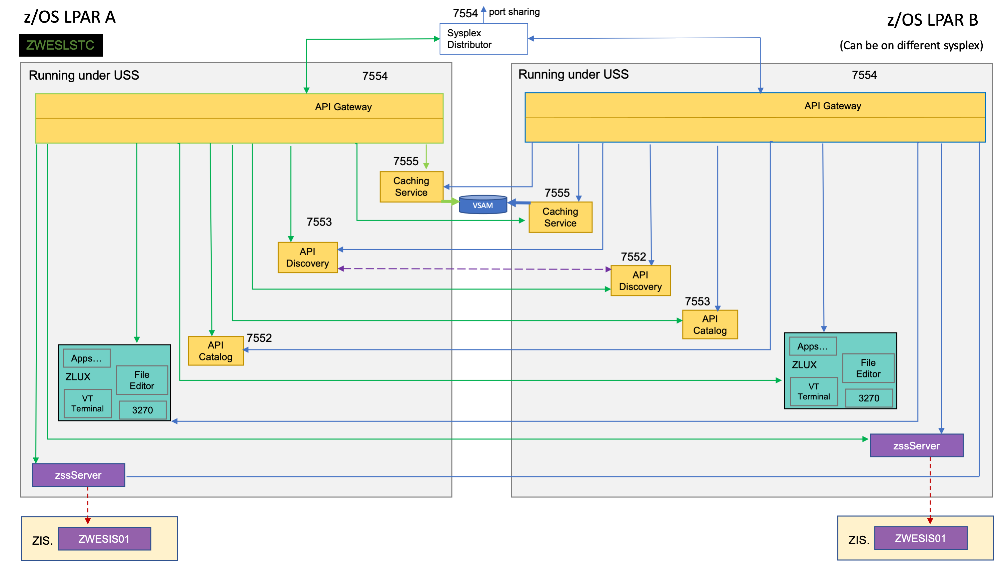

# Zowe architecture

Zowe&trade; is a collection of components that together form a framework that allows Z-based functionality to be accessible across an organization. This includes exposing Z-based components such as z/OSMF as Rest APIs. The framework provides an environment where other components can be included and exposed to a broader non-Z based audience.

The following diagram depicts the high-level Zowe architecture.

The diagram shows the default port numbers that are used by Zowe.  These are dependent on each instance of Zowe and are held in the Zowe instance directory configuration file `instance.env`. For more information, see [Creating and configuring the Zowe instance directory](../user-guide/configure-instance-directory.md).

Zowe components can be categorized by location: server or client. While the client is always an end user tool such as a PC, browser or mobile device, the server components can be further categorized by what machine they run on.

Zowe server components can be installed and run entirely on z/OS, but a subset of the components can alternatively run on Linux or z/Linux via Docker. While on z/OS, many of these components run under Unix System Services (USS). The ones that do not run under USS must remain on z/OS when using Docker in order to provide connectivity to the mainframe.

## Zowe architecture with high availability enablement on Sysplex

<Badge text="Technical Preview"/> The Zowe high availability enablement on Sysplex is a technical preview. 

The following diagram depicts the difference in locations of Zowe components when deploying Zowe into Sysplex with high availability enabled as opposed to running all components on a single z/OS system.  

To enable high availability for Zowe, the `ZWESLSTC` started task is used instead of using `ZWESVSTC`. Also, the configuration details are held in a `zowe.yaml` configuration file instead of `instance.env`. `zowe.yaml` contains settings for each high availability instance that the launcher starts. 

The diagram above shows that `ZWESLSTC` has started two Zowe instances running on two separate LPARs that can be on the same, or different, sysplexes.  
- The Sysplex distributor port sharing enables the API Gateway 7554 ports to be shared so incoming requests can be routed to either the gateway on LPAR A or LPAR B.  
- The discovery servers on each LPAR communicate with each other and share their registered instances, which allows the API gateway on LPAR A to dispatch APIs to components either on its own LPAR, or else to components on LPAR B.  As indicated on the diagram, each component has two input lines: one from the API gateway on its own LPAR and one from the gateway on the other LPAR.  When one of the LPARs goes down, the other LPAR remains operating within the sysplex providing high availability to clients that connect through the shared port irrespective of which Zowe instance is serving the API requests.

The `zowe.yaml` file can be configured to start Zowe instances on more than two LPARS, and also to start more than one Zowe instance on a single LPAR, providing a grid cluster of Zowe components that can meet availability and scalability requirements.  

Each LPAR's configuration entries in `zowe.yaml` control which components will be started. This allows you to start just the desktop and API Mediation Layer on the first LPAR, and start all of the Zowe components on the second LPAR. Because the desktop on the first LPAR is available to the second LPAR's gateway, all desktop traffic will be routed there.  

The caching services for each Zowe instance, whether on the same LPAR or distributed across the sysplex, are connected to each other by the same shared VSMA file.  This allows state sharing so that each instance behaves similarly to the user irrespective of where their request is routed.  

For simplification of the diagram above, the Zowe Explorer API and UI servers are not shown as being started. If you define them to be started in the `zowe.yaml` configuration file, they would behave the same as the servers illustrated. That means, they will register to their API discovery server which will then communicate with other discovery servers on other Zowe instances on either the same or other LPARs. The API traffic received by any API gateway on any Zowe instance will be routed to any of the Zowe Explorer API or UI components that are available.  

To learn more about Zowe with high availability enablement, see [Zowe high availability installation roadmap](../user-guide/install-ha-sysplex.md).

## Zowe architecture when using Docker image

<Badge text="Technical Preview"/> The Zowe Docker build is a technical preview. 

The following diagram depicts the difference in locations of Zowe components when using Docker as opposed to running all components on z/OS.

The components on z/OS run under the Zowe started task `ZWESVSTC`, which has its own user ID `ZWESVUSR` and includes a number of servers each with their own address space.  The `ZWESVSTC` started task has a `STDOUT` file that includes log and trace information for its servers.  Sever error messages are written to `STDERR`. For problem determination, see [Troubleshooting](../troubleshoot/troubleshooting.md).

When Docker is used, server components not running on z/OS instead run in a Linux environment provided via the Docker container technology. The servers run as processes within the container which log to `STDOUT` and `STDERR` of that container, with some components also write to the Zowe instance's log directory.

## App Server

The App Server is a node.js server that is responsible for the Zowe Application Framework. It provides the Zowe desktop, which is accessible through a web browser via port 8544. The Zowe desktop includes a number of applications that run inside the Application Framework such as a 3270 emulator and a File Editor. 

The App Server server logs are written to `<INSTANCE_DIR>/logs/appServer-yyyy-mm-dd-hh-mm.log`.  The Application Framework provides REST APIs for its services that are included on the API catalog tile `Zowe Application Framework` that can be viewed at `https://<ZOWE_HOST_IP>:7554/ui/v1/apicatalog/#/tile/ZLUX/zlux`.

## ZSS

The Zowe desktop delegates a number of its services to the ZSS server which it accesses through the http port 8542.  ZSS is written in C and has native calls to z/OS to provide its services.  ZSS logs are written `STDOUT` and `STDERR` for capture into job logs, but also as a file into `<INSTANCE_DIR>/logs/zssServer-yyyy-mm-dd-hh-mm.log`.  

## API Gateway

The API Gateway is a proxy server that routes requests from clients on its northbound edge, such as web browsers or the Zowe command line interface, to servers on its southbound edge that are able to provide data to serve the request.  It is also responsible for generating the authentication token used to provide single sign-on (SSO) functionality.  The API Gateway homepage is `https://<ZOWE_HOST_IP>:7554`, that after authentication allows you to navigate to the API Catalog. 

## API Catalog

The API Catalog provides a list of the API services that have registered themselves as catalog tiles.  These allow you to view the available APIs from Zowe's southbound servers as well as test REST API calls.  

## API Discovery

The API Discovery server acts as the registration service broker between the API Gateway and its southbound servers.  It can be accessed through the URL `https://<ZOWE_HOST_IP>:7552`.  You can view a list of registered API services on the API discovery homepage. 

## Caching service

The Caching service aims to provide an API which offers the possibility to store, retrieve and delete data associated with keys. The service is used only by internal Zowe applications and will not be exposed to the internet. Its URL is `https://<ZOWE_HOST_IP>:7555`. 
For more information about the Caching service, see its [documentation](../extend/extend-apiml/api-mediation-caching-service.md).

## Caching service

The Caching service aims to provide an API which offers the possibility to store, retrieve and delete data associated with keys. The service is used only by internal Zowe applications and will not be exposed to the internet. Its URL is `https://<ZOWE_HOST_IP>:7555`. 
For more  information about the Caching service, see its [documentation](../extend/extend-apiml/api-mediation-caching-service.md).

## MVS, JES, and USS UI

Zowe provides a number of rich GUI web applications for working with z/OS.  This includes the MVS Explorer for data sets, the JES Explorer for jobs, and the USS Explorer for the Unix File System. You can access them through the Zowe desktop.

### File API and JES API

The File API server provides a set of REST APIs for working with z/OS data sets and Unix files.  These APIs are used by the MVS and USS Explorer apps.  

The JES API server provides a set of REST APIs for working with JES.  These APIs are used by the JES Explorer application.

Both the File API and JES API servers are registered as tiles on the API catalog, so you can view the Swagger definition and test API requests and responses.

## Cross memory server

The Cross memory server is a low-level privileged server for managing mainframe data securely.
For security reasons, it is not an HTTP server. Instead, it has a trust relationship with ZSS. Other Zowe components can work through ZSS in order to handle z/OS data that would otherwise be unavailable or insecure to access from higher-level languages and software.

Unlike all of the servers described above which run under the `ZWESVSTC` started task as address spaces for USS processes, the cross memory server has its own separate started task `ZWESISTC` and its own user ID `ZWESIUSR` that runs the program `ZWESIS01`. 
