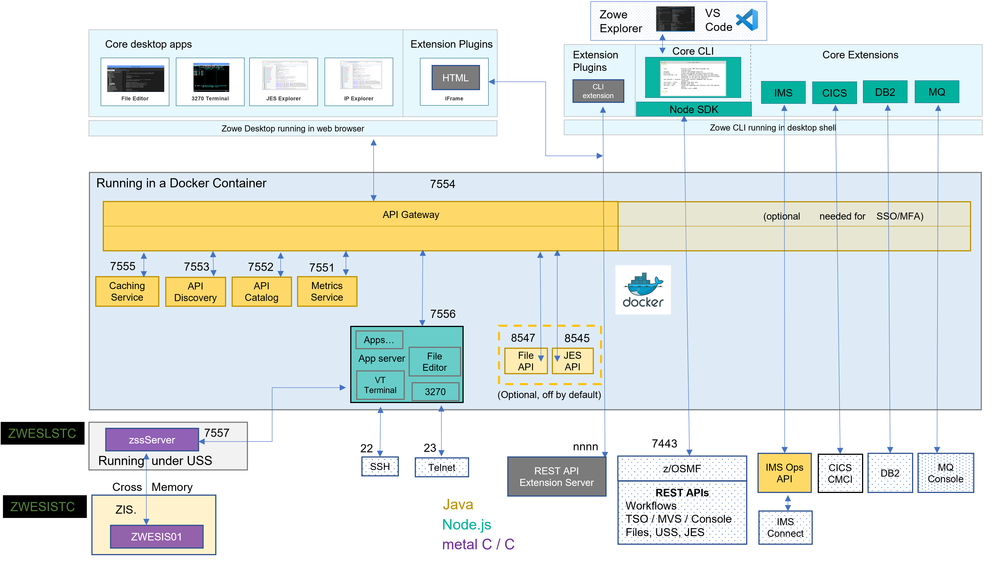
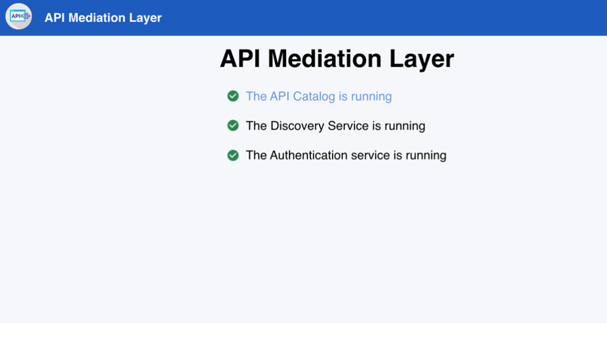
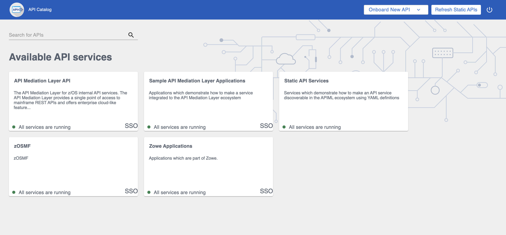

# Zowe architecture

Zowe&trade; is a collection of components that together form a framework that allows Z-based functionality to be accessible across an organization. This includes exposing Z-based components such as z/OSMF as Rest APIs. The framework provides an environment where other components can be included and exposed to a broader non-Z based audience.

The following diagram depicts the high-level Zowe architecture.

 

The diagram shows the default port numbers that are used by Zowe.  These are dependent on each instance of Zowe and are held in the Zowe instance directory configuration file `instance.env`. For more information, see [Creating and configuring the Zowe instance directory](../user-guide/configure-instance-directory.md).

Zowe components can be categorized by location: server or client. While the client is always an end user tool such as a PC, browser or mobile device, the server components can be further categorized by what machine they run on.

Zowe server components can be installed and run entirely on z/OS, but a subset of the components can alternatively run on Linux or z/Linux via Docker. While on z/OS, many of these components run under Unix System Services (USS). The ones that do not run under USS must remain on z/OS when using Docker in order to provide connectivity to the mainframe.

The following diagram depicts the difference in locations of Zowe components when using Docker as opposed to running all components on z/OS.

 

The components on z/OS run under the Zowe started task `ZWESVSTC`, which has its own user ID `ZWESVUSR` and includes a number of servers each with their own address space.  The `ZWESVSTC` started task has a `STDOUT` file that includes log and trace information for its servers.  Sever error messages are written to `STDERR`. For problem determination, see [Troubleshooting](../troubleshoot/troubleshooting.md).

When Docker is used, server components not running on z/OS instead run in a Linux environment provided via the Docker container technology. The servers run as processes within the container which log to `STDOUT` and `STDERR` of that container, with some components also write to the Zowe instance's log directory.

## App Server

The App Server is a node.js server that is responsible for the Zowe Application Framework. It provides the Zowe deskto, which is accessible through a web browser via port 8544. The Zowe desktop includes a number of applications that run inside the Application Framework such as a 3270 emulator and a File Editor. 

 

The App Server server logs are written to `<INSTANCE_DIR>/logs/appServer-yyyy-mm-dd-hh-mm.log`.  The Application Framework provides REST APIs for its services that are included on the API catalog tile `Zowe Application Framework` that can be viewed at `https://<ZOWE_HOST_IP>:7554/ui/v1/apicatalog/#/tile/ZLUX/zlux`.

## ZSS

The Zowe desktop delegates a number of its services to the ZSS server which it accesses through the http port 8542.  ZSS is written in C and has native calls to z/OS to provide its services.  ZSS logs are written `STDOUT` and `STDERR` for capture into job logs, but also as a file into `<INSTANCE_DIR>/logs/zssServer-yyyy-mm-dd-hh-mm.log`.  

## API Gateway

The API Gateway is a proxy server that routes requests from clients on its northbound edge, such as web browsers or the Zowe command line interface, to servers on its southbound edge that are able to provide data to serve the request.  It is also responsible for generating the authentication token used to provide single sign-on (SSO) functionality.  The API Gateway homepage is `https://<ZOWE_HOST_IP>:7554`, that after authentication allows you to navigate to the API Catalog. 

 

## API Catalog

The API Catalog provides a list of the API services that have registered themselves as catalog tiles.  These allow you to view the available APIs from Zowe's southbound servers as well as test REST API calls.  

 

## API Discovery

The API Discovery server acts as the registration service broker between the API Gateway and its southbound servers.  It can be accessed through the URL `https://<ZOWE_HOST_IP>:7552`.  You can view a list of registered API services on the API discovery homepage. 

 

## MVS, JES, and USS UI

Zowe provides a number of rich GUI web applications for working with z/OS.  This includes the MVS Explorer for data sets, the JES Explorer for jobs, and the USS Explorer for the Unix File System. You can access them through the Zowe desktop.

 

### File API and JES API

The File API server provides a set of REST APIs for working with z/OS data sets and Unix files.  These APIs are used by the MVS and USS Explorer apps.  

The JES API server provides a set of REST APIs for working with JES.  These APIs are used by the JES Explorer application.

Both the File API and JES API servers are registered as tiles on the API catalog, so you can view the Swagger definition and test API requests and responses.

## Cross memory server

The Cross memory server is a low-level privleged server for managing mainframe data securely.
For security reasons, it is not an HTTP server. Instead, it has a trust relationship with ZSS. Other Zowe components can work through ZSS in order to handle z/OS data that would otherwise be unavailable or insecure to access from higher-level languages and software.

Unlike all of the servers described above which run under the `ZWESVSTC` started task as address spaces for USS processes, the cross memory server has its own separate started task `ZWESISTC` and its own user ID `ZWESIUSR` that runs the program `ZWESIS01`. 