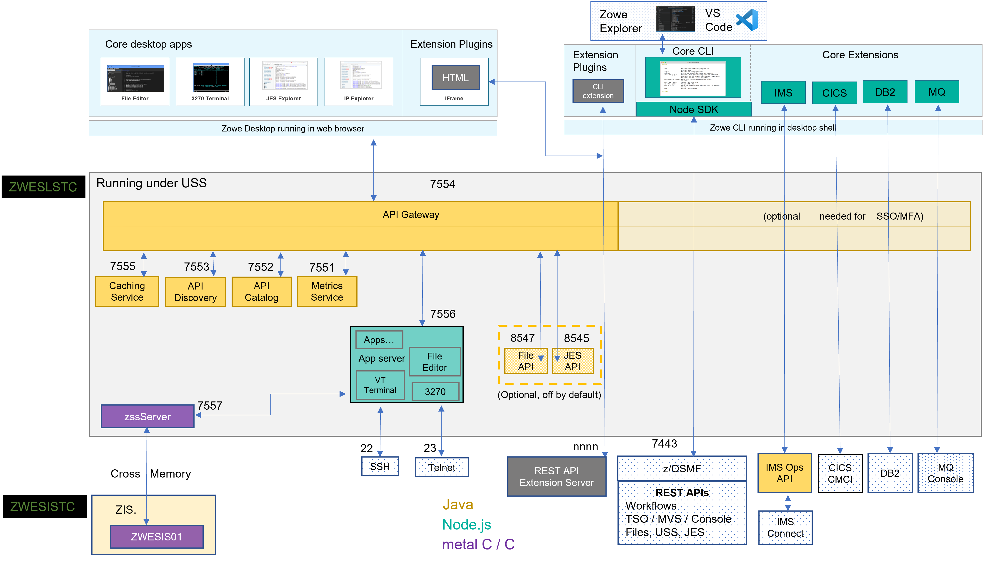

# Zowe architecture

Zowe is a collection of components that together form a framework that allows Z based functionality to be accessible across an organization. This includes exposing Z based components such as z/OSMF as Rest APIs. The framework provides an environment where other components can be included and exposed to a broader non-Z based audience.

The following diagram depicts the high level Zowe architecture.

