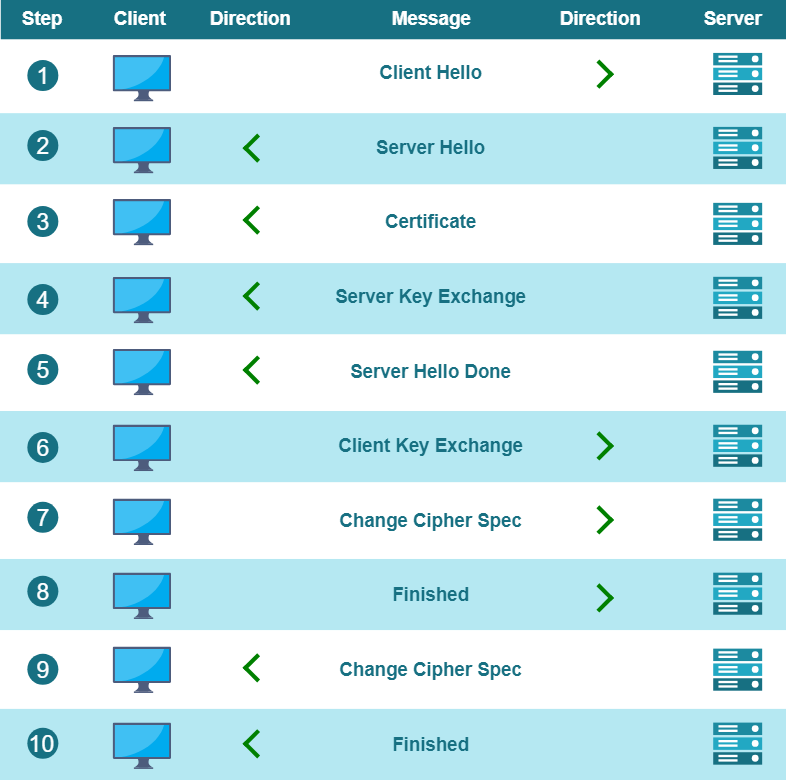

# Zowe Certificates overview

Read the following sections to learn about the key concepts of the digital certificates-based security and how Zowe implements that concepts.

- [Digital certificates definition](#digital-certificates-definition)
- [Digital certificates usage](#digital-certificates-usage)
- [PKI (Public Key Infrastructure)](#public-key-infrastructure)
- [Transport Layer Security (TLS)](#transport-layer-security)
- [Digital certificates types](#digital-certificates-types)
- [Certificates storage](#certificates-storage)

## Digital certificates definition
A Digital Certificate is an electronic file that is tied to a cryptographic (public and private) key pair and authenticates the identity of a website, individual, organization, user, device, or server.
The current de-facto standard is the x.509 family type of certificates, which are the foundation behind [Public Key Infrastructure (PKI)](#public-key-infrastructure) security.

An X.509 certificate binds an identity to a public key using a digital signature.
A certificate contains an identity (a hostname, or an organization, or an individual), and a public key (RSA, DSA, ECDSA, ed25519, etc.).

A certificate can be self-signed or issued by a Certificate Authority (CA). A CA is an organization which provides infrastructure for creation, validation and revocation of the certificates according to the contemporary security standards.

**Note:** In some cases, such as for testing purposes of Zowe, it is acceptable to use certificates issued and signed either by a company local CA, or even self-signed certificates issued by Zowe security tools specific for the target technology platform.
This is, however, not recommended for production environments.

## Digital certificates usage

Digital certificates according to the x.509 standard specification are the cornerstone for securing communication channels between clients and servers.

X.509 Digital certificates are primarly used to implement the following functions:
- Verification of the identity of a sender/receiver of an electronic message during TLS handshake
- Encryption/Decryption of the messages between the sender and the receiver
- Identification of client-service users

Zowe uses digital certificates as a foundational element of both communication and identity security.
Additionally, Zowe provides client identity validation functionality based on the ownership of the provided x.509 client certificate and the mainframe security authentication mechanism.

For more information about using certificates in Zowe, see [Use certificates](../user-guide/use-certificates) in hte User Guide section of Zowe docs.

For more information about the various options for configuring your certificate for use in Zowe, see [Zowe certificate configuration overview](../user-guide/configure-certificates.md) article in the Zowe User Guide documentation.

## Public key infrastructure
[Public Key Infrastructure (PKI)](https://en.wikipedia.org/wiki/Public_key_infrastructure) is a key aspect of internet security. PKI is both the technology and processes that make up the framework for encryption to protect and authenticate digital communications.
PKI includes software, hardware, policies, and procedures that are used to create, distribute, manage, store, and revoke digital certificates and manage public-key encryption.

Visit the following external link, to learn [How Does PKI Works](https://www.keyfactor.com/education-center/what-is-pki/#section2).

Visit the following link to learn more about PKI in the context of [z/OS Cryptographic Services](https://www.ibm.com/docs/en/zos/2.3.0?topic=planning-introducing-pki-services).

## Transport Layer Security
[Transport Layer Security (TLS)](https://en.wikipedia.org/wiki/Transport_Layer_Security) is a networking cryptography protocol that provides authentication, privacy, and data integrity between two communicating computer applications.
TLS is a successor to Secure Socket Layer (SSL), which was deprecated in 2015.

**Note:** Although the transition from SSL 3.0 to TLS 1.0 happened in 1999, it is common that SSL is referred instead of to TLS. Ultimately, it is now common that this technology is referred to as SSL/TLS.

Most importantly, TLS defines a client-server handshake mechanism to establish an encrypted and secure connection, which ensures the authenticity of the communication parties.
During the handshake, the parties negotiate an exchange algorithm, cipher suites and exchange key material to establish a stateful encrypted connection.
The exact steps of the TLS handshake depend on the protocol version/s supported by the client and the server.
The current version is 1.3, while version 1.2 is widely supported and is still more popular than 1.3.

Knowing the key concepts and terms helps to properly set up the network security of Zowe servers and to troubleshoot configuration issues.

Additional concepts that a user should be familiar with, include the following terms:
- Cipher Suite
- Key Exchange
- Symmetric Encryption
- Asymmetric Encryption
- Authentication
- Basic vs mutually-authenticated handshake

The following diagram illustrates the TLS handshake steps:

Zowe does not compromise on security and strictly relies on the Transport Layer Security (TLS) to secure the  communication channels between its components,
as well as between a client application and Zowe server components.

For more information, see the [TLS requirements in Zowe API ML requirements](../extend/extend-apiml/zowe-api-mediation-layer-security-overview#zowe-api-ml-tls-requirements).

**Note:** 
When installed on a mainframe system, Zowe is able to utilize the AT-TLS implementation if supported by the corresponding z/OS version/installation.

## Digital certificates types
We distinguish several aspects of the PKI artifacts and their usage, that influence the categorization and the decision, which certificate type to use.
Some certificates types are specific for a given technology, while others are generic and apply across a wider spectrum of platforms.

Certificates come in various file formats and can be stored in different [certificates storage](#certificates-storage) types.

Digital X.509 certificates can be issued in various file formats such as PEM, DER, PKCS#7 and PKCS#12.
PEM and PKCS#7 formats use Base64 ASCII encoding while DER and PKCS#12 use binary encoding.

In general, the choice of certificates format depends on the technologies used for the implementation of the server components and on the certificate storage type.
For example, Java servers can use JKS and JCEKS keystores, which are platform specific.

Zowe supports the following formats:
* **file-based PKCS12**  
  PKCS12 certificates are the most general and widely deployed certificate format.
* **z/OS keyring-based keystore (JKS/JCEKS)**  
  JKS/JCEKS certificates are specific types of certificates that depend on the Java environment.

**Note:** Java 9 and higher can also work with PKCS12 certificates.

## Certificates storage

There are two options for the storage of certificates:

* Keystore and Truststore Combination
* SAF Keyrings

### Keystore and Truststore

Two key concepts to understand storage and verification of certificates are keystores and truststores.

* **Keystores** are used to store certificates and the verification of these certificates.
* **Truststores** are used for the storage of verification.

Zowe supports keystores and truststores that are either z/OS keyrings (when on z/OS) or PKCS12 files. By default, Zowe reads a PKCS12 keystore from `keystore` directory in zowe.yaml. This directory contains a server certificate, the Zowe generated certificate authority, and a `truststore` which holds intermediate certificates of servers that Zowe communicates with (for example z/OSMF).

* **Keystores**  
  Zowe can use PKCS12 certificates stored in USS to encrypt TLS communication between Zowe clients and Zowe z/OS servers, as well as intra z/OS Zowe server to Zowe server communication. Zowe uses a `keystore` directory to contain its external certificate, and a `truststore` directory to hold the public keys of servers which Zowe communicates with (for example z/OSMF).

* **Truststores**  
  Truststores are essential to provide secure communication with external services. The truststore serves as a secure repository for storing certificates and trust anchors. In the context of Zowe, the truststore establishes the trust relationships with external services as well as manages the relationship between Zowe's components and the certificates presented by the external services.

  In addition to utilizing the intra-address space of certificates, Zowe incorporates external services on z/OS to enhance the encryption of messages transmitted between its servers. These external services, such as z/OSMF or Zowe conformant extensions, have registered themselves with the API Mediation Layer.

  The API Mediation Layer, acting as an intermediary, validates these certificates. When the API ML receives a certificate from an external service, it examines each certificate in the certificate chain and compares it to the certificates in the truststore.

  By leveraging the truststore, Zowe ensures that only trusted and authorized external services can establish communication with its servers.

### SAF Keyring

An alternative to certificate storage with keystores and trustores is to use a SAF Keyring. Use of a SAF Keyring is more secure than PKCS12 files. This SAF keyring method also makes it possible to import an existing certificate or generate new certificates with Top Secret, ACF2, and RACF.

For details about using a SAF Keyring, see the documentation [API ML SAF Keyring](../extend/extend-apiml/certificate-management-in-zowe-apiml.md) in the article **Certificate management in Zowe API Mediation Layer**.
