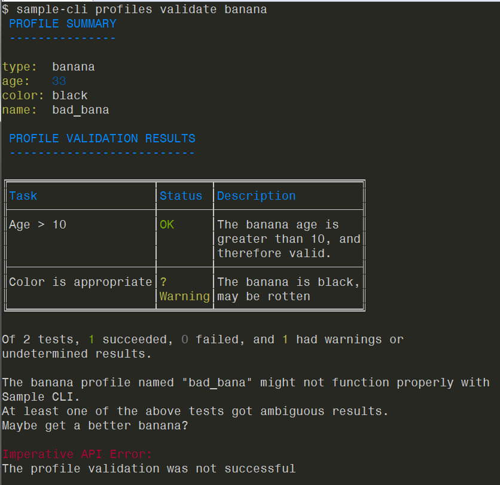

# Working with profiles
Imperative CLI Framework provides application developers with a mechanism to define user profiles. Profiles are simple configuration documents (stored in YAML format) that are intended to persist user configuration properties. A common use case for user profiles is storing multiple sets of connection details (for example, host, port, and credentials) to a remote host (for example, sessions in Putty).

- [Define profiles](#define-profiles)
- [Configure commands to load profiles](#configure-commands-to-load-profiles)
- [Access loaded profiles](#access-loaded-profiles)
- [Access user profiles](#access-user-profiles)
- [Configure profile dependencies](#configure-profile-dependencies)
- [Using auto-generated profile commands](#using-auto-generated-profile-commands)
- [Validate profiles](#validate-profiles)

**More information:**

For information about how to protect user information in your applications, see [Secure Credential Storage](). In the Secure Credential Storage article, we describe how you can use [keytar]() (Keychain Manager) to implement security, how the [default security implementation]() works, and how you can use a [custom credential manager]() to secure the user profiles for your applications.

## Define profiles
To define profiles to your Imperative-based CLI, you populate the profiles property on your Imperative configuration document. You can define as many profile types as you need.

**Example (configuration):**

```typescript
{
   "profiles": [
       {
           type: "banana",
           schema: {
               type: "object",
               title: "The Banana command profile schema",
               description: "The Banana command profile schema",
               properties: {
                   age: {
                       type: "number",
                   },
                   color: {
                       type: "string",
                   },
               },
               required: ["age", "color"],
           },
       }
   ]
}
```


**Example banana profile contents:**
```
age: 15
color: yellow
```
### Type property

The profile type property is a string identifier for the profile and its structure (schema). You use the type property to organize profiles on disk (placed in their respective type directories), build profile commands/options, and indicate the types of profiles that should be loaded for a command.

### Schema property

The schema document describes the structure of the respective profile type. The profile schema follows the JSON Schema standard. You use the schema when saving, loading, and validating profiles to help ensure that the contents of a profile conforms to its type requirements.

**More information:**
- For an in-depth look at schema, see [JSON Schema](),

## Configure commands to load profiles
After you define the profile types on your configuration document, you specify the profile type (or types) that you want the command to load in the profiles property in the command definition document.

By default, when you specify a profile that your command uses, the framework automatically adds options that let you specify which profile of that type you want to use (unless the command definition requests that the option be suppressed). The options are in the form --<type>-profile.

**Example Command:**

```typescript
{
    "definitionTree": {
        "name": "fruit",
        "description": "Work with fruits", 
        "type": "group",
        "children": [
            {
                "name"   : "eat",
                "type"   : "command",
                "handler": "/handlers/eat",
                "profile": {
                  "required": ["banana"],
                  "optional": ["strawberry"],
                  "suppressOptions": []
                }
            }
        ]
    }
}
```

### Required property

An array of required profile types. Required implies that a command will fail (before invoking the handler) if no profile of the required type (or types) are available.

### Optional property

An array of optional profile types. Optional implies that a command can proceed (the handler will be in invoked) if a profile of the optional type (or types) is not available.

### Suppress options property
An array of profile types for which Imperative will NOT auto-generate command options.

## Access loaded profiles

After the framework loads the required/optional profiles for a command, the framework passes the profiles to the command handler on the handler parameters object. You can get the loaded profiles by type using `params.profiles.get()`.

**Example:**
You issue the following command: `fruit eat --banana-profile tasty`

**Example Handler:**
```typescript
export default class Handler implements ICommandHandler {
    public async process(params: IHandlerParameters): Promise<void> {
        const banana = params.profiles.get("banana");
        params.response.console.log(banana.name);
    }
}
```

The handler prints `tasty` to the console/terminal.

## Access user profiles
Outside of a CLI (from a client app or IDE/Editor extension), you may want to access the users profiles. You can access the user's profiles using the [Basic Profile Manager](URL).

**Example Profile Load:**

The following example illustrates the instantiation of the Basic Profile Manager (BasicProfileManager.ts). You must supply the directory of the plug-ins profiles and a type.

**Note:** The example assumes that the users `Fruit-CLI` profiles are stored in their home directory (the framework automatically generates the hidden profile directory and the `/profiles/` directory).

```typescript
const tastyProfile = await new BasicProfileManager({
    profileRootDirectory: require("os").homedir() + "/.fruit-cli/profiles/",
    type: "banana"
}).load({name: "tasty"});
```

## Configure profile dependencies

You can configure a profile `type` to be dependent on another profile type (or types).

**Example:**

The following example illustrates a profile `type` configuration with the `dependencies` property. In this example, a profile of type `bunch` requires that a dependency be listed for a `banana` profile and can optionally specify a dependency of type `strawberry`.

```typescript
{
    type: "bunch",
    schema: {
        type: "object",
        title: "The fruit bunch",
        description: "The fruit bunch schema",
        properties: {
        },
        required: [],
    },
    dependencies: [{
        type: "banana",
        required: true
    }, {
        type: "strawberry",
        required: false
    }]
}
```
**Example Contents:**

```typescript
dependencies:
    -
        type: banana
        name: tasty
    -
        type: strawberry
        name: ripe
```

Dependencies load automatically when the profile that contains the `dependencies` property is loaded.

## Using auto-generated profile commands

Unless explicitly disabled, the framework generates a set of profile management commands automatically. You can disable auto-generated profile commands by specifying `autoGenerateProfileCommands: false` in your Imperative configuration.

For each type of profile defined in your Imperative configuration, one of each of the below types of commands will be generated. For example, when you define the profile types `strawberry` and `banana`, a profiles create strawberry-profile command and a profiles create banana-profile command will be generated for you.

For example, when you issue the following command:
```
sample-cli profiles --help  (***should this be zowe-cli***????)
````

The following help content displays:

```typescript
sample-cli profiles -h

 DESCRIPTION
 -----------

   Create and manage configuration profiles

 USAGE
 -----

   bright profiles [group]

 GROUPS
 ------

   create | cre      Create new configuration profiles.
   delete | rm       Delete existing profiles.
   list | ls         List existing profiles.
   set-default | set Set which profiles are loaded by default.
   update | upd      Update existing profiles
   validate | val    Test the validity of a profile

 GLOBAL OPTIONS
 --------------

   --response-format-json  | --rfj (flag) (optional)

      Produce the command response as a JSON document

   --help  | -h (flag) (optional)

      Display help text

```
### Auto-generated create profile command

The user of your CLI uses these commands to create new profiles. In the schema property of your profile configuration, you can specify an `optionDefinition` field for properties that you would like to be exposed. For most simple profiles, options specified by the user can be automatically mapped to fields in the resulting profile fields.

**Example schema:**
```typescript
    {
        type: "strawberry",
        schema: {
            type: "object",
            title: "The strawberry command profile schema",
            description: "The strawberry command profile schema",
            properties: {
                age: {
                    optionDefinition: {
                        description: "Amount of strawberries",
                        type: "number",
                        name: "amount", aliases: ["a"],
                        required: true
                    },
                    type: "number",
                },
                ripe: {
                    optionDefinition: {
                        description: "The strawberries are ripe",
                        type: "boolean",
                        name: "ripe", aliases: ["c"],
                        required: true,
                    },
                    type: "boolean",
                },
            },
            required: ["age", "ripe"],
        }
    }
```

If you specify `optionDefinitions` instead of `optionDefinition` to map multiple option definitions to a single profile field, or if you need to transform the options provided by the user, you need to specify a `createProfileFromArgumentsHandler` in your profile configuration. The handler is the same type as any other command handler for your CLI, but it should output the completed profile object by calling `commandParameters.response.data.setObj(yourNewProfile)`. When you implement a `createProfileFromArgumentsHandler`, the resulting profile will still be automatically written to the user's disk.

**Example:**

Issue the following commands:

```
sample-cli profiles create --help`
sample-cli profiles create banana-profile old-banana --age 100000`
```
Results:
```
sample-cli profiles create banana-profile old-banana --age 10000
Profile created successfully!  Path:
C:\Users\<username>\.sample-cli\profiles\banana\old-banana.yaml
type:  banana
name:  old-banana
age:   10000
color: yellow

Review the created profile and edit if necessary using the profile update command.
```

**Example:**

`createProfileFromArgumentsHandler` specification:
```typescript
  profiles: [ 
    { 
     type: "banana",
     createProfileFromArgumentsHandler: "lib/profiles/CreateBananaProfileHandler"
     // ... 
    }]
```
### Auto-generated List Profiles Command

The `profiles list` commands list profiles that the user created. They can also display the contents of each profile if the –show-contents option is specified.

Issue the following commands:

```
sample-cli profiles list --help
sample-cli profiles list banana-profiles
```
Results:
```
sample-cli profiles list banana-profiles
bad_bana (default)
old-banana
```

### Auto-generated delete profiles command
The following commands let you delete existing profiles.

```
sample-cli profiles delete --help
sample-cli profiles delete banana-profile old-banana
```
Results:
```
sample-cli profiles delete banana old-banana
Profile "old-banana" of type "banana" successfully deleted.
```

### Auto-generated Update Profile Command

The following commands let users update particular fields of their existing profiles.

Similar to the `profiles create` command, you can specify a custom `updateProfileFromArgumentsHandler` on your profile configuration when you need special logic for updating the profile. Otherwise, the contents of the new and old profiles will automatically be merged together, with the new profile fields taking precedence over the old ones in case of conflict.

**Example:** 
Issue the following commands:
```
sample-cli profiles update --help
sample-cli profiles update banana-profile old-banana --color blue
```
Results: 
```
sample-cli profiles update banana-profile old-banana --color blue
Overwrote existing profile for .
Profile created successfully!  Path:
C:\Users\<username>\.sample-cli\profiles\banana\old-banana.yaml

type:  banana
name:  old-banana
age:   10000
color: yellow

Review the created profile and edit if necessary using the profile update command.
```

Example `updateProfileFromArgumentsHandler` specification:
```
  profiles: [ 
    { 
     type: "banana",
     updateProfileFromArgumentsHandler: "lib/profiles/UpdateBananaProfileHandler"
     // ... 
    }]
```
### Auto-generated validate profile command
The following commands let users check the validity of their existing profiles. For more information, see Profile Validation below.
```
sample-cli profiles validate --help
sample-cli profiles validate banana-profile old-banana
```

## Validate profiles

The Imperative CLI Framework contains profile validation infrastructure that lets you (command line developers and users) test the profiles that you create. You can use the infrastructure (for example) after you use the auto-generated profiles commands or your own custom-generated commands to create new configuration profiles.

To use the profile validation infrastructure, build an object that corresponds to the structure of the IProfileValidationPlan interface. The plan contains a list of tasks to perform against the user’s profile to test its validity. Each task, when finished, provides a result (Success, Warning, or Failure), a description of the result, and a list of any associated REST endpoints for the task. Having these specific tasks can make it easier for you to safely test credentials, URLS, file paths, and other data that is stored in the profile before the user starts using your CLI.

**Example:**

The following example illustrates how to provide a file name that contains a profile validation plan on your profile configuration:
```typescript
“profiles”: [
     {    
                “type”: “banana”, 
                “validationPlanModule”:   “lib/profiles/banana/ValidationPlan”
```                
As a plug-in developer, When you specify a `validationPlanModule` on the profile configuration, and you also let `profiles` commands generate automatically, a `profiles validate banana-profile` command is generated when you call `Imperative.init()`. Plug-in users can issue the validate profile command to generate a report that contain the results of the tasks listed in the validation plan. Users can use the report to correct any problems with their profile and run the validation again to confirm the changes.



Users can also issue the command with the --print-plan-only option to generate a table that details which tasks are contained in the plan without actually executing them.