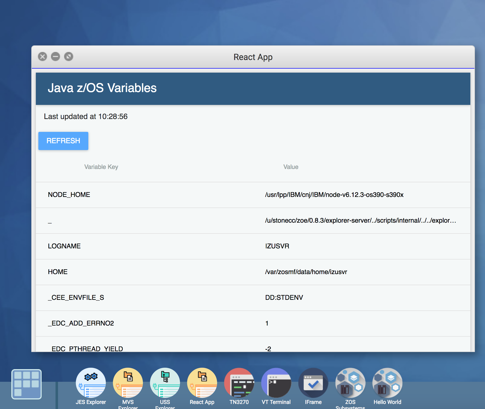

# Creating a Zowe integrated ReactJS UI

One of the great things about working with Zowe is that you can include any UI's that you have already developed in your Zowe Virtual Desktop. In this blog we look at how we do this and also show how to take advantage of a Restful API created on a JEE server within the Zowe environment.

Take a look at the [Creating a RestAPI with Swagger documentation using Liberty](https://zowe.github.io/docs-site/guides/libertyAPI.html) tutorial for the background to the Restful API with Swagger documentation we will be using.

The sample app can be downloaded from [TODO](https://github.ibm.com/ZoeExtenders/webui-scenarios/tree/master/basic-react) overview
