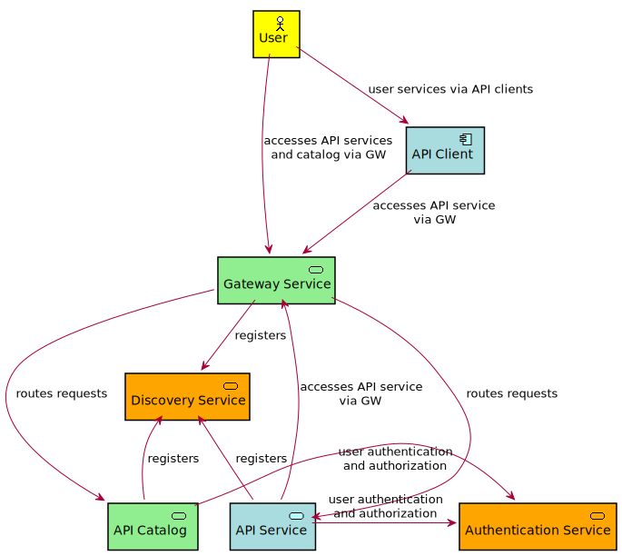

# Zowe API Mediation Layer Security

- [Introduction and requirements](#introduction-and-requirements)
  - [Transport-level Security](#transport-level-security)
  - [Authentication](#authentication)
  - [Authorization](#authorization)
  - [Types of services](#types-of-services)
  - [Transport Security Requirements](#transport-security-requirements)
  - [Authentication](#authentication-1)
  - [Truststores and keystores](#truststores-and-keystores)
  - [Client Certificates](#client-certificates)
  - [Authentication to the Discovery Service](#authentication-to-the-discovery-service)
- [Certificate Management in Zowe API Mediation Layer](#certificate-management-in-zowe-api-mediation-layer)
  - [Running on localhost](#running-on-localhost)
    - [How to start APIML on localhost with full HTTPS](#how-to-start-apiml-on-localhost-with-full-https)
    - [Certificate management script](#certificate-management-script)
    - [Generating own certificates for localhost](#generating-own-certificates-for-localhost)
    - [Generating certificate for a new service on localhost](#generating-certificate-for-a-new-service-on-localhost)
    - [Add a service with an existing certificate to APIML on localhost](#add-a-service-with-an-existing-certificate-to-apiml-on-localhost)
    - [Login to Discovery service on localhost](#login-to-discovery-service-on-localhost)
  - [Zowe runtime on z/OS](#zowe-runtime-on-zos)
    - [Certificates for z/OS installation from the Zowe PAX file](#certificates-for-zos-installation-from-the-zowe-pax-file)
    - [Import the local CA certificate to your browser](#import-the-local-ca-certificate-to-your-browser)
    - [Generating keystore and truststore for a new service on z/OS](#generating-keystore-and-truststore-for-a-new-service-on-zos)
    - [Add a service with an existing certificate to APIML on z/OS](#add-a-service-with-an-existing-certificate-to-apiml-on-zos)
      - [What happens if the service is not trusted](#what-happens-if-the-service-is-not-trusted)
    - [Trust z/OSMF certificate](#trust-zosmf-certificate)
    - [Disabling certificate validation](#disabling-certificate-validation)
    - [Use an existing server certificate for API Mediation Layer](#use-an-existing-server-certificate-for-api-mediation-layer)

## Introduction and requirements

The security of the APIML is performed on several levels and are described in following sections.

### Transport-level Security

Data needs to be secured during transport. This is achieved by using the TLS protocol for all connections to APIML services. While disabling the TLS protocol is permitted (e.g. for debugging purposes), the default mode is to have it on.

### Authentication

Authentication is a way how an entity, whether it be a user (API Client) or an application (API Service), proves its true identity.  

APIML uses two authentication methods:
- user ID and password (and authentication tokens retrieved by using the user ID and password) 
    - These requests originate from a user.
    - The user ID and password are validated by a z/OS security manager and
    a token is issued that is then used to access the API service.
- TLS client certificates
    - These certificates are for service-only requests.

In the future, we would like APIML to support client certificates to access the gateway.

### Authorization

Authorization is a method used to determine access rights of an entity.

In the APIML, the authorization is done by the z/OS security manager ([CA ACF2](https://www.ca.com/us/products/ca-acf2.html), [IBM RACF](https://www.ibm.com/support/knowledgecenter/zosbasics/com.ibm.zos.zsecurity/zsecc_042.htm), [CA Top Secret](https://www.ca.com/us/products/ca-top-secret.html)). The authentication token is used as proof of valid authentication. The authorization checks, however, are always done by the z/OS security manager.

### Types of services

- Zowe Core services:

    - Zowe APIML services:
    
        - Gateway Service (GW)
            - The access point for API clients that need to access API services
            - API Services can be accessed via the gateway by API Clients
            - Gets information about an API Service from the Discovery Service
        
        - Discovery Service (DS)
            - Collects information about API Services and provides it to the Gateway Service and other services
            - API Mediation services are also registered to the Discovery Service
        
        - API Catalog (AC)
            - Displays information about API services in a web UI
            - Gets information about an API Service from the Discovery Service

        - Authentication and Authorization Service (AAS) 
            - Provides authentication and authorization functionality to check access of users to resources on z/OS
            - Security service is not provided as an individual microservice but is included to the Gateway Service
            - For more details, see: [APIML wiki](https://github.com/gizafoundation/api-layer/wiki/Zowe-Authentication-and-Authorization-Service)

    - Non-APIML Zowe Core services (zLUX, Atlas)

        - They are like other regular API Client and Service described below

- API Clients
    - API Clients are external applications, users, or other API services that are accessing API services via the API Gateway
  
- API Services 
    - API Services are applications that want to be accessed via the API Gateway
    - They register themselves to the Discovery Service
    - API Services can always access other services via the API Gateway
    - API Services can sometimes access other services without the API Gateway (if they are installed in such a way that direct access is possible)
    - API Services can also be API Clients (when they access other services)

The following diagram illustrates basic relationships between services:

### Transport Security Requirements

Servers ae required to provide HTTPS ports.

The requirements for the services are the following:

- API Client
    - Is not a server
    - Needs to trust the API Gateway
    - Has a truststore that contains certificate(s) needed to trust the API Gateway

- Gateway Service
    - Provides an HTTPS port
    - Has a keystore with a server certificate
        - The certificate needs to be trusted by API Clients
        - This certificate should be trusted by web browsers because the API Gateway can be used to display web UIs
    - Has a truststore that contains certificates needed to trust API Services

- API Catalog
    - Provides an HTTPS port
    - Has a keystore with a server certificate
        - The certificate needs to be trusted by the API Gateway
        - This certificate does not need to be trusted by anyone else

- Discovery Service
    - Provides an HTTPS port
    - Has a keystore with a server certificate
        - The certificate needs to be trusted by API Clients
    - Has a truststore that contains certificates needed to trust API Services

- API Service
    - Provides an HTTPS port
    - Has a keystore with a server and client certificate
        - The server certificate needs to be trusted by GW
        - The client certificate needs to be trusted by DS
        - The client and server certificates can be the same
        - These certificates do not need to be trusted by anyone else
    - Has a truststore that contains certificate(s) needed to trust the API Gateway and Discovery Service
  

### Authentication

- API Gateway

    - API Gateway currently does not handle authentication. Requests are sent to the API services that need to handle authentication

- API Catalog

    - API Catalog is accessed by users and it needs to be protected by a login
    - This is done via Authentication and Authorization Service

- Discovery Service

    - Discovery Service is accessed by API Services
    - This access (reading information and registration) needs to be protected by a client certificate
    - Access can be granted to users (administrators) - optional

- API Services

    - It is up to the service
    - It should be using Authentication and Authorization Service for authentication

### Truststores and keystores

A _keystore_ is a repository of security certificates consisting of either authorization certificates or public key certificates with corresponding private keys, used in TLS encryption. A _keystore_ can be stored in Java specific format (JKS) or use the standard format (PKCS12). The Zowe APIML uses PKCS12 to enable the keystores to be used
by other technologies used in Zowe (Node.js).

The APIML local CA:

- Contains local CA certificate and its private key (needs to be store securely)
- It is used to sign certificates of services
- Its certificate is trusted by API services and clients

The APIML keystore:

- server certificate of GW (with PK) - can be signed by local CA or external CA
- server certificate of DS (with PK) - can be signed by local CA
- server certificate of AC (with PK) - can be signed by local CA
- used by APIML services

The APIML truststore:

- contains local CA public certificate
- contains external CA public certificate (optional)
- can contain self-signed certificates of API Services that are not signed by local or external CA
- used by APIML services

Zowe Core services:

- they can use the same keystore and truststore as APIML for simpler installation and management
- or they can have individual stores for higher security

API service keystore (for each service)

- contains server and client certificate signed by local CA
  
API service truststore (for each service)  

- contains local CA and external CA certificates (optional)

### Client Certificates

A client certificate is a certificate that is used for validation of the HTTPS client.

The client certificate of a Discovery Service client can be the same certificate as the server certificate of the services which the Discovery Service client.

### Authentication to the Discovery Service

The Discovery Service has two types of users that need to authenticate:

1. Administrators and developers who need to login to the homepage of the Discovery Service
   
   - These users need to provide valid user ID and password (currently pre-configured user ID and password, it will be replaced by mainframe security in https://waffle.io/zowe/api-layer/cards/5bd8be8131cd76001dcddd77)

2. Services that need to register to the Discovery Service

    - These are not users that have user ID and password but other services 
    - They authenticate using client certificate. The client certificate is the same TLS certificate that the service uses for HTTPS communication

## Certificate Management in Zowe API Mediation Layer

### Running on localhost

#### How to start APIML on localhost with full HTTPS

The https://github.com/zowe/api-layer repository already contains pre-generated certificates that can be used to start APIML with HTTPS on your computer. The certificates are not trusted by your browser so can either ignore security warning or generate your own certificates and add them to the truststore of your browser or system.

The certificates are described in more detail in the https://github.com/zowe/api-layer/blob/https-local-certmgmt-%2372/keystore/README.md.

#### Certificate management script

Zowe API Mediation layer provides a script that can used on Windows, Mac, Linux, and z/OS
to generate the certificate and keystore for the local CA, API Mediation Layer, and services.

It is stored in [scripts/apiml_cm.sh](https://github.com/zowe/api-layer/blob/master/scripts/apiml_cm.sh).
It is a UNIX shell script that can be executed by Bash or z/OS Shell. For Windows, you need to install Bash, for example by using [cmder](http://cmder.net/).

#### Generating own certificates for localhost

Use the following script in the root of the `api-layer` repository:

    scripts/apiml_cm.sh --action setup

This creates the certificates and keystore for the API Mediation Layer in your current workspace.

#### Generating certificate for a new service on localhost

The instructions are described at:
https://github.com/zowe/api-layer/blob/master/keystore/README.md#generating-certificate-for-a-new-service-on-localhost

#### Add a service with an existing certificate to APIML on localhost

This will be documented during work on the following user story: https://waffle.io/zowe/api-layer/cards/5bd8be80283e09001babbf86

#### Login to Discovery service on localhost

You need to provide a valid client certificate if you want to access Discovery Service on localhost.

The certificate is stored in the `keystore/localhost/localhost.keystore.p12` keystore.

Some utilities including HTTPie requires the certificate to be in PEM format. You can find it in `keystore/localhost/localhost.pem`.

Since the Discovery Service is using HTTPS, your client has also verify the validity of its certificate. This can be done by trusting the local CA certificate which is store at `keystore/local_ca/localca.cer`.

Example how to access Discovery Service from CLI with full certificate validation:

    http --cert=keystore/localhost/localhost.pem --verify=keystore/local_ca/localca.cer -j GET https://localhost:10011/eureka/apps/

### Zowe runtime on z/OS

#### Certificates for z/OS installation from the Zowe PAX file

When you install the Zowe runtime on z/OS from the PAX file following the instructions in [Installing the Zowe runtime on z/OS](https://zowe.github.io/docs-site/latest/user-guide/install-zos.html), the certificates for the APIML local CA and APIML service are automatically generated.

They are generated by the certificate management script `apiml_cm.sh` that is installed to `$ZOWE_ROOT_DIR/api-mediation/scripts/apiml_cm.sh`.    

`$ZOWE_ROOT_DIR` is the directory where you installed the Zowe runtime.

The certificates are generated to the directory `$ZOWE_ROOT_DIR/api-mediation/keystore`.

APIML keystore and truststore:

  * `$ZOWE_ROOT_DIR/api-mediation/keystore/local/localhost.keystore.p12` 
    - used for the HTTPS servers
    - contains the APIML server certificate signed by the local CA and private key for the server
    
  * `$ZOWE_ROOT_DIR/api-mediation/keystore/local/localhost.truststore.p12` 
    - use to validate trust when communicating with the services that are registered to the APIML
    - contains the root certificate of the local CA (not the server certificate)
    - contains the local CA public certificate
    - can contain additional certificate to trust services that are not signed by local CA

APIML key and truststores needs be accessible by the user ID that executes the Zowe runtime.

Local CA:

  * `$ZOWE_ROOT_DIR/api-mediation/keystoree/local_ca/localca.cer`
    - public certificate of local CA
  
  * `$ZOWE_ROOT_DIR/api-mediation/keystore/local_ca/localca.keystore.p12`
    - private key of the local CA 

Local CA keystore can be accessible only by the user that is installing and managing the Zowe runtime. 

#### Import the local CA certificate to your browser

The local CA certificate is not trusted outside of the API Mediation Layer by default.
You need to add it to the truststore of the REST API clients and to your browser.

The public certificate in the [PEM format](https://en.wikipedia.org/wiki/Privacy-Enhanced_Mail) is stored at `$ZOWE_ROOT_DIR/api-mediation/keystore/local_ca/localca.cer` where `$ZOWE_ROOT_DIR`  is the directory that was used for the Zowe runtime during installation.

It is stored in UTF-8 encoding so you need to transfer it as a binary file. Since this is certificate that your browser is going to trust, it is recommended to use a secure connection for transfer.

The recommended method is to use [Zowe CLI](https://github.com/zowe/zowe-cli#zowe-cli--):

    zowe zos-files download uss-file --binary $ZOWE_ROOT_DIR/api-mediation/keystore/local_ca/localca.cer

Alternatively, you can use `sftp`:

    sftp <system>
    get $ZOWE_ROOT_DIR/api-mediation/keystore/local_ca/localca.cer

Verify that the file has been transferred correctly. Open it and you should see something like:

    -----BEGIN CERTIFICATE-----
    ...
    -----END CERTIFICATE-----

Then you need to import the certificate to your root certificate store and trust it. 

For **Windows**, you can run the following command:

    certutil -enterprise -f -v -AddStore "Root" localca.cer 
    
You have to open the terminal as administrator. This will install the certificate to the Trusted Root Certification Authorities. 

If you're using **macOS**, you can run the following command: 

    $ sudo security add-trusted-cert -d -r trustRoot -k /Library/Keychains/System.keychain localca.cer 

**Firefox** uses its own certificate truststore. You can manually import your root certificate via the Firefox settings, or force Firefox to use the Windows truststore:

Create a new Javascript file firefox-windows-truststore.js at `C:\Program Files (x86)\Mozilla Firefox\defaults\pref` with the following content:

    /* Enable experimental Windows truststore support */
    pref("security.enterprise_roots.enabled", true);
    

#### Generating keystore and truststore for a new service on z/OS

You can generate keystore and truststore for a new service by calling the `apiml_cm.sh` script in the directory with API Mediation Layer:

    cd $ZOWE_ROOT_DIR/api-mediation
    scripts/apiml_cm.sh --action new-service --service-alias <alias> --service-ext <ext> \
    --service-keystore <keystore_path> --service-truststore <truststore_path> \
    --service-dname <dname> --service-password <password> --service-validity <days> \
    --local-ca-filename $ZOWE_ROOT_DIR/api-mediation/keystore/local_ca/localca 

The `service-alias` is an unique string to identify the key entry. All keystore entries (key and trusted certificate entries) are accessed via unique aliases. Since the keystore will have only one certificate, you can omit this parameter and use the default value `localhost`.

The `service-keystore` is a repository of security certificates plus corresponding private keys. The `<keystore_path>` is the path excluding the extension to the keystore that will be generated. It can be an absolute path or a path relative to the current working directory. The key store is generated in PKCS12 format with `.p12` extension. It should be path in an existing directory where your service expects the keystore. For example: `/opt/myservice/keystore/service.keystore`.

The `service-truststore` contains certificates from other parties that you expect to communicate with, or from Certificate Authorities that you trust to identify other parties. The `<truststore_path>` is the path excluding the extension to the trust store that will be generated. It can be an absolute path or a path relative to the current working directory. The truststore is generated in PKCS12 format.

The `service-ext` specifies the X.509 extension that should be the Subject Alternate Name (SAN). The SAN has contain host names that are used to access the service. You need specify the same hostname that is used by the service during API Mediation Layer registration. For example:

    "SAN=dns:localhost.localdomain,dns:localhost,ip:127.0.0.1"

*Note:* For more details about SAN, see section *SAN or SubjectAlternativeName* at [Java Keytool - Common Options](https://www.ibm.com/support/knowledgecenter/en/SSYKE2_8.0.0/com.ibm.java.security.component.80.doc/security-component/keytoolDocs/commonoptions.html).

The `service-dname` is the X.509 Distinguished Name and is used to identify entities, such as those which are named by the subject and issuer (signer) fields of X.509 certificates. For example:

    "CN=Zowe Service, OU=API Mediation Layer, O=Zowe Sample, L=Prague, S=Prague, C=CZ"

The `service-validity` is the number of days after that the certificate will expire.

The `service-password` is the keystore password. The purpose of the password is the integrity check. The access protection for the keystore and keystore need to be achieved by making them accessible only by the ZOVESVR user ID and the system administrator.

The `local-ca-filename` is the path to the keystore that is used to sign your new certificate with the local CA private key. If you an in the `$ZOWE_RUNTIME/api-mediation-directory`, you can omit this parameter. It should point to the `$ZOWE_ROOT_DIR/api-mediation/keystore/local_ca/localca`.

#### Add a service with an existing certificate to APIML on z/OS

The API Mediation Layer needs to validate the certificate of each service that it accessed by the API Mediation Layer. The API Mediation Layer needs to validate the full certificate chain. It usually means that:

1. You need to import the public certificate of the root CA that has signed the certificate of the service to the APIML truststore.

2. or your service needs to have its own certificate and all intermediate CA certificates (if it was signed by intermediate CA) in its keystore.

    - If the service does not provide intermediate CA certificates to the APIML then the validation fails. This can be circumvented by importing the intermediate CA certificates to the APIML truststore.

You can import a public certificate to the APIML truststore by calling in the directory with API Mediation Layer:

    cd $ZOWE_ROOT_DIR/api-mediation
    scripts/apiml_cm.sh --action trust --certificate <path-to-certificate-in-PEM-format> --alias <alias>

##### What happens if the service is not trusted

If you access a service that is not trusted, for example, by issuing a REST API request to it:

    http --verify=keystore/local_ca/localca.cer GET https://<gatewayHost>:<port></port>/api/v1/<untrustedService>/greeting

You will get a similar response:

    HTTP/1.1 502
    Content-Type: application/json;charset=UTF-8

    {
        "messages": [
            {
                "messageContent": "The certificate of the service accessed by HTTPS using URI '/api/v1/<untrustedService>/greeting' is not trusted by the API Gateway: sun.security.validator.ValidatorException: PKIX path building failed: sun.security.provider.certpath.SunCertPathBuilderException: unable to find valid certification path to requested target",
                "messageKey": "apiml.common.tlsError",
                "messageNumber": "AML0105",
                "messageType": "ERROR"
            }
        ]
    }

The response has HTTP status code [502 Bad Gateway](https://developer.mozilla.org/en-US/docs/Web/HTTP/Status/502) and a JSON response in the standardized format for error messages. The message has key `apiml.common.tlsError` and message number `AML0105` and its content explains details about the message.

If you see this message, you need to import the certificate of your service or the CA that has signed it to the truststore API Mediation Layer as described above.

#### Trust z/OSMF certificate

The Zowe installation script tries to import z/OSMF public certificates to the truststore of API Mediation Layer automatically.

This requires the user ID that is doing the installation to be able to read the z/OSMF keyring.

If it is not possible, you will see following error message:

    ERROR: z/OSMF is not trusted by the API Mediation Layer.

You can add z/OSMF to the truststore manually as a user that have access right to read the z/OSMF keyring or is a superuser.

To find the name of the z/OSMF keyring issue:
 
    cat /var/zosmf/configuration/servers/zosmfServer/bootstrap.properties | grep izu.ssl.key.store.saf.keyring

This will return line like:

    izu.ssl.key.store.saf.keyring=IZUKeyring.IZUDFLT

You need to run following commands as superuser to import z/OSMF certificates:

    su
    cd $ZOWE_RUNTIME/api-mediation
    scripts/apiml_cm.sh --action trust-zosmf --zosmf-keyring IZUKeyring.IZUDFLT --zosmf-userid IZUSVR

If the import is successful, you need to restart Zowe server to make the changes effective.

#### Disabling certificate validation

If you want to try out the Zowe without setting up the certificates, you can disable the validation of the TLS/SSL certificates by the API Mediation layer.

This can be done updating following property:

    -Dapiml.security.verifySslCertificatesOfServices=false

in following shell scripts:

- `$ZOWE_RUNTIME/api-mediation/scripts/api-mediation-start-catalog.sh`
- `$ZOWE_RUNTIME/api-mediation/scripts/api-mediation-start-discovery.sh`
- `$ZOWE_RUNTIME/api-mediation/scripts/api-mediation-start-gateway.sh`
  

#### Use an existing server certificate for API Mediation Layer

This will be documented during work on the following user story: 
https://github.com/zowe/api-layer/issues/91
