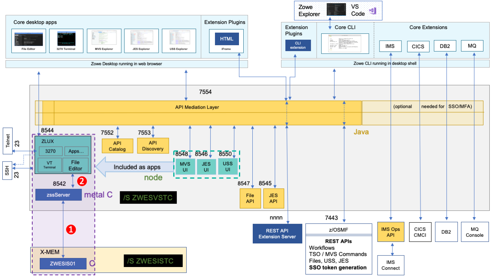

# Troubleshooting Zowe Application Framework

The following topics contain information that can help you troubleshoot problems when you encounter unexpected behavior installing and using Zowe&trade; Application Framework which includes the Zowe Desktop.

Most of the solutions below identify issues by referring to the [Zowe logs](app-mustgather.md). To identify and resolve issues, you should be familiar with their names and locations.

The Zowe Application Framework manages issues in GitHub. When you troubleshoot a problem, you can check whether a GitHub issue (open or closed) that covers the problem already exists. For a list of issues, see the [zlux repo](https://github.com/zowe/zlux/issues).

## Desktop apps fail to load

**Symptom:**

When you open apps in the Zowe desktop, a page is displayed with the message "The plugin failed to load."

**Solution:**

This problem might occur when you use Node.js v8.16.1, which performs auto-encoding in a way that breaks Zowe apps. See [https://github.com/ibmruntimes/node/issues/142](https://github.com/ibmruntimes/node/issues/142) for details.

To solve the problem, use a different version of Node.js v8, such as v8.17.0, or use Node.js v12. You can obtain them from the [Node.js marketplace](https://www.ibm.com/ca-en/marketplace/sdk-nodejs-compiler-zos). Download the `ibm-trial-node-v8.17.0-os390-s390x.pax.Z` file.

## NODEJSAPP disables immediately

**Symptom:**

You receive the message `CEE5207E The signal SIGABRT was received in stderr`. 

**Solution:**

You might have reached the limit for shared message queues on your LPAR. When Node.js applications are terminated by a SIGKILL signal, shared message queues might not be deallocated. For more information, see the **If the NODEJSAPP disables immediately** section in the [Troubleshooting Node.js applications](https://www.ibm.com/support/knowledgecenter/en/SSGMCP_5.5.0/troubleshooting/node/node-troubleshooting.html) topic on IBM Knowledge Center.

## Cannot log in to the Zowe Desktop

**Symptom:**

When you attempt to log in to the Zowe Desktop, you receive the following error message that is displayed beneath the **Username** and **Password** fields. 

```
Authentication failed for 1 types:  Types: ["zss"]
```

**Solution:**

For the Zowe Desktop to work, the node server that runs under the ZWESVSTC started task must be able to make cross memory calls to the ZWESIS01 load module running under the ZWESISTC started task. If this communication fails, you see the authentication error.  

There are two known problems that might cause this error.  The [Zowe architecture diagram](../../getting-started/zowe-architecture.md) shows the following connections. One of these two connections likely failed. 

1. The zssServer connection to the `ZWESISTC` started task using cross memory communication. If this fails, see [zssServer unable to communicate with X-MEM](#zss-server-unable-to-communicate-with-x-mem).  The architecture diagram below has been annotated with a (1) to show this connection.
2. The Zowe Desktop ZLUX server connection to the zssServer across the default port 8542. If this fails, see [ZLUX unable to communicate with zssServer](#zlux-unable-to-communicate-with-zssserver).  The architecture diagram below has been annotated with a (2) to show this connection.  

 

### ZSS server unable to communicate with X-MEM

- Open the log file `$INSTANCE_DIR/logs/zssServer-yyyy-mm-dd-hh-ss.log`.  This file is created each time ZWESVSTC is started and only the last five files are kept.  

- Look for the message that starts with `ZIS status`.  

   - If the communication works, the message includes `Ok`. For example:

     ```
     ZIS status - Ok (name='ZWESIS_STD      ', cmsRC=0, description='Ok'
     ```
   
     If the communication works, the problem is likely that the ZLUX server is unable to communicate to the zssServer. For more information, see [ZLUX unable to communicate with zssServer](#zlux-unable-to-communicate-with-zssserver).

   - If the communication is not working, the message includes `Failure`. For example:

     ```
     ZIS status - Failure (name='ZWESIS_STD      ', cmsRC=39, description='Cross-memory call ABENDed'
     ```
     or
     ```
     ZIS status - Failure (name='ZWESIS_STD      ', cmsRC=64, description='N/A', clientVersion=2)
     ```

     In this case, check that the ZWESISTC started task is running. If not, start it with the TSO command `/S ZWESISTC`
    
   - If the problem cannot be easily fixed (such as the ZWESISTC task not running), then it is likely that the cross memory server is not running. To check whether the cross memory is running, check that the started task `ZWESISTC` is active.  
   
   - If this is the first time you set up Zowe, it is possible that the cross memory server configuration did not complete successfully. To set up and configure the cross memory server, follow steps as described in the topic [Installing and configuring the Zowe cross memory server (ZWESISTC)](../../user-guide/configure-xmem-server.md).  Once `ZWESISTC` is started, if problems persist, check its log to ensure it has been able to correctly locate its load module ZWESIS01 as well as the parmlib ZWESIP00.  

   - If there is an authorization problem, the message might include `Permission Denied`. For example:

     ```
     ZIS status - Failure (name='ZWESIS_STD      ', cmsRC=33, description='Permission denied'
     ```
     Check that the user ID of the ZWESVSTC started task is authorized to access the load module. Only authorized code can call ZWESIS01 because it is an APF-authorized load module. 

     **Note:** If you are using RACF security manager, a common reason for seeing `Permission Denied` is that the user running the started task ZWESVSTC (typically ZWESVUSR) does not have READ access to the FACILITY class ZWES.IS.

    If the message includes the following text, the configuration of the Application Framework server may be incomplete:

    ```
    ZIS status - Failure read failed ret code 1121 reason 0x76650446
    ```
    If you are using AT/TLS, then the ```"attls" : true``` statement might be missing from the ```zluxserver.json``` file. For more information, see [Configuring Zowe App Server for HTTPS communication with ZSS](../../user-guide/mvd-configuration.html#configuring-zss-for-https).


### ZLUX unable to communicate with zssServer

Follow these steps: 

- Open the log file `$INSTANCE_DIR/logs/appServer-yyyy-mm-dd-hh-ss.log`.  This file is created each time ZWESVSTC is started and only the last five files are kept.  

- Look for the message that starts with `GetAddrInfoReqWrap.onlookup` and the log messages below.  

   ```
   yyyy-mm-dd hh:mm:ss.ms <ZWED:16842977> ZWESVUSR INFO (_zsf.apiml,apiml.
   yyyy-mm-dd hh:mm:ss.ms <ZWED:16842977> ZWESVUSR INFO (_zsf.auth,webauth
   yyyy-mm-dd hh:mm:ss.ms <ZWED:16842977> ZWESVUSR WARN (_zsf.proxy,proxy.
     at GetAddrInfoReqWrap.onlookup Ýas oncomplete¨ (dns.js:64:26) {    
     errno: 'ENOTFOUND',                                                  
     code: 'ENOTFOUND',                                                    
     syscall: 'getaddrinfo',                                              
     hostname: 'localhost'                                                    
   ``` 
  These messages show that the host name `localhost` cannot be reached between the Zowe desktop server and the zssServer because `localhost` has not been mapped to an IP address.  

- Map localhost to port 127.0.0.1. 

   Create an entry in the file `/etc/hosts` that contains the line

   ```
   127.0.0.1       localhost
   ```

- Restart the `ZWESVSTC` address space.

## Server startup problem ret=1115

**Symptom:**
When ZWESVSTC is restarted, the following message is returned in the output of the ZSS server log file, `$INSTANCE_DIR/logs/zssServer-yyyy-mm-dd-hh-ss.log`:
```
server startup problem ret=1115
```

**Solution:**
This message means that some other process is already listening on port 7542, either at address 127.0.0.1 (localhost) or at 0.0.0.0 (all addresses). This prevents the ZSS server from starting.

One possibility is that a previously running ZSS server did not shut down correctly, and either the operating system has not released the socket after the ZSS server shut down, or the ZSS server is still running.


## Application plug-in not in Zowe Desktop

**Symptom:**  
An application plug-in is not appearing in the Zowe Desktop.

**Solution:**   
To check whether the plug-in loaded successfully, enter the following URL in a browser to display all successfully loaded Zowe plug-ins:

`https://my.mainframe.com:8544/plugins?type=application`

You can also search the [node server logs](app-mustgather.md) for the plug-in identifier, for example `org.zowe.sample.app`. If the plug-in loaded successfully, you will find the following message:
```
[2019-08-06 13:54:21.341 _zsf.bootstrap INFO] - Plugin org.zowe.sampleapp at path=zlux\org.zowe.sampleapp loaded.
```
If the plug-in did not load successfully, you will find the following message:
```
[2019-08-06 13:54:21.208 _zsf.bootstrap WARNING] - Error: org.zowe.sampleapp 
```
If the identifier is not in the logs, make sure the plug-in's locator file is in the `/zlux-app-server/deploy/instance/ZLUX/plugins/` directory. The plug-in locator is a `.json` file, usually with same name as the identifier, for example `org.zowe.sampleapp.json`. Open the file and make sure that the path that is defined with the `pluginLocation` attribute is correct. If the path is relative, make sure it is relative to the `zlux-app-server/bin` directory. 

For more information on loading plug-ins to the Desktop, see [Adding Your App to the Desktop](https://github.com/zowe/workshop-user-browser-app/blob/master/README.md).


## Error: You must specify MVD_DESKTOP_DIR in your environment

**Symptom:** 

A plug-in that is built in your local environment using `npm run start` or `npm run build` failed with an error message about a missing MVD_DESKTOP_DIR environment variable. 

**Solution:**   
Add the Zowe Desktop directory path to the `MVD_DESKTOP_DIR` environment variable. To specify the path, run the following commands in your Windows console or Linux bash shell:

- Windows
  ```
  export MVD_DESKTOP_DIR=<zlux-root-dir>/zlux-app-manager/virtual-desktop
  ```

- Mac Os/Linux
  ```
  set MVD_DESKTOP_DIR=<zlux-root-dir>/zlux-app-manager/virtual-desktop
  ```

## Error: Zowe Desktop address space fails to start { ZWED0115E }

After launching the started task `ZWESVSTC` there are no Zowe desktop `ZWE1DS` address space(s).

**Symptom:**
Check the log for the message 

```
ZWED0115E - Unable to retrieve storage object from cluster. This is probably due to a timeout. 
You may change the default of '5000' ms by setting 'node.cluster.storageTimeout' within the config. Timeout call null/clusterManager/getStorageAll 
```

The timeout value was increased to be `30000` in 1.11.0 release.  To check which release of Zowe you are running, see [Determining the Zowe release number](../troubleshooting.md#determining-the-zowe-release-number). To further increase this, or update the value on a previous release you can add an entry to your `$INSTANCE_DIR/instance.env`.

```
ZWED_node_cluster_storageTimeout=30000
```
where the timeout value is in milliseconds.

## Warning: Problem making eureka request { Error: connect ECONNREFUSED }

**Symptom:** 
The Zowe started task `ZWESVSTC` log contains error messages reporting problems connecting 

```
Problem making eureka request { Error: connect ECONNREFUSED 10.1.1.2:7553
at TCPConnectWrap.afterConnect [as oncomplete] (net.js:1195:14)
errno: 'ECONNREFUSED',
code: 'ECONNREFUSED',
syscall: 'connect',
address: '10.1.1.2',
port: 7553 }
```

**Solution:**   
You can ignore these messages. These messages are timing-related where different Eureka servers come up, try to connect to each other, and warn that the endpoint they are trying to perform a handshake with is not available.  When all of the Eurka services have started, these errors will stop being logged.  

## Warning: ZWED0159W - Plugin (org.zowe.zlux.proxy.zosmf) loading failed.

**Symptom:**
The Zowe started task `ZWESVSTC` log contains messages

```
ZWED0159W - Plugin (org.zowe.zlux.proxy.zosmf) loading failed. 
Message: "ZWED0047E - Proxy (org.zowe.zlux.proxy.zosmf:data) setup failed.
Host & Port for proxy destination are required but were missing.
```

**Solution:**   
You can ignore these messages which should not occur in 1.11 or later releases.  To check which release of Zowe you are running, see [Determining the Zowe release number](../../troubleshoot/troubleshooting.md#determining-the-zowe-release-number).

## Warning: ZWED0050W - Could not read swagger doc folder (..)
 
**Symptom:**
The Zowe started task `ZWESVSTC` log contains messages ending

```
ZWED0050W - Could not read swagger doc folder <RUNTIME_DIR>/components/app-server/share/zlux-workflow/doc/swagger
ZWED0050W - Could not read swagger doc folder <RUNTIME_DIR>/components/app-server/share/zlux-app-manager/virtual-desktop/doc/swagger
ZWED0050W - Could not read swagger doc folder <RUNTIME_DIR>/components/app-server/share/zlux-app-manager/bootstrap/doc/swagger
ZWED0050W - Could not read swagger doc folder <RUNTIME_DIR>/components/app-server/share/zlux-server-framework/plugins/terminal-proxy/doc/swagger
ZWED0050W - Could not read swagger doc folder <RUNTIME_DIR>/components/app-server/share/tn3270-ng2/doc/swagger
```

**Solution:**   
You can ignore these messages. 

## Warning: ZWED0047W - Swagger file for server (...) not found

**Symptom:**

The Zowe started task `ZWESVSTC` log contains messages ending

```
ZWED0047W - Swagger file for service (org.zowe.zosmf.workflows:zosmf) not found
ZWED0047W - Swagger file for service (org.zowe.zlux.ng2desktop:browser-preferences) not found
ZWED0047W - Swagger file for service (org.zowe.zlux.bootstrap:adminnotificationdata) not found
ZWED0047W - Swagger file for service (org.zowe.terminal.proxy:tn3270data) not found
ZWED0047W - Swagger file for service (org.zowe.terminal.tn3270:statediscovery) not found
```

**Solution:**   
You can ignore these messages. 

## Unable to log in to the explorers when using Zowe V1.13 or V1.14

**Symptom:**

You installed Zowe V1.13 or V1.14. When you start the Zowe server, you see the following error message in the `appServer` log. 

```
failed to process config                                           
TypeError: config.csp.frame-ancestorsÝ0¨.split is not a function   
```

When you log in to the Zowe Desktop, you cannot open the JES, MVS, or USS Explorers. You receive the following error message: 

```
{"messages":[{"messageType":"ERROR","messageNumber":"ZWEAG708E","messageContent":"The request to the URL '/ui/v1/explorer-uss/' has failed after retrying on all known service instances. Caused by: java.net.ConnectException: EDC8128I Connection refused. (errno2=0x74940000) (Connection refused)","messageKey":"org.zowe.apiml.gateway.connectionRefused"}]} 
```

**Solution:**

A new property `ZOWE_EXPLORER_FRAME_ANCESTORS` was introduced in V1.12. This property is required to be present in the `instance.env` file with some valid value. When undefined, it is treated as Boolean, which breaks the string split function. To resolve the issue, define the value for this property in the `instance.env` file. 