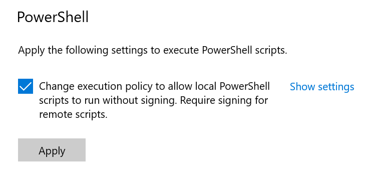

# Known Zowe CLI issues

The following topics contain information that can help you troubleshoot problems when you encounter unexpected behavior installing and using Zowe&trade; CLI.

## Zowe commands fail with secure credential errors

**Valid on Windows, macOS, and Linux**

**Symptoms:**

After you install Zowe CLI, and the installation appears to complete successfully, Zowe commands that load the secure credential store return error messages. For example, the following commands return error messages:

- `zowe config init`
- `zowe config secure`
- Most Zowe commands that access your mainframe environment

This behavior occurs under the following conditions:

- npm version 8.11.0 or 8.12.0 is running on your computer.
- The computer on which you installed Zowe CLI cannot access the Internet or it has limited access to the Internet. Your site does not allow connections to https://github.com/.
- You installed Zowe CLI from a local package or from an NPM public online registry

**Solution:**

1. Define the `npm_config_global` environment variable. Issue the command that corresponds with your operating system:

    - Windows Command Prompt: `set npm_config_global=true`
    - Windows PowerShell: `$env:npm_config_global="true"`
    - macOS/Linux Bash: `export npm_config_global=true`
2. Install or reinstall Zowe CLI using your preferred installation method.
3. After the Zowe CLI installation completes, reset the `npm_config_global` environment variable. Issue the command that corresponds with your operating system:
    - Windows Command Prompt: `set npm_config_global=`
    - Windows PowerShell: `$env:npm_config_global=""`
    - macOS/Linux Bash: `export npm_config_global=`
4. Continue configuring Zowe CLI. Or, reissue a Zowe command that returned an error message. You should no longer get an error message.

## Chain commands fail in a batch script

**Valid on Windows**

**Symptom:** When invoking Zowe CLI in a batch script (`.bat` or `.cmd` file), subsequent commands in the script do not run.

**Solution:**

To prevent the Zowe executable from taking control and stopping the execution of the script it is called from, add `call` in front of each Zowe CLI command.

In the example below, the script never prints "hello" to the terminal:

```
zowe --version
echo hello
```
To fix this, add `call` before the Zowe CLI command.

```
call zowe --version 
echo hello
```
For multiple Zowe CLI commands, see the following example:

```
call zowe --version
echo hello
call zowe --version
echo goodbye
```

## *Command not found* message displays when issuing `npm install` commands

**Valid on all supported platforms**

**Symptom:**

When you issue NPM commands to install the CLI, the message *command not found* displays. The message indicates that Node.js and NPM are not installed on your computer, or that PATH does not contain the correct path to the NodeJS folder.

**Solution:**

To correct this behavior, verify the following:

- Node.js and NPM are installed.
- PATH contains the correct path to the NodeJS folder.

For more information, see [System requirements for Zowe CLI](../../user-guide/systemrequirements-cli.md).

## EACCESS error when issuing `npm install` command

**Valid on Windows, Mac, or Linux**

**Symptom:**

An `EACCESS` error is returned when you issue the `npm install -g` command to install a package from Zowe.org or npm.

**Solution:**

To resolve the issue, follow the steps described in [Resolving EACCESS permissions errors when installing packages globally](https://docs.npmjs.com/resolving-eacces-permissions-errors-when-installing-packages-globally) in the npm documentation.

## Installation fails on Oracle Linux 6

**Valid on Oracle Linux 6**

**Symptom:**

You receive error messages when you attempt to install the product on an
Oracle Linux 6 operating system.

**Solution:**

Install the product on Oracle Linux 7 or another Linux or Windows OS. Zowe CLI is not compatible with Oracle Linux 6.

## Node.js commands do not respond as expected

**Valid on Windows or Linux**

**Symptom:**

You attempt to issue node.js commands and you do not receive the expected  output.

**Solution:**

There might be a program that is named *node* on your path. The Node.js installer automatically adds a program that is named *node* to your path. When there are pre-existing programs that are named *node* on your computer, the program that appears first in the path is used. To correct this behavior, change the order of the programs in the path so that Node.js appears first.

## `npm install -g` command fails due to an EPERM error

**Valid on Windows**

**Symptom:**

This behavior is due to a problem with Node Package Manager (npm). There
is an open issue on the npm GitHub repository to fix the defect.

**Solution:**

If you encounter this problem, some users report that repeatedly
attempting to install Zowe CLI yields success. Some users also
report success using the following workarounds:

  - Issue the `npm cache clean` command.

  - Uninstall and reinstall Zowe CLI. For instructions,
    see the [Zowe CLI installation checklist](../../user-guide/cli-install-cli-checklist.md).

  - Add the `--no-optional` flag to the end of the `npm install` command.

## Paths converting in Git Bash

**Valid on Windows**

**Symptom:**

When issuing a command with an absolute directory path that begins with a forward slash, Git Bash converts it into an invalid path that does not exist.

If a command includes a path similar to the following example:

  ```
  /a/ibmuser/my_dir
  ```
  Git Bash can erroneously convert the root directory to a drive letter, as in the example below:

  ```
  A:/ibmuser/my_dir
  ```
  :::note
  
  Depending on the root directory, the Git Bash conversion can add other directories it assumes to be included in the path.

  :::

**Solutions:**

- Replace the single slash in front of a path with double slashes (//). This stops Git Bash from remapping the path.
  
  To avoid conversion in the example above, edit the path in the following manner:
  ```
  //a/ibmuser/my_dir
  ```

- Set the environment variable `MSYS_NO_PATHCONV` to `1` in one of the following ways:
    - Use the export command.
    
      While running commands in a terminal, run the export command once during that terminal session. If writing a script, run the command once at the top of the script.
    
      The export command is included in the following example:
      ```
      export MSYS_NO_PATHCONV=1
      zowe zos-files upload dir-to-uss local_dir /a/ibmuser/my_dir
      ```
    - Set the environment variable in your `~/.bashrc` file to define it permanently.

The better option depends on particular circumstances. Using double forward slashes is a good choice when defining system-wide environment variables could cause problems with other applications. On the other hand, the environment variable helps avoid rewriting paths on every CLI command that uses them.

## `Sudo` syntax required to complete some installations

**Valid on Linux and macOS**

**Symptom:**

The installation fails on Linux or macOS.

**Solution:**

Depending on how you configured Node.js on Linux or macOS, you might need to add the prefix `sudo` before the `npm install -g` command or the `npm uninstall -g` command. This step gives Node.js write access to the installation directory.

## Missing data set search results with `--mainframe-search` option

**Valid on Windows, Mac, or Linux**

**Symptom:**

When the `zowe zos-files search data-sets` command is issued with the `--mainframe-search` option, results can omit data sets that are in binary format.

**Solution:**

Issue the `zowe files search ds` command without the `--mainframe-search` option. This returns results that include data sets in binary format.

## Error message with PowerShell scripts

**Valid on Windows**

**Symptom:**

PowerShell users on Windows can encounter an error when they try to run Zowe CLI with certain execution policies in place.

Example of an error message:

```
PS C:\> zowe
zowe : File C:\Users\user\AppData\Roaming\npm\zowe.ps1 cannot be loaded because running scripts is disabled on this
system. For more information, see about_Execution_Policies at https:/go.microsoft.com/fwlink/?LinkID=135170.
At line:1 char:1
+ zowe
+ ~~~~
    + CategoryInfo          : SecurityError: (:) [], PSSecurityException
    + FullyQualifiedErrorId : UnauthorizedAccess
```

**Solutions:**

- Update developer settings in Windows to enable running local scripts without signing:



- Run PowerShell as an administrator and use the `Set-ExecutionPolicy` command to change the execution policy to a less-restrictive setting, for example: `Set-ExecutionPolicy RemoteSigned -scope CurrentUser`.
