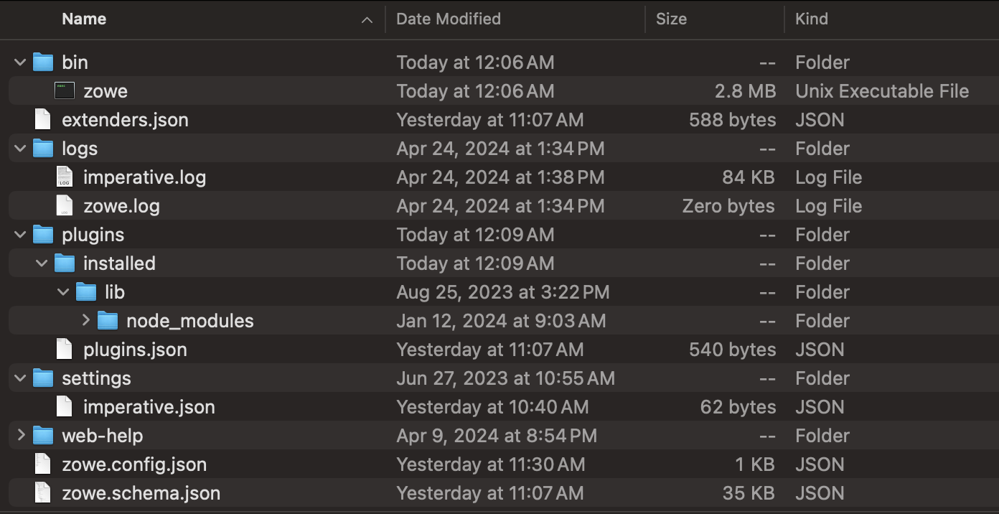

# Must-Gather information when troubleshooting Zowe CLI

The following topics contain information that can help you troubleshoot problems when you encounter unexpected behavior installing and using Zowe CLI.

You should endeavor to retrieve the following:
- Zowe CLI version installed
- List of plugins and version number
- List of Environmental variables in use

## Identify the currently installed version of Zowe CLI

Issue the following command:
```
zowe -V 
```
Zowe CLI versions may vary depending upon if the stable or incremental edition was used. So for confirmation, the stable edition:
```
npm list -g @zowe/cli
```
For the incremental edition:
```
npm list -g @brightside/core
```
More information regarding versioning conventions for Zowe CLI and Plug-ins is located in [Versioning Guidelines](https://github.com/zowe/zowe-cli/blob/master/docs/MaintainerVersioning.md) 

## Identify the currently installed versions of Zowe CLI plug-ins

Issue the following command:
```
zowe plugins list
```
The output describes version and the registry information. Note that the offical downloads are located at https://api.bintray.com/npm

## Environment Variables

### Setting the Zowe CLI logging level

Environment variables are available to specify logging level and the CLI home directory
**Important\!** Setting the log level to TRACE or ALL might result in "sensitive" data being logged. For example, command line arguments will be logged when TRACE is set.

| Environment Variable | Description | Values | Default |
| ---------------------- | ----------- |------- | ------- |
| `ZOWE_APP_LOG_LEVEL`        | Zowe CLI logging level            | Log4JS log levels (OFF, TRACE, DEBUG, INFO, WARN, ERROR, FATAL) | DEBUG   |
| `ZOWE_IMPERATIVE_LOG_LEVEL` | Imperative CLI Framework logging level | Log4JS log levels (OFF, TRACE, DEBUG, INFO, WARN, ERROR, FATAL) | DEBUG   |

### Setting the Zowe CLI home directory

You can set the location on your computer where Zowe CLI creates the *.zowe* directory, which contains log files, profiles, and plug-ins for the product:

| Environment Variable | Description | Values | Default |
| ---------------------- | ----------- | ------ | ------- |
| `ZOWE_CLI_HOME`  | Zowe CLI home directory location | Any valid path on your computer | Your computer default home directory |

The values for these can be **echo**ed

## Structure of home directory



### Location of logs

There are two sets of logs to be aware of the imperative log which generally contains installation and configuration information and the zowe log which contains information about interaction between CLI and the server endpoints.

### Profile configuration
Contains connnection information. **Important\!** The profile directory may contain "sensitive" information and so if requested any password or other sensitive refernces need tgo be obfuscated.

## Node.js and npm
Zowe CLI should be compatible with Node.js v8 and greater. 

To gather Node.js and npm versions, use the following:
```
node --version
npm --version
```

### npm configuration 
If the user is having trouble installing Zowe CLI from an npm registry, gathering their npm configuration will help identify issues with registry settings, global install paths, proxy settings, etc.
```
npm config ls -l
```
