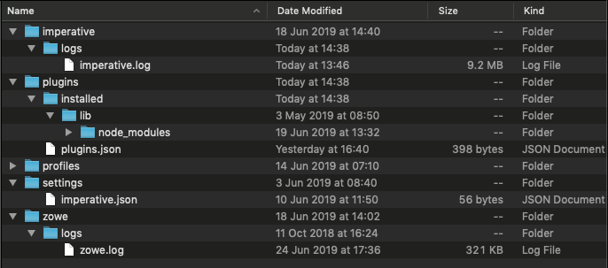

# Gathering information to troubleshoot Zowe CLI

Follow these instructions to gather specific pieces of information to help troubleshoot Zowe&trade; CLI issues.

[[toc]]

## Identify the currently installed CLI version

Issue the following command:

```
zowe -V
```

The exact Zowe CLI version may vary depending upon if the `@latest` or `@zowe-v1-lts`, or `@lts-incremental` version is installed.

For the `@zowe-v1-lts` and the `@latest` (forward-development) version tags:

```
npm list -g @zowe/cli
```

For the `@lts-incremental` version tag:

```
npm list -g @brightside/core
```

More information regarding versioning conventions for Zowe CLI and plug-ins is located in [Versioning Guidelines](https://github.com/zowe/zowe-cli/blob/master/docs/MaintainerVersioning.md).

## Identify the currently installed versions of plug-ins

Issue the following command:

```
zowe plugins list
```

The output describes version and the registry information.

## Environment variables

The following settings are configurable via environment variables:

### Log levels

Environment variables are available to specify logging level and the CLI home directory.

**Important\!** Setting the log level to TRACE or ALL might result in "sensitive" data being logged. For example, command line arguments will be logged when TRACE is set.

| Environment Variable | Description | Values | Default |
| ---------------------- | ----------- |------- | ------- |
| `ZOWE_APP_LOG_LEVEL`        | Zowe CLI logging level            | Log4JS log levels (OFF, TRACE, DEBUG, INFO, WARN, ERROR, FATAL) | DEBUG   |
| `ZOWE_IMPERATIVE_LOG_LEVEL` | Imperative CLI Framework logging level | Log4JS log levels (OFF, TRACE, DEBUG, INFO, WARN, ERROR, FATAL) | DEBUG   |

### CLI daemon mode

By default, the CLI daemon mode binary creates or reuses a file in the user's home directory each time a Zowe CLI command runs. In some cases, this behavior might be undesirable. For example, the home directory resides on a network drive and has poor file performance. To change the location that the daemon uses, set the environment variables that are described in the following table:


| Platform | Environment Variable  | Description | Values | Default |
| ---------------------- | ---------------------- | ---------------------- | ---------------------- | ---------------------- |
| Windows | `ZOWE_DAEMON_LOCK` | Specifies an alternative path to the lock file that restricts access to the named pipe that the daemon uses for communication. | Any valid path on your computer | `%HOMEPATH%\.zowe-daemon.lock` |
| Linux, macOS | `ZOWE_DAEMON` | Specifies an alternative path to the socket that the daemon uses for communication. | Any valid path on your computer | `$HOME/.zowe-daemon.sock` |
| Windows | `ZOWE_DAEMON` | Specifies an alternative name for the named pipe that the daemon uses for communication. The environment variable cannot be defined as a file path that resides on a disk. | Any valid Windows pipe name without the `\\.\` prefix | `%USERNAME%\ZoweDaemon` |


### Home directory

You can set the location on your computer for the Zowe CLI home directory, which contains log files, profiles, and plug-ins for the product.

**Tip!** The default `.zowe` folder is created when you issue your first Zowe CLI command. If you change the location of the folder, you must reinstall plug-ins and recreate or move profiles and log files that you want to retain. In some cases, you might want to maintain a different set of profiles in multiple folders, then switch between them using the environment variable.

| Environment Variable | Description | Values | Default |
| ---------------------- | ----------- | ------ | ------- |
| `ZOWE_CLI_HOME`  | Zowe CLI home directory location | Any valid path on your computer | C:\Users\\<username\>\\.zowe

The values for these variables can be **echo**ed.

## Home directory structure



### Location of logs

There are two sets of logs to be aware of:

- Imperative CLI Framework log, which generally contains installation and configuration information.

- Zowe CLI log, which contains information about interaction between CLI and the server endpoints.

Analyze these logs for any information relevant to your issue.

### Profile configuration

The `profiles` folder stores connection information.

**Important\!** The profile directory might contain "sensitive" information, such as your mainframe password. You should obfuscate any sensitive references before providing configuration files.

## Node.js and npm
Zowe CLI is compatible with the currently supported Node.js LTS versions. For an up-to-date list of supported LTS versions, see [Node.js.org](https://nodejs.org/en/download/releases/).

To gather the Node.js and npm versions installed on your computer, issue the following commands:

```
node --version
npm --version
```

### npm configuration
If you are having trouble installing Zowe CLI from an npm registry, gather your npm configuration to help identify issues with registry settings, global install paths, proxy settings, etc...

```
npm config ls -l
```

### npm log files
In case of errors, npm creates log files in the `npm_cache\_logs` location. To get the `npm_cache` location for a specific OS, run the following command:

```
npm config get cache
```

By default, npm keeps only 10 log files, but sometimes more are needed. Increase the log count by issuing the following command:

```
npm config set logs-max 50
```

This command increases the log count to 50, so that more log files will be stored on the system. Now you can run tests multiple times and not lose the log files. The logs can be passed to Support for analysis.

As the log files are created only when an npm conmmand fails, but you are interested to see what is executed, you can increase the log level of npm. Issue the following command:

```
npm config set loglevel verbose
```

- With this change, you can see all actions taken by npm on the stdout. If the command is successful, it still does not generate a log file.

- The available log levels are:
"silent", "error", "warn", "notice", "http", "timing", "info", "verbose", "silly", and "notice". "Notice" is the default.
<!--Explain what each log level means-->

- Alternatively, you can pass `--loglevel verbose` on the command line, but this only works with npm related commands. By setting log level in the config, it also works when you issue some `zowe` commands that use npm (for example, `zowe plugins install @zowe/cics`).
