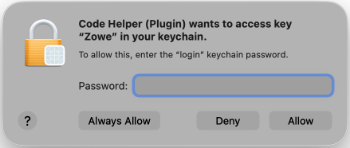

# Troubleshooting Zowe CLI credentials

## Secure credentials

### Authentication mechanisms

You can troubleshoot a failed log-in to a mainframe service by reviewing the authentication mechanisms used by Zowe CLI.

Zowe CLI accepts various methods, or mechanisms, of authentication when communicating with the mainframe, and the method that the CLI ultimately follows is based on the service it is communicating with.

However, some services can accept multiple methods of authentication. When multiple methods are provided (in a configuration profile or command) for a service, the CLI follows an *order of precedence* to determine which method to apply.

To find the authentication methods used for different services and their order of precedence, see the table in [Authentication mechanisms](../../extend/extend-cli/cli-authentication-mechanisms.md).

### PEM certificate files

PEM certificate files are used by Zowe CLI to authenticate to the API Mediation Layer. To be accepted, these certificate files must first be recorded in the service's keyring/trust-store on the mainframe before they are used by Zowe CLI.

Some users choose to secure PEM certificates by placing them in a password protected container, such as a PGP file, a ZIP file, or a password protected PKCS12 file (or a PFX file). However, Zowe CLI does not currently support any certificate files that require a password for use.

:::note

These client certificate files are different from the certificates generated or imported during Zowe server configuration. For more information, see [Using Certificates](https://docs.zowe.org/stable/user-guide/use-certificates/).

:::

To log into the API Mediation Layer with a PEM certificate file, refer to this workaround.

**Symptom:**

When using a password protected certificate to log in to API ML, an error message displays.

**Sample message:**

```
Unexpected Command Error:
Please review the message and stack below.
Contact the creator of handler:
"PATH-TO-INSTALLED-NPM\bin\npm\node_modules\@zowe\cli\lib/auth/ApimlAuthHandler"
Message:
error:1E08010C:DECODER routines::unsupported
Stack:
Error: error:1E08010C:DECODER routines::unsupported
    at setKey (node:internal/tls/secure-context:92:11)
    at configSecureContext (node:internal/tls/secure-context:174:7)
    at Object.createSecureContext (node:_tls_common:117:3)
    at Object.connect (node:_tls_wrap:1629:48)
    at Agent.createConnection (node:https:150:22)
    at Agent.createSocket (node:_http_agent:350:26)
    at Agent.addRequest (node:_http_agent:297:10)
    at new ClientRequest (node:_http_client:335:16)
    at Object.request (node:https:360:10)
    at PATH-TO-INSTALLED-NPM\bin\npm\node_modules\@zowe\cli\node_modules\@zowe\imperative\lib\rest\src\client\AbstractRestClient.js:117:39
```

**Solution:**

Create a new PEM certificate file with no password requirement to log in to API ML.

### Secrets SDK persistence level for Windows

**Symptom:**

A Windows user encounters the error message "An OS error has occurred" when saving secure credentials.

**Solution:**

Customize the credential manager persistence level to configure the scope of application for credentials.

Zowe CLI and Zowe Explorer allow customizing the credential manager persistence level for Windows.

Supported persistence levels:
- `enterprise`: Default value. Saves credential changes to the local machine and ensures these are propagated to all log-on sessions for this account across the network.
- `local_machine`: Saves credential changes to the local machine and does not propagate these across networked accounts.
- `session`: Saves credential changes to the local machine for the duration of the user's log-on session. These credentials are deleted when the user logs off.

To customize the persistence level on Windows:

1. Locate the `imperative.json` file in your `ZOWE_CLI_HOME` directory (`ZOWE_CLI_HOME/settings/imperative.json`).
2. Add the following object (highlighted in the following code block) to the `imperative.json` file to specify the persistence level:
    ```
    {
        "overrides": {
            "CredentialManager": "@zowe/cli"
        },
        //highlight-start
        "credentialManagerOptions": {
            "persist": "session"
        }
        //highlight-end
    }
    ```
3. Save the file to apply the changes.
4. Run a Zowe CLI command, such as `zowe config secure`, to update your secure credentials.

    Updated secured credentials are stored with the configured persistence level.

### Keychain Access prompts on macOS

**Symptom:**

When running Zowe CLI commands on macOS, a keychain access dialog displays asking whether to allow access to a keychain item.

On macOS, Zowe CLI stores and retrieves secure credentials (such as usernames and passwords) using the operating system's keychain. The dialog is a standard macOS security prompt that appears whenever an application requests access to a keychain item that has not previously been granted access.

This prompt is expected behavior and is not an error. It might display:

- The first time you run a Zowe CLI command after installing or updating Zowe CLI.
- After your macOS user password changes.
- When running a command that accesses a profile whose credentials have not yet been unlocked in the current login session.

**Sample message:**



**Solution:**

Select one of the following options in the dialog:

| Option | Effect |
|---|---|
| **Always Allow** | Grants permanent access for Zowe CLI. The prompt does not appear again for this keychain item. |
| **Deny** | The command fails to retrieve credentials. You are prompted to re-enter them manually. |
| **Allow** | Grants access for this single request. The prompt reappears on subsequent commands. |


Selecting **Always Allow** is recommended for most users to avoid repeated prompts during normal Zowe CLI usage.

:::note

If you are running Zowe CLI in a CI/CD pipeline or another non-interactive environment on macOS, the Keychain Access dialog cannot be displayed. Without user interaction to approve access, credential retrieval is blocked and commands will fail silently. To avoid this, use environment variables to supply credentials instead of the secure credential store. For more information, see [Using environment variables](../../user-guide/cli-using-using-environment-variables.md).

:::


