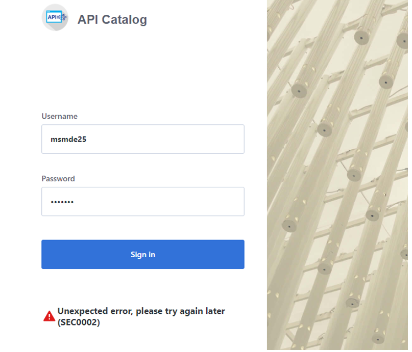

# Troubleshooting API ML

As an API Mediation Layer user, you may encounter problems with how the API ML functions. This article presents known API ML issues and their solutions.

## Error Message Codes

The following error message codes may appear on logs or API responses. Use the following message code references and the corresponding reasons and actions to help troubleshoot issues. 

### ZWEAD700W

  Static API definition directory '%s' is not a directory or does not exist

  **Reason:**

  One of the specified static API definition directories does not exist or is not a directory.

  **Action:**

  Review the static API definition directories and their setup. The static definition directories is specified as a launch parameter to a discovery service jar. The property key is: `apiml.discovery.staticApiDefinitionsDirectories`

### ZWEAD701E

  Error loading static API definition file '%s'

  **Reason:**

  A problem occurred while reading (IO operation) of a specific static API definition file. 

  **Action:**

  Ensure that the file data is not corrupted or incorrectly encoded.

### ZWEAD702W

  Unable to process static API definition data: '%s'

  **Reason:**

  A problem occurred while parsing a static API definition file. 

  **Action:**

  Review the mentioned static API definition file for errors. 
  Refer to the specific log message to see what is the exact cause of the problem:
  
  - ServiceId is not defined in the file '%s'. The instance will not be created. Make sure to specify the ServiceId. 
  - The `instanceBaseUrls` parameter of %s is not defined. The instance will not be created. Make sure to specify the `InstanceBaseUrl` property.
  - The API Catalog UI tile ID %s is invalid. The service %s will not have an API Catalog UI tile. Specify the correct catalog title ID.
  - One of the instanceBaseUrl of %s is not defined. The instance will not be created. Make sure to specify the InstanceBaseUrl property.
  - The URL %s does not contain a hostname. The instance of %s will not be created. The specified URL is malformed. Make sure to specify valid URL.
  - The URL %s does not contain a port number. The instance of %s will not be created. 
  - The specified URL is missing a port number. Make sure to specify a valid URL.
  - The URL %s is malformed. The instance of %s will not be created: The Specified URL is malformed. Make sure to specify a valid URL.
  - The hostname of URL %s is unknown. The instance of %s will not be created: Thes specified hostname of the URL is invalid. Make sure to specify valid hostname.
  - Invalid protocol. The specified protocol of the URL is invalid. Make sure to specify valid protocol.

### ZWEAD703E

  I/O problem occurred during reading static API definition directory: '%s'

  **Reason:**

  The property files of type .yml were not found. 

  **Action:**

  Review the paths for validity of your .yml files. 
  
### ZWEAM100E

  Could not read properties from: '%s'

  **Reason:**

  The Build Info properties file was empty or null.

  **Action:**

  Ensure that `META-INF/build-info.properties` and `META-INF/git.properties` exist and are not empty. 

### ZWEAM101E

  ΙΟ Error reading properties from: '%s' Details: '%s'

  **Reason:**

  An error occurred while reading the Build Info properties file.

  **Action:**

  Ensure that `META-INF/build-info.properties` and `META-INF/git.properties` exist and are not corrupted. 
  
### ZWEAM401E

  Error in HTTPS configuration: '%s'

  **Reason:**

  An Unknown error occurred while setting up an HTTP client during service initialization followed by a system exit. 

  **Action:**

  Start the service again in debug mode to get a more descriptive message. This error indicates it is not a configuration issue. 
  
### ZWEAM600W

  Invalid parameter in metadata: '%s'

  **Reason:**

  An invalid apiInfo parameter was found while parsing the service metadata.

  **Action:**

  Remove or fix the referenced metadata parameter.
  
### ZWEAM500W

  The service is not verifying the TLS/SSL certificates of the services

  **Reason:**

  This is a warning that the SSL Context will be created without verifying certificates.

  **Action:**

  If this was not an intentional use, stop the service and set the `verifySslCertificatesOfServices` parameter to `true`. Then restart the service.
  
### ZWEAM400E

  Error initializing HTTP client: '%s'

  **Reason:**

  An error occurred while initializing the HTTP Client. The `sslContextBuilder` was disrupted either when trusting the connection or while building the secure socket protocol implementation. 

  **Action:**

  Contact support for assistance. 
  
### ZWEAM501W

  Service is configured to use insecure HTTP protocol. For production use, please switch to HTTPS instead.
  
  **Reason:**

  This service is registered to Discovery service with an unsecure HTTP protocol.

  **Action:**

  If you are in production, restart your service with the `verifySslCertificatesOfServices` parameter set to `true` and have your service use SSL certification.

### ZWEAM502E

  Error reading secret key: '%s'
  
  **Reason:**

  An error occurred while reading the secret key from keystore or keyring. The key loads but could not be encoded in base64 format.

  **Action:**

  Ensure that the specified key is in the right format and is not corrupt.
  
### ZWEAM503E

  Error loading secret key: '%s'
  
  **Reason:**

  An error occurred while loading the secret key from the keystore or keyring

  **Action:**

  Ensure the key exists and the passwords, paths, and aliases are correct. 
  
### ZWEAM504E

  Error loading public key: '%s'
  
  **Reason:**

  An error occurred while loading the public key from keystore or keyring.

  **Action:**

  Ensure the key and keystore exist and the paths and aliases are correct.

### ZWEAM601E

  z/OSMF service name not found. Set the parameter `apiml.security.auth.zosmfServiceId` to your service name.

  **Reason:**

  The parameter `zosmfserviceId` was not configured correctly and could not be validated.

  **Action:**

  Ensure that the parameter `apiml.security.auth.zosmfServiceId` is correctly entered with a valid zosmf instance URL.
  
### ZWEAM505E

  Error initializing SSL/TLS context: '%s'
  
  **Reason:**

  An error occurred while trying to initialize the context for an SSL connection regarding the truststore. 
  
  **Action:**

  Check that your truststore is correct. If no problems are determined in the truststore, contact support.
  
### ZWEAM506E

  Truststore Password configuration parameter is not defined

  **Reason:**

  Your truststore password was not set in the configuration.
  
  **Action:**

  Ensure that the parameter `server.ssl.trustStorePassword` in the properties or yaml file contains the correct password for your truststore.
  
### ZWEAM507E

  Truststore configuration parameter is not defined but it is required
  
  **Reason:**

  The truststore usage is set as mandatory, but the truststore location was not provided. 

  **Action:**

  If you need a truststore, edit the `server.ssl.truststore`, `server.ssl.truststorePassword` and `server.ssl.truststoreType` parameters with valid data. 
  If you do not require a truststore, change the `trustStoreRequired` boolean parameter to `false`.

### ZWEAM508E

  Keystore not found, server.ssl.keyStore configuration parameter is not defined

  **Reason:**

  Your keystore path was not set in the configuration.
  
  **Action:**

  Ensure that the correct path to your keystore is contained in the parameter `server.ssl.keyStore` in the properties or yaml file of your service.
    
### ZWEAM509E

  Keystore password not found, server.ssl.keyStorePassword configuration parameter is not defined
  
  **Reason:**

  Your keystore password was not set in the configuration.
  
  **Action:**

  Ensure that the correct password to your keystore in the parameter `server.ssl.keyStorePassword` is contained in the properties or yaml file of your service.
  
### ZWEAM510E

  Invalid key alias '%s'

  **Reason:**

  The key alias you provided was not found.                       
  
  **Action:**

  Ensure that the key alias provided for the key exists in the provided keystore.                    

## Enable API ML Debug Mode

Use debug mode to activate the following functions:

- Display additional debug messages for API ML
- Enable changing log level for individual code components

**Important:** We highly recommend that you enable debug mode only when you want to troubleshoot issues.
Disable debug mode when you are not troubleshooting. Running in debug mode while operating API ML can adversely affect
its performance and create large log files that consume a large volume of disk space.

**Follow these steps:**

1. Locate the following shell script files in the `<Zowe install directory>/api-mediation/scripts` directory:

    - ```api-mediation-start-catalog.sh```
    - ```api-mediation-start-discovery.sh```
    - ```api-mediation-start-gateway.sh```

2. Open a file, for which you want to enable the debug mode.

3. Find the line which contains the `LOG_LEVEL=` parameter and set the value to `debug`:
    ```
    LOG_LEVEL=debug
    ```

4. Restart Zowe&trade;.

    You have enabled the debug mode.

5. (Optional) Reproduce a bug that causes issues and review debug messages. If you are unable to resolve the issue, create an issue [here](https://github.com/zowe/api-layer/issues/).     

6. Disable the debug mode. Modify the line which contains the `spring.profiles.include` parameter back to default:
    ```
    -Dspring.profiles.include= \
    ```
7. Restart Zowe.

    You have disabled the debug mode.
 ___
## Change the Log Level of Individual Code Components

You can change the log level of a particular code component of the API ML internal service at run time.

**Follow these steps:**

1. Enable API ML Debug Mode as described in Enable API ML Debug Mode.
This activates the application/loggers endpoints in each API ML internal service (Gateway, Discovery Service, and Catalog).
2. List the available loggers of a service by issuing the GET request for the given service URL:

    ```
    GET scheme://hostname:port/application/loggers
    ```

    Where:
    - **scheme**

        API ML service scheme (http or https)

    - **hostname**

        API ML service hostname

    - **port**

        TCP port where API ML service listens on. The port is defined by the configuration parameter MFS_GW_PORT for the Gateway,
    MFS_DS_PORT for the Discovery Service (by default, set to gateway port + 1), and MFS_AC_PORT for the Catalog
    (by default, set to gateway port + 2).

    **Exception:** For the catalog you will able to get list the available loggers by issuing the GET request for the given service URL:
    ```
    GET [gateway-scheme]://[gateway-hostname]:[gateway-port]/api/v1/apicatalog/application/loggers
    ```

    **Tip:** One way to issue REST calls is to use the http command in the free HTTPie tool: https://httpie.org/.

    **Example:**

    ```
    HTTPie command:
    http GET https://lpar.ca.com:10000/application/loggers

    Output:
    {"levels":["OFF","ERROR","WARN","INFO","DEBUG","TRACE"],
     "loggers":{
       "ROOT":{"configuredLevel":"INFO","effectiveLevel":"INFO"},
       "com":{"configuredLevel":null,"effectiveLevel":"INFO"},
       "com.ca":{"configuredLevel":null,"effectiveLevel":"INFO"},
       ...
     }
    }
    ```

3. Alternatively, you extract the configuration of a specific logger using the extended **GET** request:

    ```
    GET scheme://hostname:port/application/loggers/{name}
    ```
    Where:

    - **{name}**

         is the logger name

4. Change the log level of the given component of the API ML internal service. Use the POST request for the given service URL:

    ```
    POST scheme://hostname:port/application/loggers/{name}
    ```
    The POST request requires a new log level parameter value that is provided in the request body:
    ```
    {

    "configuredLevel": "level"

    }
    ```
    Where:

    - **level**

        is the new log level: **OFF**, **ERROR**, **WARN**, **INFO**, **DEBUG**, **TRACE**

    **Example:**

    ```
    http POST https://hostname:port/application/loggers/com.ca.mfaas.enable.model configuredLevel=WARN
    ```


## Known Issues

### API ML stops accepting connections after z/OS TCP/IP stack is recycled

**Symptom:**

When z/OS TCP/IP stack is restarted, it is possible that the internal services of API Mediation Layer
(Gateway, Catalog, and Discovery Service) stop accepting all incoming connections, go into a continuous loop,
and write a numerous error messages in the log.

**Sample message:**

The following message is a typical error message displayed in STDOUT:

```
2018-Sep-12 12:17:22.850. org.apache.tomcat.util.net.NioEndpoint -- Socket accept failed java.io.IOException: EDC5122I Input/output error.

.at sun.nio.ch.ServerSocketChannelImpl.accept0(Native Method) ~.na:1.8.0.
.at sun.nio.ch.ServerSocketChannelImpl.accept(ServerSocketChannelImpl.java:478) ~.na:1.8.0.
.at sun.nio.ch.ServerSocketChannelImpl.accept(ServerSocketChannelImpl.java:287) ~.na:1.8.0.
.at org.apache.tomcat.util.net.NioEndpoint$Acceptor.run(NioEndpoint.java:455) ~.tomcat-coyote-8.5.29.jar!/:8.5.29.
.at java.lang.Thread.run(Thread.java:811) .na:2.9 (12-15-2017).
```
**Solution:**

Restart API Mediation Layer.

**Tip:**  To prevent this issue from occurring, it is strongly recommended not to restart the TCP/IP stack while API ML is running.

### SEC0002 error when logging in to API Catalog

SEC0002 error typically appears when users fail to log in to API Catalog. The following image shows the API Catalog login page with the SEC0002 error.



The error is caused by failed z/OSMF authentication. To determine the reason authentication failed, open the ZOWESVR joblog and look for a message that contains `ZosmfAuthenticationProvider`. The following is an example of the message that contains `ZosmfAuthenticationProvider`:

```
2019-08-05 11:25:03.431 ERROR 5 --- .0.0-7552-exec-3. c.c.m.s.l.ZosmfAuthenticationProvider    : Can not access z/OSMF service. Uri 'https://ABC12.slv.broadcom.net:1443' returned: I/O error on GET request for "https://ABC12.slv.broadcom.net:1443/zosmf/info": ... 
```

Check the rest of the message, and identify the cause of the problem. The following list provides the possible reasons and solutions for the z/OSMF authentication issue:

- [Connection refused](#connection-refused)
- [Missing z/OSMF host name in subject alternative names](#missing-z/osmf-host-name-in-subject-alternative-names)
- [Invalid z/OSMF host name in subject alternative names](#invalid-z/osmf-host-name-in-subject-alternative-names)

#### Connection refused

In the following message, failure to connect to API Catalog occurs when connection is refused:

```
Connect to ABC12.slv.broadcom.net:1443 .ABC12.slv.broadcom.net/127.0.0.1. failed: EDC8128I Connection refused.; nested exception is org.apache.http.conn.HttpHostConnectException: 
```
The reason for the refused connection message is either invalid z/OSMF configuration or z/OSMF being unavailable. The preceding message indicates that z/OSMF is not on the 127.0.0.1:1443 interface.

**Solution:**

#### Configure z/OSMF

Make sure that z/OSMF is running and is on 127.0.0.1:1443 interface, and try to log in to API Catalog again. If you get the same error message, change z/OSMF configuration.

**Follow these steps:**

1. Locate the z/OSMF PARMLIB member IZUPRMxx.

    For example, locate IZUPRM00 member in SYS1.PARMLIB.
    
2. Change the current `HOSTNAME` configuration to `HOSTNAME('*')`.
3. Change the current `HTTP_SSL_PORT` configuration to `HTTP_SSL_PORT('1443')`.

    **Important!** If you change the port in the z/OSMF configuration file, all your applications lose connection to z/OSMF.

For more information, see [Syntax rules for IZUPRMxx](https://www.ibm.com/support/knowledgecenter/en/SSLTBW_2.3.0/com.ibm.zos.v2r3.izua300/izuconfig_IZUPRMxx.htm).

If changing the z/OSMF configuration does not fix the issue, reconfigure Zowe.

**Follow these steps:**

1. Open `.zowe_profile` in the home directory of the user who installed Zowe.
2. Modify the value of the `ZOWE_ZOSMF_PORT` variable. 
3. Reinstall Zowe.


#### Missing z/OSMF host name in subject alternative names

In following message, failure to connect to API Catalog is caused by a missing z/OSMF host name in the subject alternative names:

```
Certificate for <ABC12.slv.broadcom.net> doesn't match any of the subject alternative names: ..; nested exception is javax.net.ssl.SSLPeerUnverifiedException: Certificate for <ABC12.slv.broadcom.net> doesn't match any of the subject alternative names: ..
```

**Solutions:**

Fix the missing z/OSMF host name in subject alternative names using the following methods:

**Note:** Apply the insecure fix only if you use API Catalog for testing purposes.

- [Secure fix](#Secure-fix)
- [Insecure fix](#insecure-fix)

#### Secure fix

**Follow these steps:**

1. Obtain a valid certificate for z/OSMF and place it in the z/OSMF keyring. For more information, see [Configure the z/OSMF Keyring and Certificate](https://www.ibm.com/support/knowledgecenter/en/SSLTBW_2.3.0/com.ibm.zos.v2r3.izua300/izuconfig_KeyringAndCertificate.htm).
2. Navigate to `$ZOWE_RUNTIME/api-mediation` and run the following command:
    ```
    scripts/apiml_cm.sh --action trust-zosmf 
    ```

    2a. (Optional) If you do not use the default z/OSMF userid (IZUSVR) and keyring (IZUKeyring.IZUDFLT), issue the following command: 

       scripts/apiml_cm.sh --action trust-zosmf--zosmf-userid **ZOSMF_USER** --zosmf-keyring **ZOSMF_KEYRING**
    
    where;
    - `--zosmf-keyring` and `--zosmf-userid` - options that override the default userid and keyring accordingly.

#### Insecure fix

**Follow these steps:**

1. Set the value of the `verifyCertificatesOfServices` property to `false` in `zowe-install.yaml` to disable verification of certificates in Zowe.
2. Reinstall Zowe.

#### Invalid z/OSMF host name in subject alternative names

In the following message, failure to connect to API Catalog is caused by an invalid z/OSMF host name in the subject alternative names:

```
Certificate for <ABC12.slv.broadcom.net> doesn't match any of the subject alternative names: [abc12.ca.com, abc12, localhost, abc12-slck, abc12-slck.ca.com, abc12-slck1, abc12-slck1.ca.com, abc12-slck2, abc12-slck2.ca.com, usilabc12, usilabc12.ca.com]; 
nested exception is javax.net.ssl.SSLPeerUnverifiedException: Certificate for <ABC12.slv.broadcom.net> doesn't match any of the subject alternative names: [abc12.ca.com, abc12, localhost, abc12-slck, abc12-slck.ca.com, abc12-slck1, abc12-slck1.ca.com, abc12-slck2, abc12-slck2.ca.com, usilabc12, usilabc12.ca.com]
```

**Solutions:**

Fix the invalid z/OSMF host name in the subject alternative names using the following methods:

- [Request a new certificate](#request-a-new-certificate)
- [Change the ZOWE_EXPLORER_HOST variable](#change-the-zowe_explorer_host-variable)

#### Request a new certificate

Request a new certificate that contains a valid z/OSMF host name in the subject alternative names.

#### Change the ZOWE_EXPLORER_HOST variable

Change `ZOWE_EXPLORER_HOST` variable to fix the issue.

**Follow these steps:**

1. Open .zowe_profile in the home directory of the user who installed Zowe.
2. Change  `ZOWE_EXPLORER_HOST` to a host name from the subject alternative names of the z/OSMF certificate. For example, issue the following command:
    ```
    export ZOWE_EXPLORER_HOST=SAN (change this to the correct one > in the code block).
    ```
3. Reinstall Zowe. 
