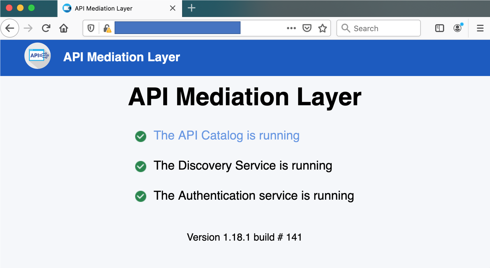

# Troubleshooting installation and startup of Zowe z/OS components

The following topics contain information that can help you troubleshoot problems when you encounter unexpected behavior installing Zowe z/OS components or starting Zowe's `ZWESVSTC` started task.


## Successful startup of `ZWESVSTC`

The `ZWESVSTC` started task on z/OS brings up a number of address spaces.  For each component messages are written to the JES `STDOUT` that can be used to check that they have started successfully.  Errors during startup can be found in the `STDERR` job spool file.  

To learn more about the Zowe components see the [Zowe Archiecture](../getting-started/zowe-architecture.md). Zowe can be configured to only bring up a subset of its components by using the `LAUNCH_COMPONENT_GROUPS` variable in the `instance.env` file, see [Component Groups](../user-guide/configure-instance-directory.md#component-groups).  

To monitor `ZWESVSTC` you can look at the address spaces, using a command such as `DA` in SDSF.  Each address space is named to identify its component, see [Address space names](../user-guide/configure-instance-directory.md#address-space-names).

### API Mediation Layer 

The API Mediation Layer has three address spaces: API Catalog `ZWE1AC`, API Gateway `ZWE1AG` and API Discovery `ZWE1AD`.  Check that each address spaces is active.

Each component write a successful startup message `ZWEAM000I` to the JES, that also indicates the CPU of seconds spent, as shown below.  Check that each address space has written this message.  

```
021-01-12 17:48:23.738 <ZWEADS1:main:33557015> ZWESVUSR INFO  (o.z.a.p.s.ServiceStartupEventHandler) `ZWEAM000I` Discovery Service started in 97.725 seconds
2021-01-12 17:48:27.577 <ZWEEAJ1:main:50334218> ZWESVUSR INFO  (o.s.b.w.e.t.TomcatWebServer,TomcatWebServer.java:202) Tomcat started on port(s): 8545 (https) with context path ''
2021-01-12 17:48:27.590 <ZWEEAJ1:main:50334218> ZWESVUSR INFO  (o.z.j.JesJobsApplication,StartupInfoLogger.java:59) Started JesJobsApplication in 44.878 seconds (JVM running for 52.194)
2021-01-12 17:48:30.145 <ZWEAGW1:main:50334212> ZWESVUSR INFO  (o.z.a.p.s.ServiceStartupEventHandler) `ZWEAM000I` Gateway Service started in 104.248 seconds
2021-01-12 17:48:31.036 <ZWEAAC1:main:33557009> ZWESVUSR INFO  (o.z.a.p.s.ServiceStartupEventHandler) `ZWEAM000I` API Catalog Service started in 105.127 seconds
```

As well as looking for `ZWEAM00I` in the JES log, another way to check the API mediation layer is fully initialized is to log into the gateway homepage.  If there is a red or yellow tick beside one of its three services the components are still starting.  

 

When all services are fully initialized there will be three green ticks.

 

### Zowe Desktop 

The Zowe desktop 

###

## Unable to launch Zowe with { FSUM7351 }

When you run `zowe-start.sh` from a unix shell path `<zowe-instance-directory>/bin`, you encounter the following error:

```
<RUNTIME_DIRECTORY>/scripts/internal/opercmd: ./zowe-start.sh 6: FSUM7351 not found
```

This can be because the value of `ROOT_DIR` in the `<zowe-instance-directory>/instance.env` file is pointing to an invalid Zowe runtime.  This can occur in scenarios where the Zowe runtime directory was removed during an upgrade of a convenience build, and the `instance.env` file's `ROOT_DIR` value was not updated to point to the new fully qualified path for the new Zowe runtime.

This errors can also occur if the user ID running `zowe-start.sh` does not have read and traverse access to the directory tree ancestors of the `ROOT_DIR` itself.  For example, if `ROOT_DIR` is set to `/usr/lpp/zowe` then the TSO user executing `zowe-start.sh` must have `rx` access to the directories `usr/lpp/zowe`, `usr/lpp` and `usr`.  To see the access for a directory issue the unix command `ls -alT`.  If you do not wish to open up `rx` access to the directory tree ancestors of the `ROOT_DIR` then Zowe can still be launched using a TSO command, see [Starting Zowe with a /S TSO command](../user-guide/configure-zowe-server.md#option-2-starting-zowe-with-a-s-tso-command). 

## Unable to create BPXAS instances

**Symptom:**

When you start `ZWESVSTC` started task, either by running the `zowe-start.sh` script or by launching the started task directly, you encounter the following error in the log:

```
<ROOT_DIR>/bin/internal/run-zowe.sh 1: FSUM7726 cannot fork: reason code  = 094500f7: EDC5112I Resource temporarily unavailable.
```

You will also encounter the following messages in the SYSLOG:

```
0290  S ZWESVSTC                                                               
0281  $HASP100 ZWESVSTC ON STCINRDR                                            
0290  IEF695I START ZWESVSTC WITH JOBNAME ZWESVSTC IS ASSIGNED TO USER         
      ZWESVUSR, GROUP ZWEADMIN                                                 
0281  $HASP373 ZWESVSTC STARTED                                                
0090  IEA602I ADDRESS SPACE CREATE FAILED.  MAXUSERS WOULD HAVE BEEN EXCEEDED  
0290  BPXP005I A FORK OR SPAWN ERROR WAS ENCOUNTERED.  RETURN CODE 00000070    
      REASON CODE 094500F7                                                     
0090  IEA602I ADDRESS SPACE CREATE FAILED.  MAXUSERS WOULD HAVE BEEN EXCEEDED  
0090  IEA602I ADDRESS SPACE CREATE FAILED.  MAXUSERS WOULD HAVE BEEN EXCEEDED  
0090  IEA602I ADDRESS SPACE CREATE FAILED.  MAXUSERS WOULD HAVE BEEN EXCEEDED  
```

**Solution:**

This problem occurs when the maximum number of `BPXAS` instances have been reached.  

This may be because when the Zowe instance directory was created, it was generated in the same location as the Zowe root directory.  The Zowe instance directory is created by using the script `<RUNTIME_DIR>/bin/zowe-configure-instance.sh -c <PATH_TO_INSTANCE_DIR>`. See [Creating an instance directory](../user-guide/configure-instance-directory.html#creating-an-instance-directory). The Zowe runtime directory is replaced when new PTFs are applied and should be considered as a read-only set of files. Zowe instance directories are designed to live outside the directory structure and are used to start a Zowe runtime.  

This problem will only occur with Zowe drivers prior to v1.10 and has been resolved in v1.10 where the `zowe-configure-instance.sh` script will report error if it detects the `-c` argument because the installation directory location is an existing Zowe runtime directory.  

## Errors caused when running the Zowe desktop with node 8.16.1

**Symptom:**

When you start the `ZWESVSTC` started task, you encounter the following error messages: 

```
/usr/lpp/zowe/components/app-server/share/zlux-app-server/lib/initInstance.js:1
(function (exports, require, module, __filename, __dirname) {
SyntaxError: Invalid or unexpected token
    at createScript (vm.js:80:10)
    at Object.runInThisContext (vm.js:139:10)
    at Module._compile (module.js:617:28)
    at Object.Module._extensions..js (module.js:664:10)
    at Module.load (module.js:566:32)
    at tryModuleLoad (module.js:506:12)
    at Function.Module._load (module.js:498:3)
    at Function.Module.runMain (module.js:694:10)
    at startup (bootstrap_node.js:204:16)
    at bootstrap_node.js:625:3
```

```
/global/zowe/instances/prod/bin/internal/run-zowe.sh 3: FSUM7332 syntax error: got ), expecting Newline
```

**Solution:**

This problem occurs when you use Node.js v8.16.1 which is not supported on Zowe. There is a known issue with node.js v8.16.1 and Zowe desktop encoding. Use a supported version of Node.js instead. For more information, see [Supported Node.js versions](../user-guide/install-nodejs-zos.md#supported-nodejs-versions).

## Cannot start Zowe and UNIX commands not found with FSUM7351

**Symptom:**

When you start the ZWESVSTC started task, you might encounter the following error message: 

```
dirname: <instance-dir>/bin/internal/run-zowe.sh 2: FSUM7351 not found
pwd: <instance-dir>/bin/internal/run-zowe.sh 2: FSUM7351 not found
.: <instance-dir>/bin/internal/run-zowe.sh 3: /bin/internal/read-instance.sh: not found
```

**Solution:**

Check that /bin is part on your PATH. Do `echo $PATH` to check. If it is missing, make sure that it is appended to PATH in your profile, for example, in `/etc/profile/`.

## Various warnings show when connecting Zowe with another domain

**Symptoms:**

When you configure the Zowe environment variable `ZOWE_EXPLORER_HOST` in `instance.env` with a domain (for example, `domain-a.com`), and access Zowe with another domain (for example, `domain-b.com`), you may see the following errors:

- Certificate warnings similar to the following one:
  ```
  domain-b.com:8544 uses an invalid security certificate.

  The certificate is only valid for the following names: domain-a.com, <ip-of-domain-a>, localhost.localdomain, localhost, 127.0.0.1
  ```
- No pinned applications show in Zowe Desktop.
- JES Explorer, MVS Explorer, USS Explorer may show errors similar to the following one if you ignore the certificate error.
  ``` 
  Blocked by Content Security Policy

  An error occurred during a connection to domain-a.com:7554.

  Firefox prevented this page from loading in this way because the page has a content security policy that disallows it.
  ```
  

The above warnings and errors will also show when you plan to use Zowe with multiple domain names.

**Solutions:**

You can take the following steps:

- When you prepare the `bin/zowe-setup-certificates.env` file, specify the `HOSTNAME=` and `IPADDRESS=` parameters to accept multiple domains separated by comma (from Zowe v1.14.0). The following configuration is an example:

  ```
  HOSTNAME=domain-a.com,domain-b.com
  IPADDRESS=<ip-of-domain-a>,<ip-of-domain-b>
  ```

  Then you can proceed to run the `bin/zowe-setup-certificates.sh` script.
- After you run the `bin/zowe-configure-instance.sh` script, modify the `instance.env` file located in the instance directory in the following ways to reflect the multiple domains you plan to use.
  * Add a line of `ZWE_EXTERNAL_HOSTS`. For example, `ZWE_EXTERNAL_HOSTS=domain-a.com,domain-b.com`.
  * Add a line of `ZWE_REFERRER_HOSTS`. For example, `ZWE_REFERRER_HOSTS=domain-a.com,domain-b.com`.
  * Find the line that starts with `ZOWE_EXPLORER_FRAME_ANCESTORS` and modify its values to `ZOWE_EXPLORER_FRAME_ANCESTORS="${ZOWE_EXPLORER_HOST}:*,domain-a.com:*,domain-b.com:*,${ZOWE_IP_ADDRESS}:*"`.

**Drawback:**

With this change, you must use the API Mediation Layer Gateway port (default is 7554) to access Zowe Desktop, for example, `https://domain-a.com:7554/ui/v1/zlux` or `https://domain-b.com:7554/ui/v1/zlux`. Using Desktop port (default is 8544) like `https://domain-b.com:8544/` is not supported.
