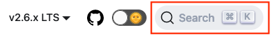

# Troubleshooting Zowe

To isolate and resolve Zowe&trade; problems, you can use the troubleshooting and support information.

## How to start troubleshooting

When you run into some issues and are looking for troubleshooting tips, the following steps may help you.

1. Search the error message or error code in your error log by using the Search bar in the [Zowe Docs site](https://docs.zowe.org/). If there is an existing solution, follow the instructions to troubleshoot.

    

2. If no solution is available or the existing solutions cannot apply to your problem, you could search the keywords, error messages, or error code in the [Zowe GitHub repository](https://github.com/zowe). If you find a closed issue or pull request, try troubleshooting by using the information shared in the item's Conversation section. If the issue is still open, post your question or comment to prompt a discussion on your problem.

    

3. If your problem is not solved, try the following options:

    * Create an issue in the [Zowe GitHub repository](https://github.com/zowe) with a detailed description of the problem you have encountered.

    * Bring up your questions to the corresponding channels as shown below:

        - [Zowe API ML Slack channel](https://openmainframeproject.slack.com/archives/CC5UUL005)
        - [Zowe Chat Slack channel](https://openmainframeproject.slack.com/archives/C03NNABMN0J)
        - [Zowe CLI Slack channel](https://openmainframeproject.slack.com/archives/CC8AALGN6)
        - [Zowe Documentation Slack channel](https://openmainframeproject.slack.com/archives/CC961JYMQ)
        - [Zowe Explorer for VS Code channel](https://openmainframeproject.slack.com/archives/CUVE37Z5F)

    * Reach out to your available Zowe support team for assistance.

## Known problems and solutions

Some common problems with Zowe are documented in the Zowe Docs **Troubleshoot** section, along with their solutions or workarounds. If you have a problem with Zowe installation and components, review the problem-solution topics to determine whether a solution is available to the problem that you are experiencing.

You can also find error messages and codes, must-gathers, and information about how to get community support in these topics.

### Troubleshooting Zowe server-side components

- [Troubleshooting Zowe Launcher](./launcher/launcher-troubleshoot.md)
- [Troubleshooting Zowe z/OS component startup](troubleshoot-zos-startup.md)
- [Troubleshooting API Mediation Layer](troubleshoot-apiml.md)
- [Troubleshooting Zowe Application Framework](./app-framework/app-troubleshoot.md)

### Troubleshooting Zowe client-side components

- [Troubleshooting Zowe CLI](./cli/troubleshoot-cli.md)
- [Troubleshooting Zowe Explorer](./ze/troubleshoot-ze.md)
- [Troubleshooting Zowe Chat](./zowe-chat-troubleshoot/troubleshooting.md)
- [Troubleshooting Zowe Explorer plug-in for IntelliJ IDEA](troubleshoot-intellij.md)

## Verifying a Zowe release's integrity

Following a successful install of a Zowe release, the Zowe runtime directory should contain the code needed to launch and run Zowe. If the contents of the Zowe runtime directory have been modified, this may result in unpredictable behavior. To assist with this, Zowe provides the ability to validate the integrity of a Zowe runtime directory. See [Verify Zowe runtime directory](./verify-fingerprint.md) for more information.

## Understanding the Zowe release

Knowing which version of Zowe you are running might help you isolate the problem. Also, the Zowe version number is needed by the Zowe community enlisted to help you. To learn how to find the version number, see [Understanding the Zowe release](troubleshoot-zowe-release.md).
