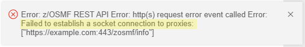
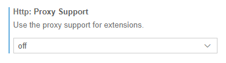

# Known Zowe Explorer issues

The following topics contain information that can help you troubleshoot problems when you encounter unexpected behavior when using Zowe Explorer.

## Bidirectional languages

Files written in languages primarily read from right to left (Arabic, Hebrew, many Asian languages) can include portions of text that are written and read left to right, such as numbers.

These bidirectional (BiDi) languages are not currently supported in Visual Studio Code. See [Issue #86667](https://github.com/microsoft/vscode/issues/86667) for more information.

As a result, VS Code extensions like Zowe Explorer, Zowe Explorer CICS Extension, and Zowe Explorer FTP Extension are not able to support BiDi languages in files.

## Client certificate support

Some Zowe Explorer users prefer to use certificates to access the API Mediation Layer. This can be the case in sites that use credentials such as passwords and multifactor authentication, which might only be valid for a short period of time. On the other hand, certificates can be valid for much longer.

Zowe Explorer does not support authenticating to the API ML using client certificates. However, it is possible to use Zowe CLI to authenticate to the API ML using client certificates and receive a token that Zowe Explorer can use for API ML access.

To use a client certificate to generate an API ML token:

1. Open a command line window and issue the following command:

    ```
    zowe auth login apiml --host <APIML Host> --port <APIML Port> --cert-file <PEM Public Certificate Path> --cert-key-file <PEM Private Certificate Path>
    ```
    - `<APIML Host>`
    
        Specifies the API ML host.
    - `<APIML Port>`
        
        Specifies the API ML port.
    - `<PEM Public Certificate Path>`
    
        Specifies the path for the PEM public certificate.
    - `<PEM Private Certificate Path>`
    
        Specifies the path to the PEM private certificate.

    Zowe CLI procures a security token from the API ML and adds that token to the base profile in the applicable configuration file.

2. Open Zowe Explorer, or reload it if already open.

    Zowe Explorer can access the API ML token in the base profile for authentication.
    
    :::note
    
    If you have multiple types of configuration files and base profiles, see [How configuration files and profiles work together](../../user-guide/cli-using-understand-profiles-configs.md#how-configuration-files-and-profiles-work-together) to learn which configuration and profile would be used to store the API ML token.

    :::

## Data Set creation error

**Symptom:**

Data set creation fails.

**Sample message:**

Error running command zowe.createDataset: z/OSMF REST API Error: http(s) request error event called Error: self signed certificate in certificate chain. This is likely caused by the extension that contributes zowe.createDataset.

**Solution:**

Set the value of the Reject-Unauthorized parameter to `false`. Use the profile edit function to change profile's parameters.

## Opening binary files error

**Symptom:**

When opening a binary file, an error message appears.

**Sample messages:**

```
Cannot open file:
///Users/userID/.vscode/extensions/zowe-vs.code-extension-for-zowe-1.8.0/resources/temp/binaryfilename.
Detail: File seems to be binary and cannot be opened as text
```

```
Error running command zowe.editMember:
cannot open file:
///Users/userID/.vscode/extensions/zowe-vs.code-extension-for-zowe-1.8.0/resources/temp/binaryfilename.
Detail: File seems to be binary and cannot be opened as text. This is likely caused by the extension that contributes zowe.editMember.
```

**Solution:**

There is no solution or workaround at this time.

## Visual Studio Code mainframe connection error

**Symptom:**

When performing an action that requires a mainframe connection (such as searching for data sets), you get a proxy error.

**Sample message:**

"z/OSMF REST API Error" that includes the message `Failed to establish a socket connection to proxies`, as in the following image:



**Solution:**

In VS Code settings, search for `proxy` and change the http.proxySupport setting to `off`, as in the following image:


