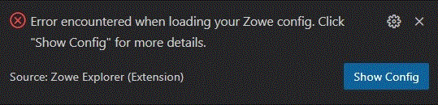
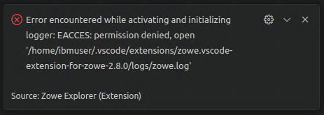
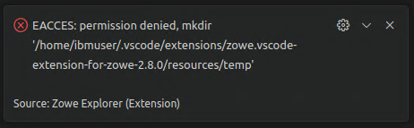
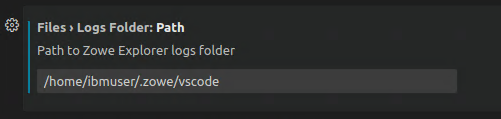
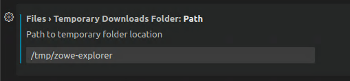

# Troubleshooting Zowe Explorer

As a Zowe Explorer user, you may encounter problems when using Visual Studio Code extension functions. Review Zowe Explorer known issues and troubleshooting solutions here.

## Before reaching out for support

1. Is there already a GitHub issue (open or closed) that covers the problem? Check [Zowe Explorer Issues](https://github.com/zowe/zowe-explorer-vscode/issues).
2. Review the current list of [Known issues](known-ze.md) in documentation. Also, try searching using the Zowe Docs search bar (keyboard shortcut `ctrl` + `k`).
3. Collect the following information to help diagnose the issue:
    - The Zowe Explorer and Visual Studio Code versions installed
        - See [Checking your Zowe version release number](../troubleshoot-check-your-zowe-version/#zowe-explorer-for-visual-studio-code) for information.
    - Node.js and NPM versions installed
    - Your operating system
    - Zowe Logs, which usually can be found in `C:\Users\userID\.vscode\extensions\zowe.vscode-extension-for-zowe-X.Y.Z\logs`
    
      :::note
      In some cases, this path can differ. On operating systems such Linux or Mac, the default path is `~/.vscode/extensions/zowe.vscode-extension-for-zowe-X.Y.Z/logs`. In a non-standard installation of Visual Studio Code, extensions could be stored under a different directory.
      :::

Use [the Slack channel](https://app.slack.com/client/T1BAJVCTY/CUVE37Z5F) to reach the Zowe Explorer community for assistance.

## Connection issues with Zowe Explorer

If you are using Zowe Explorer at a site that uses an Internet proxy but cannot connect to a mainframe, ensure that the **Proxy Support** setting in Visual Studio Code is properly configured. Your system administrator can provide information on which option works best for your network environment.

Note that Zowe Explorer cannot bypass this setting as it would circumvent the VS Code setting applied to all other extensions.

To access the **Proxy Support** setting in VS Code:

1. Open VS Code and select the **Manage** icon on the **Side Bar**.
2. Select the **Settings** option from the context menu.
3. In the Settings view, open the **Application** menu and select **Proxy**.
4. Find the **Proxy Support** drop-down menu and select the appropriate option.

In addition, VS Code allows users and administrators to configure proxy options on launch. See [Network Connections in Visual Studio Code](https://code.visualstudio.com/docs/setup/network#_proxy-server-support) for more information on proxy server support.

System administrators can also add IP addresses, IP ranges, or DNS hostnames for each system inaccessible by proxy to the `NO_PROXY` environment variable. VS Code uses this variable for outgoing requests.

## Resolving invalid profiles

A problem with a configuration file can make Zowe Explorer unable to read your configurations.

Zowe Explorer displays an error message advising it cannot read the configuration file when a Zowe V3 configuration file fails to load.

Possible problems in the file could include a syntax error, or an invalid keyword or symbol.

To fix the configuration file causing the error:

1. Click the **Show Config** button in the message window.

    

    This opens the file in an **Editor** tab.

2. Modify the file as needed and save the changes.
3. Reload Visual Studio Code to confirm that Zowe Explorer can read the updated file.

## Missing write access to VS Code `extensions` folder

In some environments, the path for VS Code extensions (typically `~/.vscode/extensions`) can be read-only. This can happen when an environment has developers sharing a common read-only extensions folder that is managed by an admin with write access.

In these cases, Zowe Explorer fails to activate because it cannot write to the `logs` and `temp` folders in the extension path. When Zowe Explorer launches, an `EACCES: permission denied` error displays. See the following examples.

`logs` folder write access error:

`temp` folder write access error:

To avoid this, change the `logs` and `temp` folder locations:

1. In VS Code, select the **File menu**, select **Preferences**, and click on **Settings**.

2. In either the **User** or **Workspace** tab, click on the **Extensions** option to open the menu.

3. Select **Zowe Explorer**.

4. Enter the new path in the **Logs Folder** or **Temporary Downloads Folder** fields. For examples:

    `logs` folder setting:

    

    - Log files include information about Zowe Explorer and connections it makes to the mainframe. These files can be used for troubleshooting and to analyze errors.

     `temp` folder setting:

    

    - Temporary files are local copies of data sets or USS files downloaded from the mainframe to edit in VS Code. These files last until VS Code closes and all changes have been uploaded to the mainframe.

     After a new path is entered, Zowe Explorer writes logs and temporary files using the corresponding path.
