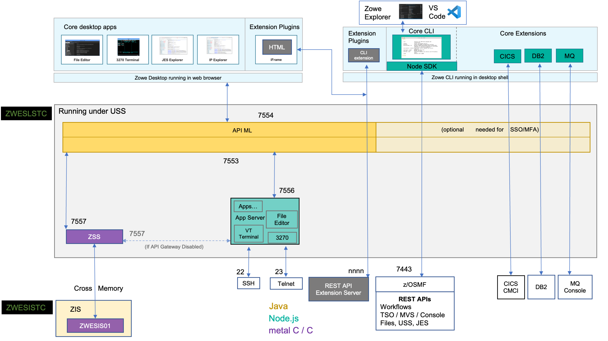

# API Mediation Layer Single-Service deployment

Zowe version 3.3.0 introduces as a technical preview the option to switch execution mode from the current modularized scheme to a single-service option.
This switch <!--"Execution of xyz though the Monulith method ..."-->brings performance benefits and configuration simplification for new installations:

* Unified memory footprint. <!--Please add the benefit of this. -->
* Minimize JVM processes.
* Minimize networking operations.
* Unified configuration options.

## Architecture

This section contains an overview of the architecture of the API Mediation Layer single-service deployment mode.


<!-- TODO
Diagram
Data flows
Use the example from the current architecture diagram?
 -->

## Breaking Changes

:::note
The following instructions assume a default address space prefix `ZWE1`. Update as needed.
:::

To run API Mediation Layer in single-service mode, the system programmer is required to make configuration changes in the following areas:

* Port usage is shared in a single address space. <!-- I think we should remove "is shared in a single address spece" as this information should be detailed in the corresponding section below.-->
* Log prefix is unified for all components. <!--Similarly, "is unified for all components" should be explained in the corresponding section. -->
* AT-TLS rule adaptations.

### Port usage

The new single-service deployment mode runs all API Mediation Layer components in a single JVM process. <!-- Please add a single sentence about the benefit of using a single JVM process.-->For backward compatibility reasons, this single process handles connections to both the Gateway Service and the Discovery Service ports (defaults 7554 and 7553).

The single-service API Mediation Layer address space uses ports defined in `components.gateway.port` and `components.discovery.port`.

Update the network permissions to reflect this change. Both ports will be under z/OS address space `ZWE1AG`. <!-- Can we please include a codeblock example of this configuration? -->

### Log Prefix

Logs from internal API Mediation Layer components such as the Discovery Service, API Catalog, Caching Service will appear under the `ZWE1AG` prefix.
<!-- Can we please include a log example? -->

### AT-TLS

If the installation is configured with AT-TLS, rules need to be updated. Perform the following updates to the PAGENT rules:

* Update job name filters to use `ZWE1AG`.
* Remove unneeded rules that were performing the handling.

<!--We need to include an example of these PAGENT rules configuration -->

**Note:** TCP HTTP calls are still in use for high availability scenarios to maintain synchronization between instances accross LPARs.

## Limitations

The following features are not supported in the technical preview release of the single service API Mediation Layer:

* Multi tenancy deployment is not supported.
* Docker container deployments.

## Enable the Single-service API Mediation Layer

To switch the API Mediation Layer into modularized mode, perform the following changes to the installation's `zowe.yaml` file:

1. Add component `apiml` and enable it: <!-- Please add where specifically in the yaml. -->

    ```yaml
    components:
      apiml:
        enabled: true
    ```

2. Disable remaining API Mediation Layer components:

    * Disable Gateway Service:

        ```yaml
            components:
              gateway:
                enabled: false
        ```

    * Disable Discovery Service:

        ```yaml
            components:
              discovery:
                enabled: false
        ```

    * Disable API Catalog: set `components.api-catalog.enabled` to `false`

        ```yaml
            components:
              api-catalog:
                enabled: false
        ```

    * Disable ZAAS: set `components.zaas.enabled` to `false`

        ```yaml
            components:
              zaas:
                enabled: false
        ```

    * Disable Caching Service: set `components.caching-service.enabled` to `false`

        ```yaml
            components:
              caching-service:
                enabled: false
        ```

    **Note:** If the Caching Service is not configured on your system, follow the steps described in [Using the Caching Service](./api-mediation-caching-service.md) to configure the Caching Service. The Caching Service is enabled by default in the modularized deployment of API Mediation Layer.

3. Start the Zowe task.

### Rolling back changes

It is possible to revert to the original deployment mode by switching back the changes in `zowe.yaml`:

1. Disable the `apiml` component:
    Set `components.apiml.enabled` to `false`.

2. Re-enable the original components:

   * Set `components.gateway.enabled` to `true`.
   * Set `components.discovery.enabled` to `true`.
   * Set `components.zaas.enabled` to `true`.
   * Set `components.api-catalog.enabled` to `true` (if required)
   * Set `components.caching-service.enabled` to `true` (if required)

3. Start the Zowe task.

## Future plans

* The modularized deployment is planned to be the default mode in Zowe v3.4.0
* The option to rollback to the modularized deployment will remain for the duration of the Zowe v3 lifecycle.
