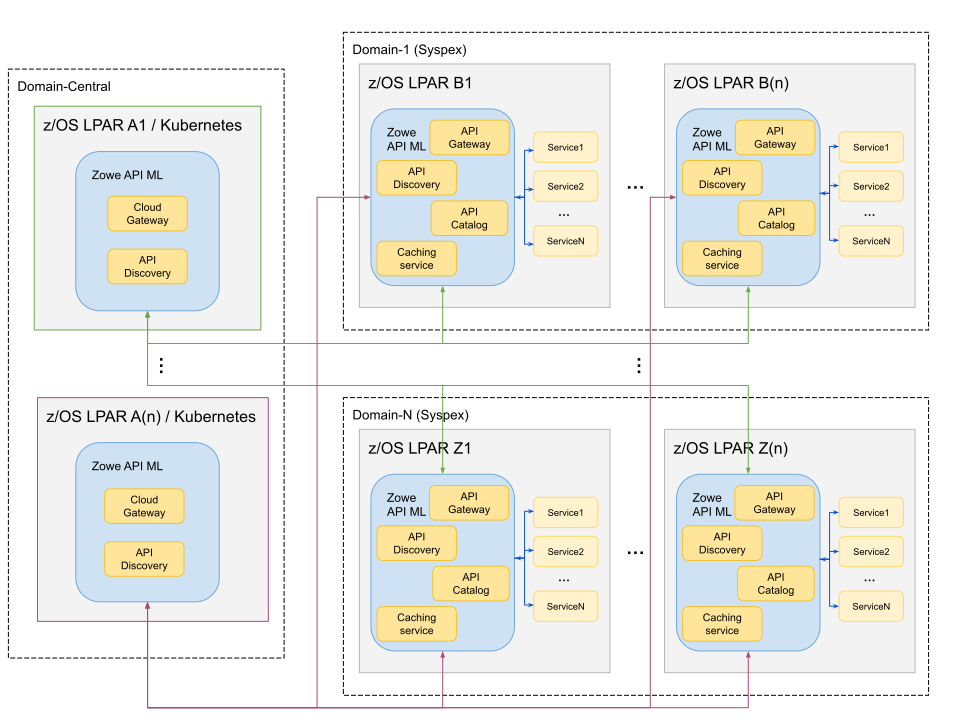

# Multitenancy Configuration

Zowe supports management of multiple tenants, whereby different tenants can serve different purposes or different customers. The use case for multi-tenant support is when a service provider manages sysplexes/monoplexes for multiple customers. This configuration makes it possible to have a single access point for all customers, and properly route and authenticate across different domains.
* [Overview of Central and Domain API MLs](#overview-of-central-and-domain-api-mls)
* [Multitenancy component enablement settings](#multitenancy-component-enablement-settings)
* [Onboarding Domain Gateways to the central Cloud Gateway](#onboarding-domain-gateways-to-the-central-cloud-gateway)
  * [Dynamic Onboarding (recommended) for Domain Gateways](#dynamic-onboarding-recommended-for-domain-gateways)
  * [Static Onboarding for Domain Gateways (deprecated)](#static-onboarding-for-domain-gateways-deprecated)
* [Onboarding a Domain Cloud-Gateway service to Central Discovery service](#onboarding-a-domain-cloud-gateway-service-to-the-central-discovery-service)
    * [Dynamic Configurations to the Central Discovery Service](#dynamic-configurations-to-the-central-discovery-service)
        * [Dynamic configuration: YML](#dynamic-configuration-yml)
        * [Dynamic configuration: Environment variables](#dynamic-configuration-environment-variables)
    * [Validating successful configuration](#validating-successful-configuration)
* [Establishing a trust relationship between Domain API ML and Central API ML](#establishing-a-trust-relationship-between-domain-api-ml-and-central-api-ml)
  * [Commands to establish trust between Domain and Central API MLs](#commands-to-establish-trust-between-domain-and-central-api-mls)
* [Using the `/registry` endpoint in Cloud Gateway](#using-the-registry-endpoint-in-the-central-cloud-gateway)
  * [Configuration for `/registry`](#configuration-for-registry)
  * [Authentication for `/registry`](#authentication-for-registry)
  * [Authorization for `/registry`](#authorization-with-registry)
  * [Requests with `/registry`](#requests-with-registry)
  * [Response with `/registry`](#response-with-registry)
* [Validating successful configuration with `/registry`](#validating-successful-configuration-with-registry) 
* [Gateway static definition example](#gateway-static-definition-example-deprecated)
* [Troubleshooting multitenancy configuration](#troubleshooting-multitenancy-configuration)
  * [ZWESG100W](#zwesg100w)
  * [No debug messages similar to apiml1 completed with onComplete are produced](#no-debug-messages-similar-to-apiml1-completed-with-oncomplete-are-produced)


## Overview of Central and Domain API MLs

The following diagram illustrates communication between the "central" API Mediation Layer and Zowe in multiple domains. Note that some API MLs may be running in a sysplex (HA), while others may be in a monoplex (non-HA).



Domain-Central is where the "central" API ML is running, and may be on  z/OS, or off z/OS, for example in Kubernetes. This API ML is referred to as the Central API ML.
The Central API ML serves as a single point of access to all API Mediation Layers registered in it, and by extension, to all services registered in those secondary API MLs.

Domain-1 to Domain-N are z/OS systems with the standard Zowe API ML running either in HA (sysplex) or non-HA (monoplex). These API MLs are referred to as  Domain API MLs.


## Multitenancy component enablement settings

In the multitenancy environment, certain Zowe components may be enabled, while others may be disabled. The multitenancy environment expects one Central API ML that handles the discovery and registration as well as routing to the API ML installed in specific domains. As such, different setups are required for the V2 version of the API ML on the central domain and on the specific customer environments. 

When using a multitenancy environment, ensure that the following Zowe components are either enabled or disabled:

- **Domain API ML**
  - Gateway and Discovery Service: **enabled**
  - Cloud Gateway: **disabled**

- **Central API ML**
  - Cloud Gateway and Discovery Service: **enabled**
  - Gateway: **disabled**

## Onboarding Domain Gateways to the Central Cloud Gateway

The Central Cloud Gateway must onboard all Domain Gateways. This can be done dynamically or by static definition. We strongly recommend using dynamic onboarding as this onboarding method adapts better to the potentially changing environments of the customer. Static onboarding does not provide the functionality to actively monitor the health of specific services (e.g. domain gateways).  

### Dynamic Onboarding (recommended) for Domain Gateways

To dynamically onboard to the Discovery service in the central cluster, set the following property for all Domain Gateways:

`components.gateway.apiml.service.additionalRegistration`

Use the following example as a template for how to set the value for this property in zowe.yml.

**Example:**
```
components.gateway.apiml.service.additionalRegistration:
    # central API ML (in HA, for non-HA mode use only 1 hostname)
       - discoveryServiceUrls:      https://sys1:{discoveryServicePort}/eureka/,https://sys2:{discoveryServicePort}/eureka/
 	    routes:
              - gatewayUrl: /
                serviceUrl: /
```

```
components.gateway.apiml.security.x509:
    #  cloud gateway port 
        certificatesUrl: https://sys1:{cloudGatewayPort}/gateway/certificates
```

:::note
It is not necessary for the Gateway service to provide different routing patterns for the Central Discovery service. These metadata can be the same for every cluster.
:::

### Static Onboarding for Domain Gateways (deprecated)

Alternatively, you can statically onboard all Domain Gateways on the Central Discovery service. Note that dynamic onboarding is the preferred method.

For static onboarding, make sure that the following parameters are correctly specified in the static definition file:

- **services.serviceId**  
  Specify this parameter to GATEWAY
- **services.instanceBaseUrls**  
  Specifies the URL of the Domain Gateway
- **services.customMetadata.apiml.service.apimlId**  
  Specifies the id of the API ML environment

For static onboarding, use the [Gateway static definition example (deprecated)](#gateway-static-definition-example-deprecated) presented later in this article.

## Onboarding a Domain Cloud Gateway service to the Central Discovery service

The Central Cloud Gateway can onboard Cloud Gateways of all domains. This service onboarding can be achieved similar to additional registrations of the Gateway. This section describes the dynamic configuration of the yaml file and environment variables, and how to validate successful configuration.

- Dynamic configuration via zowe.yaml
- Dynamic configuration via Environment variables

### Dynamic Configurations to the Central Discovery service

#### Dynamic configuration: YML

Users must set the following property for the Domain Cloud Gateway to dynamically onboard to the Central Discovery service.

`components.cloud-gateway.apiml.service.additionalRegistration`

Use the following example as a template for how to set the value of this property in zowe.yml.

**Example:**
```
components.cloud-gateway.apiml.service.additionalRegistration:
    # central API ML (in HA, for non-HA mode use only 1 hostname)
       - discoveryServiceUrls:      https://sys1:{discoveryServicePort}/eureka/,https://sys2:{discoveryServicePort}/eureka/
 	    routes:
              - gatewayUrl: /
                serviceUrl: /
```

#### Dynamic configuration: Environment variables

The list of additional registrations is extracted from environment variables. You can define a list of objects by following YML -> Environment translation rules. 

The previous example can be substituted with the following variables:

```
ZWE_CONFIGS_APIML_SERVICE_ADDITIONALREGISTRATION_0_DISCOVERYSERVICEURLS=https://sys1:{discoveryServicePort}/eureka/,https://sys2:{discoveryServicePort}/eureka/
ZWE_CONFIGS_APIML_SERVICE_ADDITIONALREGISTRATION_0_ROUTES_0_GATEWAYURL=/
ZWE_CONFIGS_APIML_SERVICE_ADDITIONALREGISTRATION_0_ROUTES_0_SERVICEURL=/
```

This Zowe configuration transforms the zowe.yaml configuration file into the environment variables described previously. 

### Validating successful configuration

The corresponding Cloud Gateway service should appear in the Eureka console of the Central Discovery service. 

To see details of all instances of the ‘CLOUD-GATEWAY’ application, perform a **GET** call on the following endpoint of the Central Discovery service:

```
/eureka/apps
```

## Establishing a trust relationship between Domain API ML and Central API ML

For routing to work in a multitenancy configuration, the Central API Mediation Layer must trust the Domain API Mediation Layers for a successful registration into the Discovery Service component.
The Domain API Mediation Layers must trust the Central API Mediation Layer Gateway to accept routed requests.
It is necessary that the root and, if applicable, intermediate public certificates be shared between the Central API Mediation Layer and Domain API Mediation Layers. 

The following diagram is a visual description of the relationship between the Central API ML and Domain API MLs. 


As shown in this example diagram, the Central API ML is installed on system X. Domain API MLs are installed on systems Y and Z.

To establish secure communications, "Domain APIML 1" and "Domain APIML 2" are using different private keys signed with different public keys. These API MLs do not trust each other.

In order for all Domain API MLs to register with the Central API ML, it is necessary that the Central API ML have all public keys from the certificate chains of all Domain API MLs:
* DigiCert Root CA
* DigiCert Root CA1
* DigiCert CA

These public keys are required for the Central API ML to establish trust with "Domain APIML 1" and "Domain APIML 2". 

The Central API ML uses a private key which is signed by the Local CA public key for secure communication. 

"Domain APIML 1" and "Domain APIML 2" require a Local CA public key in order to accept the routing requests from the Central API ML, otherwise the Central API ML requests will not be trusted by the Domain API MLs.
The diagram indicates all of the added certificates inside the red dashed lines.

### Commands to establish trust between Domain and Central API MLs

The following commands are examples of establishing a trust relationship between a Domain API ML and the Central API ML for both PKCS12 certificates and when using keyrings.

1. Import the root and, if applicable, the intermediate public key certificate of Domain API MLs running on systems Y and Z into the truststore of the Central API ML running on system X.

  - **PKCS12**
  
    For PKCS12 certificates, use the following example of keytool commands:
  
    `keytool -import -file sysy/keystore/local_ca/local_ca.cer -alias gateway_sysy -keystore sysx/keystore/localhost/localhost.truststore.p12`
  
    `keytool -import -file sysz/keystore/local_ca/local_ca.cer -alias gateway_sysz -keystore sysx/keystore/localhost/localhost.truststore.p12`

  - **Keyring**
      
    For keyrings, use the following examples of commands specific to your ESM to add certificates from the dataset and connect these certificates to the keyring used by the Central API ML:
        
    - **For RACF:**
      
      ```
      RACDCERT ADD('SHARE.SYSY.ROOTCA.CER') ID(ZWESVUSR) WITHLABEL('DigiCert Root CA') TRUST
      RACDCERT ADD('SHARE.SYSZ.INTERCA.CER') ID(ZWESVUSR) WITHLABEL('DigiCert CA') TRUST
      RACDCERT ID(ZWESVUSR) CONNECT(ID(ZWESVUSR) LABEL('DigiCert Root CA') RING(ZoweKeyring) USAGE(CERTAUTH))
      RACDCERT ID(ZWESVUSR) CONNECT(ID(ZWESVUSR) LABEL('DigiCert CA') RING(ZoweKeyring) USAGE(CERTAUTH))
      SETROPTS RACLIST(DIGTCERT, DIGTRING) REFRESH
      ```

      Verify:
      ```
      RACDCERT LISTRING(ZoweKeyring) ID(ZWESVUSR)
      ```

    - **For ACF2:**
      
      ```
      ACF
      SET PROFILE(USER) DIV(CERTDATA)
      INSERT CERTAUTH.SYSYROOT DSNAME('SHARE.SYSY.ROOTCA.CER') LABEL(DigiCert Root CA) TRUST
      INSERT CERTAUTH.SYSZINTR DSNAME('SHARE.SYSZ.INTERCA.CER') LABEL(DigiCert CA) TRUST
      F ACF2,REBUILD(USR),CLASS(P),DIVISION(CERTDATA)
      
      SET PROFILE(USER) DIVISION(KEYRING)
      CONNECT CERTDATA(CERTAUTH.SYSYROOT) LABEL(DigiCert Root CA) KEYRING(ZWESVUSR.ZOWERING) USAGE(CERTAUTH)
      CONNECT CERTDATA(CERTAUTH.SYSZINTR) LABEL(DigiCert CA) KEYRING(ZWESVUSR.ZOWERING) USAGE(CERTAUTH)
      F ACF2,REBUILD(USR),CLASS(P),DIVISION(KEYRING)
      ```
      
      Verify:
      ```
      SET PROFILE(USER) DIVISION(KEYRING)
      LIST LIKE(ZWESVUSR.-)
      ```

    - **For TopSecret:**
      
      ```
      TSS ADD(CERTAUTH) DCDS(SHARE.SYSY.ROOTCA.CER)  DIGICERT(SYSYROOT) LABLCERT('DigiCert Root CA') TRUST
      TSS ADD(CERTAUTH) DCDS(SHARE.SYSZ.INTERCA.CER)  DIGICERT(SYSZINTR) LABLCERT('DigiCert CA') TRUST
      TSS ADD(ZWESVUSR) KEYRING(ZOWERING) RINGDATA(CERTAUTH,SYSYROOT) USAGE(CERTAUTH)
      TSS ADD(ZWESVUSR) KEYRING(ZOWERING) RINGDATA(CERTAUTH,SYSZINTR) USAGE(CERTAUTH)
      ```

      Verify:
      ```
      TSS LIST(ZWESVUSR) KEYRING(ZOWERING)
      ```

2. Import root and, if applicable, intermediate public key certificates of the Central API ML running on system X into the truststore of the Domain API MLs running on systems Y and Z.

  - **PKCS12**

    For PKCS12 certificates, use the following example of the keytool commands:

    `keytool -import -file x/keystore/local_ca/local_ca.cer -alias gateway_x -keystore y/keystore/localhost/localhost.truststore.p12`

    `keytool -import -file x/keystore/local_ca/local_ca.cer -alias gateway_x -keystore z/keystore/localhost/localhost.truststore.p12`
  
  - **Keyring**

     For keyring certificates, use the following examples of commands specific to your ESM to add certificates from the dataset, and connect these certificates to the keyrings used by Domain API MLs:
  
    - **For RACF:**
  
      ```
      RACDCERT ADD('SHARE.SYSX.ROOTCA.CER') ID(ZWESVUSR) WITHLABEL('Local CA') TRUST
      RACDCERT ID(ZWESVUSR) CONNECT(ID(ZWESVUSR) LABEL('Local CA') RING(ZoweKeyring) USAGE(CERTAUTH))
      SETROPTS RACLIST(DIGTCERT, DIGTRING) REFRESH
      ```

      Verify:
      ```
      RACDCERT LISTRING(ZoweKeyring) ID(ZWESVUSR)
      ```

    - **For ACF2:**
  
      ```
      ACF
      SET PROFILE(USER) DIV(CERTDATA)
      INSERT CERTAUTH.SYSXROOT DSNAME('SHARE.SYSX.ROOTCA.CER') LABEL(Local CA) TRUST
      F ACF2,REBUILD(USR),CLASS(P),DIVISION(CERTDATA)
      
      SET PROFILE(USER) DIVISION(KEYRING)
      CONNECT CERTDATA(CERTAUTH.SYSXROOT) LABEL(Local CA) KEYRING(ZWESVUSR.ZOWERING) USAGE(CERTAUTH)
      F ACF2,REBUILD(USR),CLASS(P),DIVISION(KEYRING)
      ```

      Verify:
      ```
      SET PROFILE(USER) DIVISION(KEYRING)
      LIST LIKE(ZWESVUSR.-)
      ```

    - **For TopSecret:**
  
      ```
      TSS ADD(CERTAUTH) DCDS(SHARE.SYSX.ROOTCA.CER)  DIGICERT(SYSXROOT) LABLCERT('Local CA') TRUST
      TSS ADD(ZWESVUSR) KEYRING(ZOWERING) RINGDATA(CERTAUTH,SYSXROOT) USAGE(CERTAUTH)
      ```

      Verify:
      ```
      TSS LIST(ZWESVUSR) KEYRING(ZOWERING)
      ```

You completed certificates setup for multitenancy configuration, whereby Domain API MLs can trust the Central API ML and vice versa.

## Using the `/registry` endpoint in the Central Cloud Gateway

The `/registry` endpoint provides information about services onboarded to all Domain Gateways and the Central Cloud Gateway. This section describes the configuration, authentication, authorization, example of requests, and responses when using the `/registry` endpoint. 

### Configuration for `/registry`

The `/registry` endpoint is disabled by default. Use the following environment variable to enable this feature:

`APIML_CLOUDGATEWAY_REGISTRY_ENABLED=TRUE`

### Authentication for `/registry`

The `/registry` endpoint is authenticated by the client certificate. The Central Cloud Gateway accepts certificates that are trusted. The username is obtained from the common name of the client certificate.

Unsuccessful authentication returns a 401 error code.

### Authorization with `/registry`

Only users configured by the following environment variable are allowed to use the `/registry` endpoint.

`APIML_SECURITY_X509_REGISTRY_ALLOWEDUSERS=USER1,user2,User3`

This parameter makes it possible to set multiple users as a comma-separated list.

Unsuccessful authorization returns a 403 error code. 

### Requests with `/registry`

There are two endpoints that provide information about services registered to the API ML. One endpoint is for all domains, and the other endpoint is for the specific domain. Choose from the following **GET** calls:

* `GET /cloud-gateway/api/v1/registry`  
This request lists services in all domains.

* `GET /cloud-gateway/api/v1/registry/{apimlId}`  
This request lists services in the apimlId domain.

* `GET /cloud-gateway/api/v1/registry/{apimlId}apiId={apiId}?serviceId={serviceId}`  
  This request gets the specific service in the specific apimlId domain.

### Response with `/registry`

**Example:**

```
[
    {
        "apimlId": "apiml1",
        "services": [
            {
                "status": "UP",
                "customMetadata": {
                  "zos.sysname": "sys1",
		  "zos.sysplex": "sysplex"
                },
                "apiId": [
        "zowe.apiml.gateway"
],
                "serviceId": "gateway"
            }
        ]
    },
    {
        "apimlId": "apiml2",
        "services": [
            {
                "status": "UP",
                    "customMetadata": {
                 "zos.sysname": "sys2",
		 "zos.sysplex": "sysplex"
				        },
                "apiId": [
        "zowe.apiml.gateway"
],
                "serviceId": "gateway"
            },
            {
             "status": "UP",
                "customMetadata": {
                 "zos.sysname": "sys2",
 		 "zos.sysplex": "sysplex"},
                "apiId": [
        "zowe.apiml.catalog"
          ],
                "serviceId": "catalog"
            }
        ]
]
```

### Response with `/registry{apimlId}`

Should contain information about all services in a specific domain 

**Example:**

* `GET /cloud-gateway/api/v1/registry/apiml2`

```
[
    {
        "apimlId": "apiml2",
        "services": [
            {
                "status": "UP",
                "customMetadata": {
                 "zos.sysname": "sys2",
	 	 "zos.sysplex": "sysplex"
				},
                "apiId": [
        "zowe.apiml.gateway"
  ],
                "serviceId": "gateway"
            },
            {
                "status": "UP",
                "customMetadata": {
                 "zos.sysname": "sys2",
		 "zos.sysplex": "sysplex"
				},
                "apiId": [
        "zowe.apiml.catalog"
  ],
                "serviceId": "catalog"
            }
        ]
]
```

### Response with `GET /cloud-gateway/api/v1/registry/{apimlId}apiId={apiId}?serviceId={serviceId}`

Should contain information about a specific service in a specific domain 

**Example:**

* `GET /cloud-gateway/api/v1/registry/apiml2?apiId=zowe.apiml.gateway?serviceId=catalog`

```
 [
    {
        "apimlId": "apiml2",
        "services": [
            {
                "status": "UP",
                "customMetadata": {
                "zos.sysname": "sys2",
		"zos.sysplex": "sysplex"
                },
                "apiId": [
        "zowe.apiml.catalog"
    ],
                "serviceId": "catalog"
            }
        ]
]
```

## Validating successful configuration with `/registry`

Use the `/registry` endpoint to validate successful configuration. The response should contain all Domain API MLs represented by `apimlId`, and information about onboarded services.

## Gateway static definition example (deprecated)

The Gateway static definition file should be stored together with other statically onboarded services. The default location is `/zowe/runtime/instance/workspace/api-mediation/api-defs/`. 
There is no naming restriction of the filename, but the file extension must be `yml`.

**Example:**
```
#
# Static definition of "discoverable-client" as "staticclient"
#
# This file provides static API service definition in YAML format.
# It is loaded by the Discovery Service during its startup.
#
services:
   - serviceId: GATEWAY  # unique lowercase ID of the service
     catalogUiTileId: static  # ID of the API Catalog UI tile (visual grouping of the services)
     title: Statically Defined API Service  # Title of the service in the API catalog
     description: Sample to demonstrate how to add an API service with Swagger to API Catalog using a static YAML definition  # Description of the service in the API catalog
     instanceBaseUrls:  # list of base URLs for each instance
         - https://sys1:{gatewayPort}/  # scheme://hostname:port/contextPath
     homePageRelativeUrl: / # Normally used for informational purposes for other services to use it as a landing page
     statusPageRelativeUrl: /application/info  # Appended to the instanceBaseUrl
     healthCheckRelativeUrl: /application/health  # Appended to the instanceBaseUrl
     routes:
         - gatewayUrl: api/v1  # [api/ui/ws]/v{majorVersion}
           serviceRelativeUrl: /api/v1 # relativePath that is added to baseUrl of an instance
         - gatewayUrl: ui/v1
           serviceRelativeUrl: /
         - gatewayUrl: ws/v1
           serviceRelativeUrl: /ws
       # List of APIs provided by the service (currently only one is supported):
     apiInfo:
         - apiId: zowe.apiml.gateway
           gatewayUrl: api/v1
           swaggerUrl: https://sys1:{discoverableClientPort}/discoverableclient/v2/api-docs
     customMetadata:
         apiml:
             service.apimlId: apiml1
             okToRetryOnAllOperations: true


   - serviceId: GATEWAY  # unique lowercase ID of the service
     catalogUiTileId: static  # ID of the API Catalog UI tile (visual grouping of the services)
     title: Statically Defined API Service  # Title of the service in the API catalog
     description: Sample to demonstrate how to add an API service with Swagger to API Catalog using a static YAML definition  # Description of the service in the API catalog
     instanceBaseUrls:  # list of base URLs for each instance
         - https://sys2:{gatewayPort}/  # scheme://hostname:port/contextPath
     homePageRelativeUrl: / # Normally used for informational purposes for other services to use it as a landing page
     statusPageRelativeUrl: /application/info  # Appended to the instanceBaseUrl
     healthCheckRelativeUrl: /application/health  # Appended to the instanceBaseUrl
     routes:
         - gatewayUrl: api/v1  # [api/ui/ws]/v{majorVersion}
           serviceRelativeUrl: /api/v1 # relativePath that is added to baseUrl of an instance
         - gatewayUrl: ui/v1
           serviceRelativeUrl: /
         - gatewayUrl: ws/v1
           serviceRelativeUrl: /ws
         # List of APIs provided by the service (currently only one is supported):
     apiInfo:
         - apiId: zowe.apiml.gateway
           gatewayUrl: api/v1
           swaggerUrl: https://sys2:{discoverableClientPort}/discoverableclient/v2/api-docs
     customMetadata:
         apiml:
             service.apimlId: apiml2
             okToRetryOnAllOperations: true


# List of tiles that can be used by services defined in the YAML file:
catalogUiTiles:
   static:
       title: Static API Services
       description: Services which demonstrate how to make an API service discoverable in the APIML ecosystem using YAML definitions

```
## Troubleshooting multitenancy configuration

### ZWESG100W

Cannot receive information about services on API Gateway with apimlId 'apiml1' because: Received fatal alert: certificate_unknown; nested exception is javax.net.ssl.SSLHandshakeException: Received fatal alert: certificate_unknown

**Reason**  
The trust between the domain and the Cloud Gateway was not established. 

**Action**  
Review your certificate configuration.

### No debug messages similar to apiml1 completed with onComplete are produced

 **Reason**  
 Domain Gateway is not correctly onboarded to Discovery Service in Central API ML. 
 
 **Action**  
 Review Gateway static definition. Check the Central Discovery Service dashboard if the domain Gateway is displayed. 
