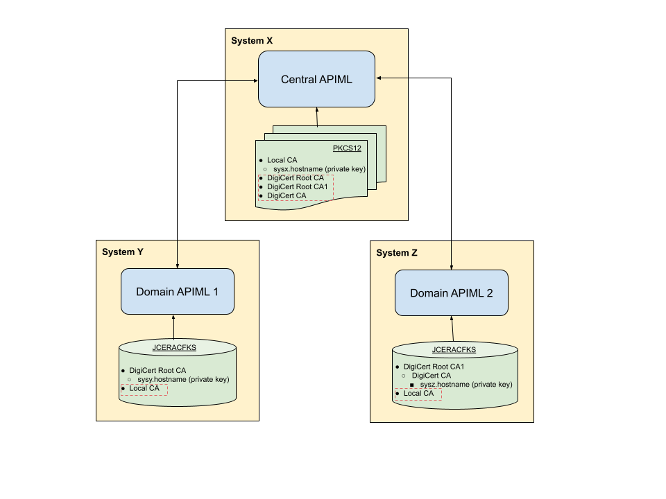

# Multitenancy Configuration

Zowe supports management of multiple tenants, whereby different tenants can serve different purposes or different customers. The use case for multi-tenant support is when a service provider manages sysplexes/monoplexes for multiple customers. This configuration makes it possible to have a single access point for all customers, and properly route and authenticate across different domains.

## Overview of API MLs 

The following diagram illustrates communication between the API Mediation Layers and Zowe in multiple domains. Note that some API MLs may be running in a sysplex (HA), while others may be in a monoplex (non-HA).


The diagram illustrates a Multitenacy environment where the API MLs in Domain(2-N) are registered to API ML in Domain-1. The API ML in Domain-1 may be running on z/OS, or off z/OS, for example in Kubernetes. This API ML serves as a single point of access to all API Mediation Layers registered in this and, by extension, to all services registered in those API MLs.

The API MLs in Domain(2-N) are installed on z/OS systems with the standard Zowe API ML running either in HA (sysplex) or non-HA (monoplex). These API MLs are registered to API ML in Domain-1.

## Multitenancy component enablement settings

In the multitenancy environment, certain Zowe components may be enabled, while others may be disabled. The multitenancy environment expects one API ML (for example API ML in Domain-1) that handles the discovery and registration as well as routing to the other API MLs (API MLs in Domain(2-N)) installed in any other specific domains. 

## Onboarding a Gateway service in one domain to the Discovery service of API ML in another domain

A Gateway from any domain can onboard Gateways of any other domains. Onboarding this service can be achieved similar to additional registrations of the Gateway. This section describes the dynamic configuration of the yaml file and environment variables, and how to validate successful configuration.

- [Dynamic configuration via zowe.yaml](#dynamic-configuration-via-zoweyaml)
- [Dynamic configuration via Environment variables](#dynamic-configuration-via-environment-variables)

### Dynamic configuration via zowe.yaml 

1. In zowe.yml, set the following property for the Gateway of API MLs in Domain(2-N) to dynamically onboard to the Discovery service of API ML in Domain-1:

`components.gateway.apiml.service.additionalRegistration`

Use the following example as a template for how to set the value of this property in zowe.yml.

**Example:**
```
components.gateway.apiml.service.additionalRegistration:
      # APIML in Domain-1 (in HA, for non-HA mode use only 1 hostname)
      - discoveryServiceUrls: https://sys1:{discoveryServicePort}/eureka/,https://sys2:{discoveryServicePort}/eureka/
  ```

:::note Notes:
  * Ensure that each API ML instance is defined in a separated record. Do not combine multiple API ML instances in a single record. In the case of a high availability setup, the value `discoveryServiceUrls` may contain multiple URLs.

  * We highly recommend to provide all available Discovery URLs in the value `discoveryServiceUrls`.

  * Always provide the direct address to the system. Do not use the DVIPA address. Using this DVIPA address could lead to unexpected behaviour.

  * Use hostnames `sys1` and `sys2` for the LPAR in the sysplex.
:::

2. (Optional) Configure the Gateway to forward client certificates.   
Use this step to enable the domain(2-N) Gateway to use this client certificate for authentication.  
Set the `certificatesUrl` property to ensure that only  Gateway-forwarded certificates are used for client certificate authentication. This URL returns a certificate chain from the Gateway.

```
components.gateway.apiml.security.x509:
    # gateway port in domain-1 
    certificatesUrl: https://{gatewayHost}:{gatewayPort}/gateway/certificates
```

### Dynamic configuration via Environment variables

The list of additional registrations is extracted from environment variables. You can define a list of objects by following YML -> Environment translation rules. 

The previous example can be substituted with the following variables:

```
ZWE_CONFIGS_APIML_SERVICE_ADDITIONALREGISTRATION_0_DISCOVERYSERVICEURLS=https://sys1:{discoveryServicePort}/eureka/,https://sys2:{discoveryServicePort}/eureka/
ZWE_CONFIGS_APIML_SERVICE_ADDITIONALREGISTRATION_0_ROUTES_0_GATEWAYURL=/
ZWE_CONFIGS_APIML_SERVICE_ADDITIONALREGISTRATION_0_ROUTES_0_SERVICEURL=/
```

* **#**  
`#` in `ZWE_CONFIGS_APIML_SERVICE_ADDITIONALREGISTRATION_#_*` specifies the ID of API ML instance.

:::note Notes:

  * Ensure that each API ML instance is defined in a separated record. Do not combine multiple API ML instances in a 
  single record. In the case of a high availability setup, the value `discoveryServiceUrls` may contain multiple URLs. 
  We highly recommend to provide all available Discovery URLs in the value `discoveryServiceUrls`.

  * Always provide the direct address to the system. Do not use the DVIPA address. Using this address could lead to unexpected behaviour.

  * Use hostnames `sys1` and `sys2` for the LPAR in the sysplex.
:::

This Zowe configuration transforms the zowe.yaml configuration file into the environment variables described previously. 

### Validating successful configuration

The corresponding Gateway service in domain(2-N) should appear in the Eureka console of the Discovery service in the domain-1 API ML. 

To see details of all instances of the ‘GATEWAY’ application, perform a **GET** call on the following endpoint of the Discovery service in domain-1 API ML:

```
/eureka/apps
```

## Establishing a trust relationship between the API MLs

For routing to work in a multitenancy configuration, as represented in the previous diagram where "Domain API ML 2" and "Domain API ML 3" are registered to "Domain API ML 1", "Domain API ML 1" must trust  "Domain API ML 2" and "Domain API ML 3". This trust is required for successful registration into the Discovery Service component of Domain API ML 1.

To accept routed requests, "Domain API ML 2" and "Domain API ML 3" must trust the "Domain API ML 1" Gateway where Domains API ML 2 and 3 are registered to.
It is necessary that the root and, if applicable, intermediate public certificates are shared between these domain API Mediation Layers. 

The following diagram shows the relationship between the API MLs. 



As illustrated in this example diagram, The API MLs are installed on systems X, Y, and Z.

To establish secure communications, "Domain API ML 2" and "Domain API ML 3" use different private keys signed with different public keys. These API MLs do not trust each other.

In multitenancy set up, in order for all API MLs to register with "Domain API ML 1", it is necessary that "Domain API ML 1" has all public keys from the certificate chains of all registered API MLs:
* DigiCert Root CA
* DigiCert Root CA1
* DigiCert CA

These public keys are required for the "Domain API ML 1" to establish trust with "Domain API ML 2" and "Domain API ML 3". 

"Domain API ML 1" uses a private key which is signed by the local CA public key for secure communication. 

"Domain API ML 2" and "Domain API ML 3" require a local CA public key to accept routing requests from "Domain API ML 1". Without these local CA public keys "Domain API ML 1" requests will not be trusted by the registered API MLs.
All added certificates are indicated in the diagram inside the red dashed lines.

### Commands to establish trust between the API MLs

The following commands are examples of establishing a trust relationship between API MLs in Multitenancy Configuration for both PKCS12 certificates and when using keyrings.

1. Import the root and, if applicable, the intermediate public key certificate of registered "Domain API ML 2" and "Domain API ML 3" API MLs running on systems Y and Z into the truststore of the "Domain API ML 1" running on system X.

  - **PKCS12**
  
    For PKCS12 certificates, use the following example of keytool commands:
  
    `keytool -import -file sysy/keystore/local_ca/local_ca.cer -alias gateway_sysy -keystore sysx/keystore/localhost/localhost.truststore.p12`
  
    `keytool -import -file sysz/keystore/local_ca/local_ca.cer -alias gateway_sysz -keystore sysx/keystore/localhost/localhost.truststore.p12`

  - **Keyring**
      
    For keyrings, use the following examples of commands specific to your ESM to add certificates from the dataset and connect these certificates to the keyring used by the "Domain APIML 1":

    <details>
    <summary>Click here for command details for RACF.</summary>
    - **For RACF:**
      
      ```
      RACDCERT ADD('SHARE.SYSY.ROOTCA.CER') ID(ZWESVUSR) WITHLABEL('DigiCert Root CA') TRUST
      RACDCERT ADD('SHARE.SYSZ.INTERCA.CER') ID(ZWESVUSR) WITHLABEL('DigiCert CA') TRUST
      RACDCERT ID(ZWESVUSR) CONNECT(ID(ZWESVUSR) LABEL('DigiCert Root CA') RING(ZoweKeyring) USAGE(CERTAUTH))
      RACDCERT ID(ZWESVUSR) CONNECT(ID(ZWESVUSR) LABEL('DigiCert CA') RING(ZoweKeyring) USAGE(CERTAUTH))
      SETROPTS RACLIST(DIGTCERT, DIGTRING) REFRESH
      ```

      Verify:
      ```
      RACDCERT LISTRING(ZoweKeyring) ID(ZWESVUSR)
      ```
    </details>

    <details>
    <summary>Click here for command details for ACF2.</summary>
    - **For ACF2:**
      
      ```
      ACF
      SET PROFILE(USER) DIV(CERTDATA)
      INSERT CERTAUTH.SYSYROOT DSNAME('SHARE.SYSY.ROOTCA.CER') LABEL(DigiCert Root CA) TRUST
      INSERT CERTAUTH.SYSZINTR DSNAME('SHARE.SYSZ.INTERCA.CER') LABEL(DigiCert CA) TRUST
      F ACF2,REBUILD(USR),CLASS(P),DIVISION(CERTDATA)
      
      SET PROFILE(USER) DIVISION(KEYRING)
      CONNECT CERTDATA(CERTAUTH.SYSYROOT) LABEL(DigiCert Root CA) KEYRING(ZWESVUSR.ZOWERING) USAGE(CERTAUTH)
      CONNECT CERTDATA(CERTAUTH.SYSZINTR) LABEL(DigiCert CA) KEYRING(ZWESVUSR.ZOWERING) USAGE(CERTAUTH)
      F ACF2,REBUILD(USR),CLASS(P),DIVISION(KEYRING)
      ```
      
      Verify:
      ```
      SET PROFILE(USER) DIVISION(KEYRING)
      LIST LIKE(ZWESVUSR.-)
      ```
    </details>

    <details>
    <summary>Click here for command details for Top Secret.</summary>
    - **For Top Secret:**
      
      ```
      TSS ADD(CERTAUTH) DCDS(SHARE.SYSY.ROOTCA.CER)  DIGICERT(SYSYROOT) LABLCERT('DigiCert Root CA') TRUST
      TSS ADD(CERTAUTH) DCDS(SHARE.SYSZ.INTERCA.CER)  DIGICERT(SYSZINTR) LABLCERT('DigiCert CA') TRUST
      TSS ADD(ZWESVUSR) KEYRING(ZOWERING) RINGDATA(CERTAUTH,SYSYROOT) USAGE(CERTAUTH)
      TSS ADD(ZWESVUSR) KEYRING(ZOWERING) RINGDATA(CERTAUTH,SYSZINTR) USAGE(CERTAUTH)
      ```

      Verify:
      ```
      TSS LIST(ZWESVUSR) KEYRING(ZOWERING)
      ```
    </details>  
      
2. Import root and, if applicable, intermediate public key certificates of the API ML running on system X into the truststore of the API MLs running on systems Y and Z.

  - **PKCS12**

    For PKCS12 certificates, use the following example of the keytool commands:

    `keytool -import -file x/keystore/local_ca/local_ca.cer -alias gateway_x -keystore y/keystore/localhost/localhost.truststore.p12`

    `keytool -import -file x/keystore/local_ca/local_ca.cer -alias gateway_x -keystore z/keystore/localhost/localhost.truststore.p12`
  
  - **Keyring**

    For keyring certificates, use the following examples of commands specific to your ESM to add certificates from the dataset, and connect these certificates to the keyrings used by registered API MLs:
  
    <details>
    <summary>Click here for command details for RACF.</summary>
    - **For RACF:**
  
      ```
      RACDCERT ADD('SHARE.SYSX.ROOTCA.CER') ID(ZWESVUSR) WITHLABEL('Local CA') TRUST
      RACDCERT ID(ZWESVUSR) CONNECT(ID(ZWESVUSR) LABEL('Local CA') RING(ZoweKeyring) USAGE(CERTAUTH))
      SETROPTS RACLIST(DIGTCERT, DIGTRING) REFRESH
      ```

      Verify:
      ```
      RACDCERT LISTRING(ZoweKeyring) ID(ZWESVUSR)
      ```
    </details>

    <details>
    <summary>Click here for details for ACF2.</summary>
    - **For ACF2:**
  
      ```
      ACF
      SET PROFILE(USER) DIV(CERTDATA)
      INSERT CERTAUTH.SYSXROOT DSNAME('SHARE.SYSX.ROOTCA.CER') LABEL(Local CA) TRUST
      F ACF2,REBUILD(USR),CLASS(P),DIVISION(CERTDATA)
      
      SET PROFILE(USER) DIVISION(KEYRING)
      CONNECT CERTDATA(CERTAUTH.SYSXROOT) LABEL(Local CA) KEYRING(ZWESVUSR.ZOWERING) USAGE(CERTAUTH)
      F ACF2,REBUILD(USR),CLASS(P),DIVISION(KEYRING)
      ```

      Verify:
      ```
      SET PROFILE(USER) DIVISION(KEYRING)
      LIST LIKE(ZWESVUSR.-)
      ```
    </details>

    <details>
    <summary>Click here for command details for Top Secret.</summary>

    - **For Top Secret:**
  
      ```
      TSS ADD(CERTAUTH) DCDS(SHARE.SYSX.ROOTCA.CER)  DIGICERT(SYSXROOT) LABLCERT('Local CA') TRUST
      TSS ADD(ZWESVUSR) KEYRING(ZOWERING) RINGDATA(CERTAUTH,SYSXROOT) USAGE(CERTAUTH)
      ```

      Verify:
      ```
      TSS LIST(ZWESVUSR) KEYRING(ZOWERING)
      ```
    </details>

You completed certificates setup for multitenancy configuration, whereby registered API MLs can trust the API ML where they are registered and vice versa.

## Using the `/registry` endpoint in the Gateway

The `/registry` endpoint provides information about services onboarded to all registered Gateways. This section describes the configuration, authentication, authorization, example of requests, and responses when using the `/registry` endpoint. 

### Configuration for `/registry`

The `/registry` endpoint is disabled by default. Use the configuration property `apiml.gateway.registry.enabled=true` or
environment variable `APIML_GATEWAY_REGISTRY_ENABLED=TRUE` to enable this feature.

### Authentication for `/registry`

The `/registry` endpoint is authenticated by the client certificate. The Gateway accepts certificates that are trusted. The username is obtained from the common name of the client certificate.

Unsuccessful authentication returns a 401 error code.

### Authorization with `/registry`

Only users configured by the following environment variable are allowed to use the `/registry` endpoint.

`APIML_SECURITY_X509_REGISTRY_ALLOWEDUSERS=USER1,user2,User3`

This parameter makes it possible to set multiple users as a comma-separated list.

Unsuccessful authorization returns a 403 error code. 

### Requests with `/registry`

There are two endpoints that provide information about services registered to the API ML. One endpoint is for all APIMLs, and the other endpoint is for the specific APIML. Choose from the following **GET** calls:

* **`GET /gateway/api/v1/registry`**  
This request lists services in all API MLs.

* **`GET /gateway/api/v1/registry/{apimlId}`**  
This request lists services in the API ML of the specific apimlId given.

* **`GET /gateway/api/v1/registry/{apimlId}?apiId={apiId}&serviceId={serviceId}`**  
  This request gets the specific service from the API ML in the specific apimlId.

### Response with `/registry`

<details>
<summary>Click here for an example of the response with /registry</summary>

**Example:**

```
[
    {
        "apimlId": "apiml1",
        "services": [
            {
                "status": "UP",
                "customMetadata": {
                    "zos.sysname": "sys1",
		            "zos.sysplex": "sysplex"
                },
                "apiId": [
                    "zowe.apiml.gateway"
                ],
                "serviceId": "gateway"
            }
        ]
    },
    {
        "apimlId": "apiml2",
        "services": [
            {
                "status": "UP",
                "customMetadata": {
                    "zos.sysname": "sys2",
		            "zos.sysplex": "sysplex"
				},
                "apiId": [
                    "zowe.apiml.gateway"
                ],
                "serviceId": "gateway"
            },
            {
                "status": "UP",
                "customMetadata": {
                    "zos.sysname": "sys2",
 		            "zos.sysplex": "sysplex"
 		        },
                "apiId": [
                    "zowe.apiml.catalog"
                ],
                "serviceId": "catalog"
            }
        ]
    }
]
```
</details>

### Response with `/registry{apimlId}`

This response should contain information about all services in an API ML with the specific apimlId.

<details>
<summary>Click here for an example response</summary>

**Example:**

* `GET /gateway/api/v1/registry/apiml2`

```
[
    {
        "apimlId": "apiml2",
        "services": [
            {
                "status": "UP",
                "customMetadata": {
                    "zos.sysname": "sys2",
	 	            "zos.sysplex": "sysplex"
				},
                "apiId": [
                    "zowe.apiml.gateway"
                ],
                "serviceId": "gateway"
            },
            {
                "status": "UP",
                "customMetadata": {
                    "zos.sysname": "sys2",
		            "zos.sysplex": "sysplex"
				},
                "apiId": [
                    "zowe.apiml.catalog"
                ],
                "serviceId": "catalog"
            }
        ]
    }
]
```

</details>

### Response with `GET /gateway/api/v1/registry/{apimlId}?apiId={apiId}&serviceId={serviceId}`

This response should contain information about a specific service in an APIML with the specific apimlId.

<details>
<summary>Click here for an example response</summary>

**Example:**

* `GET /gateway/api/v1/registry/apiml2?apiId=zowe.apiml.gateway&serviceId=catalog`

```
 [
    {
        "apimlId": "apiml2",
        "services": [
            {
                "status": "UP",
                "customMetadata": {
                    "zos.sysname": "sys2",
		             "zos.sysplex": "sysplex"
                },
                "apiId": [
                    "zowe.apiml.catalog"
                ],
                "serviceId": "catalog"
            }
        ]
    }
]
```
</details>

## Validating successful configuration with `/registry`

Use the `/registry` endpoint to validate successful configuration. The response should contain all the API MLs represented by `apimlId`, and information about onboarded services.

## Gateway static definition example (deprecated)

The Gateway static definition file should be stored together with other statically onboarded services. The default location is `/zowe/runtime/instance/workspace/api-mediation/api-defs/`. 
There is no naming restriction of the filename, but the file extension must be `yml`.

<details>
<summary>Click here for a Gateway static definition example.</summary>

**Example:**
```
#
# Static definition of "discoverable-client" as "staticclient"
#
# This file provides static API service definition in YAML format.
# It is loaded by the Discovery Service during its startup.
#
services:
   - serviceId: GATEWAY  # unique lowercase ID of the service
     catalogUiTileId: static  # ID of the API Catalog UI tile (visual grouping of the services)
     title: Statically Defined API Service  # Title of the service in the API catalog
     description: Sample to demonstrate how to add an API service with Swagger to API Catalog using a static YAML definition  # Description of the service in the API catalog
     instanceBaseUrls:  # list of base URLs for each instance
         - https://sys1:{gatewayPort}/  # scheme://hostname:port/contextPath
     homePageRelativeUrl: / # Normally used for informational purposes for other services to use it as a landing page
     statusPageRelativeUrl: /application/info  # Appended to the instanceBaseUrl
     healthCheckRelativeUrl: /application/health  # Appended to the instanceBaseUrl
     routes:
         - gatewayUrl: api/v1  # [api/ui/ws]/v{majorVersion}
           serviceRelativeUrl: /api/v1 # relativePath that is added to baseUrl of an instance
         - gatewayUrl: ui/v1
           serviceRelativeUrl: /
         - gatewayUrl: ws/v1
           serviceRelativeUrl: /ws
     # List of APIs provided by the service (currently only one is supported):
     apiInfo:
         - apiId: zowe.apiml.gateway
           gatewayUrl: api/v1
           swaggerUrl: https://sys1:{discoverableClientPort}/discoverableclient/v2/api-docs
     customMetadata:
         apiml:
             service.apimlId: apiml1
             okToRetryOnAllOperations: true


   - serviceId: GATEWAY  # unique lowercase ID of the service
     catalogUiTileId: static  # ID of the API Catalog UI tile (visual grouping of the services)
     title: Statically Defined API Service  # Title of the service in the API catalog
     description: Sample to demonstrate how to add an API service with Swagger to API Catalog using a static YAML definition  # Description of the service in the API catalog
     instanceBaseUrls:  # list of base URLs for each instance
         - https://sys2:{gatewayPort}/  # scheme://hostname:port/contextPath
     homePageRelativeUrl: / # Normally used for informational purposes for other services to use it as a landing page
     statusPageRelativeUrl: /application/info  # Appended to the instanceBaseUrl
     healthCheckRelativeUrl: /application/health  # Appended to the instanceBaseUrl
     routes:
         - gatewayUrl: api/v1  # [api/ui/ws]/v{majorVersion}
           serviceRelativeUrl: /api/v1 # relativePath that is added to baseUrl of an instance
         - gatewayUrl: ui/v1
           serviceRelativeUrl: /
         - gatewayUrl: ws/v1
           serviceRelativeUrl: /ws
     # List of APIs provided by the service (currently only one is supported):
     apiInfo:
         - apiId: zowe.apiml.gateway
           gatewayUrl: api/v1
           swaggerUrl: https://sys2:{discoverableClientPort}/discoverableclient/v2/api-docs
     customMetadata:
         apiml:
             service.apimlId: apiml2
             okToRetryOnAllOperations: true


# List of tiles that can be used by services defined in the YAML file:
catalogUiTiles:
   static:
       title: Static API Services
       description: Services which demonstrate how to make an API service discoverable in the APIML ecosystem using YAML definitions

```
</details>

## Troubleshooting multitenancy configuration

### ZWESG100W

Cannot receive information about services on API Gateway with apimlId 'apiml1' because: Received fatal alert: certificate_unknown; nested exception is javax.net.ssl.SSLHandshakeException: Received fatal alert: certificate_unknown

**Reason**  
Cannot connect to the Gateway service. 

**Action**  
Make sure that the external Gateway service is running and the truststore of the both Gateways contains the corresponding certificate.

