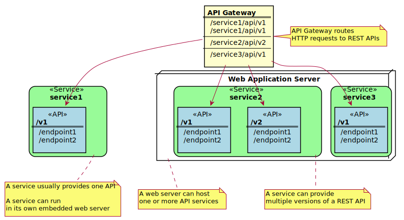

# Onboard an existing REST API service with the Zowe API Mediation Layer without code changes

As a user of Zowe API Mediation Layer, onboard a REST API service into the Zowe API Mediation Layer without changing the code of the API service. The following procedure is an overview of steps to onboard an API service through the API Gateway in the API Mediation Layer.

**Follow these steps:**

<!-- TOC depthFrom:2 orderedList:true -->

1. [Overview of APIs](#overview-of-apis)
2. [Identify the API that you want to expose](#identify-the-api-that-you-want-to-expose)
3. [Define the service and API in the YAML format](#define-the-service-and-api-in-the-yaml-format)
4. [Configuration parameters](#configuration-parameters)
5. [Add and validate the definition in the API Mediation Layer running on your machine](#add-and-validate-the-definition-in-the-api-mediation-layer-running-on-your-machine)
6. [Add a definition in the API Mediation Layer in the Zowe runtime](#add-a-definition-in-the-api-mediation-layer-in-the-zowe-runtime)
7. [(Optional) Check the log of the API Mediation Layer](#optional-check-the-log-of-the-api-mediation-layer)
8. [(Optional) Reload the services definition after the update when the API Mediation Layer is already started](#optional-reload-the-services-definition-after-the-update-when-the-api-mediation-layer-is-already-started)

<!-- /TOC -->

## Overview of APIs

Before you can identify the API you want to expose, it is useful to consider the structure of an API. An API or application programming interface is a set of rules that allow programs to talk to each other. A developer creates an API on a server and allows the client to talk to the API. Representational State Transfer (REST) determines the look of the API. REST is a set of rules that developers follow when creating an API. One of these rules states that a user should be able to get a piece of data (called a resource) accessible via URL endpoints through HTTP. These resources are usually represented in the form of JSON or XML documents. The preferred documentation type in Zowe is JSON format.

REST APIs are provided by REST API services. A REST API service can provide one or more REST APIs. A service usually provides the latest version of its API. A REST service is hosted on a web server which can host one or more services. A service is sometimes called _application_. A web server that hosts multiple services (applications) is usually called a _web application server_. Examples of _web application servers_ are [Apache Tomcat](http://tomcat.apache.org/) or [WebSphere Liberty](https://developer.ibm.com/wasdev/websphere-liberty/). 

**Note:** Definitions used in this procedure follow the [OpenAPI specification](https://swagger.io/specification/). 
Each API has its own title, description, and version (versioned using [Semantic Versioning 2.0.0](https://semver.org/spec/v2.0.0.html).



## Identify the API that you want to expose

The first step to onboard an API service through the API Gateway without making code changes is to identify the API you want to expose.

In microservice architecture, a web server usually provides one service. A typical example of such implementation is a Spring Boot web application. The following example uses a Spring Boot web service: https://github.com/swagger-api/swagger-samples/tree/master/java/java-spring-boot.

You can build this service using instructions in the source code of that example (https://github.com/swagger-api/swagger-samples/blob/master/java/java-spring-boot/README.md) or you can use another existing service.

The sample service has a base URL. If you start this service on your computer, the _service base URL_ is: http://localhost:8080. 

If a service is deployed to an application server, a  base URL of the service (application) can be: `http://application-server-hostname:port/application-name.`

This service provides one API that has the base path `/v2`, which is represented in the base URL of the API as http://localhost:8080/v2.

This API provides only one endpoint:

- `/pets/{id}` - *Find pet by ID*. This endpoint returns a pet when 0 < ID <= 10. ID > 10 or when non-integers simulate API error conditions.

Access http://localhost:8080/v2/pets/1 to get the following response:

```json
{
    "category": {
        "id": 2,
        "name": "Cats"
    },
    "id": 1,
    "name": "Cat 1",
    "photoUrls": [
        "url1",
        "url2"
    ],
    "status": "available",
    "tags": [
        {
            "id": 1,
            "name": "tag1"
        },
        {
            "id": 2,
            "name": "tag2"
        }
    ]
}
```

The following example defines a new REST API service in the API Mediation Layer. This service generates one REST API.

The _service ID_ of a service identifies the service in the API Gateway. The service ID is an alphanumeric string in lowercase ASCII (for example `petstore`). The API Gateway differentiates major versions of an API. For example, to access version 2 of the `petstore` API you use the following gateway URL:

    https://gateway-host:port/api/v2/petstore

The base URL of the version 2 of the `petstore` API is:

    http://localhost:8080/v2

The API Gateway routes REST API requests from the gateway URL `https://gateway:port/api/v2/petstore` to the service `http://localhost:8080/v2`.

As an user of the API Gateway, access the service only through the gateway URL. This enables you to access the service through a stable URL and move the service to another machine without changing the gateway URL. Accessing a service through the API Gateway also enables you to have multiple instances of the service running on different machines to achieve high-availability.

## Define the service and API in the YAML format

To define the sample `petstore` service used in this example, provide the following definition in a YAML file:

```yaml
services:
    - serviceId: petstore
      instanceBaseUrls:
        - http://localhost:8080
      routes:
        - gatewayUrl: api/v2
          serviceRelativeUrl: /v2
```

In this example, a suitable name for the file is `petstore.yml`. The filename does not need to follow specific naming conventions but it requires the `.yml` extension.

The file can contain one or more services defined under the `services:` node.

Each service has a service ID. In this example, the service ID is `petstore`. The service can have one or more instances. In this case, only one instance `http://localhost:8080` is used.

A service can provide multiple APIs that are routed by the API Gateway. In this case, requests with the relative base path `api/v2` at the API Gateway (full gateway URL: `https://gateway:port/api/v2/...`) are routed to the relative base path `/v2` at the full URL of the service (`http://localhost:8080/v2/...`).

**Tips:** 
    * There are more examples of API definitions in https://github.com/gizafoundation/api-layer/tree/master/config/local/api-defs.

    * For more details about YAML formatting, see https://learnxinyminutes.com/docs/yaml/

## Configuration parameters##

The following list describes the configuration parameters:

* **serviceId**

    Specifies the service instance identifier that is registered in the API Mediation Layer installation. 
    The service ID is used in the URL for routing to the API service through the gateway. 
    The service ID uniquely identifies the service in the API Mediation Layer. 
    The system administrator at the customer site defines this parameter.
    
    **Important!**  Ensure that the service ID is set properly with the following considerations:

    * When two API services use the same service ID, the API gateway considers the services to be clones (two instances for the same service). An incoming API request can be routed to either of them.
    * The same service ID should be set only for multiple API service instances for API scalability.
    * The service ID value must contain only lowercase alphanumeric characters.
    * The service ID cannot contain more than 40 characters.
    * The service ID is linked to security resources. Changes to the service ID require an update of security resources.
    
    **Examples:**
    * If the customer system administrator sets the service ID to `sysviewlpr1`, the API URL in the API Gateway appears as the following URL: 

            https://gateway:port/api/v1/sysviewlpr1/...

    * If customer system administrator sets the service ID to `vantageprod1`, the API URL in the API Gateway appears as the following URL:

            http://gateway:port/api/v1/vantageprod1/...

* **baseUrl**

    Specifies the URL to your service to the REST resource. It will be the prefix for the following URLs:
    
    * **homePageRelativeUrl**
    * **statusPageRelativeUrl**
    * **healthCheckRelativeUrl**
    
    **Examples:** 
    * `http://host:port/serviceid` for HTTP service
    * `https://host:port/serviceid` for HTTPS service
 
* **homePageRelativeUrl** 

    Specifies the relative path to the homepage of your service. The path should start with `/`.
    If your service has no homepage, omit this parameter. 

    **Examples:**
    * `homePageRelativeUrl: /` The service has homepage with URL `${baseUrl}/`
    * `homePageRelativeUrl: /ui/` The service has homepage with URL `${baseUrl}/ui/`
    * `homePageRelativeUrl: ` The service has homepage with URL `${baseUrl}`
  
* **statusPageRelativeUrl**

    Specifies the relative path to the status page of your service.
    Start this path with `/`. If you service has not a status page, omit this parameter.

    **Example:**
    * `statusPageRelativeUrl: /application/info` the result URL will be `${baseUrl}/application/info`
  
* **healthCheckRelativeUrl**

    Specifies the relative path to the health check endpoint of your service. 
    Start this URL with `/`. If you service has not a health check endpoint, omit this parameter.

    **Example:**
    * `healthCheckRelativeUrl: /application/health`. This results in the URL:
    `${baseUrl}/application/health`
    
* **routes**

    The routing rules between the gateway service and your service.

    * **routes.gatewayUrl**
    
        Both _gateway-url_ and _service-url_ parameters specify how the API service endpoints are mapped to the API
        gateway endpoints. The _gateway-url_ parameter sets the target endpoint on the gateway.

    * **routes.serviceUrl**
    
        Both _gateway-url_ and _service-url_ parameters specify how the API service endpoints are mapped to the API
        gateway endpoints. The _service-url_ parameter points to the target endpoint on the gateway.


## Add and validate the definition in the API Mediation Layer running on your machine

After you define the service in YAML format, you are ready to add your service definition to the API Mediation Layer ecosystem.

The following procedure describes how to add your service to the API Mediation Layer on your local machine.

**Follow these steps:**

1.  Copy or move your YAML file to the `config/local/api-defs` directory in the directory with API Mediation layer.

2.  Start the API Mediation Layer services.

    **Tip:** For more information about how to run the API Mediation Layer locally, see [Running the API Mediation Layer on Local Machine.](https://github.com/gizafoundation/api-layer/blob/master/docs/local-configuration.md) 
    
3.  Run your Java application. 

    **Tip:** Wait for the services to be ready. This process may take a few minutes.

4.  Go to the following URL to reach the API Gateway (port 10010) and see the paths that are routed by the API Gateway:

        https://localhost:10010/application/routes

    The following line should appear:

        /api/v2/petstore/**: "petstore"

    This line indicates that requests to relative gateway paths that start with `/api/v2/petstore/` are routed to the service with service ID `petstore`.

    You successfully defined your Java application if your service is running and you can access the service endpoints. The following example is the service endpoint for the sample application:

        https://localhost:10010/api/v2/petstore/pets/1


## Add a definition in the API Mediation Layer in the Zowe runtime

After you define and validate the service in YAML format, you are ready to add your service definition to the API Mediation Layer running as part of the Zowe runtime installation. 

**Follow these steps:**

1. Locate the Zowe runtime directory. The Zowe runtime directory was chosen during Zowe installation. 
   Its location is in the `zowe-install.yaml` file in the variable `install:rootDir`. 

    **Note:** We use the `${zoweRuntime}` symbol in following instructions.

2. Copy your YAML file to the `${zoweRuntime}/api-mediation/api-defs` directory.

3. Run your application. 

4. Restart Zowe runtime or follow steps in section [(Optional) Reload the services definition after the update when the API Mediation Layer is already started](#optional-reload-the-services-definition-after-the-update-when-the-api-mediation-layer-is-already-started).

5.  Go to the following URL to reach the API Gateway (default port 7554) and see the paths that are routed by the API Gateway:

        https://${zoweHostname}:${gatewayHttpsPort}/application/routes

   The following line should appear:

        /api/v2/petstore/**: "petstore"

    This line says that requests to the relative gateway paths that start with `/api/v2/petstore/` are routed to the service with service ID `petstore`.

    You successfully defined your Java application if your service is running and you can access its endpoints. The endpoint displayed for the sample application is:

        https://l${zoweHostname}:${gatewayHttpsPort}/api/v2/petstore/pets/1


## (Optional) Check the log of the API Mediation Layer

The API Mediation Layer prints the following messages to its log when the API definitions are processed:

        Scanning directory with static services definition: config/local/api-defs
        Static API definition file: /Users/plape03/workspace/api-layer/config/local/api-defs/petstore.yml
        Adding static instance STATIC-localhost:petstore:8080 for service ID petstore mapped to URL http://localhost:8080


## (Optional) Reload the services definition after the update when the API Mediation Layer is already started

The following procedure enables you to refresh the API definitions after you change the definitions whin the API Mediation Layer is already running.

**Follow these steps:**

1. Use a REST API client to issue a POST request to the Discovery Service (port 10011):
    
        http://localhost:10011/discovery/api/v1/staticApi

    Discovery Services requires authentication. If the API Mediation Layer running on your local machine, the user ID is `eureka`, and the password is `password`.

    This example uses the [HTTPie command-line HTTP client](https://httpie.org):
   
        http -j -a eureka:password POST http://localhost:10011/discovery/api/v1/staticApi

2. Check if your updated definition is effective.

    **Note:** It can take up 30 seconds to API Gateway to pick up the new routing.

    **Note:** The basic authentication will be replaced by client certificates when the Discovery Service is updated to use HTTPS.
