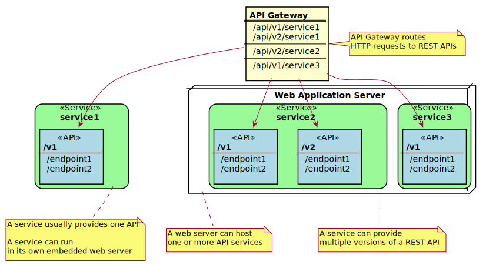

# Onboarding Overview

## Overview of APIs

Before identifying the API you want to expose in the API Mediation Layer, it is useful to consider the structure of APIs. An application programming interface (API) is a set of rules that allow programs to talk to each other. A developer creates an API on a server and allows a client to talk to the API. Representational State Transfer (REST) determines the look of an API and is a set of rules that developers follow when creating an API. One of these rules states that a user should be able to get a piece of data (resource) through URL endpoints using HTTP. These resources are usually represented in the form of JSON or XML documents. The preferred documentation type in Zowe is in the JSON format.

A REST API service can provide one or more REST APIs and usually provides the latest version of each API. A REST service is hosted on a web server which can host one or more services, often referred to as _applications_. A web server that hosts multiple services  or applications is referred to as a _web application server_. Examples of _web application servers_ are [Apache Tomcat](http://tomcat.apache.org/) or [WebSphere Liberty](https://developer.ibm.com/wasdev/websphere-liberty/). 

**Note:** Definitions used in this procedure follow the [OpenAPI specification](https://swagger.io/specification/). 
Each API has its own title, description, and version (versioned using [Semantic Versioning 2.0.0](https://semver.org/spec/v2.0.0.html)).

Following diagram shows the relations between various types of services, their APIs, REST API endpoints, and API gateway:




## Sample REST API Service

In microservice architecture, a web server usually provides a single service. A typical example of a single service implementation is a Spring Boot web application. 

To demonstrate the concepts that apply to REST API services, we use the following example of a Spring Boot REST API service: https://github.com/swagger-api/swagger-samples/tree/master/java/java-spring-boot. This example is used in the REST API onboarding guide: **REST API without code changes required**. 

You can build this service using instructions in the source code of the Spring Boot REST API service example (https://github.com/swagger-api/swagger-samples/blob/master/java/java-spring-boot/README.md).

The Sample REST API Service has a base URL. When you start this service on your computer, the _service base URL_ is: `http://localhost:8080`. 

**Note:** If a service is deployed to a web application server, the base URL of the service (application) has the following format: `https://application-server-hostname:port/application-name`.

This service provides one API that has the base path `/v2`, which is represented in the base URL of the API as `http://localhost:8080/v2`. The `/v2` is the component  of the base path that was chosen by the developer of this API. Each API has a base path depending on the particular implementation of the service. 

This sample API has only one single endpoint:

- `/pets/{id}` - *Find pet by ID*. This endpoint in this sample service returns information about a pet when the `{id}` is between 0 and 10. If `{id}` is greater than 0 or a non-integer then it returns an error. Thes are conditions set in the sample.

**Tip:** Access http://localhost:8080/v2/pets/1 to see what this REST API endpoint does. You should get the following response:

```json
{
    "category": {
        "id": 2,
        "name": "Cats"
    },
    "id": 1,
    "name": "Cat 1",
    "photoUrls": [
        "url1",
        "url2"
    ],
    "status": "available",
    "tags": [
        {
            "id": 1,
            "name": "tag1"
        },
        {
            "id": 2,
            "name": "tag2"
        }
    ]
}
```

**Note:** The onboarding guides demonstrate how to add the Sample REST API Service to the API Mediation Layer to make the service available through the `petstore` service ID.

The following diagram shows the relations between the Sample REST API Service, its corresponding API, REST API endpoint, and API gateway:


This sample service provides a Swagger document in JSON format at the following URL:

    http://localhost:8080/v2/swagger.json

The Swagger document is used by the API Catalog to display the API documentation.


## API Service Types

The process of onboarding depends on the method that is used to develop the API service.

While any REST API service can be added to the API Mediation Layer, this documentation focuses on following types of REST APIs:

- Services that can be updated to support the API Mediation Layer natively by updating the service code:
    - [REST API service implemented in Java using Spring Boot](api-mediation-onboard-an-existing-spring-boot-rest-api-service.md)
    - [REST API service implemented in Java using Jersey](api-mediation-onboard-an-existing-java-jersey-rest-api-service.md)
    - [REST API service implemented in Java with any REST API framework](api-mediation-onboard-an-existing-java-rest-api-service.md)
  
- [Services that can be added to the API Mediation Layer without code changes](api-mediation-onboard-an-existing-rest-api-service-without-code-changes.md)

**Tip:** If you develop a new service, we recommend that you update the code to support the API Mediation Layer natively. Use the previously mentioned onboarding guides for services that can be updated to support the API Mediation Layer natively. The benefit of supporting the API Mediation Layer natively is that it requires less configuration for the system administrator. Such service can be moved to different system, listen on different port, or additional instances can be started without the need to changed the configuration of the API Mediation Layer.
