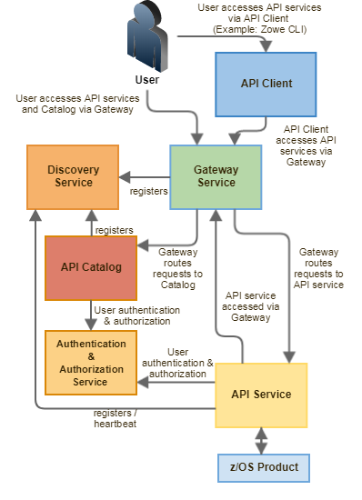

# API Mediation Layer

The API Mediation Layer provides a single point of access for mainframe service REST APIs. The layer offers enterprise, cloud-like features such as high-availability, scalability, dynamic API discovery, consistent security, a single sign-on experience, and documentation. The API Mediation Layer facilitates secure communication across loosely coupled microservices through the API Gateway. The API Mediation Layer consists of three components: the Gateway, the Discovery Service, and the Catalog. The Gateway provides secure communication across loosely coupled API services. The Discovery Service enables you to determine the location and status of service instances running inside the API ML ecosystem. The Catalog provides an easy-to-use interface to view all discovered services, their associated APIs, and Swagger documentation in a user-friendly manner. 

## Key features  
* Consistent Access: API routing and standardization of API service URLs through the Gateway component provides users with a consistent way to access mainframe APIs at a predefined address.
* Dynamic Discovery: The Discovery Service automatically determines the location and status of API services.
* High-Availability: API Mediation Layer is designed with high-availability of services and scalability in mind.
* Redundancy and Scalability: API service throughput is easily increased by starting multiple API service instances without the need to change configuration.
* Presentation of Services: The API Catalog component provides easy access to discovered API services and their associated documentation in a user-friendly manner. Access to the contents of the API Catalog is controlled through a z/OS security facility. 
* Encrypted Communication: API ML facilitates secure and trusted communication across both internal components and discovered API services.

## API Mediation Layer architecture 
The following diagram illustrates the single point of access through the Gateway, and the interactions between API ML components and services:

## Components
The API Layer consists of the following key components:

### API Gateway

Services that comprise the API ML service ecosystem are located behind a gateway (reverse proxy). All end users and API client applications interact through the Gateway. Each service is assigned a unique service ID that is used in the access URL. Based on the service ID, the Gateway forwards incoming API requests to the appropriate service. Multiple Gateway instances can be started to achieve high-availability. The Gateway access URL remains unchanged. The Gateway is built using Netflix Zuul and Spring Boot technology.

### Discovery Service

The Discovery Service is the central repository of active services in the API ML ecosystem. The Discovery Service continuously collects and aggregates service information and serves as a repository of active services. When a service is started, it sends its metadata, such as the original URL, assigned serviceId, and status information to the Discovery Service. Back-end microservices register with this service either directly or by using a Eureka client. Multiple enablers are available to help with service on-boarding of various application architectures including plain Java applications and Java applications that use the Spring Boot framework. The Discovery Service is built on Eureka and Spring Boot technology.

#### Discovery Service TLS/SSL

HTTPS protocol can be enabled during API ML configuration and is highly recommended. Beyond encrypting communication, the HTTPS configuration for the Discovery Service enables hightened security for service registration. Without HTTPS, services provide a username and password to register in the API ML ecosystem. When using HTTPS, only trusted services that provide HTTPS certificates signed by a trusted certificate authority can be registered.

### API Catalog

The API Catalog is the catalog of published API services and their associated documentation. The Catalog provides both the REST APIs and a web user interface (UI) to access them. The web UI follows the industry standard Swagger UI component to visualize API documentation in OpenAPI JSON format for each service. A service can be implemented by one or more service instances, which provide exactly the same service for high-availability or scalability. 

#### Catalog Security
 
Access to the API Catalog can be protected with an Enterprise z/OS Security Manager such as IBM RACF, ACF2, or Top Secret. Only users who provide proper mainframe credentials can access the Catalog. Client authentication is implemented through the zOSMF API. 

## Onboarding APIs
The most important part of the ecosystem are the real API services that provide useful APIs. Use the following topics to understand what options you have for adding new APIs to the Mediation Layer:

* [Onboarding Overview](../../extend/extend-apiml/onboard-overview.md)

## Caching service

The Caching service aims to provide an API which offers the possibility to store, retrieve and delete data associated with keys. The service is used only by internal Zowe applications and is not exposed to the internet. The URL of the Caching service is `https://<ZOWE_HOST_IP>:7555`. 
For more information, see the [Caching service documentation](../../extend/extend-apiml/api-mediation-caching-service.md).

## Metrics service (Techincal Preview)

The Metrics service aims to provide a web user interface to visualize requests to API Mediation Layer services. The Metrics service is currently in technical preview and is not ready for production. At this time, only core API Mediation Layer services integrate with the Metrics service. Metrics are not displayed for onboarded services. For more information, see the [Metrics service documentation](../../user-guide/api-mediation-metrics-service.md). 