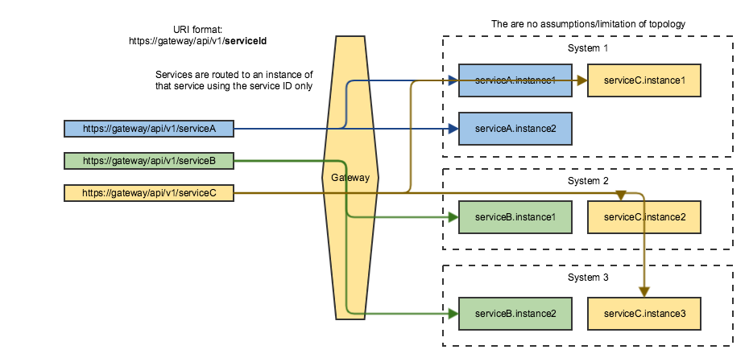
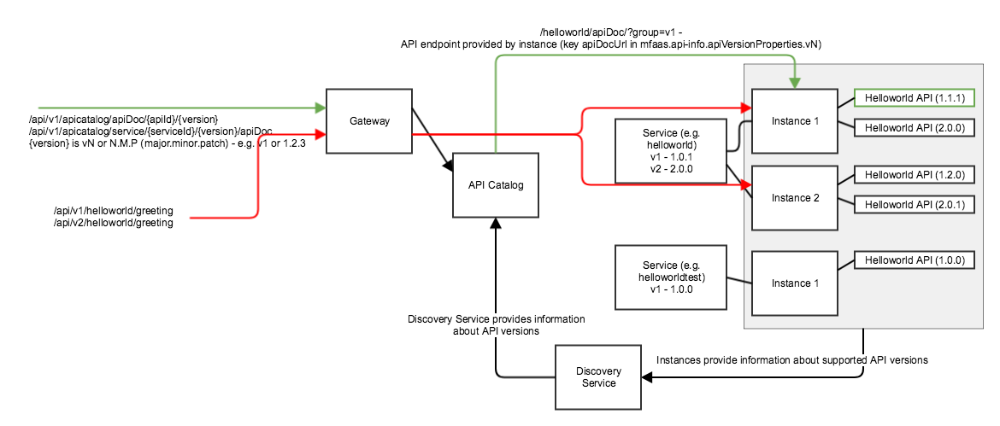

# Routing requests to REST APIs

API consumers can access any services onboarded to the API Mediation Layer through a single port. In this context, 'service' refers to one or more instances that share the same API and are onboarded under the same service Id. Some services provide versioned APIs, while other services provide an unversioned API. From the consumer side, the API Mediation Layer takes care of situations in which one instance is down and/or distributing the load between different instances of a service.

Types of services include both versioned and nonversioned services:

* **Versioned services**
Routing with service ID and version

* **Nonversioned services**
Using only the service ID

Under certain conditions it is possible to route to a specific instance of service.

## Terminology

* **Service**

  * A service provides one or more APIs, and is identified by a service ID. Note that sometimes the term "service name" is used to mean the service ID.
  * The default service ID is provided by the service developer in the service configuration file.
  * A system administrator can replace the service ID with a deployment environment specific name using additional configuration that is external to the service deployment unit. Most often, configuration is performed in a JAR or WAR file.
  * Services are deployed using one or more service instances, which share the same service ID and implementation.

* **URI (Uniform Resource Identifier)**

  The URI is a string of characters used to identify a resource. Each URI must point to a single corresponding resource that does not require any additional information, such as HTTP headers.

## Basic Routing

The basic method of routing is based on the service ID. For services that have multiple versions of an API, the secondary parameter is the version of the API that the user wants to reach.

### API ML Routing to the Versioned service

The URI identifies the resource, but does not identify the instance of the service as unique when multiple instances of the same service are provided, such as when a service is running in high-availability (HA) mode. To get to a specific instance, it is necessary to access the instance with a specific API ML configuration and header X-Instance-Id.

In addition to basic routing, the Zowe API Gateway supports versioning in which the user can specify a major version. The Gateway routes a request only to an instance that provides the specified major version of the API.

* The `/api/` prefix is used for REST APIs.
* The prefix `/ui/` applies to web UIs
* The prefix `/ws/` applies to WebSockets
* The prefix `/graphql/` applies to the GraphQL API

The URL expected by the API Gateway has the following format:

`https://{gatewayHost}:{port}/{serviceId}/api/v{majorVersion}/{resource}`

**Example:**

The following address shows the original URL of a resource exposed by a service:

```
https://service:7554/enablerv1sampleapp/api/v1/samples
```

The following address shows the API Gateway URL of the resource:

```
https://gateway:7554/enablerv1sampleapp/api/v1/samples
```

The following diagram illustrates how basic routing works:



## High availability

The API Gateway can be deployed in a high-availability configuration, such as on Sysplex, where multiple Gateway instances share a port and route requests across LPARs. This routing behavior is separate from the service ID/version routing described above.

For details on deploying Zowe with high availability enabled, see [Configuring Sysplex for high availability](../configure-sysplex.md).

## API Versioning

Service instances provide one or more different API versions. One important assumption is that one service instance does not provide two versions with the same major version. No assumptions are made regarding which versions are provided and how. As such, an instance can provide only one version and that another version is provided by a different instance, and other services can have instances that provide multiple versions.

The API user specifies only the major version in the URI. The API Catalog needs to differentiate between different _full versions_ internally and be able to return a specific full version or return documentation for the highest version of the specified major version that is supported by all running services.

### Guidelines

- The version of the API is not dependent on the product release.

- Two last versions are supported.

 - **Major version**
 This version is specified by the user of the API in the URI, and increased only when a backward incompatible change is introduced. This circumstance is rare because the REST APIs should be designed to allow extensibility.

 - **Minor version**
 This version is not specified in the URI but the user should know what is it. It is important to display the correct level of documentation. The minor version is increased when the API is extended with a new feature (if you use a new resource available in v1.2, the request fails on v1.1). If there are multiple instances of the services that have different minor versions, the service together will state that the lowest minor version is available.

 **Example:**

 Instance A provide v1.3 and v2.2. Instance B was not yet upgraded and provides v1.2 and v2.1. Subsequently, the service provides v1.2 and v2.1.

 - **Patch version**
 The Patch version is not specified in the URI and does not indicate a difference in the API. A patch version is used only when the API documentation is patched or a bug was fixed with no change in the API.

 
