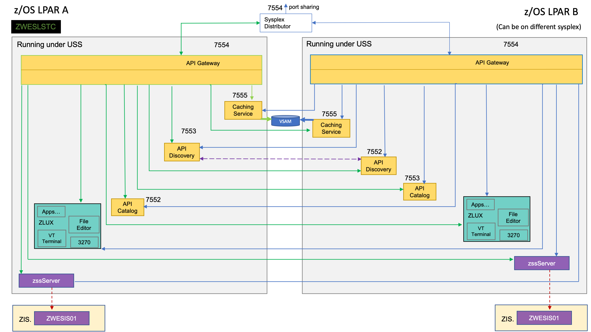

# Routing requests to REST APIs

As an API consumer, I can access any services onboarded to the API Mediation Layer through one port. The service means one or more instances that share the same API and are onboarded under the same service Id. Some of the services provides versioned APIs and some of the services provide unversioned API. Generally you as a consumer shouldn't care about the details, the API Mediation Layer handles topics like what happens when one instance is down and or ditributing the load between different instances of the service. 

Types of services:
* Versioned services - Routing with serviceId and version
* Nonversioned services - Using only the service Id

Under certain conditions it's possible to route to a specific instance of service.

## Terminology

* **Service**

  * A service provides one or more APIs, and is identified by a service ID. Note that sometimes the term "service name" is used to mean service ID.  
  * The default service ID is provided by the service developer in the service configuration file.  
  * A system administrator can replace the service ID with a deployment environment specific name using additional configuration that is external to the service deployment unit. Most often, this is configured in a JAR or WAR file.  
  * Services are deployed using one or more service instances, which share the same service ID and implementation.

* **URI (Uniform Resource Identifier)**

  A string of characters used to identify a resource. Each URI must point to a single corresponding resource that does not require any additional information, such as HTTP headers.

## Basic Routing

The basic method of routing is based on the service ID. For the services that has multiple versions of the API the secondary parameter is the version of the API that you want to reach. 

### API ML Routing to the Versioned service

The URI identifies the resource, but does not identify the instance of the service as unique when multiple instances of the same service are provided. For example, when a service is running in high-availability (HA) mode. To get to a specific instance, you would need to access it with specific API ML configuration and header X-Instance-Id.

In addition to the basic Zuul routing, the Zowe API Gateway supports versioning in which you can specify a major version. The Gateway routes a request only to an instance that provides the specified major version of the API.

The `/api/` prefix is used for REST APIs. The prefix `/ui/` applies to web UIs, the prefix `/ws/` applies to [WebSockets](websocket.md) and the prefix `/graphql/` applies to GraphQL API.

The URL expected by the API Gateway has the following format:

`https://{gatewayHost}:{port}/{serviceId}/api/v{majorVersion}/{resource}`

**Example:**

The following address shows the original URL of a resource exposed by a service:

```
https://service:10015/enablerv1sampleapp/api/v1/samples
```

The following address shows the API Gateway URL of the resource:

```
https://gateway:10010/enablerv1sampleapp/api/v1/samples
```

The following diagram illustrates how basic routing works:


### Implementation details for routing


## Zowe architecture with high availability enablement on Sysplex

The following diagram illustrates the difference in locations of Zowe components when deploying Zowe into a Sysplex with high availability enabled as opposed to running all components on a single z/OS system.  



Zowe has a high availability feature built-in. To enable this feature, you can define the `haInstances` section in your YAML configuration file.

The preceding diagram shows that `ZWESLSTC` started two Zowe instances running on two separate LPARs. These LPARs can be on the same or different sysplexes.  

- The Sysplex distributor port sharing enables the API Gateway 7554 ports to be shared, which makes it possible for  incoming requests to be routed to either the gateway on LPAR A or LPAR B.
- The discovery servers on each LPAR communicate with each other and share their registered instances, which allows the API gateway on LPAR A to dispatch APIs to components either on its own LPAR, or alternatively to components on LPAR B. As indicated in the diagram, each component has two input lines: one from the API gateway on its own LPAR, and one from the gateway on the other LPAR. When one of the LPARs goes down, the other LPAR remains operating within the sysplex providing high availability to clients that connect through the shared port irrespective of which Zowe instance is serving the API requests.

The `zowe.yaml` file can be configured to start Zowe instances on more than two LPARS, and also to start more than one Zowe instance on a single LPAR, thereby providing a grid cluster of Zowe components that can meet availability and scalability requirements.  

The configuration entries of each LPAR in the `zowe.yaml` file control which components are started. This configuration mechanism makes it possible to start just the desktop and API Mediation Layer on the first LPAR, and start all of the Zowe components on the second LPAR. Because the desktop on the first LPAR is available to the gateway of the second LPAR, all desktop traffic is routed to the second LPAR.  

The caching services for each Zowe instance, whether on the same LPAR, or distributed across the sysplex, are connected to each other by the same shared VSAM data set. This arrangement allows state sharing so that each instance behaves similarly to the user irrespective of where their request is routed.  

For simplification of the diagram above, the Jobs and Files API servers are not shown as being started. If the user defines Jobs and Files API servers to be started in the `zowe.yaml` configuration file, these servers behave the same as the servers illustrated. In other words, these services register to their API discovery server which then communicates with other discovery servers on other Zowe instances on either the same or other LPARs. The API traffic received by any API gateway on any Zowe instance is routed to any of the Jobs or Files API components that are available.  

To learn more about Zowe with high availability enablement, see [Configuring Sysplex for high availability](../user-guide/configure-sysplex.md).

## API Versioning

Service instances provide one or more different API versions (we take only one assumption: one
service instance will not provide two versions with the same major version, no other assumptions
which versions will be provided and how - e.g. an instance can provide only one version and another
version will be provided by different instance, other services can have instances that provide
multiple versions).

The API user specifies only the major version in the URI. The API catalog needs to differentiate
between different _full versions_ internally and able to return a specific full version or return
documentation for the highest version of the specified major version that is supported by all
running services.

### Guidelines

- The version of the API is not dependent on the product release.

- Two last versions are supported.

 - **Major version**  
 This version is specified by the user of the API in the URI, and increased only when a backward
 incompatible change is introduced. This circumstance is rare because the REST APIs should be designed to allow
 extensibility.

 - **Minor version**  
 This version is not specified in the URI but the user should know what is it. It is important to
 display the correct level of documentation. The minor version is increased when the API is extended with a new feature
 (if you use a new resource available in v1.2, the request
 fails on v1.1). If there are multiple instances of the services that have different minor versions,
 the service together will state that the lowest minor version is available.
 
 **Example:**
 
 Instance A provide v1.3 and v2.2. Instance B was not yet upgraded and provides v1.2 and v2.1. Subsequently, the service provides v1.2 and v2.1.

 - **Patch version**  
 The Patch version is not specified in the URI and does not indicate a difference in the API. A patch version is used only when the API documentation is patched or a bug was fixed with no change in the API.

 
