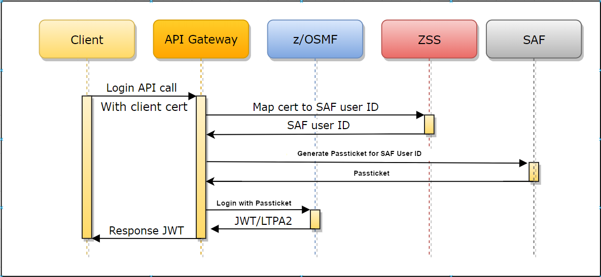

# Authenticating with client certificates

:::info Required roles: system administrator, security administrator
:::

Authentication for integration with API Mediation Layer (API ML) can also be performed by the client when the service endpoint is called through
the API ML Gateway with client certificates. This method of authentication requires client certification to be enabled and configured. For details about this configuration, see [Enabling single sign on for clients via client certificate configuration](./api-mediation/configuration-client-certificates.md).

:::note Notes:

* When calling the login endpoint with basic authentication credentials, as well as with client certificate, the basic 
  authentication credentials take precedence and the client certificate is ignored.

* If you are calling a specific endpoint on one of the onboarded services, API Mediation Layer ignores Basic authentication. In this case, the Basic authentication is not part of the authenticated request.
:::

## How the Gateway resolves authentication

When sending a request to a service with a client certificate, the Gateway performs the following process to resolve authentication:

1. The client calls the service endpoint through the API ML Gateway with the client certificate.
2. The client certificate is verified as a valid TLS client certificate against the trusted certificate authorities (CAs) of the Gateway.
3. The public key of the provided client certificate is verified against SAF. SAF subsequently returns a user ID that owns this certificate.
4. The Gateway then performs the login of the mapped user and provides valid authentication to the downstream service.

When sending a request to the login endpoint with a client certificate, the Gateway performs the following process to exchange the client certificate for an authentication token:

1. The client calls the API ML Gateway login endpoint with the client certificate.
2. The client certificate is verified to ensure this is a valid TLS client certificate against the trusted CAs of the Gateway.
3. The public part of the provided client certificate is verified against SAF. SAF subsequently returns a user ID that owns this certificate.
4. The Gateway then performs the login of the mapped user and returns a valid JWT token.

:::note Notes:

* As of Zowe release 3.0.0, the Internal API ML Mapper is the default API that provides this mapping between the public part of the client certificate and SAF user ID. Alternatively, you can use Z Secure Services (ZSS) to provide this API for API ML, with the noted exception when using ACF2, although we recommend using the internal API ML mapper.
* For information about ZSS, see the section Zowe runtime in the [Zowe server-side installation overview](./install-zos.md).
:::

The following diagram shows how routing works with ZSS, in the case where the ZSS API is used for the identity mapping.



:::tip
For more information, see the Medium blog post [Zowe client certificate authentication](https://medium.com/zowe/zowe-client-certificate-authentication-5f1c7d4d579).
:::

## Configure your z/OS system to support client certificate authentication for specific users

Register the client certificate with the user IDs in your ESM.

The following commands show options for both the internal API ML mapper and ZSS.

:::note

If using the internal API ML mapper (default from Zowe v3) and the MAP / CERTMAP option with distinguished name filters, use the `CHCKCERT` or equivalent command on the certificate to use the same order and format of the certificate's distinguished name as displayed.
:::

**RACF**
<details>
<summary>Click here for an example command in RACF. </summary>

  Activate the `DIGTNMAP` class:
  
  ```racf
  SETROPTS CLASSACT(DIGTNMAP) RACLIST(DIGTNMAP)
  ```

  Create the mapping for the user and a distinguished name filter:

  ```racf
  RACDCERT ID(<userid>) MAP 
  SDNFILTER('<subject's-distinguished-name-filter>')
  WITHLABEL('<label>')
  SETROPTS RACLIST(DIGTMAP) REFRESH
  ```

  Alternatively, if you disabled the internal API ML mapper, use the following command to add the certificate to an ACID:

  ```racf
  RACDCERT ADD(<dataset>) ID(<userid>) WITHLABEL('<label>') TRUST
  SETROPTS RACLIST(DIGTCERT, DIGTRING) REFRESH
  ```

</details>

**ACF2** 

<details>
<summary>Click here for an example command in ACF2. </summary>  

  Create the mapping for the user and a distinguished name filter:

  ```acf2
  CERTMAP.<recid>     
  SDNFILTR(<subject's-distinguished-name-filter>)
  LABEL(<label>)
  USERID(<userid>)
  TRUST
  ```

  Alternatively, if you disabled the internal API ML mapper, use the following command to add the certificate to an ACID

  ```acf2
  INSERT <userid>.<certname> DSNAME('<dataset>') LABEL(<label>) TRUST
  ```

</details>

**Top Secret**

<details>
<summary>Click here for an example command in Top Secret. </summary>

  Create the mapping for the user and a distinguished name filter:
  
  ```tss
  TSS ADDT0(<userid>) CERTMAP(<recid>)
  SDNFILTR('<subject's-distinguished-name-filter>')
  USERID(<userid>)
  TRUST
  ```

  Alternatively, if you disabled the internal API ML mapper, use the following command to add the certificate to an ACID:

  ```tss
  TSS ADDTO(<userid>) DIGICERT(<certname>) LABLCERT('<label>') DCDSN('<dataset>') TRUST
  ```

</details>

Additional details are likely described in your security system documentation.

:::note Notes

* The alternative ESM map commands allow mapping a certificate to a user without adding the X.509 certificate to the ESM database. While this approach is more convenient, it could be considered less secure than adding the certificate to the ACID, which offers better control and protection.
* Ensure that you have the Issuer certificate imported in the truststore or in the SAF keyring. Alternatively, you can generate these certificates in SAF.
* Ensure that the client certificate has the following `Extended Key Usage` metadata:  
`OID: 1.3.6.1.5.5.7.3.2`  
This metadata can be used for TLS client authentication.
:::

## Validate the client certificate functionality

To validate that the client certificate functionality works properly, call the login endpoint with the certificate that was set up using the steps in [Configure your z/OS system to support client certificate authentication for a specific user](#configure-your-zos-system-to-support-client-certificate-authentication-for-specific-users) described previously in this article.

Validate using _CURL_, a command line utility that runs on Linux based systems:

**Example:**

```bash
curl -X POST \
--cert /path/to/cert.pem \
--key /path/to/key.pem \
https://api-mediation-layer:7554/gateway/api/v1/auth/login -v
```

Where:

* `cert`: Specifies the certificate location
* `key`: Path to the private key
* `7554`: Replace with the configured API Gateway port in the intance

x.509 Client Certificate authentication is correctly configured if the result of the request is HTTP 200 with an `apimlAuthenticationToken` cookie generated.

Your Zowe instance is configured to accept x.509 client certificates authentication.
