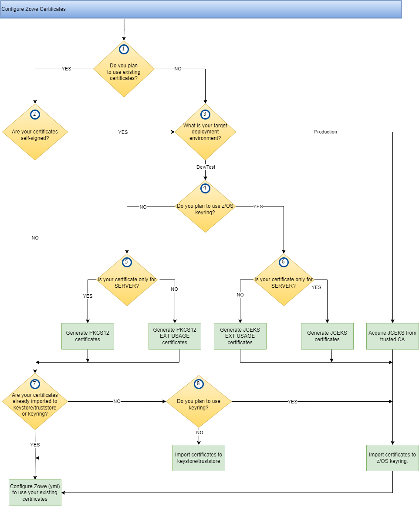

# Zowe certificates questionnaire

Answering this [questionnaire](#certificates-configuration-questionnaire) will help to select certificates setup options according to your planned Zowe deployment.

Before you answer [the questions](#certificates-configuration-questionnaire) you could also:
- Learn the [Certificates concepts](../appendix/zowe-security-glossary#certificate-concepts) explained in our [Zowe Security Glossary](../appendix/zowe-security-glossary).
- Visit the [Zowe certificates overview](../getting-started/zowe-certificates-overview).
- Review the [Certificate configuration scenarios](certificate-configuration-scenarios.md) to understand better the certificates configuration options. 

## Certificates configuration options

1. Certificates storage type

You can instruct Zowe installation to store your certificates in a:
- File-based keystore/truststore pair
- z/OS keyring

2. Certificate file format

You need to acquire or generate certificates in the format accepted by the selected storage type.
Vice-versa, if you already have digital certificates for your servers, you need to select the appropriate storage type that can host them. 
The digital certificate types that can be used by Zowe are: 
- PKCS12
- JKS / JCEKS

3. Certificate signing

Every digital certificate must be signed by a public/private Certificate Authority (CA), or they can be [self-signed](/configure-certificates#self-signed-certificates "A self-signed certificate is one that is not signed by a CA at all – neither private nor public. In this case, the certificate is signed with its own private key, instead of requesting verification from a public or a private CA. This arrangement, however, means there is no chain of trust to guarantee that the host with this certificate is the one you wanted to communicate with. Note that these certificates are not secure against other hosts masquerading as the one you want to access. As such, it is highly recommended that certificates be verified against the truststore for production environments."). Recursively, the CA's signing certificates also must be signed, 
effectively building a trust chain, rooted by a trusted Root Certificate Authority (whose certificate is self-signed). The Root CA can be a public or a private one.     

When the certificates are signed by a public CA, their authenticity can be easily verified due to the transitive trust policy based on the signing certificates chain and the public availability of that certificates.   
When the certificates are signed by a CA which is owned by the organization, the clients must explicitly request the CA certificate of the organization private CA and then import it to their trust stores in order to apply the transitive trust policy.   

Choose the type of certificate-signing:
- Self-signed
- Private CA
- Public CA

4. Client or server validation

Certificates usage can be limited to a server, a client or both. This means that a certificate explicitly created for server usage can't be used by a client application, and vice-versa a client certificate can't be used by a server component.
If it is necessary to use the same certificate for both usage types, then either don't limit the usage to one type and specify both types in the Extended Key Usage Attribute.
:::info
See the [Extended Key Usage definition in Zowe security glossary](../appendix/zowe-security-glossary.md#extended-key-usage)
:::

Choose Extended Usage Attribute value:
- Only client validation
- Only server validation
- Both, client and server validation

## Certificates configuration questionnaire

Now when you understand the certificates configuration options, answer the following questions
to choose the best options for certificates type and properties according to your Zowe deployment plan:

1. Do you plan to use existing certificates?
   1. Yes, I already have certificates for my server/s.
   2. No, I don't have certificates for my server/s.
   
2. Are your certificates self-signed?
   1. Yes, my existing certificates are self-signed.
   2. No, my existing certificates are signed by trusted CA.

3. What is your target environment?
   1. Production - Live production systems open for access from the internet/VPN.
   2. Test/Dev/Private (Learning, Experimenting).

4. What certificates storage type do you plan to use? 
   1. I plan to use z/OS keyring.
   2. I plan to use keystore/truststore files pair.

5. Do you intend to use your certificates for server, for client, or for both?
   1. Server only (your service only accepts calls from TLS-secured clients).
   2. Client only (your service only performs calls to TLS-secured services).
   3. Server and client (your service accepts inbound connections and performs calls to other TLS-secured services).

6. Were the certificates already imported to your keystore/truststore (regardless of the certificate format and storage type)?
   1. Yes, my valid certificates were previously imported.
   2. No, I need to import my new certificates.

## Certificates configuration decision flow

Review the diagram to understand the certificates configuration decision flow.
Use the answers you provided in the questionnaire to decide which path to follow in corresponding decision block (the numbered yellow diamonds).

1. If you have an existing certificates (see Question 1), you can import them to a key storage of corresponding type depending on the certificates format.

:::note
Before importing your certificates, check the next question to make sure that their format, type and properties correspond to the required protection and acceptability, according to the planned deployment environment (DEV, TEST, PROD).
For example, you should not use self-signed certificates for production environments.
:::
:::info
For more information, see [Import and configure an existing certificate](./import-certificates.md).
:::
2. If your existing certificates are self-signed (see Question 2) and your target environment is production (see Question 3), we strongly recommend that you acquire new certificates from your trusted CA.

3. Depending on your target environment type (see Question 3) - DEV/TEST or PROD, you can create your certificates (self-signed option) or acquire a new ones from a trusted CA.

4. If you plan to use z/OS keyring you need to generate JCEKS type of certificate. If you prefer to store your certificates in a keystore/truststore pair, you need to generate PKCS12 type of certificate.

:::note
If you plan for production deployment and need to acquire certificates from a trusted CA, follow the same rule to decide what type of certificate to request from the CA.
:::
:::info
For more information, see [Generate a certificate if you do not have a certificate](./generate-certificates.md).
:::

6. If you plan to use the same certificate for client and server usage (see Question 5), you need to generate your certificates with the EXTENDED USAGE attribute set to CLIENT and SERVER.

:::note
If you plan production deployment and need to acquire certificates from a trusted CA, follow the same rule to decide what values for the EXTENDED USAGE attribute values to request from the CA.
:::

7. Once you have the certificates created or acquired, import them to your certificate store - see Question 8.

For more information, see the [Import certificates article](./import-certificates.md).

7. When your certificate is in the keystore, it is ready for use. Edit your Zowe configuration to reflect the options and settings selected preceding.

:::info
For more information, see [Use certificates](./use-certificates.md).
:::
:::tip
See the [Troubleshooting the certificate configuration](../troubleshoot/troubleshoot-zos-certificate.md), to find resolution of errors you encounter when configuring the Zowe certificates.
:::

## Next Steps
If yon need to learn more about the basics for configuring review certificates, please review the [Configure Zowe Certificates](./configure-certificates) article
or visit the [Certificates Overview](../getting-started/zowe-certificates-overview) in the Getting Started documentation.
