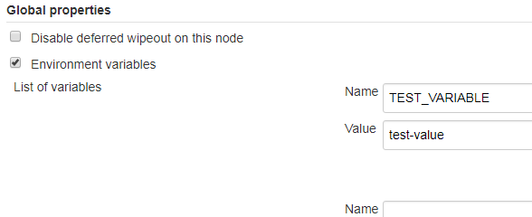

# Configuring Zowe CLI
This section explains how to define and verify your connection to the mainframe in Zowe&trade; CLI, and how to configure log levels and your home directory location.

**Tip:** Configuration for the CLI is stored on your computer in a directory such as `C:\Users\user01\.zowe`. The directory includes log files, profile information, and installed CLI plug-ins. Refer to the logs in the `imperative` and `zowe` folders when you troubleshoot.

  - [Defining Zowe CLI connection details](#defining-zowe-cli-connection-details)
  - [Testing Zowe CLI connection to z/OSMF](#testing-zowe-cli-connection-to-zosmf)
  - [Certificate security](#certificate-security)
  - [Setting Zowe CLI log levels](#setting-zowe-cli-log-levels)
  - [Setting the Zowe CLI home directory](#setting-the-zowe-cli-home-directory)

## Defining Zowe CLI connection details

Zowe CLI abides by a "command option order of precedence" that provides flexibility when issuing commands and writing scripts.

When you issue a command, the CLI *searches* for your command arguments in the following order:

1. **Options** that you specify directly on individual commands.
2. **Environment variables** that you define in the computer's operating system. For more information, see [Defining Environment Variables](#defining-environment-variables)
3. **Service profiles** that you create (i.e. z/OSMF profile or another MF service).
4. **Base profiles** that you create (can contain credentials for multiple services and/or an API ML login token).
5. The **default value** for the argument or option.

If you omit an option from the command line, Zowe CLI searches for any environment variables that contains a value for the option. If no environment variable exists, the CLI searches your service profiles for the value. Base profiles provide values to other service profiles so that you do not need to specify the same options (i.e. username and password) in multiple service profiles.

If you do not provide a value with one of these methods, the default option value is used.

**Note:** If a required option or argument value is not located, you receive a syntax error message that states `Missing Positional Argument` or `Missing Option`.

### Creating Zowe CLI profiles

Profiles let you store configuration details for use on multiple commands. Create a profile that contains your username, password, and connection details for a mainframe service, then reuse that profile to avoid typing the information on every command. Switch between profiles to quickly target different mainframe subsystems.

There are two main types of profiles:

- **Service profiles:** Store connection information for specific mainframe service, such as IBM z/OSMF. Plug-ins can introduce other service profile types, such as the `cics` profile to connect to IBM CICS.

- **Base profiles:** Store connection information for use with one or more services. The base profile can optionally contain a token to connect to Zowe API Mediation Layer, which improves security by enabling Multi-Factor Authentication (MFA) and Single Sign-on (SSO).

**Tips:**
- You can have multiple service profiles and multiple base profiles.
- Profiles are **not** required. You can choose to specify all connection details for every command.
- Profile values are stored on your computer in plaintext in the `C:\Users\<yourUsername>\.zowe\profiles` folder.

#### Displaying profiles help

Use the CLI help to learn about the  options for creating profiles. For example, for a `zosmf` profile, issue the following command:

```
zowe profiles create zosmf-profile --help
```

#### Creating and using a service profile

Create a profile that targets a specific mainframe service, then use the profile to issue a command. For example, issue the following command (substituting your connection details) to create a `zosmf` service profile named `myprofile123`:

```
zowe profiles create zosmf-profile myprofile123 --host host123 --port port123 --user ibmuser --password pass123
```

Use the profile. Issue the following command to list all data sets under the name `ibmuser` on the system that you specified in `myprofile123`:

```
zowe zos-files list data-set "ibmuser.*" --zosmf-profile myprofile123
```

#### Creating and using a base profile

Create a base profile, which can store option values and provide them to multiple service profiles. The base profile can also contain tokens to connect to services securely through API ML.

For example, create a base profile that contains your username and password. After the base profile is created, you can omit the `--username` and `--password` options when creating a service profile such as `zosmf`. The service profile will use values provided by th

<!-- insert example syntax for creating a base profile here -->

#### Integrating with Zowe API Mediation Layer (API ML)

Zowe API ML provides a single point of access to a defined set of mainframe services. The layer provides API management features such as high-availability, dynamic API discovery, consistent security, and an SSO experience.

You can access API ML directly through Zowe CLI, which enables SSO/MFA and lets you access to multiple registered services through a base CLI profile. When you issue commands using the base profile, the layer routes the requests to an appropriate instance of the API based on the system load and available API instances.

To integrate with the layer, request a Java Web Token (JWT) using the following command:

```
zowe auth login apiml
```

The CLI will prompt you to enter connection details. After you enter username and password (password can be a PIN concatenated with a second factor for MFA), a base profile is created that contains your JWT, username, and password.

You can use the base profile to issue a command. For example:

```
zowe zos-files list data-set "ibmuser.*" --base-profile myprofile123
```

The request will be routed through API ML to access the appropriate instance of z/OSMF.

**Notes:**
- When your JWT token expires, you must request another token with the `zowe auth login apiml` command.
- If you omit connection details from a service profile, such as `zosmf` profile, the CLI uses the information from your base profile.
- You can still specify all connection details on a service profile to connect directly to the service (not through API ML).

#### Target a specific LPAR

If you have multiple instances of API ML at your site and want to target a specific LPAR, or if you want to connect to a specific instance of a service that is registered to API ML, use the `--base-path` option.
<!-- (describe the base path here, which is still available for the purpose of choosing a specific LPAR for either a service or APIML)
Previous content: Use the `--base-path` option on commands to let all of your Zowe CLI core command groups (excludes plug-in groups) access REST APIs through an API Mediation Layer. To access API Mediation Layers, you specify the base path, or URL, to the API gateway as you execute your commands. Optionally, you can define the base path URL as an environment variable or in a profile that you create.

The following example illustrates the base path for a REST request that is not connecting through an API Mediation Layer to one system where an instance of z/OSMF is running:

```
https://mymainframehost:port/zosmf/restjobs/jobs
```

The following example illustrates the base path (named `api/v1/zosmf1)` for a REST request to an API mediation layer:

```
https://myapilayerhost:port/api/v1/zosmf1/zosmf/restjobs/jobs
```

When you create a profile, specify the host, port, and the base path of API ML instance that you want to access. Using the base path to API ML, Zowe CLI routes your requests to an appropriate instance of the API based on the system load and the available instances of the API.

**Example:**

The following example illustrates the command to create a profile that connects to z/OSMF through API ML with the base path `my/api/layer`:

```
zowe profiles create zosmf myprofile -H <myhost> -P <myport> -u <myuser> --pw <mypass> --base-path <my/api/layer>
```
 -->

### Defining Environment Variables

You can define environment variables in your environment to execute commands more efficiently. You can store a value, such as your password, in an environment variable, then issue commands without specifying your password every time. The term environment refers to your operating system, but it can also refer to an automation server, such as Jenkins or a Docker container. In this section we explain how to transform arguments and options from Zowe CLI commands into environment variables and define them with a value.

  - **Assigning an environment variable for a value that is commonly used.**

    For example, you might want to specify your mainframe user name as an
    environment variable on your computer. When you issue a command and omit
    the `--username` argument, Zowe CLI automatically uses the
    value that you defined in the environment variable. You can now
    issue a command or create any profile type without specifying your
    user name repeatedly.

  - **Overriding a value that is used in existing profiles.**

    For example, you might want to override a value that you previously
    set on multiple profiles to avoid recreating each profile.This
    reduces the number of profiles that you need to maintain and lets
    you avoid specifying every option on command line for one-off
    commands.

  - **Specifying environment variables in a Jenkins environment (or other automation server) to store credentials securely.**

    You can set values in Jenkins environment variables for use in
    scripts that run in your CI/CD pipeline. You can define Jenkins
    environment variables in the same manner that you can on your computer. You
    can also define sensitive information in the Jenkins secure
    credential store. For example, you might need to define your mainframe
    password in the secure credential store so that it is not available
    in plain text.

#### Transforming arguments/options to environment variable format

Transform the option/argument into the correct format for a Zowe CLI environment variable, then define values to the new variable.
The following rules apply to this transformation:

  - Prefix environment variables with `ZOWE_OPT_`
  - Convert lowercase letters in arguments/options to uppercase letters
  - Convert hyphens in arguments/options to underscores

**Tip:**  See your operating system documentation for information about how to set and get environment variables. The procedure for setting environment variables varies between Windows, Mac, and various versions of Linux operating systems.

**Examples:**

The following table shows command line options that you might want to
transform and the resulting environment variable to which you should define the value. Use the appropriate procedure for for your operating system to define the variables.

| Command Option          | Environment Variable           | Use Case   |
| ----------------------- | ------------------------------ | ------------------------------------------------------------------------------------------------------------------------------------------------------ |
| `--user`                | `ZOWE_OPT_USER`                | Define your mainframe user name to an environment variable to avoid specifying it on all commands or profiles.                           |
| `--reject-unauthorized` | `ZOWE_OPT_REJECT_UNAUTHORIZED` | Define a value of `true` to the `--reject-unathorized` flag when you always require the flag and do not want to specify it on all commands or profiles. |

#### Setting environment variables in an automation server

You can use environment variables in an automation server, such as Jenkins, to write more efficient scripts and make use of secure credential storage.

You can either set environment variables using the `SET` command within your scripts, or navigate to **Manage Jenkins \> Configure System \> Global Properties** and define an environment variable in the Jenkins GUI. For example:



#### Using secure credential storage

To improve security, you can store credentials securely (not in plain text). Install the [Secure Credential Store Plug-in for Zowe CLI](cli-scsplugin.md).

Automation tools such as Jenkins automation server also usually provide a mechanism for securely storing configuration (for example, credentials). In Jenkins, you can use `withCredentials` to expose credentials as an environment variable (ENV) or Groovy variable. For more information about using this feature in Jenkins, see [Credentials Binding Plugin](https://jenkins.io/doc/pipeline/steps/credentials-binding/) in the Jenkins documentation.

## Testing Zowe CLI connection to z/OSMF

You can issue a command at any time to receive diagnostic information from the server and confirm that Zowe CLI can communicate with z/OSMF or other mainframe APIs.

**Important!** By default, the server certificate is verified against a list of Certificate Authorities (CAs) trusted by Mozilla. This handshake ensures that the CLI can trust the server. You can append the flag `--ru false` to any of the following commands to bypass the certificate verification against CAs. If you use the `--ru false` flag, ensure that you understand the potential security risks of bypassing the certificate requirement at your site. For the most secure environment, system administrators configure a server keyring with a server certificate signed by a Certificate Authority (CA). For more information, see [Certificate security](#certificate-security).

**Without a Profile**

Verify that your CLI instance can communicate with z/OSMF.

```
zowe zosmf check status --host <host> --port <port> --user <username> --pass <password>
```

**Default profile**

After you [create a profile](#creating-zowe-cli-profiles), verify that you can use your *default profile* to communicate with z/OSMF:

```
zowe zosmf check status
```

**Specific profile**

After you [create a profile](#creating-zowe-cli-profiles), verify that you can use *a specific profile* to communicate with z/OSMF:

```
zowe zosmf check status --zosmf-profile <profile_name>
```

The commands return a success or failure message and display information about your z/OSMF server, such as the z/OSMF version number. Report any failure to your systems administrator and use the information for diagnostic purposes.

## Certificate security

Certificates authorize communication between a server and client, such as z/OSMF and Zowe CLI. The client CLI must "trust" the server to successfully issue commands. Use one of the following methods to let the CLI communicate with the server:

- [Configure certificates signed by a Certificate Authority (CA)](#configure-certificates-signed-by-a-certificate-authority-ca)
- [Extend trusted certificates on client](#extend-trusted-certificates-on-client)
- [Bypass certificate requirement with CLI flag](#bypass-certificate-requirement-with-cli-flag)

### Configure certificates signed by a Certificate Authority (CA)

System Administrators can configure the server with a certificate signed by a Certificate Authority (CA) trusted by Mozilla. When a CA trusted by Mozilla exists in the certificate chain, the CLI automatically recognizes the server and authorizes the connection.

**Related information:**

- [Using certificates with z/OS client/server applications](https://www.ibm.com/support/knowledgecenter/en/SSLTBW_2.3.0/com.ibm.zos.v2r3.icha700/icha700_Using_certificates_with_z_OS_client_server_applications.htm) in the IBM Knowledge Center.
- [Configuring the z/OSMF key ring and certificate](https://www.ibm.com/support/knowledgecenter/en/SSLTBW_2.3.0/com.ibm.zos.v2r3.izua300/izuconfig_KeyringAndCertificate.htm) in the IBM Knowledge Center.
- [Certificate management in Zowe API Mediation Layer](../extend/extend-apiml/api-mediation-security.md#certificate-management-in-zowe-api-mediation-layer)
- [Mozilla Included CA Certificate List](https://wiki.mozilla.org/CA/Included_Certificates)

### Extend trusted certificates on client

If your organization uses self-signed certificates in the certificate chain (rather than a CA trusted by Mozilla), you can download the certificate to your computer add it to the local list of trusted certificates. Provide the certificate locally using the `NODE_EXTRA_CERTS` environment variable. Organizations might want to configure all client computers to trust the self-signed certificate.

[This blog post](https://medium.com/@dkelosky/zowe-cli-providing-node-extra-ca-certs-117727d936e5) outlines the process for using environment variables to trust the self-signed certificate.

### Bypass certificate requirement with CLI flag

If you do not have server certificates configured at your site, or you want to trust a known self-signed certificate, you can append the `--reject-unauthorized false` flag to your CLI commands. Setting the `--reject-unauthorized` flag to `false` rejects self-signed certificates and essentially bypasses the certificate requirement.

**Important!** Understand the security implications of accepting self-signed certificates at your site before you use this command.

**Example:**

```
zowe zosmf check status --host <host> --port <port> --user <username> --pass <password> --reject-unauthorized false
```

## Setting Zowe CLI log levels

You can set the log level to adjust the level of detail that is written to log files:

**Important\!** Setting the log level to TRACE or ALL might result in "sensitive" data being logged. For example, command line arguments will be logged when TRACE is set.

| Environment Variable | Description | Values | Default |
| ---------------------- | ----------- |------- | ------- |
| `ZOWE\_APP\_LOG\_LEVEL`        | Zowe CLI logging level            | Log4JS log levels (OFF, TRACE, DEBUG, INFO, WARN, ERROR, FATAL) | DEBUG   |
| `ZOWE\_IMPERATIVE\_LOG\_LEVEL` | Imperative CLI Framework logging level | Log4JS log levels (OFF, TRACE, DEBUG, INFO, WARN, ERROR, FATAL) | DEBUG   |

## Setting the Zowe CLI home directory

You can set the location on your computer where Zowe CLI creates the *.zowe* directory, which contains log files, profiles, and plug-ins for the product:

| Environment Variable | Description | Values | Default |
| ---------------------- | ----------- | ------ | ------- |
| `ZOWE\_CLI\_HOME`  | Zowe CLI home directory location | Any valid path on your computer | Your computer default home directory |
